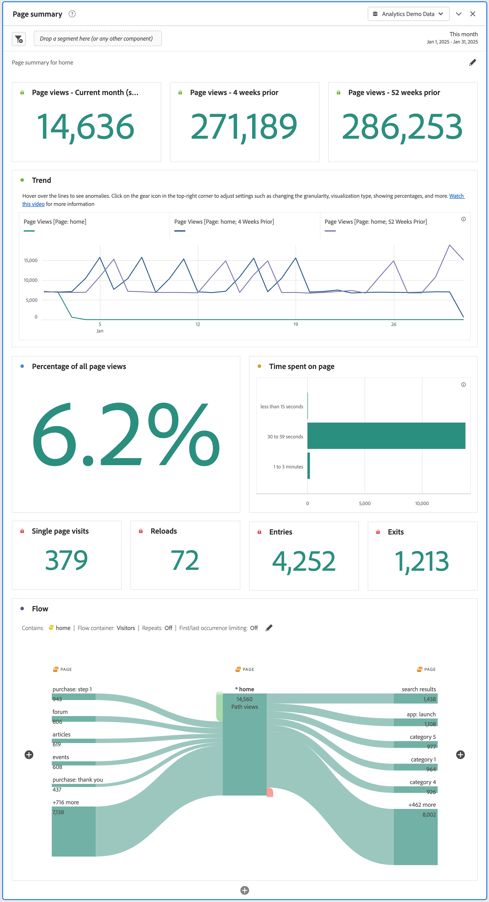

# Panelen Sidsammanfattning {#page-summary}

<!-- markdownlint-disable MD034 -->

>[!CONTEXTUALHELP]
>id="workspace_pagesummary_button"
>title="Sidsammanfattning"
>abstract="Granska snabbt några av de högnivåstatistik som finns och hur man går från en viss sida till och från en viss sida."

<!-- markdownlint-enable MD034 -->

<!-- markdownlint-disable MD034 -->

>[!CONTEXTUALHELP]
>id="workspace_pagesummary_panel"
>title="Panelen Sidsammanfattning"
>abstract="Granska snabbt några av de högnivåstatistik som finns och hur man går från en viss sida till och från en viss sida.  **Parametrar &#x200B;** **Lägg till ett siddimensionsobjekt**: Öppna komponentfältet, leta upp siddimensionen och expandera den genom att klicka på moroten för att visa dimensionsobjekten. Dra och släpp sedan den sida du vill veta mer om i verktyget. När du har dragit och släppt dimensionsobjektet fylls rapporten automatiskt i med nyckelinformation om sidan."

<!-- markdownlint-enable MD034 -->

>[!BEGINSHADEBOX]

_Den här artikeln dokumenterar panelen Sidsammanfattning i_  _&#x200B;**Adobe Analytics**._ _Det finns ingen motsvarande panel i_  _&#x200B;**Customer Journey Analytics**._

>[!ENDSHADEBOX]

På en **[!UICONTROL Page summary]**-panel kan du utforska nyckelstatistik om specifika sidor.

## Använd

Så här använder du en **[!UICONTROL Page summary]**-panel:

1. Skapa en **[!UICONTROL Page summary]**-panel. Mer information om hur du skapar en panel finns i [Skapa en panel](panels.md#create-a-panel).

1. Ange [indata](#panel-input) för panelen.

1. Observera [utdata](#panel-output) för panelen.

Du kan komma åt panelen inifrån [!UICONTROL Reports] eller i [!UICONTROL Workspace].

| Åtkomstpunkt | Beskrivning |
| --- | --- |
| [!UICONTROL Reports] | <ul><li>Panelen har redan släppts i ett projekt.</li><li>Den vänstra listen är komprimerad.</li><li>Endast siddimensionen stöds.</li><li>En standardinställning har redan använts, i det här fallet den översta besökta sidan för dimensionen [!UICONTROL Page]. Du kan ändra den här inställningen.</li></ul> |
| Workspace | Skapa ett nytt projekt och välj panelikonen i den vänstra listen. Dra panelen [!UICONTROL Page summary] ovanför friformstabellen. Observera att fältet Sida [!UICONTROL Dimension Item] är tomt. Välj en dimensionsobjekt i listrutan. |

### Panelindata {#panel-input}

Du kan konfigurera panelen [!UICONTROL Page summary] med följande indatainställningar:

| Indata | Beskrivning |
| --- | --- |
| **[!UICONTROL Page]** | Välj en siddimension för vilken sida du vill utforska nyckelstatistik. |

{style="table-layout:auto"}

Välj **[!UICONTROL Build]** om du vill skapa panelen.

### Panelutdata {#panel-output}

Panelen [!UICONTROL Page summary] returnerar en mängd mätdata och visualiseringar som hjälper dig att förstå statistik om specifika sidor bättre.

| Visualisering | Beskrivning |
| --- | --- |
| **[!UICONTROL Page views]- Aktuell månad (hittills)** | En [sammanfattningsvisualisering](/help/analyze/analysis-workspace/visualizations/summary-number-change.md) som visar antalet sidvisningar för den här sidan för den aktuella månaden. |
| **[!UICONTROL Page views]- 4 veckor före** | En [sammanfattningsvisualisering](/help/analyze/analysis-workspace/visualizations/summary-number-change.md) som visar antalet sidvisningar för den här sidan under den senaste månaden. |
| **[!UICONTROL Page views]- 52 veckor före** | En [sammanfattningsvisualisering](/help/analyze/analysis-workspace/visualizations/summary-number-change.md) som visar antalet sidvisningar för den här sidan det senaste året. |
| **[!UICONTROL Trend]** | En [Line](/help/analyze/analysis-workspace/visualizations/line.md)-visualisering för sidvisningar för den här månaden, 4 veckor före och 52 veckor före. |
| **[!UICONTROL Percentage of all page views]** | Ett sammanfattningsnummer för procentandelen av alla sidvyer som gick till den här sidan. |
| **[!UICONTROL Time spent on page]** | En [vågrät fältvisualisering](/help/analyze/analysis-workspace/visualizations/horizontal-bar.md) som visar hur lång tid som har ägnats åt den här sidan. |
| **[!UICONTROL Single page visits]** | Ett [sammanfattningsnummer](/help/analyze/analysis-workspace/visualizations/summary-number-change.md) som visar antalet sidvyer där den här sidan var den enda sida som besöktes. |
| **[!UICONTROL Reloads]** | Ett [sammanfattningsnummer](/help/analyze/analysis-workspace/visualizations/summary-number-change.md) som visar hur många gånger ett dimensionsobjekt fanns under en omladdning. En besökare som uppdaterar sin webbläsare är det vanligaste sättet att utlösa en omladdning. |
| **[!UICONTROL Entries]** | Ett [sammanfattningsnummer](/help/analyze/analysis-workspace/visualizations/summary-number-change.md) som visar hur många gånger ett givet dimensionsobjekt hämtas som det första värdet vid ett besök. |
| **[!UICONTROL Exits]** | Ett [sammanfattningsnummer](/help/analyze/analysis-workspace/visualizations/summary-number-change.md) som visar hur många gånger ett givet dimensionsobjekt hämtas som det sista värdet vid ett besök. |
| **[!UICONTROL Flow]** | En [Flödesvisualisering](/help/analyze/analysis-workspace/visualizations/c-flow/flow.md) med den valda sidan som fokalpunkt. Du kan fördjupa dig i data precis som i alla [Flow](/help/analyze/analysis-workspace/visualizations/c-flow/create-flow.md) -visualiseringar. |

{style="table-layout:auto"}

Använd  för att konfigurera om och återskapa panelen.
