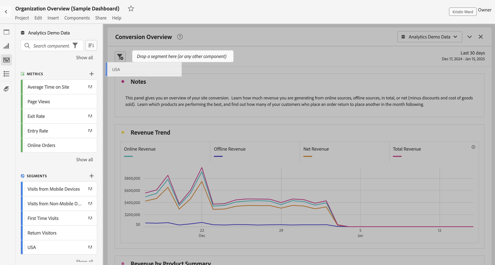
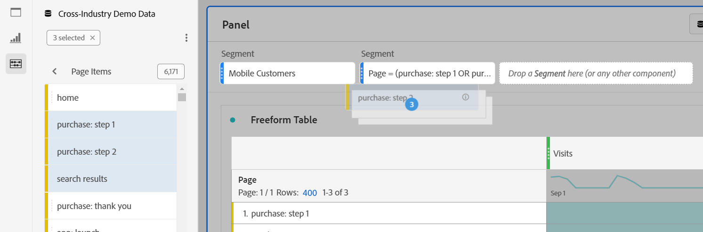

# Paneler - översikt

En [!UICONTROL panel] är en samling tabeller och visualiseringar. Du kommer åt panelerna från den övre vänstra ikonen i Workspace eller en [tom panel](/help/analyze/analysis-workspace/c-panels/blank-panel.md). Paneler är användbara när du vill ordna dina projekt efter tidsperioder, rapportsviter eller användningsfall för analyser.

## Paneltyper

Följande paneltyper är tillgängliga i Analysis Workspace för [!UICONTROL Adobe Analytics]:

| Panelnamn | Beskrivning |
| --- | --- |
| [Tom panel](/help/analyze/analysis-workspace/c-panels/blank-panel.md) | Välj bland tillgängliga paneler och visualiseringar för att starta analysen. |
| [Attribution](attribution.md) | Jämför och visualisera snabbt valfritt antal attribueringsmodeller med alla mått och konverteringsvärden. |
| [Analyser för mål](a4t-panel.md) | Analysera Target-aktiviteter och -upplevelser i Analysis Workspace. |
| [Frihand](freeform-panel.md) | Utför obegränsade jämförelser och uppdelningar och lägg sedan till visualiseringar för att berätta en utförlig databerättelse. |
| [Medel - genomsnittlig minutpublik](average-minute-audience-panel.md) | Analysera den genomsnittliga minuten-publiken för ett visst innehåll eller under en anpassad tidsperiod. |
| [Medievisningsprogram för samtidig användning](media-concurrent-viewers.md) | Analysera samtidiga tittare över tid, med information om maximal samtidighet och möjlighet att dela upp och jämföra. |
| [Tidsåtgång för uppspelning av media](/help/analyze/analysis-workspace/c-panels/media-playback-time-spent.md) | Analysera den uppspelningstid som används för att förstå var högfrekvenser förekommer eller var bortfall inträffar. |
| [Nästa eller föregående objekt](next-previous.md) | Visa nästa eller föregående sidor som andra går till. |
| [Snabba insikter](quickinsight.md) | Bygg snabbt ett frihandsbord och en medföljande visualisering för att analysera och hitta insikter snabbare. |
| [Segmentjämförelse](/help/analyze/analysis-workspace/c-panels/c-segment-comparison/segment-comparison.md) | Jämför snabbt två segment över alla datapunkter för att automatiskt hitta relevanta skillnader. |

[!UICONTROL Quick insights]-, [!UICONTROL Blank]- och [!UICONTROL Freeform]-panelerna är bra platser att starta analysen på, medan [!UICONTROL Attribution] är intresserad av mer avancerade analyser. En  finns längst ned på arbetsytan, så du kan när som helst lägga till tomma paneler.

Standardstartpanelen är panelen [!UICONTROL Freeform], men du kan göra den [tomma panelen](/help/analyze/analysis-workspace/c-panels/blank-panel.md) eller [snabbinsikterna](/help/analyze/analysis-workspace/c-panels/quickinsight.md) till standard. Se [Inställningar för projekt och analys](/help/analyze/analysis-workspace/user-preferences.md#projects--analyses-preferences).

## Skapa en panel

Så här skapar du en panel:

* Dra och släpp en panel från den vänstra panelen på arbetsytan i **[!UICONTROL Panels]**.
* Välj en panel på panelen [Tom](blank-panel.md).
* Använd menyn **[!UICONTROL Insert]** i Workspace och markera panelen. Du kan också använda något av [kortkommandona](../build-workspace-project/fa-shortcut-keys.md) för att infoga en panel.

  

Ni kan:

* Välj  **i** en panel om du vill lägga till en annan visualisering. Ett popup-fönster visas där du kan välja en visualisering.

  

  | Välj.. | Skapa en.. |
  |---|---|
  |  | [Frihandstabell](/help/analyze/analysis-workspace/visualizations/freeform-table/freeform-table.md) |
  |  | [Linjediagram](/help/analyze/analysis-workspace/visualizations/line.md) |
  |  | [Bar](/help//analyze/analysis-workspace/visualizations/bar.md) |
  |  | [Sammanfattningsnummer](/help/analyze/analysis-workspace/visualizations/summary-number-change.md) |
  |  | [Text](/help/analyze/analysis-workspace/visualizations/text.md) |
  |  | [Utfall](/help/analyze/analysis-workspace/visualizations/fallout/fallout-flow.md) |
  |  | [Flöde](/help/analyze/analysis-workspace/visualizations/c-flow/flow.md) |
  |  | [Område staplat](/help/analyze/analysis-workspace/visualizations/area.md) |
  |  | [Kohortabell](/help/analyze/analysis-workspace/visualizations/cohort-table/t-cohort.md) |
  |  | [Punkt](/help/analyze/analysis-workspace/visualizations/bullet-graph.md) |
  |  | [Ringdiagram](/help/analyze/analysis-workspace/visualizations/donut.md) |
  |  | [Sammanfattningsändring](/help/analyze/analysis-workspace/visualizations/summary-number-change.md) |
  |  | [Histogram](/help/analyze/analysis-workspace/visualizations/histogram.md) |
  |  | [Spridning](/help/analyze/analysis-workspace/visualizations/scatterplot.md) |
  |  | [Venn](/help/analyze/analysis-workspace/visualizations/venn.md) |
  |  | [Treemap-diagram](/help/analyze/analysis-workspace/visualizations/treemap.md) |

* Välj  **utanför** den sista panelen på arbetsytan för att lägga till ytterligare en [tom panel](blank-panel.md).

## Rapportsvit

Varje panel är associerad med en [rapportserie](/help/admin/admin/c-manage-report-suites/report-suites-admin.md) som identifieras av  **[!UICONTROL *namnet på rapportsviten *]**&#x200B;i listrutan längst upp till höger på panelen.

När du skapar en ny panel baseras standardrapportsviten på rapportsviten från den panel du senast arbetade på i Analysis Workspace-projektet.

Inom ett projekt kan du använda en eller [många rapportsviter](https://experienceleague.adobe.com/docs/analytics/analyze/analysis-workspace/build-workspace-project/multiple-report-suites.html?lang=sv-SE) beroende på dina analysexempel.

Listan med rapportsviter sorteras efter relevans, som Adobe definierar utifrån hur nyligen och ofta sviten har använts av den aktuella användaren och hur ofta sviten används i organisationen.

>[!IMPORTANT]
>
>Den valda rapportsviten avgör vilka dimensioner, mätvärden och segment som är tillgängliga för att skapa visualiseringar i en panel.
>
>
>När du byter rapportserie för en panel kanske vissa komponenter inte är tillgängliga i den nya rapportsviten. Ändringen kan göra att visualiseringen inte återges korrekt. Du kan se varningar som:
>
>* Den här panelen innehåller komponenter som inte är aktiverade i den valda rapportsviten. Ändra rapportsviten eller aktivera de nödvändiga komponenterna i rapportsviten.
>* Det gick inte att återge visualisering: Kontrollera kolumnerna och raderna för att se om de innehåller giltiga komponenter.
>

## Kalender

Panelkalendern styr rapportens datumintervall för tabeller och visualiseringar inom en panel.

>[!NOTE]
>
>Om en -datumintervallkomponent används i en visualisering eller panel (till exempel som ett segment) åsidosätter datumintervallkomponenten panelkalendern.
>

1. Välj ett datumintervall genom att först markera startdatumet och sedan slutdatumet.
Du kan också välja en **[!UICONTROL Preset]** i listrutan [!UICONTROL *Välj en förinställning*] .

1. Du kan också välja **[!UICONTROL Show advanced settings]** för att:

   * Ange **[!UICONTROL Start time]** och **[!UICONTROL End time]** förutom standardvärdena `12:00 AM` (`0:00`) och `11:59 PM` (`23:59`). Sluttider omfattar alltid 59 sekunder. För ett datumintervall som sträcker sig över många dagar gäller starttiden den första dagen i datumintervallet och sluttiden gäller den sista dagen i datumintervallet. Använd **[!UICONTROL (Reset time values)]** om du vill återställa start- och sluttiden till standardvärdena.
   * **[!UICONTROL Make date range components relative to panel calendar]**. Om det är inaktiverat är de datumintervallkomponenter som används på panelen relativa till den aktuella tiden. Om det här alternativet är aktiverat är de datumintervallskomponenter som används på panelen relaterade till panelkalendern.
   * **[!UICONTROL Use rolling dates]**. Om det här alternativet är aktiverat uppdateras förinställda datumintervall som **[!UICONTROL Last 7 full days]** dynamiskt som aktuellt datum- och tidsförlopp. Om du avaktiverar det uppdateras inte dessa förinställningar när de har använts.

     

     Du kan markera texten inom hakparenteser (till exempel **[!UICONTROL fixed start - rolling daily]**) för att utöka panelen och ange information för **[!UICONTROL Start]** och **[!UICONTROL End]**.

      1. Välj **[!UICONTROL Start of]**, **[!UICONTROL End of]** eller **[!UICONTROL Fixed day]**.
      1. När du har valt **[!UICONTROL Start of]** eller **[!UICONTROL End of]** kan du skapa ett fullständigt uttryck. Till exempel: **[!UICONTROL End of]** **[!UICONTROL current year]** **[!UICONTROL plus]** `1` **[!UICONTROL day]**. Välj lämpligt värde för varje enskild del av uttrycket.
         * Välj ett värde för aktuell. Till exempel **[!UICONTROL current year]**.
         * Välj ett värde för ytterligare beräkning. Exempel: **[!UICONTROL plus]**.
         * När du har angett ytterligare beräkning anger du ett värde. Till exempel `1`.
         * När du har angett ytterligare beräkning väljer du den tidsperiod som ska användas för beräkningen. Till exempel **[!UICONTROL day]**.

     Välj **[!UICONTROL Hide details]** om du vill dölja informationen för beräkning av rullande datum.

1. Välj **[!UICONTROL Apply]** om du vill tillämpa datumintervallet på panelen som du anropade kalendern från.
Välj **[!UICONTROL Apply to all panels]** om du vill använda datumintervallet på alla paneler i Workspace-projektet.

## Släppzon {#dropzone}

Med panelens släppzon kan du tillämpa segment och listrutesegment på alla tabeller och visualiseringar i en panel. Du kan använda ett eller flera segment på en panel.

### Segment

Dra och släpp segment från den vänstra panelen i panelens släppzon för att börja segmentera panelen. Upprepa den här processen om du vill lägga till fler segment på panelen. Segmenten visas sida vid sida högst upp på panelen.

#### Snabbsegment

Komponenter som inte tillhör segment kan också dras direkt till släppzonen för att skapa snabbsegment, vilket sparar tid och arbete med att gå till [segmentbyggaren](/help/components/segmentation/segmentation-workflow/seg-build.md). Segment som skapas på det här sättet definieras automatiskt som händelsenivåsegment. Du kan snabbt ändra den här definitionen genom att välja  bredvid segmentnamnet.

<!-- For more information, see [Quick segments](/help/components/segmentation/). -->

### Nedrullningsbara segment

>[!BEGINSHADEBOX]

Se  [Listrutesegment](https://video.tv.adobe.com/v/23877?quality=12&learn=on){target="_blank"} för en demonstrationsvideo.

>[!ENDSHADEBOX]

#### Statiska rullgardinssegment

Med statiska rullgardinssegment kan du interagera med data på ett kontrollerat sätt. Du kan till exempel lägga till ett nedrullningsbart segment för mobila enhetstyper så att du kan segmentera panelen via Surfplatta, Mobiltelefon eller Skrivbord.

Statiska rullgardinssegment kan också användas för att konsolidera många projekt till ett. Om du till exempel har många versioner av samma projekt med olika landssegment tillämpade, kan du konsolidera alla versioner till ett enda projekt och lägga till ett nedrullningsbart landssegment.

##### Skapa statiska rullgardinssegment

* För rullgardinsmenyer som använder dimensionsobjekt väljer du en dimension från den vänstra panelen och släpper dimensionen i panelens släppzon samtidigt som du håller ned ⇧ (*shift*). Den här åtgärden skapar ett nedrullningsbart segment med alla dimensionsobjekt som är associerade med den dimensionen.

  Om du vill att listrutesegmentet endast ska innehålla specifika dimensionsobjekt som är kopplade till en dimension, väljer du högerpilsikonen bredvid önskad dimension på den vänstra panelen. Den här åtgärden visar alla tillgängliga dimensionsobjekt. Markera flera dimensionsobjekt i den här listan med ⇧+ (*Skift* + *välj*) eller ^+ (*kontroll* + *markera*) och släpp dem sedan i panelens släppzon **samtidigt som du håller ned** ⇧.

* För rullgardinsmenyer som använder en enda komponenttyp (t.ex. bara dimensioner, eller bara segment, eller endast mått) väljer du flera objekt av samma typ på den vänstra panelen med ⇧+ eller ^+. Släpp sedan objekten i panelens släppzon **samtidigt som du håller ned** ⇧.

  Ett enskilt nedrullningsbart segment skapas med de komponenter som du har valt.

* För rullgardinsmenyer som använder en blandning av komponenttyper (till exempel 2 mätvärden och 3 segment) väljer du flera komponenter med ⇧+ eller ^+. Släpp markeringen i panelens släppzon **medan du håller ned** ⇧. I det här sammanhanget behandlas alla komponenttyper som separata nedrullningsbara segment. Om du till exempel inkluderar både mått och dimensionsobjekt i markeringen skapas två separata nedrullningsbara segment: ett nedrullningsbart segment innehåller dimensionsobjekt och det andra innehåller mått.

Ett nedrullningsbart segment innehåller följande alternativ för snabbmenyer:

* **[!UICONTROL Delete drop-down]**: Tar bort det nedrullningsbara segmentet från panelen.
* **[!UICONTROL Delete label]**: Ta bort texten som visas ovanför ett nedrullningsbart segment. Om du vill ändra etiketten håller du pekaren över etiketten och väljer .
* **[!UICONTROL Add label]**: När du lägger till ett nedrullningsbart segment i ett projekt ställs en etikett automatiskt in på komponentnamnet. Om du tar bort etiketten kan du lägga till den igen med det här alternativet.
* **[!UICONTROL Require selection]**: Kräver att ett segment är inställt på panelen.

##### Använda statiska rullgardinssegment

Användare kan använda den nedrullningsbara segmentmenyn på något av följande sätt för att segmentera panelen:

* Använd ett segment på panelen genom att markera segmentet i det nedrullningsbara segmentet.

* Använd flera segment på panelen genom att markera mer än ett segment i listrutan. Panelen segmenteras för att inkludera något av de valda segmenten.

#### Dynamiska rullgardinsmenyer

Med dynamiska listrutesegment kan du fastställa tillgängliga värden baserat på data i panelens rapporteringsintervall och värden i andra nedrullningsbara segment. Du kan till exempel skapa två dynamiska listrutor med en landsdimension och en stadsdimension. När du väljer ett land i listrutan **[!UICONTROL Countries]** justeras listrutan **[!UICONTROL Cities]** dynamiskt så att den bara visar städer i det landet.

Samma koncept gäller för alla dimensioner. Endast dimensionsobjekt som visas inom panelens datumintervall och markerade segment visas. Dimension-objekt som markeras i statiska rullgardinssegment påverkar tillgängliga värden i dynamiska rullgardinssegment. Inverteringen är emellertid inte true. Dimension-objekt som är markerade i dynamiska rullgardinssegment påverkar inte tillgängliga värden i statiska rullgardinssegment.

Manuellt urval av dimensionsobjekt är tillgängligt om du förväntar dig att en viss dimensionsobjekt ska samlas in i framtiden. Du kan även rensa ett dynamiskt nedrullningsbart segment så att det inte innehåller något värde, vilket innebär att andra dynamiska nedrullningsbara segment kan innehålla fler värden. Välj **[!UICONTROL Reset all]** om du vill ta bort markeringen från alla nedrullningsbara segment för den panelen.

Så här skapar du ett dynamiskt nedrullningsbart segment:

* Dra och släpp en dimension i panelens släppzon **samtidigt som du håller ned** ⇧.

Observera att dynamiska rullgardinsmenyer inte är tillgängliga för mått, segment eller datumintervall.

Ett dynamiskt nedrullningsbart segment har samma alternativ för snabbmenyer som statiska nedrullningsbara segment.

## Snabbmeny

Ytterligare funktioner för en panel är tillgängliga via en snabbmeny (högerklicka) i panelhuvudet.

Följande alternativ är tillgängliga:

| Alternativ | Beskrivning |
| --- | --- |
| **[!UICONTROL Insert copied panel]** | Gör att du kan klistra in en kopierad panel på en annan plats i projektet eller i ett annat projekt. |
| **[!UICONTROL Insert copied visualization]** | Klistra in en kopierad visualisering på en annan plats i panelen, projektet eller i ett annat projekt. |
| **[!UICONTROL Apply Report Suite to all panels]** | Använd rapportsviten för den här panelen på alla andra paneler i projektet. |
| **[!UICONTROL Copy panel]** | Kopiera en panel så att du kan infoga den på en annan plats i projektet eller i ett annat projekt. |
| **[!UICONTROL Duplicate panel]** | Skapar en exakt kopia av den aktuella panelen, som du sedan kan ändra. |
| **[!UICONTROL Collapse all panels]** | Komprimera alla projektpaneler. |
| **[!UICONTROL Expand all panels]** | Expandera alla projektpaneler. |
| **[!UICONTROL Collapse all visualizations in panel]** | Komprimera alla visualiseringar i den aktuella panelen. |
| **[!UICONTROL Expand all visualizations in panel]** | Utöka alla visualiseringar i den aktuella panelen. |
| **[!UICONTROL Edit Description]** | Lägg till (eller redigera) en textbeskrivning för panelen. |
| **[!UICONTROL Get Panel Link]** | Dirigera någon till en viss panel i ett projekt. När länken är markerad måste mottagaren logga in innan han eller hon dirigeras till just den panel som är länkad till. |

## Konfiguration

Vissa paneler (som [!UICONTROL Attribution], [!UICONTROL Experimentation], [!UICONTROL Media average minute audience] och andra) har en konfigurationsdialogruta som hjälper dig att skapa visualiseringen. Använd  längst upp på panelen för att komma åt och ändra konfigurationen.

<!--
## Panel types

The following panel types are available in Analysis Workspace:

| Panel name | Description |
| --- | --- |
| [Blank panel](blank-panel.md) | Choose from available panels and visualizations to start your analysis. |
| [Quick Insights panel](quickinsight.md) | Quickly build a freeform table and an accompanying visualization in order to analyze and uncover insights faster. |
| [Analytics for Target panel](a4t-panel.md) | Analyze Target activities and experiences in Analysis Workspace. |
| [Attribution panel](attribution.md) | Quickly compare and visualize any number of attribution models using any dimension and conversion metric. |
| [Freeform panel](freeform-panel.md) | Perform unlimited comparisons and breakdowns, then add visualizations to tell a rich data story. |
| [Media Average Minute Audience panel](average-minute-audience-panel.md) | Analyze average minute audience over time, with details on peak views and the ability to break down and compare. |
| [Media Concurrent Viewers panel](media-concurrent-viewers.md) | Analyze concurrent viewers over time, with details on peak concurrency and the ability to break down and compare. |
| [Media Playback Timespent panel](/help/analyze/analysis-workspace/c-panels/media-playback-time-spent.md) | Analyze concurrent viewers over time, with details on peak concurrency and the ability to break down and compare. |
| [Segment Comparison panel](c-segment-comparison/segment-comparison.md) | Quickly compare two segments across all data points to automatically find relevant differences. |

[!UICONTROL Quick Insights], [!UICONTROL Blank] and [!UICONTROL Freeform] panels are great places to start your analysis, while [!UICONTROL Analytics for Target], [!UICONTROL Attribution], [!UICONTROL Media Concurrent Viewers] and [!UICONTROL Segment Comparison] lend themselves to more advanced analyses. A `"+"` button is available in projects so you can add blank panels at any time.

The default starting panel is the [!UICONTROL Freeform] panel, but you can make the [blank panel](/help/analyze/analysis-workspace/c-panels/blank-panel.md) your default as well.

## Report suite {#report-suite}

Tables and visualizations within a panel derive data from the [!UICONTROL report suite] selected in the top right of the panel. The report suite also determines what components are available in the left rail. Within a project, you can use one or [many report suites](https://experienceleague.adobe.com/docs/analytics/analyze/analysis-workspace/build-workspace-project/multiple-report-suites.html?lang=sv-SE) depending on your analysis use cases. To apply a single report suite to all panels in a project, **right-click panel header > Apply report suite to all panels**.

The list of report suites is sorted on relevancy, which Adobe defines based on how recently and frequently the suite has been used by the current user, and how frequently the suite is used within the organization.

## Calendar {#calendar}

The panel calendar controls the reporting range for tables and visualizations within a panel.

>[!NOTE]
>If a (purple) date range component is used within a table, visualization or panel drop zone, it overrides the panel calendar.

You can apply a minute-level date range under the advanced settings of your panel calendar. If you are reporting on a date range that spans many days, start time applies to the first day and end time applies to the last day in your range.

## Drop zone {#dropzone}

The panel drop zone enables you to apply segment and drop-down filters to all tables and visualizations within a panel. You can apply one or many filters to a panel. 

### Segment filters

Drag and drop any segments from the left rail into the panel drop zone to begin filtering your panel. Repeat this process to add additional filters to the panel. Filters appear side by side at the top of the panel.

### Ad hoc segment filters

Non-segment components can also be dragged directly into the drop zone to create ad hoc segments, saving you the time and effort of going to the Segment Builder. Segments created in this way are automatically defined as hit-level segments. This definition can be modified by clicking the information icon (i) next to the segment, then the pencil-shaped edit icon and editing it in the Segment Builder.

Ad hoc segments are a type of quick segment, and are local to the project. They do not show up in the left rail unless you make them public.

For more information, see [Quick segments](/help/analyze/analysis-workspace/components/segments/quick-segments.md).

### Static drop-down segments

Static drop-down segments enable you to interact with the data in a controlled way. For example, you can add a drop-down segment for Mobile Device Types so that you can segment the panel by Tablet, Mobile Phone, or Desktop.

Static drop-down segments can also be used to consolidate many projects into one. For example, if you have many versions of the same project with different Country segments applied, you can consolidate all versions into a single project and add a Country drop-down segment.

#### Create static drop-down segments

* For drop-down segments using dimension items, select a single dimension from the left rail and drop it into the panel dropzone **while holding `[Shift]`**. This creates a drop-down segment with all the dimension items that are associated with that dimension. 

  Or, if you want the drop-down segment to include only specific dimension items that are associated with a dimension, click the right arrow icon next to the desired dimension in the left rail. This action exposes all available dimension items. Select multiple dimension items from this list using `[Shift + Click]` or `[Ctrl + Click]`, then drop them into the panel dropzone **while holding** `[Shift]`.

* For drop-down segments using a single component type (for example, only dimensions, or only segments, or only metrics), select multiple items of the same type in the left rail using `[Shift + Click]` or `[Ctrl + Click]`, then drop them into the panel dropzone **while holding `[Shift]`**.

  A single drop-down segment is created with components that you selected.

* For drop-down segments using a mix of component types (such as 2 metrics and 3 filters), select multiple components using `[Shift + Click]` or `[Ctrl + Click]`. Drop the selection into the panel dropzone **while holding `[Shift]`**. In this context, all component types are treated as separate drop-down segments. For example, if you include both metrics and dimension items in your selection, two separate drop-down segments are created: one drop-down segments includes dimension items, and the other includes metrics.

  

Right-clicking a drop-down segment provides the following options:

* **[!UICONTROL Delete drop-down]**: Removes the drop-down segment from the panel. 
* **[!UICONTROL Delete label]**: Remove the text above a drop-down segment. To modify the label, select the pencil icon.
* **[!UICONTROL Add label]**: When you add a drop-down segment to a project, a label is automatically set to the component name. If you delete the label, you can add it again with this option.
* **[!UICONTROL Require selection]**: Requires that a segment is set on the panel. 

[Watch the video](https://experienceleague.adobe.com/docs/analytics-learn/tutorials/analysis-workspace/using-panels/using-panels-to-organize-your-analysis-workspace-projects.html?lang=sv-SE) to learn more about how to add drop-down filters to your project.

#### Use static drop-down segments

Use the drop-down segments menu in any of the following ways in order to filter the panel:
     
* Apply a single segment to the panel by selecting the segment from the drop-down menu.

* Apply multiple segments to the panel by selecting more than one segment from the drop-down menu. The panel is filtered to include any of the selected segments. 

  To remove a segment from the list, select it again in the drop-down menu.

  

### Dynamic drop-down segments

Dynamic drop-down segments allow you to determine available values based on data within the panel's reporting range and values in other drop-down segments. For example, you can create two dynamic drop-downs using the [Countries](/help/components/dimensions/countries.md) dimension and [Cities](/help/components/dimensions/cities.md) dimension. When you select a country from the [!UICONTROL Countries] drop-down list, the [!UICONTROL Cities] drop-down list dynamically adjusts to only show cities within that country.

This same concept applies to all dimensions; only dimension items that appear within the panel's date range and selected segments are visible. Dimension items selected in static drop-down segments affect available values in dynamic drop-down segments. However, the inverse is not true; Dimension items selected in dynamic drop-down segments do not affect available values in static drop-down segments.

Manual selection of dimension items is available if you anticipate a certain dimension item to be collected in the future. You can also clear a dynamic drop-down segment so that it does not contain a value, allowing other dynamic drop-down segments to contain more values. Select **[!UICONTROL Reset all]** to clear the selection from all drop-down segments for that panel.

To create a dynamic drop-down segment:

* Drag and drop a single dimension into the panel dropzone **while holding `[Shift]`**.
* Dynamic drop-down segments are not available for metrics, segments, or date ranges.
* Right-click a drop-down segment and select **[!UICONTROL Delete dropdown]** to delete it.

Right-clicking a dynamic drop-down filter provides the same options as static drop-down filters.

## Right-click menu {#right-click}

Additional functionality for a panel is available by right-clicking on the panel header.

The following settings are available:

| Setting | Description |
| --- | --- |
| Insert Copied Panel/Visualization|Lets you paste ("insert") a copied panel or visualization to another place within the project, or into a different project.|
| Copy Panel | Lets you right-click and copy a panel, so that you can insert it to another place within the project, or into a different project.|
| Apply Report Suite to all panels | Lets you apply the active panel report suite to all panels in the project.|
| Duplicate Panel | Makes an exact duplicate of the current panel, which you can then modify. |
| Collapse/Expand all Panels | Collapses and expands all project panels. |
| Collapse/Expand all Visualizations in Panel | Collapses and expands all visualizations in the current panel. |
| Edit Description | Add (or edit) a text description for the panel. |
| Get Panel Link | Lets you direct someone to a specific panel within a project. When the link is clicked, the recipient will be required to login before being directed to the exact panel linked to. |

-->
