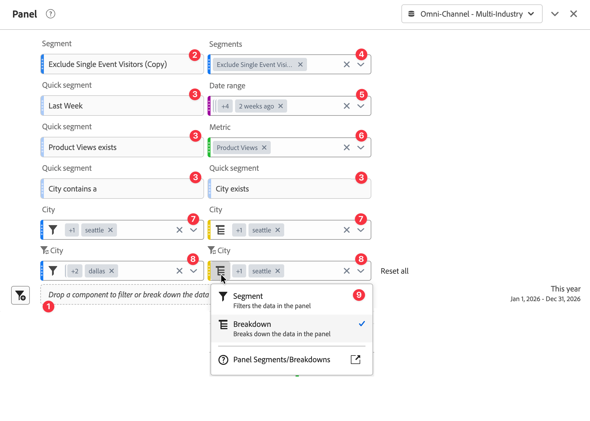

# Paneler - översikt

En [!UICONTROL panel] är en samling tabeller och visualiseringar. Du kommer åt panelerna från den övre vänstra ikonen i Workspace eller en [tom panel](/help/analyze/analysis-workspace/c-panels/blank-panel.md). Paneler är användbara när du vill ordna dina projekt efter tidsperioder, rapportsviter eller användningsfall för analyser.

## Paneltyper

Följande paneltyper är tillgängliga i Analysis Workspace för [!UICONTROL Adobe Analytics]:

| Panelnamn | Beskrivning |
| --- | --- |
| [Tom panel](/help/analyze/analysis-workspace/c-panels/blank-panel.md) | Välj bland tillgängliga paneler och visualiseringar för att starta analysen. |
| [Attribution](attribution.md) | Jämför och visualisera snabbt valfritt antal attribueringsmodeller med alla mått och konverteringsvärden. |
| [Analyser för mål](a4t-panel.md) | Analysera Target-aktiviteter och -upplevelser i Analysis Workspace. |
| [Frihand](freeform-panel.md) | Utför obegränsade jämförelser och uppdelningar och lägg sedan till visualiseringar för att berätta en utförlig databerättelse. |
| [Medel - genomsnittlig minutpublik](average-minute-audience-panel.md) | Analysera den genomsnittliga minuten-publiken för ett visst innehåll eller under en anpassad tidsperiod. |
| [Medievisningsprogram för samtidig användning](media-concurrent-viewers.md) | Analysera samtidiga tittare över tid, med information om maximal samtidighet och möjlighet att dela upp och jämföra. |
| [Tidsåtgång för uppspelning av media](/help/analyze/analysis-workspace/c-panels/media-playback-time-spent.md) | Analysera den uppspelningstid som används för att förstå var högfrekvenser förekommer eller var bortfall inträffar. |
| [Nästa eller föregående objekt](next-previous.md) | Visa nästa eller föregående sidor som andra går till. |
| [Snabba insikter](quickinsight.md) | Bygg snabbt ett frihandsbord och en medföljande visualisering för att analysera och hitta insikter snabbare. |
| [Sidsammanfattning](page-summary.md) | Utforska nyckelstatistik om specifika sidor. |
| [Segmentjämförelse](/help/analyze/analysis-workspace/c-panels/c-segment-comparison/segment-comparison.md) | Jämför snabbt två segment över alla datapunkter för att hitta relevanta skillnader automatiskt. |

[!UICONTROL Quick insights]-, [!UICONTROL Blank]- och [!UICONTROL Freeform]-panelerna är bra platser att starta analysen på, medan [!UICONTROL Attribution] är intresserad av mer avancerade analyser. En  finns längst ned på arbetsytan, så du kan när som helst lägga till tomma paneler.

Standardstartpanelen är panelen [!UICONTROL Freeform], men du kan göra den [tomma panelen](/help/analyze/analysis-workspace/c-panels/blank-panel.md) eller [snabbinsikterna](/help/analyze/analysis-workspace/c-panels/quickinsight.md) till standard. Se [Inställningar för projekt och analys](/help/analyze/analysis-workspace/user-preferences.md#projects--analyses-preferences).

## Skapa en panel

Så här skapar du en panel:

* Dra och släpp en panel från den vänstra panelen på arbetsytan i **[!UICONTROL Panels]**.
* Välj en panel på panelen [Tom](blank-panel.md).
* Använd menyn **[!UICONTROL Insert]** i Workspace och markera panelen. Du kan också använda något av [kortkommandona](../build-workspace-project/fa-shortcut-keys.md) för att infoga en panel.

  

Ni kan:

* Välj  **i** en panel om du vill lägga till en annan visualisering. Ett popup-fönster visas där du kan välja en visualisering.

  

  | Välj... | Skapa en.. |
  |---|---|
  |  | [Frihandstabell](/help/analyze/analysis-workspace/visualizations/freeform-table/freeform-table.md) |
  |  | [Linjediagram](/help/analyze/analysis-workspace/visualizations/line.md) |
  |  | [Bar](/help/analyze/analysis-workspace/visualizations/bar.md) |
  |  | [Sammanfattningsnummer](/help/analyze/analysis-workspace/visualizations/summary-number-change.md) |
  |  | [Text](/help/analyze/analysis-workspace/visualizations/text.md) |
  |  | [Utfall](/help/analyze/analysis-workspace/visualizations/fallout/fallout-flow.md) |
  |  | [Flöde](/help/analyze/analysis-workspace/visualizations/c-flow/flow.md) |
  |  | [Område staplat](/help/analyze/analysis-workspace/visualizations/area.md) |
  |  | [Kohortabell](/help/analyze/analysis-workspace/visualizations/cohort-table/t-cohort.md) |
  |  | [Punkt](/help/analyze/analysis-workspace/visualizations/bullet-graph.md) |
  |  | [Ringdiagram](/help/analyze/analysis-workspace/visualizations/donut.md) |
  |  | [Sammanfattningsändring](/help/analyze/analysis-workspace/visualizations/summary-number-change.md) |
  |  | [Histogram](/help/analyze/analysis-workspace/visualizations/histogram.md) |
  |  | [Spridning](/help/analyze/analysis-workspace/visualizations/scatterplot.md) |
  |  | [Venn](/help/analyze/analysis-workspace/visualizations/venn.md) |
  |  | [Treemap-diagram](/help/analyze/analysis-workspace/visualizations/treemap.md) |

* Välj  **utanför** den sista panelen på arbetsytan för att lägga till ytterligare en [tom panel](blank-panel.md).

## Hantera en panel

Du kan hantera en panel på följande sätt:

* Om du vill komprimera en panel väljer du .
* Om du vill visa en komprimerad panel väljer du .
* Om du vill ta bort en panel väljer du . Ångra genom att välja **[!UICONTROL Edit]** > **[!UICONTROL Undo]** (**[!UICONTROL *cmd *+*z *]**|**[!UICONTROL * ctrl *+* z *]**).
* Om du vill flytta en panel drar och släpper du panelen när en  är synlig (vanligtvis när du för muspekaren över rubriken).

## Rapportsvit

Varje panel är associerad med en [rapportserie](/help/admin/tools/manage-rs/report-suites-admin.md) som identifieras av  **[!UICONTROL *namnet på rapportsviten *]**i listrutan längst upp till höger på panelen.

När du skapar en ny panel baseras standardrapportsviten på rapportsviten från den panel du senast arbetade på i Analysis Workspace-projektet.

Inom ett projekt kan du använda en eller [många rapportsviter](/help/analyze/analysis-workspace/build-workspace-project/multiple-report-suites.md) beroende på dina analysexempel.

Listan med rapportsviter sorteras efter relevans, som Adobe definierar baserat på hur nyligen och ofta sviten har använts av den aktuella användaren. Och hur ofta sviten används inom organisationen.

>[!IMPORTANT]
>
>Den valda rapportsviten avgör vilka dimensioner, mätvärden och segment som är tillgängliga för att skapa visualiseringar i en panel.
>
>
>När du byter rapportserie för en panel kanske vissa komponenter inte är tillgängliga i den nya rapportsviten. Ändringen kan göra att visualiseringen inte återges korrekt. Du kan se varningar som:
>
>* Den här panelen innehåller komponenter som inte är aktiverade i den valda rapportsviten. Ändra rapportsviten eller aktivera de nödvändiga komponenterna i rapportsviten.
>* Det gick inte att återge visualisering: Kontrollera kolumnerna och raderna för att se om de innehåller giltiga komponenter.
>

## Kalender

Panelkalendern styr rapportens datumintervall för tabeller och visualiseringar inom en panel.

>[!NOTE]
>
>Om en -datumintervallkomponent används i en visualisering eller panel (till exempel som ett segment) åsidosätter datumintervallkomponenten panelkalendern.
>

1. Välj ett datumintervall genom att först markera startdatumet och sedan slutdatumet.
Du kan också välja en **[!UICONTROL Preset]** i listrutan [!UICONTROL *Välj en förinställning*] .

1. Du kan också välja **[!UICONTROL Show advanced settings]** för att:

   * Ange **[!UICONTROL Start time]** och **[!UICONTROL End time]** förutom standardvärdena `12:00 AM` (`0:00`) och `11:59 PM` (`23:59`). Sluttider omfattar alltid 59 sekunder. För ett datumintervall som sträcker sig över många dagar gäller starttiden den första dagen i datumintervallet och sluttiden gäller den sista dagen i datumintervallet. Använd **[!UICONTROL (Reset time values)]** om du vill återställa start- och sluttiden till standardvärdena.
   * **[!UICONTROL Make date range components relative to panel calendar]**. Om det är inaktiverat är datumintervallets komponenter som används på panelen relativa till den aktuella tiden. Om det här alternativet är aktiverat är datumintervallets komponenter som används på panelen relativa till panelkalendern.
   * **[!UICONTROL Use rolling dates]**. Om det här alternativet är aktiverat uppdateras förinställda datumintervall som **[!UICONTROL Last 7 full days]** dynamiskt som aktuellt datum- och tidsförlopp. Om du avaktiverar det uppdateras inte dessa förinställningar när de har använts.

     

     Du kan markera texten inom hakparenteser (till exempel **[!UICONTROL fixed start - rolling daily]**) för att utöka panelen och ange information för **[!UICONTROL Start]** och **[!UICONTROL End]**.

      1. Välj **[!UICONTROL Start of]**, **[!UICONTROL End of]** eller **[!UICONTROL Fixed day]**.
      1. När du har valt **[!UICONTROL Start of]** eller **[!UICONTROL End of]** kan du skapa ett fullständigt uttryck. Till exempel: **[!UICONTROL End of]** **[!UICONTROL current year]** **[!UICONTROL plus]** `1` **[!UICONTROL day]**. Välj lämpligt värde för varje enskild del av uttrycket.
         * Välj ett värde för aktuell. Exempel: **[!UICONTROL current year]**.
         * Välj ett värde för ytterligare beräkning. Exempel: **[!UICONTROL plus]**.
         * När du har angett ytterligare en beräkning anger du ett värde. Exempel: `1`.
         * När du har angett ytterligare en beräkning väljer du den tidsperiod som ska användas för beräkningen. Till exempel **[!UICONTROL day]**.

     Välj **[!UICONTROL Hide details]** om du vill dölja informationen för beräkning av rullande datum.

1. Välj **[!UICONTROL Apply]** om du vill tillämpa datumintervallet på panelen som du anropade kalendern från.
Välj **[!UICONTROL Apply to all panels]** om du vill använda datumintervallet på alla paneler i Workspace-projektet.

## Släppzon {#dropzone}

Med panelens släppzon, som heter **[!UICONTROL _Släpp en komponent för att filtrera eller dela upp data_]**, kan du filtrera eller dela upp data för panelen. De segment eller uppdelningar som du använder för att filtrera eller dela upp data gäller för alla frihandstabeller och visualiseringar i panelen.

Med segment och uppdelningar kan du interagera med data på ett kontrollerat sätt. Du kan till exempel lägga till en segmentlistruta för mobila enhetstyper så att du kan filtrera panelen genom att välja Tablet, Mobiltelefon eller Skrivbord.

Segment kan också användas för att konsolidera många projekt till ett. Om du till exempel har olika versioner av samma projekt med olika landssegment kan du konsolidera alla versioner till ett enda projekt och lägga till en meny för landssegment.

Bilden nedan visar de olika variationerna av (snabba) segment eller uppdelningar som uppstår när du lägger till komponenter i släppzonen.

### Lägg till eller ersätt

Så här lägger du till eller ersätter (snabba) segment eller uppdelningar:

1. Välj en eller flera komponenter från komponentspåret. Använd ⇧+ eller ^+ om du vill markera flera komponenter.
1. Dra markeringen till släppzonen med etiketten **[!UICONTROL _Släpp en komponent om du vill filtrera eller dela upp data_]** ❶ eller över en befintlig komponent som redan är placerad i närheten av släppzonen.
1. Du har två alternativ när du ser  **[!UICONTROL Add (press "shift" to create dropdown)]** eller  **[!UICONTROL Replace (press "shift" to add to dropdown)]**:

   

   * Släpp markeringen för att skapa följande komponenter:
      * [Segment](#segment) för alla segmentkomponenter som du släpper ❷.
      * [Snabbsegment](#quick-segment) för alla komponenter som inte är segmentkomponenter (datumintervall, mått, dimensioner, dimensionsobjekt) som du släpper ❸.
   * Släpp markeringen **medan du håller** ⇧ (Skift) för att skapa följande komponenter:
      * Statiskt segment [nedrullningsbar meny](#drop-down-menu) med alternativ att filtrera på för de markerade segment som du släpper ❹.
      * Statiskt segment [nedrullningsbar meny](#drop-down-menu) med alternativ att filtrera på för de valda datumintervallen som du släpper ❺.
      * Statiskt segment [nedrullningsbar meny](#drop-down-menu) med alternativ att filtrera på för de valda mätvärden som du släpper ❻.
      * Statiskt segment [nedrullningsbar meny](#drop-down-menu) eller nedbrytning [nedrullningsbar meny](#drop-down-menu) med alternativ att filtrera på eller dela upp för den valda dimensionen *objekt* som du släpper ❼.
      * Dynamiskt segment [nedrullningsbar meny](#drop-down-menu) eller nedbrytning [nedrullningsbar meny](#drop-down-menu) med alternativ som du kan filtrera på eller dela upp för de valda dimensionerna som du släpper ❽.

### Segment

Alla segmentkomponenter som du släpper används för att segmentera panelen. Använd segment för att få segmenterade insikter i panelens data och visualiseringar.

### Snabbsegment

Alla icke-segmentkomponenter (dimension, dimensionsobjekt, mått, datumintervall) som tas bort definierar ett [snabbsegment](#quick-segment) för att segmentera panelen. Använd valfri icke-segmentkomponent för att skapa ett snabbsegment utan att använda [segmentverktyget](/help/components/segmentation/segmentation-workflow/seg-quick.md). Ett segment som skapas på det här sättet definieras automatiskt som ett händelsenivåsegment och får etiketten **[!UICONTROL Quick segment]** som standard.

Du kan också använda  för att skapa ett snabbsegment.

Se [Snabbsegment](/help/components/segmentation/segmentation-workflow/seg-quick.md) för mer information om hur du skapar och hanterar snabbsegment.

### Listruta

En rullgardinsmeny som skapas medan du håller ⇧ kan:

* innehåller en [statisk](#static)- eller [dynamisk](#dynamic)-lista med objekt.
* [filtrera en panel](#filter) eller [bryta ned en panel](#breakdown).

#### Statisk

Statiska rullgardinsmenyer skapas för den valda dimensionen *objekt*, mått, segment och datumintervall. Alternativen i en statisk listruta baseras på de valda komponenter som du släpper och alternativen ändras inte när du lägger till eller ersätter komponenter.

#### Dynamisk

Dynamiska listrutor skapas bara när du släpper dimensionskomponenter. Dynamiska listrutor är markerade med  som en del av etiketten.

De tillgängliga alternativen i en dynamisk listruta är baserade på:

* data som är resultatet av valda objekt i andra nedrullningsbara menyer, segment och snabbsegment i panelens släppzon, och
* de data som är tillgängliga inom panelens rapporteringsintervall.

Du kan till exempel lägga till två dynamiska listrutor med en landsdimension och en stadsdimension. När du väljer ett land i listrutan **[!UICONTROL Countries]** justeras listrutan **[!UICONTROL Cities]** dynamiskt så att den bara visar städer i det valda landet. När du har ytterligare statiska rullgardinsmenyer påverkar objekt som är markerade på dessa rullgardinsmenyer även de tillgängliga objekten på de dynamiska listrutorna. Objekt som är markerade i dynamiska listrutor påverkar inte tillgängliga objekt i statiska listrutor.

#### Filtrera en panel

En listruta skapas för alla mått-, segment- eller datumintervallkomponenter som du släpper **när du håller ned** ⇧. Med den nedrullningsbara menyn kan du filtrera panelen baserat på de alternativ som är tillgängliga för den släppta komponenten.

För alla *dimension*-komponenter som du släpper **när du håller ned** ⇧ skapas en segmentlistruta. Med den nedrullningsbara menyn kan du filtrera panelen baserat på de alternativ som är tillgängliga för de släppta dimensionsobjekten ([statisk](#static) segmentmeny) eller dimensionskomponenten ([dynamisk](#dynamic) segmentmeny). Så här konfigurerar du listrutan explicit för att filtrera en panel med hjälp av segment:

* Välj  och välj  **[!UICONTROL Segment]** | **[!UICONTROL Filters the data in the panel]** på snabbmenyn för komponenten ❾.

#### Dela upp en panel

För alla *dimension*-komponenter som du släpper **när du håller ned** ⇧ skapas en segmentlistruta. Du kan konfigurera den nedrullningsbara menyn så att panelen delas upp baserat på de alternativ som är tillgängliga för de släppta dimensionsobjekten ([statisk](#static) listruta för nedbrytning) eller dimensionskomponenten ([dynamisk](#dynamic) listruta för nedbrytning). Så här konfigurerar du listrutan explicit för att dela upp en panel med hjälp av uppdelningar:

* Välj  och välj  **[!UICONTROL Breakdown]** | **[!UICONTROL Breaks down the data in the panel]** på snabbmenyn för komponenten ❾.

>[!IMPORTANT]
>
>Uppdelningar är bara tillgängliga för dimensioner och dimensionsobjekt, inte för segment, datumintervall eller mått.
>

#### Segment kontra uppdelning

Överväg att dela upp en panel i stället för att filtrera en panel (med segment) i följande scenarier:

* Om du använder attribueringsaktiverade mätvärden på panelen tar segment ofta bort dina attribueringsaktiverade mätvärden. Uppdelningar tillämpas vid en annan punkt i frågan som körs för att hämta data för panelen. Därför rensas inte dessa attributaktiverade värden bort vid uppdelningar.

  Se t.ex. skillnaden mellan attributbaserade **[!UICONTROL Online Revenue]**-mått när du använder ett **[!UICONTROL Luma: Product Category]**  **[!UICONTROL Women]** -segment och ett **[!UICONTROL Luma: Product Category]**  **[!UICONTROL Women]** -beteende.

  

* Om du använder en underhändelsenivådimension i en listruta för uppdelning, körs delhändelserna på den nivån. I stället körs segment i en segmentlistruta på händelsenivån.

  Se till exempel skillnaden mellan **[!UICONTROL Online Revenue]**-måttet när du använder ett **[!UICONTROL Luma: Product Subcategory]**  **[!UICONTROL Tops]** -segment jämfört med ett **[!UICONTROL Luma: Product Subcategory]**  **[!UICONTROL Tops]** -nedbrytning. Nedbrytningen kör frågan explicit på underhändelsenivå, medan segmentet kör frågan på händelsenivå.

  

### Hantera

Du kan hantera komponenterna i släppzonen på följande sätt:

| Vad du ska göra i panelens släppzon.. | Så här gör du ... |
|---|---|
| Ta bort ett segment eller snabbsegment. | Välj  i komponenten. |
| Ta bort ett markerat objekt från en nedrullningsbar meny. | Välj  i objektet. |
| Om du vill ta bort alla markerade objekt från en listruta. | Välj  i listrutan. |
| Så här redigerar du en komponents etikett. | Håll markören över komponentens etikett och välj . |
| Om du vill ta bort en komponents etikett. | Håll pekaren över komponentens etikett och välj **[!UICONTROL Delete label]** på komponentens snabbmeny. |
| Om du vill ta bort komponenten från släppzonen. | Välj **[!UICONTROL Delete drop-down]** på snabbmenyn för komponenten. |
| Om du vill ha information om ett segment eller snabbsegment. | Hovra inuti komponenten och välj  för att öppna Data Dictionary med information om komponenten. |
| Om du vill ha information om komponenten som definierar en nedrullningsbar meny. | Hovra i listrutan och välj  för att öppna Data Dictionary med information om komponenten. |
| Om du vill redigera ett snabbsegment. | Hovra i snabbsegmentet och välj . Mer information finns i [Snabbsegment](/help/components/segmentation/segmentation-workflow/seg-quick.md). |
| Om du vill att en meny ska vara markerad. | Välj **[!UICONTROL Require selection]** på snabbmenyn för komponenten. |
| Tillåt inget filter för en nedrullningsbar meny. | Välj **[!UICONTROL Allow no filter]** på snabbmenyn för komponenten. |
| Om du vill återställa alla komponenter och rensa alla markeringar för nedrullningsbara menyer. | Välj **[!UICONTROL Reset all]**. |

>[!BEGINSHADEBOX]

Se  [Använda filter i Analysis Workspace](https://experienceleague.adobe.com/en/docs/analytics-learn/tutorials/analysis-workspace/using-panels/using-drop-down-filters){target="_blank"} för en demonstrationsvideo.

>[!ENDSHADEBOX]

>[!BEGINSHADEBOX]

Se  [Dynamiska listrutor](https://experienceleague.adobe.com/en/docs/customer-journey-analytics-learn/tutorials/analysis-workspace/tips-and-tricks/dynamic-drop-downs){target="_blank"} för en demonstrationsvideo.

{{videocja}}

>[!ENDSHADEBOX]

## Snabbmeny

Ytterligare funktioner för en panel är tillgängliga via en snabbmeny (högerklicka) i panelhuvudet.

Följande alternativ är tillgängliga:

| Alternativ | Beskrivning |
| --- | --- |
| **[!UICONTROL Insert copied panel]** | Gör att du kan klistra in en kopierad panel på en annan plats i projektet eller i ett annat projekt. |
| **[!UICONTROL Insert copied visualization]** | Klistra in en kopierad visualisering på en annan plats i panelen, projektet eller i ett annat projekt. |
| **[!UICONTROL Apply Report Suite to all panels]** | Använd rapportsviten för den här panelen på alla andra paneler i projektet. |
| **[!UICONTROL Copy panel]** | Kopiera en panel så att du kan infoga den på en annan plats i projektet eller i ett annat projekt. |
| **[!UICONTROL Duplicate panel]** | Skapar en exakt kopia av den aktuella panelen, som du sedan kan ändra. |
| **[!UICONTROL Collapse all panels]** | Komprimera alla projektpaneler. |
| **[!UICONTROL Expand all panels]** | Expandera alla projektpaneler. |
| **[!UICONTROL Collapse all visualizations in panel]** | Komprimera alla visualiseringar i den aktuella panelen. |
| **[!UICONTROL Expand all visualizations in panel]** | Utöka alla visualiseringar i den aktuella panelen. |
| **[!UICONTROL Edit Description]** | Lägg till (eller redigera) en textbeskrivning för panelen. |
| **[!UICONTROL Get Panel Link]** | Dirigera någon till en viss panel i ett projekt. När länken är markerad måste mottagaren logga in innan han eller hon dirigeras till just den panel som är länkad till. |

## Konfiguration

Vissa paneler (som [!UICONTROL Attribution], [!UICONTROL Experimentation], [!UICONTROL Media average minute audience] och andra) har en konfigurationsdialogruta som hjälper dig att skapa visualiseringen. Använd  längst upp på panelen för att komma åt och ändra konfigurationen.

