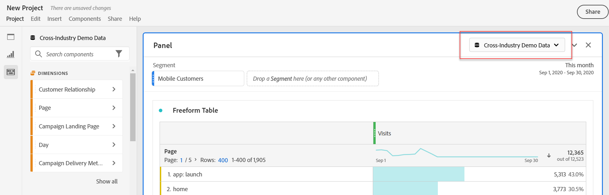

# Översikt över paneler

A [!UICONTROL panel] är en samling tabeller och visualiseringar. Du kommer åt panelerna från den övre vänstra ikonen i Workspace eller en [tom panel](blank-panel.md). Paneler är användbara när du vill ordna dina projekt efter tidsperioder, rapportsviter eller användningsfall för analyser.

## Paneltyper

Följande paneltyper är tillgängliga i Analysis Workspace:

| Panelnamn | Beskrivning |
| --- | --- |
| [Tom panel](blank-panel.md) | Välj bland tillgängliga paneler och visualiseringar för att starta analysen. |
| [Panelen Snabbinsikter](quickinsight.md) | Bygg snabbt ett frihandsbord och en medföljande visualisering för att analysera och hitta insikter snabbare. |
| [Analyser för målpanelen](a4t-panel.md) | Analysera Target-aktiviteter och -upplevelser i Analysis Workspace. |
| [Panelen Attribution](attribution.md) | Jämför och visualisera snabbt valfritt antal attribueringsmodeller med alla mått och konverteringsvärden. |
| [Frihandspanel](freeform-panel.md) | Utför obegränsade jämförelser och uppdelningar och lägg sedan till visualiseringar för att berätta en utförlig databerättelse. |
| [Panelen Mediegenomsnitt för miniatyrmålgrupp](average-minute-audience-panel.md) | Analysera den genomsnittliga minuten-publiken över tiden, med information om toppvyer och möjlighet att dela upp och jämföra. |
| [Panelen för samtidiga medieanvändare](media-concurrent-viewers.md) | Analysera samtidiga tittare över tid, med information om maximal samtidighet och möjlighet att dela upp och jämföra. |
| [Panelen Medieuppspelning - tidsfördröjning](media-playback-timespent/media-playback-time-spent.md) | Analysera samtidiga tittare över tid, med information om maximal samtidighet och möjlighet att dela upp och jämföra. |
| [Segmentjämförelsepanel](c-segment-comparison/segment-comparison.md) | Jämför snabbt två segment över alla datapunkter för att automatiskt hitta relevanta skillnader. |

[!UICONTROL Quick Insights], [!UICONTROL Blank] och [!UICONTROL Freeform] paneler är bra att använda för att starta analysen, medan [!UICONTROL Analytics for Target], [!UICONTROL Attribution IQ], [!UICONTROL Media Concurrent Viewers] och [!UICONTROL Segment Comparison] Använd mer avancerade analyser. A `"+"` -knappen är tillgänglig i projekt så att du kan lägga till tomma paneler när som helst.

Standardstartpanelen är [!UICONTROL Freeform] men du kan göra [tom panel](/help/analyze/analysis-workspace/c-panels/blank-panel.md) även din standard.

## Rapportsvit {#report-suite}

Tabeller och visualiseringar i en panel hämtar data från [!UICONTROL report suite] i panelens övre högra hörn. Rapportsviten avgör också vilka komponenter som är tillgängliga i den vänstra listen. Inom ett projekt kan du använda ett [många rapportsviter](https://experienceleague.adobe.com/docs/analytics/analyze/analysis-workspace/build-workspace-project/multiple-report-suites.html) beroende på dina analysexempel. Om du vill använda en enda rapportserie för alla paneler i ett projekt, **högerklicka på panelhuvudet > Tillämpa rapportsviten på alla paneler**.

Listan med rapportsviter sorteras efter relevans, som Adobe definierar utifrån hur nyligen och ofta sviten har använts av den aktuella användaren och hur ofta sviten används i organisationen.

## Kalender {#calendar}

Panelkalendern styr rapporteringsintervallet för tabeller och visualiseringar inom en panel.

>[!NOTE]
>Om en (lila) datumintervallkomponent används i en tabell, visualisering eller panelsläppzon åsidosätts panelkalendern.

Du kan använda ett datumintervall på minutnivå under de avancerade inställningarna i panelkalendern. Om du rapporterar i ett datumintervall som sträcker sig över många dagar, gäller starttiden den första dagen och sluttiden den sista dagen i intervallet.

## Släppzon {#dropzone}

Med panelens listzon kan du tillämpa segment- och listrutefilter på alla tabeller och visualiseringar i en panel. Du kan använda ett eller flera filter på en panel. Titeln ovanför varje filter kan ändras genom att du klickar på redigeringspennan eller så kan du högerklicka för att ta bort den helt.

### Segmentfilter

Dra och släpp ett segment från den vänstra listen i panelens släppzon för att börja filtrera panelen.

### Ad hoc-segmentfilter

Komponenter som inte är segmentkomponenter kan också dras direkt till släppzonen för att skapa ad hoc-segment, vilket sparar tid och arbete med att gå till segmentbyggaren. Segment som skapas på det här sättet definieras automatiskt som träffnivåsegment. Du kan ändra den här definitionen genom att klicka på informationsikonen (i) bredvid segmentet, sedan den pennformade redigeringsikonen och redigera den i segmentbyggaren.

Ad hoc-segment är en typ av snabbsegment och är lokala för projektet. De visas inte i den vänstra listen om du inte gör dem offentliga.

Mer information finns i [Snabbsegment](/help/analyze/analysis-workspace/components/segments/quick-segments.md).

### Statiska nedrullningsbara filter

Med nedrullningsbara filter kan du interagera med data på ett kontrollerat sätt. Du kan t.ex. lägga till ett nedrullningsbart filter för mobila enhetstyper så att du kan segmentera panelen via Surfplatta, Mobiltelefon eller Skrivbord.

Nedrullningsbara filter kan även användas för att konsolidera flera projekt till ett. Om du till exempel har många versioner av samma projekt med olika landssegment tillämpade, kan du konsolidera alla versioner till ett enda projekt och lägga till ett nedrullningsbart landsfilter.

Så här skapar du ett statiskt nedrullningsbart filter:

* För nedrullningsbara filter som använder dimensionsobjekt klickar du på högerpilsikonen bredvid önskad dimension i den vänstra listen. Den här åtgärden visar alla tillgängliga dimensionsobjekt. Välj flera dimensionsobjekt från den här listan med `[Shift + Click]` eller `[Ctrl + Click]`och sedan släppa dem i panelens dropzone **medan du håller`[Shift]`**.
* För nedrullningsbara filter som använder andra komponenter som mått, segment eller datumintervall väljer du flera komponenter med `[Shift + Click]` eller `[Ctrl + Click]`. Släpp markeringen i panelens dropzone **medan du håller`[Shift]`**. Alla komponenttyper behandlas som segment i det här sammanhanget.
* Ett enda nedrullningsbart filter kan bara innehålla en enda komponenttyp. Om du inkluderar flera komponenttyper i markeringen skapas ett separat nedrullningsbart filter per komponenttyp. Om du till exempel inkluderar både mått och dimensionsobjekt i markeringen skapas två separata nedrullningsbara filter. Ett nedrullningsbart filter innehåller dimensionsobjekt och det andra innehåller mått.

Välj ett av alternativen i listrutan om du vill ändra data på panelen. Du kan också välja att inte filtrera paneldata genom att markera **[!UICONTROL No filter]**.

Om du högerklickar på ett nedrullningsbart filter finns följande alternativ:

* **[!UICONTROL Add label]**: När du lägger till ett nedrullningsbart filter i ett projekt ställs en etikett automatiskt in på komponentnamnet. Om du tar bort etiketten kan du lägga till den igen med det här alternativet.
* **[!UICONTROL Delete label]**: Ta bort texten ovanför ett nedrullningsbart filter.
* **[!UICONTROL Delete drop-down filter]**: Tar bort nedrullningsfiltret från panelen.

[Se videon](https://experienceleague.adobe.com/docs/analytics-learn/tutorials/analysis-workspace/using-panels/using-panels-to-organize-your-analysis-workspace-projects.html) om du vill veta mer om hur du lägger till nedrullningsbara filter i ett projekt.

<!--### Dynamic drop-down filters

Dynamic drop-down filters allow you to determine available values based on data within the panel's reporting range and values in other drop-down filters. For example, you can create two dynamic drop-downs using the [Countries](/help/components/dimensions/countries.md) dimension and [Cities](/help/components/dimensions/cities.md) dimension. When you select a country from the [!UICONTROL Countries] drop-down list, the [!UICONTROL Cities] drop-down list dynamically adjusts to only show cities within that country.

This same concept applies to all dimensions; only dimension items that appear within the panel's date range and selected filters are visible. Dimension items selected in static drop-down filters affect available values in dynamic drop-down filters. However, the inverse is not true; Dimension items selected in dynamic drop-down filters do not affect available values in static drop-down filters.

Manual selection of dimension items is available if you anticipate a certain dimension item to be collected in the future. You can also clear a dynamic drop-down filter so that it does not contain a value, allowing other dynamic drop-down filters to contain more values. Select **[!UICONTROL Clear All]** to clear the selection from all drop-down filters for that panel.

To create a dynamic drop-down filter:

* Drag and drop a single dimension into the panel dropzone **while holding `[Shift]`**.
* Dynamic drop-down filters are not available for metrics, segments, or date ranges.
* Right-click a drop-down filter and select **[!UICONTROL Delete filter]** to delete it.

Right-clicking a dynamic drop-down filter provides the same options as static drop-down filters.-->

## Högerklicka på menyn {#right-click}

Ytterligare funktioner för en panel är tillgängliga genom att högerklicka på panelhuvudet.

Följande inställningar är tillgängliga:

| Inställning | Beskrivning |
| --- | --- |
| Infoga kopierad panel/visualisering | Gör att du kan klistra in (&quot;infoga&quot;) en kopierad panel eller visualisering på en annan plats i projektet, eller i ett annat projekt. |
| Kopiera panel | Högerklicka och kopiera en panel så att du kan infoga den på en annan plats i projektet eller i ett annat projekt. |
| Tillämpa Report Suite på alla paneler | Gör att du kan använda den aktiva panelrapportsviten på alla paneler i projektet. |
| Duplicera panel | Skapar en exakt kopia av den aktuella panelen, som du sedan kan ändra. |
| Komprimera/expandera alla paneler | Komprimerar och utökar alla projektpaneler. |
| Komprimera/utöka alla visualiseringar i panelen | Komprimerar och utökar alla visualiseringar i den aktuella panelen. |
| Redigera beskrivning | Lägg till (eller redigera) en textbeskrivning för panelen. |
| Hämta panellänk | Du kan dirigera någon till en viss panel i ett projekt. När användaren klickar på länken måste mottagaren logga in innan han eller hon dirigeras till just den panel som är länkad till. |
