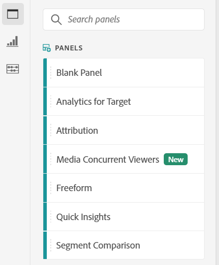

# Översikt över paneler

En [!UICONTROL panel] är en samling tabeller och visualiseringar. Du kommer åt panelerna från den övre vänstra ikonen i Workspace eller en [tom panel](blank-panel.md). Paneler är användbara när du vill ordna dina projekt efter tidsperioder, rapportsviter eller användningsfall för analyser. Följande paneltyper är tillgängliga i Analysis Workspace:

| Panelnamn | Beskrivning |
| --- | --- |
| [Tom panel](blank-panel.md) | Välj bland tillgängliga paneler och visualiseringar för att starta analysen. |
| [Panelen Snabbinsikter](quickinsight.md) | Bygg snabbt ett frihandsbord och en medföljande visualisering för att analysera och hitta insikter snabbare. |
| [Analyser för målpanelen](a4t-panel.md) | Analysera Target-aktiviteter och -upplevelser i Analysis Workspace. |
| [Panelen Attribution](attribution.md) | Jämför och visualisera snabbt valfritt antal attribueringsmodeller med alla mått och konverteringsvärden. |
| [Frihandspanel](freeform-panel.md) | Utför obegränsade jämförelser och uppdelningar och lägg sedan till visualiseringar för att berätta en utförlig databerättelse. |
| [Panelen för samtidiga medieanvändare](media-concurrent-viewers.md) | Analysera samtidiga tittare över tid, med information om maximal samtidighet och möjlighet att dela upp och jämföra. |
| [Segmentjämförelsepanel](c-segment-comparison/segment-comparison.md) | Jämför snabbt två segment över alla datapunkter för att automatiskt hitta relevanta skillnader. |

[!UICONTROL Quick Insights],  [!UICONTROL Blank] och  [!UICONTROL Freeform] paneler är bra platser för att starta analysen, medan  [!UICONTROL Analytics for Target],  [!UICONTROL Attribution IQ]och  [!UICONTROL Media Concurrent Viewers]   [!UICONTROL Segment Comparison] ge sig ut på mer avancerade analyser. En `"+"`-knapp är tillgänglig i projekt, så du kan när som helst lägga till tomma paneler.

Standardstartpanelen är panelen [!UICONTROL Freeform], men du kan göra den tomma panelen](/help/analyze/analysis-workspace/c-panels/blank-panel.md) till standard.[

## Rapportsviten {#report-suite}

Tabeller och visualiseringar i en panel hämtar data från det [!UICONTROL report suite] som är markerat i panelens övre högra hörn. Rapportsviten avgör också vilka komponenter som är tillgängliga i den vänstra listen. Inom ett projekt kan du använda en eller [många rapportsviter](https://docs.adobe.com/content/help/sv-SE/analytics/analyze/analysis-workspace/build-workspace-project/multiple-report-suites.html) beroende på dina analysexempel. Om du vill använda en enda rapportserie för alla paneler i ett projekt **högerklickar du på panelhuvudet > Använd rapportserie för alla paneler**.

Listan med rapportsviter sorteras efter relevans, som Adobe definierar utifrån hur nyligen och ofta sviten har använts av den aktuella användaren och hur ofta sviten används i organisationen.

## Kalender {#calendar}

Panelkalendern styr rapporteringsintervallet för tabeller och visualiseringar inom en panel.

Obs! Om en (lila) datumintervallkomponent används i en tabell, visualisering eller paneldropzon åsidosätts panelkalendern.

## Dropzone {#dropzone}

Med panelens listruta kan du tillämpa segment- och listrutefilter på alla tabeller och visualiseringar i en panel. Du kan använda ett eller flera filter på en panel. Titeln ovanför varje filter kan ändras genom att du klickar på redigeringspennan eller så kan du högerklicka för att ta bort den helt.

### Segmentfilter

Dra och släpp ett segment från den vänstra listen i panelens släppzon för att börja filtrera panelen.

### Ad hoc-segmentfilter

Komponenter som inte tillhör segment kan också dras direkt till dropzone för att skapa ad hoc-segment, vilket sparar tid och kraft åt att gå till Segment Builder. Segment som skapas på det här sättet definieras automatiskt som träffnivåsegment. Du kan ändra den här definitionen genom att klicka på informationsikonen (i) bredvid segmentet, sedan den pennformade redigeringsikonen och redigera den i segmentbyggaren.

Ad-hoc-segment är lokala för projektet och visas inte i den vänstra listen om du inte gör dem offentliga.

### Nedrullningsbara filter {#dropdown-filter}

Förutom segmentfilter kan du med hjälp av nedrullningsbara filter interagera med data på ett kontrollerat sätt. Du kan t.ex. lägga till ett nedrullningsbart filter för mobila enhetstyper så att du kan segmentera panelen via Surfplatta, Mobiltelefon eller Skrivbord.

Nedrullningsbara filter kan även användas för att konsolidera flera projekt till ett. Om du till exempel har många versioner av samma projekt med olika landssegment tillämpade, kan du konsolidera alla versioner till ett enda projekt och lägga till ett nedrullningsbart landsfilter.

Så här skapar du nedrullningsbara filter:

1. Om du vill skapa ett nedrullningsbart filter med [!UICONTROL Dimension items], t.ex. värden inom dimensionen [!UICONTROL Marketing Channel], klickar du på högerpilsikonen bredvid dimensionen i den vänstra listen. Då visas alla tillgängliga objekt. Markera ett eller flera komponentobjekt i den vänstra listen och släpp dem i panelens dropzon **samtidigt som du håller ned Skift-tangenten**. Komponenterna blir då ett nedrullningsbart filter i stället för ett enda segment.
1. Om du vill skapa ett nedrullningsbart filter med hjälp av andra komponenter, som mått, segment eller datumintervall, väljer du en komponenttyp i den vänstra listen och släpper i panelens listruta **samtidigt som du håller ned Skift-tangenten**.
1. Välj ett av alternativen i listrutan om du vill ändra data på panelen. Du kan också välja att inte filtrera paneldata genom att välja **[!UICONTROL No filter]**.

[Titta på ](https://docs.adobe.com/content/help/en/analytics-learn/tutorials/analysis-workspace/using-panels/using-panels-to-organize-your-analysis-workspace-projects.html) videon och lär dig mer om hur du lägger till nedrullningsbara filter i ditt projekt.

## Högerklicka på menyn {#right-click}

Ytterligare funktioner för en panel är tillgängliga genom att högerklicka på panelhuvudet.

Följande inställningar är tillgängliga:

| Inställning | Beskrivning |
| --- | --- |
| Infoga kopierad panel/visualisering | Gör att du kan klistra in (&quot;infoga&quot;) en kopierad panel eller visualisering på en annan plats i projektet, eller i ett helt annat projekt. |
| Kopiera panel | Högerklicka och kopiera en panel så att du kan infoga den på en annan plats i projektet eller i ett helt annat projekt. |
| Tillämpa Report Suite på alla paneler | Gör att du kan använda den aktiva panelrapportsviten på alla paneler i projektet. |
| Duplicera panel | Skapar en exakt kopia av den aktuella panelen, som du sedan kan ändra. |
| Komprimera/expandera alla paneler | Komprimerar och utökar alla projektpaneler. |
| Komprimera/utöka alla visualiseringar i panelen | Komprimerar och utökar alla visualiseringar i den aktuella panelen. |
| Redigera beskrivning | Lägg till (eller redigera) en textbeskrivning för panelen. |
| Hämta panellänk | Du kan dirigera någon till en viss panel i ett projekt. När användaren klickar på länken måste mottagaren logga in innan han eller hon dirigeras till just den panel som är länkad till. |
