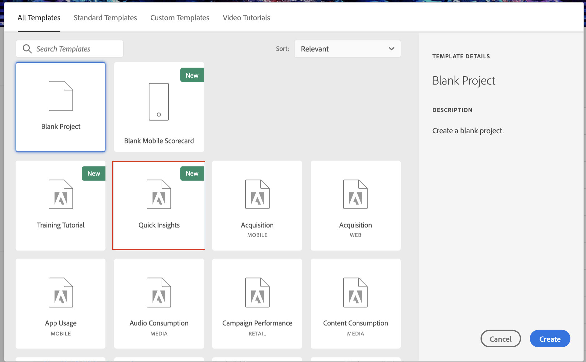

# Quick Insights builder

>[!IMPORTANT]
>
>**[!UICONTROL Quick Insights]** är för närvarande i betatestning och är inte allmänt tillgänglig för alla Adobe Analytics-kunder än.

[!UICONTROL Quick Insights] ger vägledning för icke-analytiker och nya användare av Analysis Workspace så att de snabbt och enkelt kan besvara affärsfrågor. Det är också ett bra verktyg för avancerade användare som snabbt vill besvara en fråga utan att själva behöva skapa en tabell.

När du börjar använda den här Analysis Workspace första gången kanske du undrar vilka visualiseringar som skulle vara mest användbara, vilka dimensioner och mätvärden som skulle kunna underlätta insikter, var objekten ska dras och släppas, var ett segment ska skapas osv.

För att hjälpa till med detta, och baserat på ditt företags användning av datakomponenter i Analysis Workspace, [!UICONTROL Quick Insights] utnyttjar en algoritm som ger dig de populäraste dimensionerna, mätvärdena, segmenten och datumintervallen som ditt företag använder.

[!UICONTROL Quick Insights] hjälper dig

* Bygg en datatabell och tillhörande visualisering korrekt i Analysis Workspace.
* Lär dig terminologi och vokabulär för grundläggande komponenter och delar av Analysis Workspace.
* Gör enkla uppdelningar av dimensioner, lägg till flera mätvärden eller jämför segment enkelt i en frihandstabell.
* Ändra eller prova olika visualiseringstyper för att snabbt och intuitivt hitta sökverktyget för din analys.

## Grundläggande nyckelterminologi

Nedan följer några grundläggande termer som du måste känna till. Varje datatabell består av två eller flera byggstenar (komponenter) som du använder för att berätta din databerättelse.

| Byggblock (komponent) | Definition |
|---|---|
| [!UICONTROL Dimension] | Dimensioner är beskrivningar eller egenskaper för mätdata som kan visas, delas upp och jämföras i ett projekt. De är icke-numeriska värden och datum som delas upp i dimensionsobjekt. Till exempel är &quot;webbläsare&quot; eller &quot;sida&quot; dimensioner. |
| [!UICONTROL Dimension item] | Dimensionsobjekt är enskilda värden för en dimension. Dimensionsobjekten för webbläsardimensionen är till exempel Chrome, Firefox och Edge. |
| [!UICONTROL Metric] | Mätvärden är kvantitativ information om besökaraktivitet, t.ex. visningar, klickningar, omladdningar, genomsnittlig tid, enheter, order, intäkter och så vidare. |
| Visualisering | Workspace erbjuder [ett antal visualiseringar](/help/analyze/analysis-workspace/visualizations/t-sync-visualization.md) för att skapa visuella representationer av dina data, till exempel stapeldiagram, dondiagram, histogram, linjediagram, kartor, punktdiagram med mera. |
| [!UICONTROL Segment] | Med segment kan du identifiera undergrupper av besökare baserat på egenskaper eller webbplatsinteraktioner. Du kan till exempel skapa [!UICONTROL Visitor] segment baserat på attribut: webbläsartyp, enhet, antal besök, land, kön eller baserat på interaktioner: kampanjer, sökordssökningar, sökmotorer eller baserat på avslutningar och tävlingsbidrag: besökare från Facebook, en definierad landningssida, hänvisande domän eller baserad på anpassade variabler: formulärfält, definierade kategorier, kund-ID. |

## Kom igång med Quick Insights

1. Logga in på Adobe Analytics med de inloggningsuppgifter du har fått.
1. Gå till [!UICONTROL Workspace] och klicka **[!UICONTROL Create New Project]** och klicka sedan **[!UICONTROL Quick Insights Builder]**.

   

1. När du börjar ska du gå igenom den korta självstudiekurs som lär ut några av grunderna i Quick Insight Builder. Du kan också klicka för att **[!UICONTROL Skip Tutorial]**.
1. Markera dina byggstenar (kallas även komponenter): dimensioner (orange), mått (grönt), segment (blått) eller datumintervall (lila) Du måste välja minst en dimension och ett mått för att en tabell ska skapas automatiskt.

   

   Du kan välja byggblock på tre olika sätt:
   * Dra och släpp dem från den vänstra listen.
   * Om du vet vad du söker: Börja skriva namnet så fyller Quick Insights i tomrummet.
   * Klicka på listrutan och sök i listan.

1. När du har lagt till minst en dimension och ett mått skapas följande för dig:

   * En Freeform-tabell med dimensionen (här, USA) lodrätt och måttet (här, Besök) vågrätt högst upp. Kolla in den här tabellen:
   

   * En åtföljande visualisering, i det här fallet ett [stapeldiagram](/help/analyze/analysis-workspace/visualizations/bar.md). Den visualisering som genereras baseras på den typ av data som du har lagt till i tabellen. Du kan ändra visualiseringstypen genom att klicka på listrutepilen bredvid **[!UICONTROL Bar]**.

1. (Valfritt) Detaljera mått och visa dimensionsobjekt genom att klicka på > högerpilen bredvid dimensionen.

1. Försök att lägga till fler förbättringar enligt beskrivningen nedan under Andra användbara alternativ.

## Andra användbara alternativ

Andra användbara tips kommer att dyka upp i Quick Insights-verktyget, vissa av dem beroende på den senaste åtgärden.

* **Prova att dra och släppa**: Om du t.ex. använde listrutan för att markera byggblocket kan det här dyka upp:

   

* **Ändra visualisering**: uppmuntrar dig att prova olika visuella representationer av dina data tills du hittar den som verkligen skiner. Här är ett exempel på ett linjediagram:

   

* **Uppdelning efter**: Du kan använda upp till tre nivåer av uppdelningar på dimensioner för att gå ned till de data du verkligen behöver. En uppdelning är ett sätt att bokstavligen dela upp dimensionen efter andra dimensioner. I vårt exempel kan du bryta ned USA efter mobila enheter för att få mobilenhetsbesök per stat, typ av mobila enheter, eller per region, efter interna kampanjer osv.

   

* **Lägg till fler mätvärden**: Du kan lägga till upp till två mätvärden till genom att använda operatorn AND för att lägga till dem i tabellen.

   

* **Lägg till fler segment**: Du kan lägga till upp till två segment till genom att använda operatorerna AND eller OR för att lägga till dem i tabellen. Se vad som händer med tabellen när du lägger till mobilanvändare eller lojala besökare. De står bredvid varandra, ovanför mätvärdena. Om du lade till mobila användare och lojala besökare skulle du se resultat från båda segmenten tillsammans, och de skulle staplas ovanpå varandra i tabellen.

   

## Kända begränsningar

Om du försöker redigera direkt i tabellen kommer verktyget för snabba insikter (verktyget för att fylla i det tomma) att bli osynkroniserat. Du kan återställa den till de tidigare Quick Insight-inställningarna genom att gå till **[!UICONTROL Help > Tutorials]** eller rensa tabellen genom att klicka på **[!UICONTROL Clear]** längst upp till höger på panelen Quick Insights.

Om du skapar direkt kommer tabellen nu att fungera som en traditionell Freeform-tabell, utan de praktiska funktionerna för nya användare.

