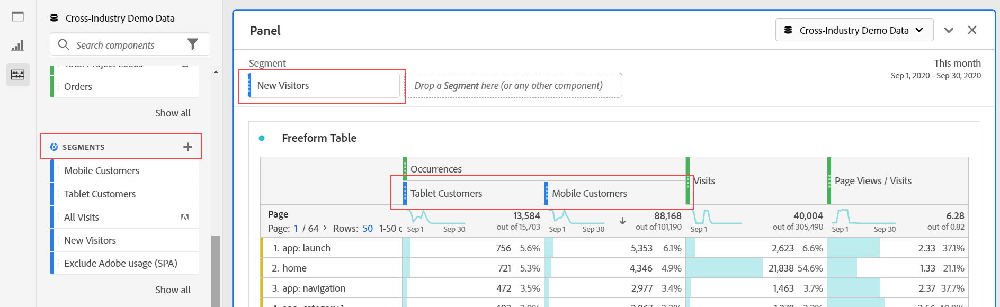

# Komponenter - översikt

Komponenter är funktioner i Adobe Analytics som kan användas i visualiseringar (t.ex. Freeform table) eller som komplement till rapporteringsfunktioner.

Så här hanterar du komponenter från Adobe Analytics huvudgränssnitt:

1. Välj **[!UICONTROL Components]** i det övre fältet.
1. Välj **[!UICONTROL Components]** om du vill se en översikt över de komponenter som du kan hantera, eller markera komponenten som du vill hantera direkt på menyn.

Du kan hantera följande komponenter:

* [Segment](/help/components/segmentation/seg-home.md): Skapa, hantera, dela och tillämpa kraftfulla, fokuserade målgruppssegment i dina rapporter. Med segment kan du identifiera delmängder av personer baserat på egenskaper eller interaktioner.
* [Beräknade mått](/help/components/c-calcmetrics/cm-overview.md): Använd mått och formler som nya komponenter för rapportering
* [Datumintervall](calendar-date-ranges/custom-date-ranges.md): Anpassa och förfina datumintervall som Analysis Workspace erbjuder.
* [Schemalagda projekt](../curate-share/t-schedule-report.md): Hantera dina schemalagda projekt.
* [Platser](../../../components/locations/locations-manager.md): Hantera platserna som dina projekt ska exporteras till.
* [Varningar](/help/components/c-alerts/intellligent-alerts.md): Gör att du kan meddelas baserat på ändrade procentsatser eller specifika datapunkter.
* [Anteckningar](annotations/overview.md): Kommunicera kontextuella datanunkter och insikter till din organisation.
* [Inställningar](/help/analyze/analysis-workspace/user-preferences.md): Hantera inställningarna för Analysis Workspace.

## Analysis Workspace-komponenter

Komponenterna i Analysis Workspace består av mått, dimensioner, segment och datumintervall som du kan dra och släppa på paneler och visualiseringar i ditt Workspace-projekt. Anpassade komponenter som du skapar läggs till i panelerna, till exempel ett beräknat mått eller ett anpassat datumintervall.

Om du vill öppna panelen Komponenter väljer du  **[!UICONTROL Components]** på knapppanelen.

Mer information om hur du använder komponenter i ett projekt finns i [Skapa ett projekt](/help/analyze/analysis-workspace/home.md).

## Hantera komponenter {#actions}

Du kan snabbt skapa en ny komponent via menyn **[!UICONTROL Components]** i Analysis Workspace. Mer information finns på [Analysis Workspace-menyn](/help/analyze/analysis-workspace/home.md#menu).

Du kan hantera komponenter (individuellt eller genom att markera flera).

1. Markera en eller flera komponenter.

1. Välj någon av följande åtgärder på snabbmenyn eller från  Component actions-knappen (längst upp i Komponenter).

   >[!TIP]
   >
   >Du kan markera flera komponenter genom att hålla ned **[!UICONTROL Shift]**, eller genom att hålla ned **[!UICONTROL Command]** (i macOS) eller **[!UICONTROL Ctrl]** (i Windows).

   

   | Komponentåtgärd | Beskrivning |
   |--- |--- |
   |  [!UICONTROL **Tagg**] | Ordna eller hantera komponenter genom att lägga till taggar i dem. Du kan sedan söka efter tagg i den vänstra panelen genom att välja filtret  eller genom att skriva `#`. Taggar fungerar också som filter i komponenthanterarna. |
   |  [!UICONTROL **Favorit**] | Lägg till komponenten i listan med favoriter. Precis som med taggar kan du söka efter Favoriter i den vänstra panelen och filtrera efter dem i komponenthanterarna. |
   |  **[!UICONTROL Un-favorite]** | Ta bort komponenten från favoritlistan. |
   |  [!UICONTROL **Godkänn**] | Markera komponenter som godkända för att signalera till användarna att komponenten är godkänd för organisationen. Precis som med taggar kan du söka efter och filtrera efter Godkänd i den vänstra panelen. En  identifierar godkända komponenter. |
   |  [!UICONTROL **Dela**] | Dela komponenter med användare i organisationen. Det här alternativet är endast tillgängligt för anpassade komponenter, till exempel segment eller beräknade värden. |
   |  [!UICONTROL **Ta bort**] | Ta bort komponenter som du inte längre behöver. Det här alternativet är endast tillgängligt för anpassade komponenter, till exempel segment eller beräknade värden. |

Anpassade komponenter kan också hanteras med respektive komponenthanterare. Se till exempel [Hantera segment](/help/components/segmentation/segmentation-workflow/seg-manage.md).

## Hantera komponentlistan

Du kan söka efter, filtrera och sortera komponentlistan på den vänstra panelen i Analysis Workspace för att hitta en viss komponent.

### Sök

1. Välj ikonen **Komponenter**  i den vänstra panelen.

2. I sökfältet börjar du skriva namnet på komponenten som du vill använda i ditt projekt.

   En färg och ikon identifierar komponenttypen. **Dimensioner**  är orange, **Segment**  är blå, **Datumintervall**  är lila och **Mätvärden**  är gröna. Adobe-ikonen  anger antingen en beräkningsmall eller en segmentmall. Beräkningsikonen  anger ett beräknat mätvärde som en administratör i organisationen har skapat.

3. Välj komponenten i listrutan.

### Filter

1. Välj ikonen **Komponenter**  i den vänstra panelen.

2. Välj **Filtrera**  eller ange `#` i sökfältet.

3. Välj något av följande filteralternativ för att filtrera komponentlistan:

   | Ikon | Filteralternativ | Beskrivning |
   |---------|---|----------|
   |  | **[!UICONTROL Approved]** | Visa endast komponenter som har markerats som Godkänd av en administratör. |
   |  | **[!UICONTROL Favorites]** | Visa endast komponenter som finns i din favoritlista.  Mer information om hur du lägger till komponenter i din favoritlista finns i [Hantera komponenter](#manage-components). |
   |  | **[!UICONTROL Dimensions]** | Visa endast komponenter som är dimensioner. |
   |  | **[!UICONTROL Metrics]** | Visa endast komponenter som är mätvärden. |
   |  | **[!UICONTROL Segments]** | Visa endast komponenter som är segment. |
   |  | **[!UICONTROL Date ranges]** | Visa endast komponenter som är datumintervall. |
   |  | **[!UICONTROL *Märkordsnamn *]** | Visa bara komponenter med de valda taggarna. Det finns en dedikerad tagg för Adobe Template som är de [beräknade standardmåtten](/help/components/c-calcmetrics/cm-reference/default-calcmetrics.md) från Adobe. |

   Välj  i ett filter för att ta bort filtret.

4. Du kan sortera komponentlistan enligt beskrivningen i [Sortera komponentlistan](#sort-the-component-list).

### Sortera

<!-- {{release-limited-testing-section}}-->

1. (Valfritt) Tillämpa eventuella filter på komponentlistan enligt beskrivningen i [Filtrera komponentlistan](#filter-the-component-list).

2. Välj ikonen **Komponenter**  i den vänstra panelen.

3. Välj **Sortera**  och välj sedan något av följande filteralternativ för att sortera komponentlistan.

Följande sorteringsalternativ är tillgängliga:

{{components-sort-options}}

## Åtkomstbehörigheter

I Analysis Workspace kan administratörer [kontrollera](/help/analyze/analysis-workspace/curate-share/curate.md) vilka komponenter som exponeras för användare vid rapportering.

<!--
# Components overview

Components in Analysis Workspace consist of dimensions, metrics, segments, and date ranges that you can drag-and-drop onto a project. 

To access the Components menu, click the **[!UICONTROL Components]** icon in the left rail. You can switch among [panels](https://experienceleague.adobe.com/docs/analytics/analyze/analysis-workspace/panels/panels.html?lang=sv-SE), [visualizations](https://experienceleague.adobe.com/docs/analytics/analyze/analysis-workspace/visualizations/freeform-analysis-visualizations.html?lang=sv-SE), and components from the left rail icons or by using [hotkeys](/help/analyze/analysis-workspace/build-workspace-project/fa-shortcut-keys.md).

You can also adjust the [View density settings](https://experienceleague.adobe.com/docs/analytics/analyze/analysis-workspace/build-workspace-project/view-density.html?lang=sv-SE) for the project to see more values in the left rail at once by going to **[!UICONTROL Project > Project Info & Settings > View Density]**.

## Dimensions {#dimensions}

[**Dimensions**](https://experienceleague.adobe.com/docs/analytics/components/dimensions/overview.html?lang=sv-SE) are text attributes that describe your visitor behavior and can be viewed, broken down, and compared in your analysis. They can be found in the left Component rail (orange section) and are typically applied as rows of a table. 

Examples of dimensions include [!UICONTROL Page Name], [!UICONTROL Marketing Channels], [!UICONTROL Device Type], and [!UICONTROL Products]. Dimensions are provided by Adobe and are captured through your custom implementation (eVar, Props, classifications, etc).

Each dimension also contains **dimension items** within it. Dimension items can be found in the left Component rail by clicking the right-arrow next to any dimension name (items are yellow).

Examples of dimension items include [!UICONTROL Homepage] (within the [!UICONTROL Page] dimension), [!UICONTROL Paid Search] (within the [!UICONTROL Marketing Channel] dimension), [!UICONTROL Tablet] (within the [!UICONTROL Mobile Device Type] dimension), and so on.

## Metrics {#metrics}

[**Metrics**](https://experienceleague.adobe.com/docs/analytics/components/metrics/overview.html?lang=sv-SE) are quantitative measures about visitor behavior. They can be found in the left Component rail (green section) and are typically applied as columns of a table.

Examples of metrics include [!UICONTROL Page views], [!UICONTROL Visits], [!UICONTROL Orders], [!UICONTROL Average Time spent], and [!UICONTROL Revenue/Order]. Metrics are provided by Adobe, or captured through your custom implementation ([!UICONTROL Success events]), or created using the [Calculated metric builder](https://experienceleague.adobe.com/docs/analytics/components/calculated-metrics/calcmetric-workflow/cm-build-metrics.html?lang=sv-SE).

## Segments {#segments}

[**Segments**](https://experienceleague.adobe.com/docs/analytics/analyze/analysis-workspace/components/segments/t-freeform-project-segment.html?lang=sv-SE) are audience filters that are applied to your analysis. They can be found in the left Component rail (blue section) and are typically applied at the top of a panel or above metric columns in a table. 

Examples of segments include [!UICONTROL Mobile Device Visitors], [!UICONTROL Visits from Email], and [!UICONTROL Authenticated Hits]. Segments are provided by Adobe, or created in the [panel dropzone](https://experienceleague.adobe.com/docs/analytics/analyze/analysis-workspace/panels/panels.html?lang=sv-SE), or created using the [Segment builder](https://experienceleague.adobe.com/docs/analytics/components/segmentation/segmentation-workflow/seg-build.html?lang=sv-SE).

## Date Ranges {#date-ranges}

[**Date Ranges**](https://experienceleague.adobe.com/docs/analytics/analyze/analysis-workspace/components/calendar-date-ranges/calendar.html?lang=sv-SE) are the range of dates you conduct your analysis across. They can be found in the left Component rail (purple section) and are typically applied in the calendar of each panel.

You can make the date range components relative to the panel calendar. For additional information, see [About relative panel date ranges](/help/analyze/analysis-workspace/components/calendar-date-ranges/calendar.md#relative-panel-dates).

Examples of date ranges include July 2019, [!UICONTROL Last 4 weeks], and [!UICONTROL This month]. Date ranges are provided by Adobe, applied in the [panel calendar](https://experienceleague.adobe.com/docs/analytics/analyze/analysis-workspace/panels/panels.html?lang=sv-SE), or created using the [Date range builder](https://experienceleague.adobe.com/docs/analytics/analyze/analysis-workspace/components/calendar-date-ranges/custom-date-ranges.html?lang=sv-SE).

## Manage components {#actions}

You can manage components directly in the left rail. 

1. Right-click a component.

   Or
   
   Select a component, then select the **Action** (3-dot) icon at the top of the component list.

   >[!TIP]
   >
   >   You can select multiple components by holding Shift, or by holding Command (on Mac) or Ctrl (on Windows).

   

   | Component action | Description |
   |--- |--- |
   | [!UICONTROL **Tag**] | Organize or manage components by applying tags to them. You can then search by tag in the left rail by clicking the filter or typing #. Tags also act as filters in the component managers. |
   | [!UICONTROL **Favorite**] | Add the component to your list of favorites. Like tags, you can search by Favorites in the left rail and filter by them in the component managers. |
   | [!UICONTROL **Approve**] | Mark components as Approved to signal to your users that the component is organization-approved. Like tags, you can search by Approved in the left rail and filter by them in the component managers. |
   | [!UICONTROL **Share**] | Share components to users in your organization. This option is available for custom components only, such as segments or calculated metrics. |
   | [!UICONTROL **Delete**] | Delete components that you no longer need. This option is available for custom components only, such as segments or calculated metrics. |

Custom components can also be managed through their respective Component managers. For example, the [Segment Manager](/help/components/segmentation/segmentation-workflow/seg-manage.md).

## Search, filter, and sort the component list

You can search, filter, and sort the component list in the left rail of Analysis Workspace to quickly locate a particular component. 

### Search the component list

1. Select the **Components** icon  in the left rail.

2. In the search field, begin typing the name of the component you want to use in your project.

   The type of component can be identified by both color and icon. **Dimensions**  are orange, **Segments**  are blue, **Date ranges**  are purple, and **Metrics**  are green. The Adobe icon indicates either a calculated metric template or a segment template, and the calculator icon  indicated a calculated metric that was created by an Analytics administrator in your organization. 

3. Select the component when it appears in the drop-down list.

### Filter the component list

1. Select the **Components** icon  in the left rail.

2. Select the **Filter** icon .

   Or

   Type the pound sign (#) in the search field.

3. Select any of the following filter options to filter the list of components:

   |Option | Function |
   |---------|----------|
   | [!UICONTROL **Approved**] | Show only components that are marked as Approved by an administrator. |
   | [!UICONTROL **Favorites**] | Show only components that are in your list of Favorites. For information about adding components to your list of favorites, see [Components overview](/help/analyze/analysis-workspace/components/analysis-workspace-components.md). |
   | [!UICONTROL **Dimensions**] | Show only components that are Dimensions. |
   | [!UICONTROL **Metrics**] | Show only components that are Metrics. |
   | [!UICONTROL **Segments**] | Show only components that are Segments.  |
   | [!UICONTROL **Date ranges**] | Show only components that are Date Ranges. |
   | [!UICONTROL **Show all**] | Show all components. This option is available only for administrators. |
   | [!UICONTROL **Unapproved**] | Show only components that are not yet marked as Approved by an administrator. As an administrator, this is helpful when identifying components that require your review and approval. This option is available only for administrators. |

4. (Optional) To further hone the list, you can sort the component list, as described in [Sort the component list](#sort-the-component-list).

### Sort the component list

1. (Optional) Apply any filters to the component list, as described in [Filter the component list](#filter-the-component-list).

2. Select the **Components** icon  in the left rail.

3. Select the **Sort** icon , then select any of the following filter options to sort the list of components:

   {{components-sort-options}}

-->