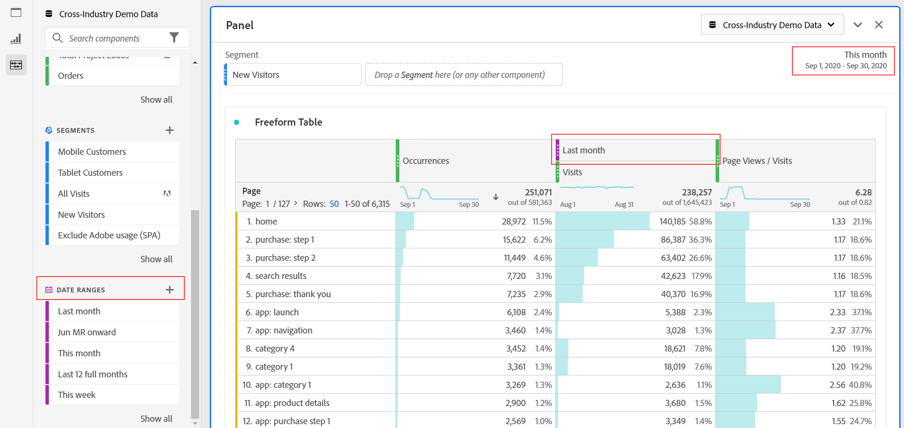

# Komponenter - översikt

Komponenterna i Analysis Workspace består av mått, mått, segment och datumintervall som du kan dra och släppa i ett projekt.

Du öppnar komponentmenyn genom att klicka på ikonen **[!UICONTROL Components]** i den vänstra listen. Du kan växla mellan [paneler](https://experienceleague.adobe.com/docs/analytics/analyze/analysis-workspace/panels/panels.html?lang=sv-SE), [Visualiseringar](https://experienceleague.adobe.com/docs/analytics/analyze/analysis-workspace/visualizations/freeform-analysis-visualizations.html?lang=sv-SE) och komponenter från ikonerna för den vänstra listen eller genom att använda [snabbtangenter](/help/analyze/analysis-workspace/build-workspace-project/fa-shortcut-keys.md).

Du kan också justera inställningarna för [Visa densitet](https://experienceleague.adobe.com/docs/analytics/analyze/analysis-workspace/build-workspace-project/view-density.html?lang=sv-SE) för projektet om du vill visa fler värden i den vänstra listen samtidigt genom att gå till **[!UICONTROL Project > Project Info & Settings > View Density]**.

## Mått {#dimensions}

[**Dimensioner**](https://experienceleague.adobe.com/docs/analytics/components/dimensions/overview.html?lang=sv-SE) är textattribut som beskriver besökarens beteende och kan visas, delas upp och jämföras i din analys. De finns i den vänstra delen av komponentraden (den orange delen) och används vanligtvis som rader i en tabell.

Exempel på dimensioner är [!UICONTROL Page Name], [!UICONTROL Marketing Channels], [!UICONTROL Device Type] och [!UICONTROL Products]. Dimensioner tillhandahålls av Adobe och hämtas via din anpassade implementering (eVar, utkast, klassificeringar osv.).

Varje dimension innehåller även **dimensionsobjekt**. Du hittar objekt i Dimensionen i den vänstra komponentlisten genom att klicka på högerpilen bredvid ett dimensionsnamn (objekten är gula).

Exempel på dimensionsobjekt är [!UICONTROL Homepage] (inom dimensionen [!UICONTROL Page]), [!UICONTROL Paid Search] (inom dimensionen [!UICONTROL Marketing Channel]), [!UICONTROL Tablet] (inom dimensionen [!UICONTROL Mobile Device Type]) och så vidare.

## Mätvärden {#metrics}

[**Mätvärden**](https://experienceleague.adobe.com/docs/analytics/components/metrics/overview.html?lang=sv-SE) är kvantitativa mått på besökares beteende. De finns i den vänstra komponenträlen (den gröna delen) och används vanligtvis som kolumner i en tabell.

Exempel på mätvärden är [!UICONTROL Page views], [!UICONTROL Visits], [!UICONTROL Orders], [!UICONTROL Average Time spent] och [!UICONTROL Revenue/Order]. Mätvärden tillhandahålls av Adobe, hämtas via din anpassade implementering ([!UICONTROL Success events]) eller skapas med [verktyget för beräkning av mätvärden](https://experienceleague.adobe.com/docs/analytics/components/calculated-metrics/calcmetric-workflow/cm-build-metrics.html?lang=sv-SE).

## Segment {#segments}

[**Segment**](https://experienceleague.adobe.com/docs/analytics/analyze/analysis-workspace/components/segments/t-freeform-project-segment.html?lang=sv-SE) är målgruppsfilter som tillämpas på din analys. De finns i den vänstra komponentlisten (blå sektion) och används vanligtvis längst upp på en panel eller ovanför måttkolumnerna i en tabell.

Exempel på segment är [!UICONTROL Mobile Device Visitors], [!UICONTROL Visits from Email] och [!UICONTROL Authenticated Hits]. Segment tillhandahålls av Adobe, skapas i [panelens dropzone](https://experienceleague.adobe.com/docs/analytics/analyze/analysis-workspace/panels/panels.html?lang=sv-SE) eller skapas med [Segment builder](https://experienceleague.adobe.com/docs/analytics/components/segmentation/segmentation-workflow/seg-build.html?lang=sv-SE).

## Datumintervall {#date-ranges}

[**Datumintervall**](https://experienceleague.adobe.com/docs/analytics/analyze/analysis-workspace/components/calendar-date-ranges/calendar.html?lang=sv-SE) är det datumintervall som du utför analysen på. De finns i den vänstra komponentspåret (lila avsnitt) och används vanligtvis i kalendern för varje panel.

Du kan göra datumintervallets komponenter relativa till panelkalendern. Mer information finns i [Om relativa paneldatumintervall](/help/analyze/analysis-workspace/components/calendar-date-ranges/calendar.md#relative-panel-dates).

Exempel på datumintervall är juli 2019, [!UICONTROL Last 4 weeks] och [!UICONTROL This month]. Datumintervall tillhandahålls av Adobe, används i [panelkalendern](https://experienceleague.adobe.com/docs/analytics/analyze/analysis-workspace/panels/panels.html?lang=sv-SE) eller skapas med [datumintervallverktyget](https://experienceleague.adobe.com/docs/analytics/analyze/analysis-workspace/components/calendar-date-ranges/custom-date-ranges.html?lang=sv-SE).

## Hantera komponenter {#actions}

Du kan hantera komponenter direkt i den vänstra listen.

1. Högerklicka på en komponent.

   eller

   Markera en komponent och välj sedan ikonen **Åtgärd** (3 punkter) längst upp i komponentlistan.

   >[!TIP]
   >
   >   Du kan markera flera komponenter genom att hålla ned Skift, eller genom att hålla ned Kommando (Mac) eller Ctrl (Windows).

   

   | Komponentåtgärd | Beskrivning |
   |--- |--- |
   | [!UICONTROL **Tagg**] | Ordna eller hantera komponenter genom att lägga till taggar i dem. Du kan sedan söka efter tagg i den vänstra listen genom att klicka på filtret eller skriva #. Taggar fungerar också som filter i komponenthanterarna. |
   | [!UICONTROL **Favorit**] | Lägg till komponenten i listan med favoriter. Precis som med taggar kan du söka efter Favoriter i den vänstra listen och filtrera efter dem i komponenthanterarna. |
   | [!UICONTROL **Godkänn**] | Markera komponenter som godkända för att signalera till användarna att komponenten är godkänd för organisationen. Precis som med taggar kan du söka efter Godkänd i den vänstra listen och filtrera efter dem i komponenthanterarna. |
   | [!UICONTROL **Dela**] | Dela komponenter med användare i organisationen. Det här alternativet är endast tillgängligt för anpassade komponenter, till exempel segment eller beräknade värden. |
   | [!UICONTROL **Ta bort**] | Ta bort komponenter som du inte längre behöver. Det här alternativet är endast tillgängligt för anpassade komponenter, till exempel segment eller beräknade värden. |

Anpassade komponenter kan också hanteras med respektive komponenthanterare. Exempel: [Segmenthanteraren](/help/components/segmentation/segmentation-workflow/seg-manage.md).

## Söka, filtrera och sortera komponentlistan

Du kan söka efter, filtrera och sortera komponentlistan i den vänstra listen i Analysis Workspace för att snabbt hitta en viss komponent.

### Sök i komponentlistan

1. Välj ikonen **Komponenter**  i den vänstra listen.

2. I sökfältet börjar du skriva namnet på komponenten som du vill använda i ditt projekt.

   Komponenttypen kan identifieras med både färg och ikon. **Dimensioner**  är orange, **Segment**  är blå, **Datumintervall**  är lila och **Mätvärden**  är gröna. Ikonen Adobe anger antingen en beräknad mätmall eller en segmentmall och räkningsikonen  indikerar ett beräknat mätresultat som har skapats av en Analysadministratör i din organisation.

3. Markera komponenten när den visas i listrutan.

### Filtrera komponentlistan

1. Välj ikonen **Komponenter**  i den vänstra listen.

2. Välj ikonen **Filter**  .

   eller

   Skriv nummertecknet (#) i sökfältet.

3. Välj något av följande filteralternativ för att filtrera komponentlistan:

   | Alternativ | Funktion |
   |---------|----------|
   | [!UICONTROL **Godkänd**] | Visa endast komponenter som har markerats som Godkänd av en administratör. |
   | [!UICONTROL **Favoriter**] | Visa endast komponenter som finns i din favoritlista. Mer information om hur du lägger till komponenter i din favoritlista finns i [Komponentöversikt](/help/analyze/analysis-workspace/components/analysis-workspace-components.md). |
   | [!UICONTROL **Dimensioner**] | Visa endast komponenter som är Dimensioner. |
   | [!UICONTROL **Mätvärden**] | Visa endast komponenter som är mätvärden. |
   | [!UICONTROL **Segment**] | Visa endast komponenter som är segment. <!--this is Filters in Customer Journey Analytics--> |
   | [!UICONTROL **Datumintervall**] | Visa endast komponenter som är datumintervall. |
   | [!UICONTROL **Visa alla**] | Visa alla komponenter. Det här alternativet är endast tillgängligt för administratörer. |
   | [!UICONTROL **Ej godkänt**] | Visa endast komponenter som ännu inte har markerats som Godkända av en administratör. Som administratör är detta användbart när du identifierar komponenter som kräver granskning och godkännande. Det här alternativet är endast tillgängligt för administratörer. |

4. (Valfritt) Om du vill finjustera listan ytterligare kan du sortera komponentlistan enligt beskrivningen i [Sortera komponentlistan](#sort-the-component-list).

### Sortera komponentlistan

1. (Valfritt) Tillämpa eventuella filter på komponentlistan enligt beskrivningen i [Filtrera komponentlistan](#filter-the-component-list).

2. Välj ikonen **Komponenter**  i den vänstra listen.

3. Välj ikonen **Sortera**  och välj sedan något av följande filteralternativ för att sortera komponentlistan:

   {{components-sort-options}}
