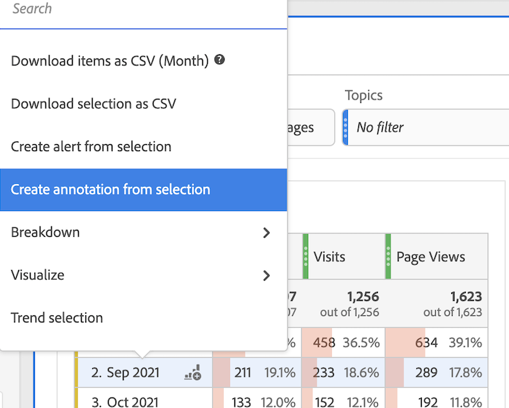
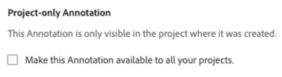

# Skapa anteckningar

>[!NOTE]
>
>Den stegvisa lanseringen av den här funktionen börjar 23 mars 2022. Allmän tillgänglighet: 11 april 2022.

1. Du kan komma igång på flera sätt för att skapa anteckningar:

| Skapandemetod | Detaljer |
| --- | --- |
| **Gå till [!UICONTROL Analytics] > [!UICONTROL Components] > [!UICONTROL Annotation].** | Sidan Annotations Manager öppnas. Klicka [!UICONTROL Create New Annotation] och [!UICONTROL Annotation builder] öppnas. |
| **Högerklicka på en punkt i en tabell.** | [!UICONTROL The Annotation builder] öppnas. Observera att som standard visas anteckningar som skapats på det här sättet bara i det projekt där de skapades. Men du kan göra dem tillgängliga för alla projekt. Lägg även märke till att datum och mätvärden redan har fyllts i.
 |
| **Högerklicka på en punkt i en [!UICONTROL Line] diagram.** | The [!UICONTROL Annotation builder] öppnas. Observera att som standard visas anteckningar som skapats på det här sättet bara i det projekt där de skapades. Men du kan göra dem tillgängliga för alla projekt. Lägg även märke till att datum och mätvärden redan har fyllts i.
 |
| **Gå till [!UICONTROL Components] > [!UICONTROL Create annotation].** | The [!UICONTROL Annotation builder] öppnas. |
| **Använd den här snabbtangenten** för att öppna Annotation Builder: (PC) `ctrl` `shift` + o, (Mac) `shift` + `command` + o | Observera, att när du använder snabbtangenten för att skapa en anteckning, skapar du en endagarsanteckning för det aktuella datumet, utan något förvalt omfång (mått eller mått). |

1. Fyll i [!UICONTROL Annotation builder] -element.

   

   | Element | Beskrivning |
   | --- | --- |
   | [!UICONTROL Project-only Annotation] | Som standard gäller anteckningen det aktuella projektet. Genom att markera den här rutan kan du göra anteckningen tillgänglig för alla projekt som du äger.
  |
   | [!UICONTROL Title] | Namnge anteckningen, t.ex. &quot;Memorial Day&quot; |
   | [!UICONTROL Description] | (Valfritt) Ange en beskrivning för anteckningen, t.ex. &quot;Offentlig semester i USA&quot;. |
   | [!UICONTROL Tags] | (Valfritt) Ordna anteckningar genom att skapa eller använda en tagg. |
   | [!UICONTROL Applied date] | Välj det datum eller datumintervall som måste finnas för att anteckningen ska kunna visas. |
   | [!UICONTROL Color] | Använd en färg på anteckningen. Anteckningen visas i projektet med den valda färgen. Färg kan användas för att kategorisera anteckningar, t.ex. allmänna helgdagar, externa händelser, spårningsproblem. |
   | [!UICONTROL Scope] | (Valfritt) Dra och släpp mätvärdena som utlöser anteckningen. Dra och släpp sedan de dimensioner eller segment som fungerar som filter (d.v.s. som anteckningen ska vara synlig med). Om du inte anger ett omfång kommer anteckningen att gälla för alla dina data.<ul><li>**[!UICONTROL Any of these metrics are present]**: Dra och släpp upp till 10 mätvärden som utlöser den anteckning som ska visas.</li><li>**[!UICONTROL With all of these filters]**: Dra och släpp upp till 10 dimensioner eller segment som ska filtreras när anteckningen visas.</li></ul>
Användningsexempel: En eVar har slutat samla in data för ett visst datumintervall. Dra eVar till **[!UICONTROL Any of these metrics are present]** -dialogrutan. Eller [!UICONTROL Visits] inga data rapporteras. Följ samma process.
**Obs!** Alla anteckningar som tillämpas på en komponent som sedan används som en del av ett beräknat mått eller en segmentdefinition ärver INTE automatiskt anteckningen. Det önskade beräknade måttet måste också läggas till i omfångsavsnittet för att anteckningen ska kunna visas. En ny anteckning bör dock skapas för alla segment som du vill kommentera med samma information.
Exempel: Du kan använda en anteckning på [!UICONTROL Orders] på en viss dag. Sedan använder du [!UICONTROL Orders] i ett beräknat mått för samma datumintervall. Det nya beräknade mätvärdet visar inte automatiskt anteckningen för order. Det beräknade måttet måste också läggas till i omfångsavsnittet för att anteckningen ska visas. |
   | [!UICONTROL Apply to all report suites] | Som standard gäller anteckningen för den ursprungliga rapportsviten. Genom att markera den här rutan kan du göra så att anteckningen gäller för alla rapportsviter i företaget. |

   {style=&quot;table-layout:auto&quot;}

1. Klicka på **[!UICONTROL Save]**.
