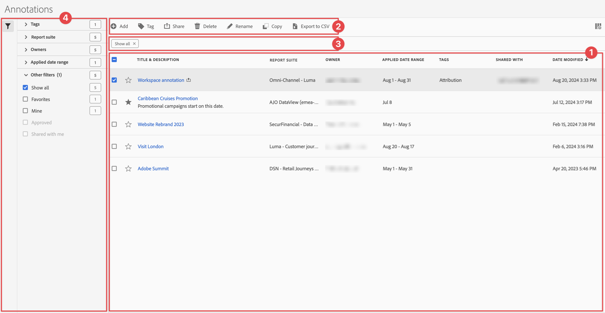

# Hantera anteckningar

Du kan dela, filtrera, tagga, godkänna, kopiera, ta bort anteckningar och markera anteckningar som favoriter från ett centralt [!UICONTROL Annotations]-hanteringsgränssnitt. Så här hanterar du anteckningar:

* Välj **[!UICONTROL Components]** i huvudgränssnittet och välj sedan **[!UICONTROL Annotations]**.

>[!NOTE]
>
>Anteckningarna som du skapar i ett visst Workspace-projekt visas inte i hanteraren för [!UICONTROL Annotations], såvida du inte har gjort anteckningen tillgänglig för alla dina projekt.
>

## Anteckningshanteraren

Anteckningshanteraren har följande gränssnittselement:

### Anteckningslista

Anteckningslistan ➊ visar alla anteckningar som du äger, anteckningarna som har omfattats av alla dina projekt och de anteckningar som har delats med dig. Listan innehåller följande kolumner:

| Kolumn | Beskrivning |
| --- | --- | 
|  | Välj om du vill prioritera  eller  en anteckning. |
| **[!UICONTROL Title and description]** | Finns i Annotations Builder. Om du vill redigera titeln och beskrivningen markerar du titellänken. [Anteckningsverktyget](/help/analyze/analysis-workspace/components/annotations/create-annotations.md#annotation-builder) öppnas. En delad anteckning har markerats med . |
| **[!UICONTROL Report suite]** | Rapporten innehåller sviter som den här anteckningen gäller för. |
| **[!UICONTROL Owner]** | Anteckningens ägare. Som användare ser du bara de anteckningar du äger eller de anteckningar som delas med dig. |
| **[!UICONTROL Applied date range]** | Det datum eller datumintervall som den här anteckningen gäller för. |
| **[!UICONTROL Tags]** | Taggarna för anteckningen. |
| **[!UICONTROL Shared with]** | De personer eller grupper som du delade anteckningen med. Välj det här alternativet om du vill öppna dialogrutan **[!UICONTROL Share Component]**. |
| **[!UICONTROL Date modified]** | Visar datum och tid då anteckningen senast ändrades. |

{style="table-layout:auto"}

Använd  för att ange vilka kolumner du vill visa.

### Åtgärdsfält

Du kan utföra åtgärder på anteckningar med åtgärdsfältet ➋. Åtgärdsfältet innehåller följande åtgärder:

| Ikon | Åtgärd | Beskrivning |
|:--:|---|---|
|  | **[!UICONTROL Add]** | Lägg till en till anteckning med [Anteckningsverktyget](create-annotations.md#annotation-builder). |
|  | [!UICONTROL *Sök efter titel*] | Om ingen anteckning är markerad i listan söker du efter anteckningar med det här sökfältet. |
|  | **[!UICONTROL Tag]** | Tagga de markerade anteckningarna. I dialogrutan **[!UICONTROL Tag Component]** markerar eller avmarkerar du taggarna för de markerade anteckningarna. Välj **[!UICONTROL Save]** om du vill spara taggarna för de markerade anteckningarna. |
|  | **[!UICONTROL Share]** | Dela de markerade anteckningarna. I dialogrutan **[!UICONTROL Share Component]** kan du  *söka efter enskilda personer eller grupper* eller välja **[!UICONTROL Organization]** eller **[!UICONTROL Groups]**. Välj **[!UICONTROL Save]** om du vill spara delningsinformation för de valda anteckningarna. Mer information finns i [Dela anteckningar](#share-annotations). |
|  | **[!UICONTROL Delete]** | Ta bort de markerade anteckningarna. Du uppmanas att bekräfta åtgärden. |
|  | **[!UICONTROL Rename]** | Byt namn på en enskild markerad anteckning. När du väljer det här alternativet kan du byta namn på anteckningen. |
|  | **[!UICONTROL Copy]** | Kopiera de markerade anteckningarna. Nya anteckningar skapas med samma namn och suffix (Kopiera) |
|  | **[!UICONTROL Export to CSV]** | Exportera anteckningarna till en `Annotations List.csv`-fil. |

### Aktivt filterfält

Filterfältet ➌ visar de aktiva filtren (om sådana finns). Du kan snabbt ta bort ett filter med . Om fler än ett filter har angetts kan du ta bort alla filter med **[!UICONTROL Remove all]**.

### Panelen Filter

Du kan filtrera anteckningar med den vänstra panelen **[!UICONTROL Filter]** ➍. Filterpanelen visar typen av filter och antalet anteckningar som följer filtret. Välj  för att växla visningen av filterpanelen.

Så här filtrerar du filterlistan:

1. Välj  för att öppna panelen Filter. Om du behöver mer utrymme för filterlistan kan du stänga panelen genom att välja  en gång till.
1. Du kan filtrera anteckningarna med någon av de tillgängliga [filteravsnitten](#filter-sections).

   >[!INFO]
   >
   >*Objekt* refererar till anteckningsobjekten som visas i [anteckningslistan](manage-annotations.md#annotations-list).
   > 

#### Filtrera avsnitt

{{tagfiltersection}}
{{reportsuitefiltersection}}
{{ownerfiltersection}}
{{daterangefiltersection}}
{{otherfiltersfiltersection}}

[Anteckningslistan](manage-annotations.md#annotations-list) uppdateras automatiskt baserat på din filterkonfiguration. Du kan se de konfigurerade filtren i det [aktiva filterfältet](manage-annotations.md#active-filter-bar).

## Redigera anteckningar

Du kan redigera en anteckning på två sätt:

* Använd ikonen [Komponentinformation](/help/analyze/analysis-workspace/components/use-components-in-workspace.md#component-info) i ett Workspace-projekt.

* Markera anteckningens titel i listan [[!UICONTROL Annotations]](#annotations-list).

Du använder [Anteckningsverktyget](/help/analyze/analysis-workspace/components/annotations/create-annotations.md#annotation-builder) för att redigera anteckningen.

## Dela anteckningar

Följande gäller när du delar anteckningar eller arbetar med anteckningar som delas med dig:

* Anteckningar som bara är för projekt i ett projekt som du delar med andra användare visas för dessa användare. Användarna kan inte redigera eller ta bort de här anteckningarna som bara är för projekt.
* Om du sparar en anteckning och delar anteckningen direkt med en användare, kan den användaren bara redigera och ta bort anteckningen om användaren har administratörsbehörighet.

* Om ett projekt delas med dig visas anteckningar som skapats i det projektet bara i det projektet. Om en anteckning delas direkt med dig, visas anteckningen i alla projekt där anteckningen kan visas.

## Anteckningar och tidszoner

Alla anteckningar skapas med en tidsstämpel, men ingen timmes- eller tidszonsinformation. Vid rapporttillfället används tidszonen för rapportsviten som konfigurerats för panelen.

<!--
# Manage annotations

The [!UICONTROL Annotations manager] shows you all of the annotations that you own or that have been shared with you. Project-specific annotations do not appear here. You can use this interface to share, filter, tag, copy, delete, and favorite your annotations. Administrators can manage and approve annotations.

**[!UICONTROL Components]** > **[!UICONTROL Annotations]**

## Annotations Manager user interface

| UI Element | Description |
| --- | --- | 
| [!UICONTROL Title and Description] | Provided in the Annotations Builder. To edit the title and description, click the title link - this takes you back to the Annotations Builder.  |
| [!UICONTROL Report Suite] | The report suites that this annotation applies to.  | 
| [!UICONTROL Owner] | Indicates who owns the annotation. As a non-Admin, you can see only annotations that you own or those that were shared with you. |
| [!UICONTROL Applied Date Range] | The date or date range that this annotation applies to. |
| [!UICONTROL Shared with] | Lists how many individuals or groups that you shared the annotation with. Click for more detail. |
| [!UICONTROL Date Modified] | Shows the date and time that the annotation was last modified. |

{style="table-layout:auto"}

## Edit annotations

Editing an annotation means that you can adjust date ranges, colors, scope, or whether it applies to all report suites or projects. You can edit annotations in two ways:

* In a line chart, hover over the annotation and click the pencil icon within the popover.
* In the [!UICONTROL Annotations Manager], click the title of the annotation.

Both of these options land you back in the [!UICONTROL Annotations Builder]. There, you can make the necessary adjustments and save the new version.

## Share annotations

When sharing annotations or working with annotations that were shared with you, keep this in mind:

* If you create a project with project-only annotations, then share the project with another user, annotations cannot be edited or deleted by anyone that you share the project with.
* If you save an annotation and share it directly with a user, they can edit/delete the annotation only if they have admin rights.
* If a project is shared with you with a project-only annotation, it shows up only in that project. If the annotation is shared directly with you, it shows up in all projects where that annotation can be displayed. 

## Annotations and time zones

All annotations are created with a timestamp, but no hours or timezone information. At report time, the timezone of the panel's report suite is always applied. For example, an annotation created for Christmas Day happens on December 25 no matter what report suite timezone you are in. 

## Other annotation tasks

The Annotations manager lets Administrators edit, add, tag, delete, rename, approve, copy, export, and filter annotations. It is not visible to non-Admin users. 

Additional options are available when you select at least one annotation:

| Task | Description |
| --- | --- |
| [!UICONTROL Add] | Takes you to the Annotations builder where you can create annotations. |
| [!UICONTROL Tag] | All users can create tags for annotations and apply one or more tags to an annotation. However, you can see tags only for annotations that you own. |
| [!UICONTROL Delete] | Deleting an annotation removes it from any project in your organization. |
| [!UICONTROL Rename] | Renaming an annotation renames it in all projects that it was applied to. |
| [!UICONTROL Copy] | Creates a distinct copy with its own annotation ID, but with the same name and definition.|
| [!UICONTROL Export to CSV] | Export the annotation definition to a .csv file.|
| [!UICONTROL Filter] (left rail) | Filter by tags, report suite, owners, and other filters (Mine, Approved, Favorites, Shared with me, and Show All).|

{style="table-layout:auto"}

-->