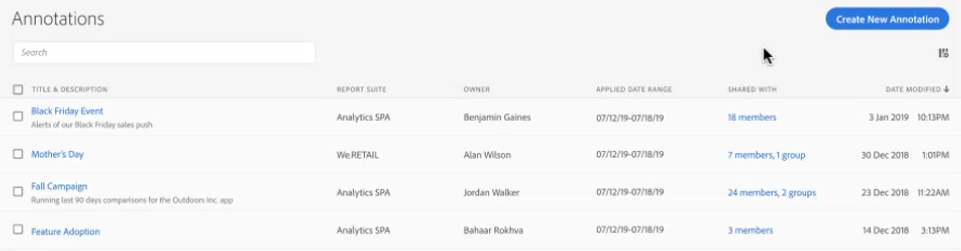

# Hantera anteckningar

>[!NOTE]
>
>Den här funktionen är för närvarande i begränsad testning.

The [!UICONTROL Components] > [!UICONTROL Annotations] kan hantera anteckningar på många olika sätt, t.ex. dela, filtrera, tagga, godkänna, kopiera, ta bort och markera som favoriter.

The [!UICONTROL Annotations] -hanteraren visar alla anteckningar du äger som har omfattats av alla dina projekt och som har delats med dig.

>[!NOTE]
>
>[!UICONTROL Annotations] som du bara skapade för ett visst projekt visas inte i hanteraren.

## Annotations Manager-användargränssnitt

| Gränssnittselement | Beskrivning |
| --- | --- | 
| [!UICONTROL Title and Description] | Finns i Annotations Builder. Om du vill redigera titeln och beskrivningen klickar du på titellänken. Då återgår du till Anteckningsverktyget. |
| [!UICONTROL Report Suite] | Rapportsviten/rapporterna som den här anteckningen gäller för. |
| [!UICONTROL Owner] | Anger vem som äger anteckningen. Som icke-administratör kan du bara se anteckningar som du äger eller de som delats med dig. |
| [!UICONTROL Applied Date Range] | Det datum eller datumintervall som den här anteckningen gäller för. |
| [!UICONTROL Shared with] | Visar hur många personer eller grupper som du har delat anteckningen med. Klicka för mer information. |
| [!UICONTROL Date Modified] | Visar datum och tid då anteckningen senast ändrades. |

## Redigera anteckningar

Att redigera en anteckning innebär att du kan justera datumintervall, färger, omfång eller om det gäller för alla rapportsviter eller projekt. Du kan redigera anteckningar på två sätt:

* Håll pekaren över anteckningen i ett linjediagram och klicka på pennikonen i pekaren.

* I [!UICONTROL Annotations Manager]klickar du på anteckningens titel.

Båda dessa alternativ ger dig tillbaka i Annotations Builder. Där kan du göra nödvändiga justeringar och spara den nya versionen.

## Dela anteckningar

1. Markera den eller de anteckningar som du vill dela och klicka på [!UICONTROL Share].

1. I [!UICONTROL Share Component] söker du efter de personer eller grupper som du vill dela anteckningarna med.

1. Under [!UICONTROL Organization], ....

1. Klicka på [!UICONTROL Save].

## Märkordsanteckningar

Följ

