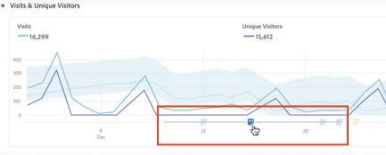

# Översikt över anteckningar

Anteckningar i Workspace gör att du effektivt kan kommunicera kontextuella datanunkter och insikter till din organisation. De gör att du kan koppla kalenderhändelser till specifika mått/mätvärden. Du kan anteckna ett datum eller datumintervall med kända dataproblem, allmänna helgdagar, kampanjstarter osv. Du kan sedan visa händelser grafiskt och se om kampanjer eller andra händelser har påverkat webbplatsens trafik, intäkter eller andra mätvärden.

Anta att du delar projekt med din organisation. Om ni hade ett stort trafiksprång på grund av en marknadsföringskampanj kan ni skapa en kommentar om startdatum för kampanjer och ange den som omfattning för hela rapportsviten. När användarna visar datauppsättningar som innehåller det datumet, ser de anteckningen i sina projekt, tillsammans med deras data.

Tänk på detta:

* Anteckningar kan knytas till ett enstaka datum eller till ett datumintervall.

* De kan gälla för hela datauppsättningen eller för angivna mått, dimensioner eller segment.

* De kan gälla för det projekt i vilket de skapades (standard) eller för alla projekt.

* De kan gälla för den rapportsserie som de skapades i (standard) eller för alla rapportsviter.

## Behörigheter

Som standard kan bara administratörer skapa anteckningar. Användare har rätt att visa anteckningar på samma sätt som andra Analytics-komponenter (som segment, beräknade värden osv.).

Administratörer kan dock ge [!UICONTROL Annotation Creation] behörighet (analysverktyg) till användare via [Adobe Admin Console](https://experienceleague.adobe.com/docs/analytics/admin/admin-console/permissions/analytics-tools.html?lang=en).

## Aktivera eller inaktivera anteckningar

Anteckningar kan aktiveras och avaktiveras på flera nivåer:

* På visualiseringsnivå: [!UICONTROL Visualization] inställningar > [!UICONTROL Show annotations]

* På projektnivå: [!UICONTROL Project info & settings] > [!UICONTROL Show annotations]

* På användarnivå: [!UICONTROL Components] > [!UICONTROL User preferences] > [!UICONTROL Data] > [!UICONTROL Show annotations]

