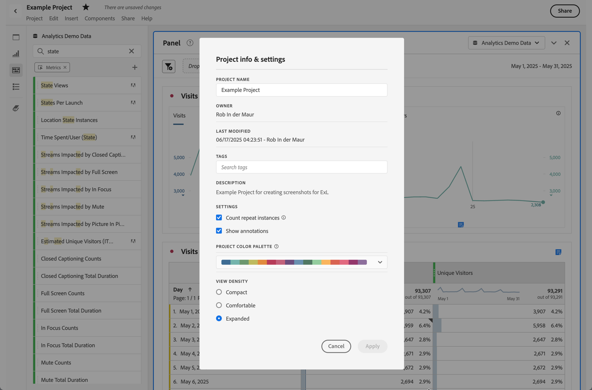

# Översikt över anteckningar

Anteckningar gör att ni effektivt kan kommunicera kontextuella datanunkter och insikter till andra intressenter i organisationen. Anteckningar gör att du kan koppla kalenderhändelser till specifika dimensioner och mätvärden. Du kan anteckna ett datum eller datumintervall med kända dataproblem, allmänna helgdagar, kampanjstarter osv. Du kan sedan visa händelser grafiskt och se om kampanjer eller andra händelser har påverkat webbplatstrafiken, användningen av mobilappar, intäkterna eller andra mätvärden.

Du delar till exempel projekt med din organisation. Om din unika besökare försämrades märkbart kan du skapa en **besökare som avtar**-anteckning och ange den som omfattning för hela rapportsviten. När användarna visar en rapportserie som innehåller det datumet, ser de anteckningen i sina projekt, tillsammans med deras data.

Anteckningar kan gälla för:

* Ett enstaka datum eller ett datumintervall.

* Hela datauppsättningen eller specifika mått, dimensioner eller segment.

* Det projekt i vilket anteckningar skapas (standard) eller i alla projekt.

* Datavyn där anteckningar skapas (standard) eller alla datavyer.

Se [Skapa anteckningar](create-annotations.md) för de olika alternativ som är tillgängliga för att skapa anteckningar. Sedan skapar, ändrar och sparar du anteckningar i [Anteckningsverktyget](create-annotations.md#annotation-builder).

Du använder [Anteckningshanteraren](manage-annotations.md) för att hantera anteckningar.

## Aktivera eller inaktivera anteckningar

Anteckningar kan aktiveras och avaktiveras på flera nivåer:

| Nivå | Använda... |
|---|---|
| **Visualisering** | Aktivera eller inaktivera  > **[!UICONTROL Settings]** > **[!UICONTROL Show annotations]**.  |
| **Projekt** | På en projektmeny för Workspace väljer du **[!UICONTROL Project]** > **[!UICONTROL Project info & settings]** och aktiverar eller inaktiverar **[!UICONTROL Show annotations]**.  |
| **Användare** | På fliken **[!UICONTROL Components]** väljer du **[!UICONTROL Preferences]** eller från en projektmeny för Workspace väljer du **[!UICONTROL Project]** > **[!UICONTROL User preferences]**.  I **[!UICONTROL Preferences]** väljer du **[!UICONTROL Projects & Analysis]**. Välj **[!UICONTROL Data]** i det vänstra flikfältet. Längst ned aktiverar eller inaktiverar du **[!UICONTROL Show annotations]** under rubriken **[!UICONTROL Freeform table]**.  |

<!--
# Annotations overview

Annotations in Workspace enable you to effectively communicate contextual data nuances and insights to your organization. They let you tie calendar events to specific dimensions/metrics. You can annotate a date or date range with known data issues, public holidays, campaign launches, etc. You can then graphically display events and see whether campaigns or other events have affected your site traffic, revenue, or any other metric.

For example, let's say you are sharing projects with your organization. If you had a major spike in traffic due to a marketing campaign, you could create a "Campaign launch date" annotation and scope it for your whole report suite. When your users view any data sets that included that date, they see the annotation within their projects, alongside their data.

Keep this in mind:

* Annotations can be tied to a single date or to a date range.

* They can apply to your entire data set or to specified metrics, dimensions, or segments.

* They can apply to the project in which they were created (default) or to all projects.

* They can apply to the report suite in which they were created (default) or to all report suites.

## Permissions {#permissions}

By default, only Admins can create annotations. Users have rights to view annotations like they do with other other Analytics components (such as segments, calculated metrics, etc.).

However, Admins can give the [!UICONTROL Annotation Creation] permission (Analytics Tools) to users via the [Adobe Admin Console](https://experienceleague.adobe.com/docs/analytics/admin/admin-console/permissions/analytics-tools.html).

## Turn annotations on or off {#annotations-on-off}

Annotations can be turned on or off at several levels:

* At the Visualization level: [!UICONTROL Visualization] settings > [!UICONTROL Show annotations]

* At the Project level: [!UICONTROL Project info & settings] > [!UICONTROL Show annotations]

* At the User level: [!UICONTROL Components] > [!UICONTROL User preferences] > [!UICONTROL Data] > [!UICONTROL Show annotations]

-->