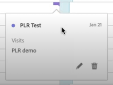

# Visa anteckningar

Anteckningarna visas något annorlunda beroende på var de visas och om de sträcker sig över en dag eller ett datumintervall.

## Visa anteckningar i Workspace

| Visualisering Typ | Beskrivning |
| --- | --- |
| **Rad &#x200B;** **En dag** | När du väljer  i en radvisualisering visas ett popup-fönster med anteckningsinformationen.  Om du vill redigera anteckningen i [Anteckningsverktyget](create-annotations.md#annotation-builder) väljer du . Om du vill ta bort anteckningen väljer du . |
| **Rad &#x200B;** **Datumintervall** | När du väljer  visas ett popup-fönster med anteckningsinformationen och en rad längst ned som anger datumintervallet. Om du vill redigera anteckningen i [Anteckningsverktyget](create-annotations.md#annotation-builder) väljer du . Om du vill ta bort anteckningen väljer du . |
| **Frihandstabell** | I en Freeform-tabell kan du komma åt alla anteckningar från anteckningsknappen längst upp till höger i visualiseringen. Välj  om du vill se en (rullningslista) med alla anteckningar.  För varje anteckning kan du välja  om du vill redigera anteckningen i [Anteckningsverktyget](create-annotations.md#annotation-builder) och  om du vill ta bort anteckningen. |

{style="table-layout:auto"}

## Visa anteckningar i en PDF

När du laddar ned ditt projekt som PDF, eller skickar ditt projekt som PDF, sammanfattas anteckningarna i PDF i sammanfattningsavsnittet Anteckningar.

<!--
# View annotations

Annotations manifest slightly differently, depending on whether they span a single day or a date range.

## View annotations in Line charts or Tables

| Date | Appearance |
| --- | --- |
| **Single day** |   
When you hover over the annotation, you can see its details, you can edit it by selecting the pen icon, or you can delete it:
  |
| **Date range** |  The icon changes and when you hover over it, the date range appears.

When you select it in the line chart, the annotation metadata appear, and you can edit or delete it:
In a table, an icon appears on every date in the date range.
|
| **Overlapping annotations** | On days that have more than one annotation tied to them, the icon appears in a grey color.

When you hover over the grey icon, all overlapping annotations appear:
 |

{style="table-layout:auto"}

## View annotations in a .pdf file

Since you cannot hover over icons in a .pdf file, this file (after export) provides notes of explanations at the bottom of a panel. Here is an example:

## View annotations with non-trended data

Sometimes annotation are shown with non-trended data, but tied to a specific dimension. In that case, they appear only in a summary annotation in the bottom right corner. Here is an example:

The summary chart appears in all visualization types in the corner, not just in non-trended freeform tables and summary numbers. It also appears in visualizations like [!UICONTROL Donut], [!UICONTROL Flow],[!UICONTROL Fallout],[!UICONTROL Cohort], and so on.

-->