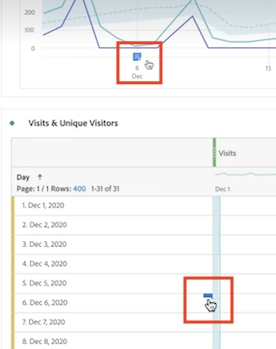

# Visa anteckningar

>[!NOTE]
>
>Den här funktionen är för närvarande i begränsad testning.

Anteckningarna visas något annorlunda beroende på om de sträcker sig över en enstaka dag eller ett datumintervall.

## Visa anteckningar i linjediagram eller tabeller

| Datum | Utseende |
| --- | --- |
| **En dag** |  |
| **Datumintervall** | Ikonen ändras och när du håller markören över den visas datumintervallet.

I en tabell visas en ikon för varje datum i datumintervallet.

Observera följande: på dagar som har fler än en anteckning kopplad till sig, kommer ikonen att vara en grå färg. |

## Visa anteckningar i ett sammanfattningsdiagram

## Visa anteckningar i en PDF-fil

Eftersom du inte kan hovra över ikoner i en PDF-fil innehåller den här filen (efter exporten) förklaringar längst ned på panelen. Här är ett exempel:

## Visa anteckningar som inte är baserade på datum

Ibland är anteckningen inte knuten till ett datum, utan kopplad till en viss dimension. I så fall visas de bara i en sammanfattningsanteckning i det nedre högra hörnet. Här är ett exempel:

