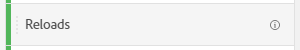
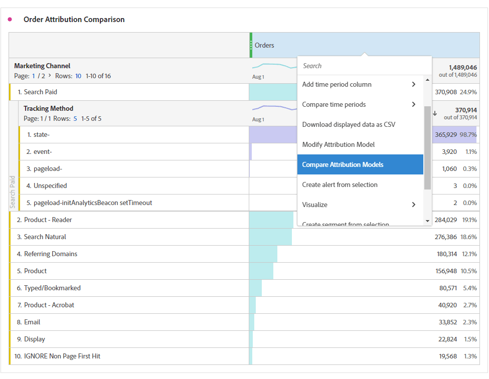

# Mätvärden

Med hjälp av mätvärden kan du kvantifiera datapunkter i Analysis Workspace. De används oftast som kolumner i en visualisering och är knutna till dimensioner.

Adobe erbjuder flera typer av mätvärden som kan användas i Analysis Workspace:

* **Standardmått**: De flesta mätvärden som används i projekt är standardvärden. Exempel [Sidvyer](/help/components/metrics/page-views.md), [Intäkter](/help/components/metrics/revenue.md), eller [Anpassade händelser](/help/components/metrics/custom-events.md). Se [Översikt över mätvärden](/help/components/metrics/overview.md) i användarhandboken för Komponenter om du vill ha mer information.

   

* **Beräknade mått**: Användardefinierade mätvärden som bygger på standardvärden, statiska tal eller algoritmiska funktioner. Användardefinierade beräknade värden visar en räkneikon i listan över tillgängliga komponenter. Se [Översikt över beräknade värden](/help/components/c-calcmetrics/cm-overview.md) i användarhandboken för Komponenter om du vill ha mer information.

   

* **Mallar för beräknade mätvärden**: Adobe-definierade mått som beter sig på liknande sätt som beräknade värden. Du kan använda dem som de är i Workspace-projekt eller spara en kopia för att anpassa dess logik. Mallar för beräknade mätvärden visar en Adobe-ikon i listan över tillgängliga komponenter.

   

Mätvärdena är flexibla i användningen inom Analysis Workspace. Dra ett mätvärde till en tom Freeform-tabell om du vill se mätningen trender över projektets datumperiod. Du kan också dra ett mått när det finns en dimension för att se mätvärdet jämfört med varje dimensionsobjekt. Om du drar ett mätresultat över ett befintligt måtthuvud ersätts det och om du drar ett mätvärde bredvid ett huvud kan du se båda mätvärdena sida vid sida.

>[!VIDEO](https://video.tv.adobe.com/v/40817/?quality=12)

## Beräknade värden

Beräknade mätvärden gör att du enkelt kan se hur mätvärden relaterar till varandra med enkla operatorer eller statistiska funktioner. Det finns flera sätt att skapa beräknade mått:

* Klicka på plusikonen bredvid måtthuvudet under komponentlistan till vänster.
* Navigera till **[!UICONTROL Components]** > **[!UICONTROL Calculated Metrics]** > **[!UICONTROL Add]**.
* Högerklicka på en kolumnrubrik > **[!UICONTROL Create metric from selection]** när en eller flera rubrikkolumnceller är markerade. Med det här alternativet skapas automatiskt ett beräknat mått utan att du behöver använda verktyget för att skapa beräkningsmetrisk regel.

[Beräknade mått: Implementeringsfria mätvärden](https://experienceleague.adobe.com/docs/analytics-learn/tutorials/components/calculated-metrics/calculated-metrics-implementationless-metrics.html) (3:42)

## Jämför mätvärden med olika attribueringsmodeller

Om du snabbt och enkelt vill jämföra en attribueringsmodell med en annan högerklickar du på ett mätresultat och väljer **[!UICONTROL Compare Attribution Models]**:

Med den här genvägen kan du snabbt och enkelt jämföra en attribueringsmodell med en annan utan att dra i ett mätresultat och konfigurera det två gånger.

## Använd [!UICONTROL cumulative average] funktion för att använda måttutjämning

Här är en video om ämnet:

>[!VIDEO](https://video.tv.adobe.com/v/27068/?quality=12)
