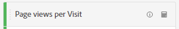

# Mätvärden

Med mätvärden kan du kvantifiera datapunkter i Analysis Workspace. De används oftast som kolumner i en visualisering och är knutna till dimensioner.

## Typer av mätvärden

Adobe erbjuder flera typer av mätvärden som kan användas i Analysis Workspace:

* **Standardmått**: De flesta mätvärden som du använder i projekt är standardvärden. Exempel är [Sidvyer](/help/components/metrics/page-views.md), [Intäkter](/help/components/metrics/revenue.md) eller [Anpassade händelser](/help/components/metrics/custom-events.md). Mer information finns i [Metrisk översikt](/help/components/metrics/overview.md) i användarhandboken för komponenter.

  

* **Beräknade mått**: Användardefinierade mått som baseras på standardvärden, statiska tal eller algoritmiska funktioner. Användardefinierade beräknade värden visar en räkneikon i listan över tillgängliga komponenter. Mer information finns i [Översikt över beräknade mått](/help/components/c-calcmetrics/cm-overview.md) i användarhandboken för komponenter.

  

* **Beräknade måttmallar**: Adobe-definierade mått som beter sig på liknande sätt som beräknade mått. Du kan använda dem som de är i Workspace-projekt eller spara en kopia för att anpassa dess logik. Mallar för beräknade mätvärden visar en Adobe-ikon i listan över tillgängliga komponenter.

  

## Använd mätvärden i Analysis Workspace

Mätvärden kan användas på olika sätt i Analysis Workspace. Mer information om hur du lägger till mått och andra typer av komponenter i Analysis Workspace finns i [Använda komponenter i Analysis Workspace](/help/analyze/analysis-workspace/components/use-components-in-workspace.md).

>[!VIDEO](https://video.tv.adobe.com/v/40817/?quality=12)

## Skapa beräknade mått

Beräknade mätvärden gör att du enkelt kan se hur mätvärden relaterar till varandra med enkla operatorer eller statistiska funktioner.

Det finns flera sätt att skapa beräknade mått. Den metod du väljer avgör om det beräknade måttet är tillgängligt från komponentlistan i alla projekt, eller bara i det projekt där det skapades.

### Skapa beräknade mätvärden för alla projekt

Du kan använda verktyget för beräknade mätvärden för att skapa beräknade mätvärden. När de skapas på det här sättet är beräknade värden tillgängliga i komponentlistan och kan sedan användas i projekt i hela organisationen.

Mer information om hur du får åtkomst till verktyget för beräknade värden finns i [Bygg mått](/help/components/c-calcmetrics/c-workflow/cm-workflow/c-build-metrics/cm-build-metrics.md).

### Skapa beräknade mätvärden för ett enskilt projekt

Du kan skapa snabba beräknade mätvärden som bara är tillgängliga för det projekt där de skapades.

Så här skapar du ett beräknat mått för ett enskilt projekt:

1. Öppna det projekt i Analysis Workspace där du vill skapa det beräknade måttet.

1. Högerklicka på en eller flera rubrikkolumnceller i en frihandstabell och välj sedan **[!UICONTROL Create metric from selection]**

   

1. Om du bara vill skapa ett beräknat mått för det här projektet väljer du bland följande alternativ:

   * [!UICONTROL **Dela**]

   * [!UICONTROL **Subtrahera**]

   * [!UICONTROL **Lägg till**]

   * [!UICONTROL **Multiplicera**]

   Om du vill öppna verktyget för beräknade mått och skapa det beräknade måttet för alla projekt väljer du [!UICONTROL **Öppna i verktyget för beräknade mått**] och fortsätter sedan med [Build metrics](/help/components/c-calcmetrics/c-workflow/cm-workflow/c-build-metrics/cm-build-metrics.md).

[Beräknade mått: Mätvärden utan implementering](https://experienceleague.adobe.com/docs/analytics-learn/tutorials/components/calculated-metrics/calculated-metrics-implementationless-metrics.html) (3:42)

## Jämför mätvärden med olika attribueringsmodeller

Om du snabbt och enkelt vill jämföra en attribueringsmodell med en annan högerklickar du på ett mätvärde och väljer **[!UICONTROL Compare Attribution Models]**:

Med den här genvägen kan du snabbt och enkelt jämföra en attribueringsmodell med en annan utan att dra i ett mätresultat och konfigurera det två gånger.

## Använd funktionen [!UICONTROL cumulative average] för att använda måttutjämning

Här är en video om ämnet:

>[!VIDEO](https://video.tv.adobe.com/v/27068/?quality=12)
