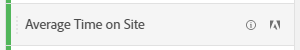

# Mätvärden

Med mätvärden kan du kvantifiera datapunkter i Analysis Workspace. De används oftast som kolumner i en visualisering och är knutna till dimensioner.

## Typer av mätvärden

Adobe erbjuder flera typer av mätvärden som kan användas i Analysis Workspace:

* **Standardmått**: De flesta mätvärden som du använder i projekt är standardvärden. Exempel är [Sidvyer](/help/components/metrics/page-views.md), [Intäkter](/help/components/metrics/revenue.md) eller [Anpassade händelser](/help/components/metrics/custom-events.md). Mer information finns i [Metrisk översikt](/help/components/metrics/overview.md) i användarhandboken för komponenter.

  

* **Beräknade mått**: Användardefinierade mått som baseras på standardvärden, statiska tal eller algoritmiska funktioner. Användardefinierade beräknade värden visar en räkneikon i listan över tillgängliga komponenter. Mer information finns i [Översikt över beräknade mått](/help/components/c-calcmetrics/cm-overview.md) i användarhandboken för komponenter.

  

* **Beräknade måttmallar**: Adobe-definierade mått som beter sig på liknande sätt som beräknade mått. Du kan använda dem som de är i Workspace-projekt eller spara en kopia för att anpassa dess logik. Mallar för beräknade mätvärden visar en Adobe-ikon i listan över tillgängliga komponenter.

  

## Använd mätvärden i Analysis Workspace

Mätvärden kan användas på olika sätt i Analysis Workspace. Mer information om hur du lägger till mått och andra typer av komponenter i Analysis Workspace finns i [Använda komponenter i Analysis Workspace](/help/analyze/analysis-workspace/components/use-components-in-workspace.md).

>[!VIDEO](https://video.tv.adobe.com/v/40817/?quality=12)

## Beräknade mått

Beräknade mätvärden gör att du enkelt kan se hur mätvärden relaterar till varandra med enkla operatorer eller statistiska funktioner. Det finns flera sätt att skapa beräknade mått:

* Klicka på plusikonen bredvid måtthuvudet under komponentlistan till vänster.
* Navigera till **[!UICONTROL Components]** > **[!UICONTROL Calculated Metrics]** > **[!UICONTROL Add]**.
* Högerklicka på en kolumnrubrik > **[!UICONTROL Create metric from selection]** när en eller flera rubrikkolumnceller är markerade. Med det här alternativet skapas automatiskt ett beräknat mått utan att du behöver använda verktyget för att skapa beräkningsmetrisk regel.

[Beräknade mått: Mätvärden utan implementering](https://experienceleague.adobe.com/docs/analytics-learn/tutorials/components/calculated-metrics/calculated-metrics-implementationless-metrics.html) (3:42)

## Jämför mätvärden med olika attribueringsmodeller

Om du snabbt och enkelt vill jämföra en attribueringsmodell med en annan högerklickar du på ett mätvärde och väljer **[!UICONTROL Compare Attribution Models]**:

Med den här genvägen kan du snabbt och enkelt jämföra en attribueringsmodell med en annan utan att dra i ett mätresultat och konfigurera det två gånger.

## Använd funktionen [!UICONTROL cumulative average] för att använda måttutjämning

Här är en video om ämnet:

>[!VIDEO](https://video.tv.adobe.com/v/27068/?quality=12)
