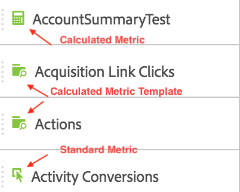

# Mätvärden

Det finns två sätt att använda mätvärden i Analysis Workspace.

Du kan antingen dra en standardmall för mått, beräknade värden eller beräknade värden från menyn [!UICONTROL Components] till tabellen:

>[!NOTE]
>
>Även om detta ser enkelt ut är användningen av mätvärden ganska kraftfull. Du kan lägga till mätvärden i en rapport genom att dra lämpliga mätvärden till måttavsnittet i en tabell. Du kan också dela upp mått efter mått och på så sätt få detaljkontroll över tabellvyn. Dessutom kan du infoga ett mått som en dimension och en dimension som ett mått för att skapa en övertidsrapport. Lek med de olika komponenterna och se vad du kan göra. Möjligheterna är oändliga.

Du kan också klicka på **[!UICONTROL Components]** > **[!UICONTROL New Metric]**. Detta tar dig till [Calculated Metric Builder](/help/components/c-calcmetrics/cm-overview.md) där du kan skapa anpassade mått utifrån befintliga mätvärden.

**[!UICONTROL Create metric from selection]** har lagts till i högerklicksmenyn i frihandstabeller för att göra det enklare att snabbt skapa beräknade värden. Det här alternativet visas när en eller flera rubrikkolumnceller är markerade.

[Beräknade mått: Implementeringsfria mätvärden](https://docs.adobe.com/content/help/en/analytics-learn/tutorials/components/calculated-metrics/calculated-metrics-implementationless-metrics.html)  (3:42)

## Jämför mätvärden med olika attribueringsmodeller

Om du snabbt och enkelt vill jämföra en attribueringsmodell med en annan högerklickar du på ett mätvärde och väljer **[!UICONTROL Compare Attribution Models]**:

Med den här genvägen kan du snabbt och enkelt jämföra en attribueringsmodell med en annan utan att dra i ett mätresultat och konfigurera det två gånger.
