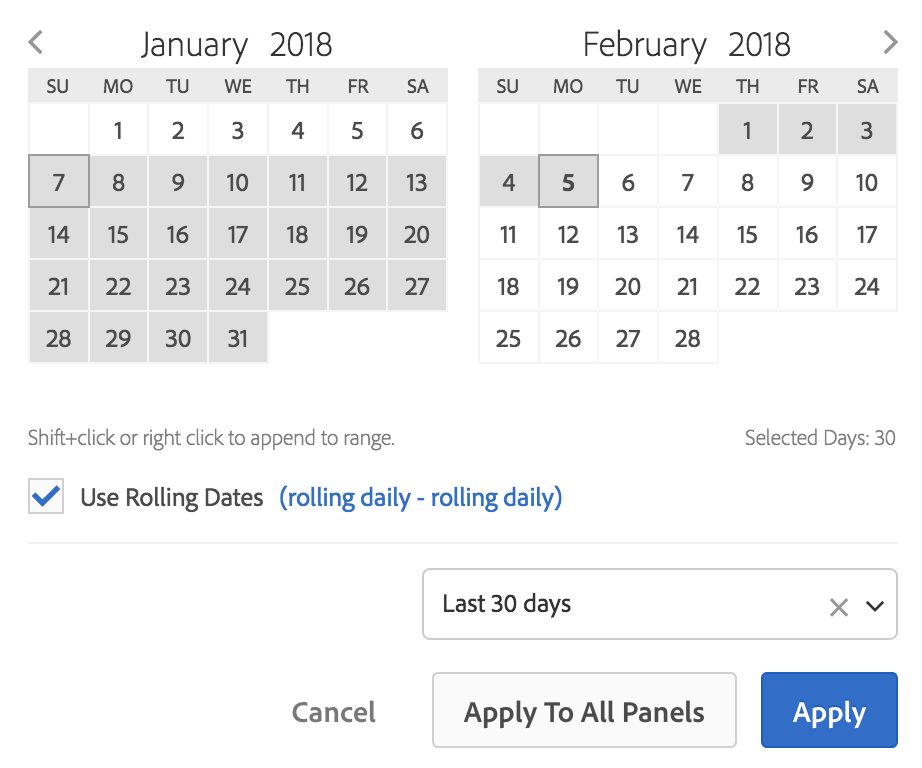

# Översikt över kalender- och datumintervall

I kalendern kan du ange datum och datumintervall eller välja en förinställning.

Kalenderval gäller på panelnivå, men du kan välja att använda dem på alla paneler. När du klickar på ett datumintervall i Arbetsyta visas den aktuella kalendermånaden och den föregående kalendermånaden i gränssnittet. Du kan justera dessa två kalendrar genom att klicka på höger- och vänsterpilarna i respektive övre hörn.

Första klicket i en kalender startar ett datumintervallval. Den andra klickningen slutför ett datumintervallval som markeras. Om du håller ned `Shift`-tangenten (eller högerklickar används) läggs den till i det markerade intervallet.

Du kan också dra datum (och tidsdimensioner) till ett Workspace-projekt. Du kan välja specifika dagar, veckor, månader, år eller rullande datum.

[Använda datumintervall och kalender i Analysis Workspace](https://experienceleague.adobe.com/docs/analytics-learn/tutorials/analysis-workspace/calendar-and-date-ranges/using-dates-in-analysis-workspace.html)  (4:07)

| Inställning | Beskrivning |
|--- |--- |
| Valda dagar | Utvalda dagar/veckor/månader/år. |
| Använd rullande datum | Med rullande datum kan du generera en dynamisk rapport som ser framåt eller bakåt under en angiven tidsperiod baserat på när du körde rapporten. Om du t.ex. vill rapportera alla beställningar som placerats i&quot;Senaste månaden&quot; (baserat på fältet Skapad den) och köra rapporten i december, ser du beställningar som gjorts i november. Om du körde samma rapport i januari skulle du se beställningar i december.<ul><li>**[!UICONTROL Date Preview]**: Anger vilken tidsperiod som den rullande kalendern omfattar.</li><li>**[!UICONTROL Start]**: Du kan välja mellan aktuell dag, aktuell vecka, aktuell månad, aktuellt kvartal, aktuellt år.</li><li>**[!UICONTROL End]**: Du kan välja mellan aktuell dag, aktuell vecka, aktuell månad, aktuellt kvartal, aktuellt år.</li></ul>Gå till exempel [här](/help/analyze/analysis-workspace/components/calendar-date-ranges/custom-date-ranges.md). |
| Datumintervall | Välj ett förinställt datumintervall. De senaste 30 dagarna är standard. **[!UICONTROL This week/month/quarter/year (excluding today)]** Med kan du välja från datumintervall som inte innehåller data för delar av dagen från och med idag. |
| Använd på alla paneler | Här kan du inte bara ändra det markerade datumintervallet för den aktuella panelen, utan även för alla andra paneler i projektet. |
| Använd | Använder endast datumintervallet på den här panelen. |
