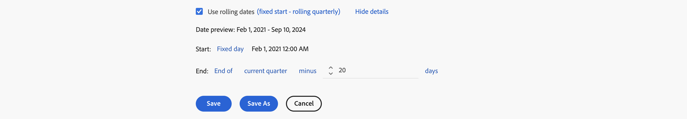

# Skapa datumintervall

Vem som helst kan skapa ett anpassat datumintervall. Du kan skapa ett datumintervall på följande sätt:


* **A** - I huvudgränssnittet väljer du **[!UICONTROL Components]** och sedan **[!UICONTROL Date range]**. Välj  **[!UICONTROL Add]** i [[!UICONTROL Date range] manager](manage.md).
* **B** - I ett Workspace-projekt väljer du **[!UICONTROL Custom date range to this date range]** på snabbmenyn i en visualisering.
* **C** - I ett Workspace-projekt väljer du **[!UICONTROL Components]** på menyn och väljer **[!UICONTROL Create date range]**
* **D** - Använd genvägen **[!UICONTROL ctrl+shift+d]** (Windows) eller **[!UICONTROL shift+command+d]** (macOS) i ett Workspace-projekt.
* **E** - I ett Workspace-projekt väljer du  i  **Datumintervall** i den vänstra panelen Komponenter.
* **F** - Välj **[!UICONTROL Annotate Selection]** i en visualisering som stöds, t.ex. en radvisualisering, på snabbmenyn på en datapunkt.

Om du vill definiera anteckningen använder du [[!UICONTROL Date range builder]](#annotation-builder):

<!-- Should we really mention API here. If so, we can do it all over the place in the docs...
| **Use the [Customer Journey Analytics Annotations API](https://developer.adobe.com/cja-apis/docs/endpoints/annotations/)** | The Customer Journey Analytics Annotations APIs allow you to create, update, or retrieve annotations programmatically through Adobe Developer. These APIs use the same data and methods that Adobe uses inside the product UI. |
-->


## Bygg datumintervall {#date-range-builder}

<!-- markdownlint-disable MD034 -->

>[!CONTEXTUALHELP]
>id="components_dateranges_endtime"
>title="Sluttid"
>abstract="Sluttider omfattar alltid 59 sekunder."

<!-- markdownlint-enable MD034 -->


Dialogrutan **[!UICONTROL New date range]** eller **[!UICONTROL Edit date range]** används för att skapa nya eller redigera befintliga datumintervall.


1. Ange **[!UICONTROL Title]** som datumintervall. Exempel: **[!UICONTROL Quarterly]**.
1. Du kan också ange **[!UICONTROL Description]**.
1. Organisera segmentet genom att skapa eller använda en eller flera **[!UICONTROL Tags]**. Börja skriva för att hitta befintliga taggar som du kan markera. Eller tryck på **[!UICONTROL ENTER]** för att lägga till en ny tagg. Välj  om du vill ta bort en tagg. |
1. Välj en **[!UICONTROL Date Range]** genom att först välja startdatum och sedan slutdatum.
Du kan också välja en **[!UICONTROL Preset]** i listrutan [!UICONTROL *Välj en förinställning*] .

1. Du kan också välja **[!UICONTROL Show advanced settings]** för att:

   * Ange **[!UICONTROL Start time]** och **[!UICONTROL End time]** förutom standardvärdena `12:00 AM` (`0:00`) och `11:59 PM` (`23:59`). Sluttider omfattar alltid 59 sekunder. För ett datumintervall som sträcker sig över många dagar gäller starttiden den första dagen i datumintervallet och sluttiden gäller den sista dagen i datumintervallet. Använd **[!UICONTROL (Reset time values)]** om du vill återställa start- och sluttiden till standardvärdena.
   * **[!UICONTROL Use rolling dates]**. Om det här alternativet är aktiverat uppdateras förinställda datumintervall som **[!UICONTROL Last 7 full days]** dynamiskt som aktuellt datum- och tidsförlopp. Om du avaktiverar det uppdateras inte dessa förinställningar när de har använts.

     Du kan markera texten inom hakparenteser (till exempel **[!UICONTROL fixed start - rolling quarterly]**) för att utöka panelen och ange information för **[!UICONTROL Start]** och **[!UICONTROL End]**.

     

      1. Välj **[!UICONTROL Start of]**, **[!UICONTROL End of]** eller **[!UICONTROL Fixed day]**.
      1. När du har valt **[!UICONTROL Start of]** eller **[!UICONTROL End of]** kan du skapa ett fullständigt uttryck. Till exempel: **[!UICONTROL End of]** **[!UICONTROL current quarter]** **[!UICONTROL minus]** `20` **[!UICONTROL days]**. Välj lämpligt värde för varje enskild del av uttrycket.
         * Välj ett värde för aktuell. Exempel: **[!UICONTROL current quarter]**.
         * Välj ett värde för ytterligare beräkning. Exempel: **[!UICONTROL minus]**.
         * När du har angett ytterligare en beräkning anger du ett värde. Exempel: `20`.
         * När du har angett ytterligare en beräkning väljer du den tidsperiod som ska användas för beräkningen. Exempel: **[!UICONTROL days]**.

     Välj **[!UICONTROL Hide details]** om du vill dölja informationen för beräkning av rullande datum.

1. Välj:
   * **[!UICONTROL Save]** om du vill spara datumintervallet.
   * **[!UICONTROL Save As]** om du vill spara en kopia av datumintervallet.
   * **[!UICONTROL Cancel]** om du vill avbryta alla ändringar du har gjort i datumintervallet eller avbryta skapandet av ett nytt datumintervall.


<!--


You can create a date range using either of the following two methods:

* Directly in a workspace project by clicking the '`+`' button next to the list of date range components on the left
* Within the date range manager

To create a date range in the date range manager:

1. Log in to [analytics.adobe.com](https://analytics.adobe.com) using your AdobeID credentials.
1. Navigate to [!UICONTROL Components] > [!UICONTROL Date Ranges].
1. Click the [!UICONTROL Add] button to open the modal window that creates a date range.

## Create a date range modal window

The modal window has four fields you can edit:

* **Date range**: The date range you want for this component.
* **Title**: The name you want for this component. The title is used in workspace projects.
* **Description**: The description you want for this component. The description is seen when clicking the  icon.
* **Tags**: Use tags to organize your date ranges. A date range can belong to multiple tags.

## Selecting a date range

When clicking the date range in the modal window, you have several options:

* **Calendar**: Select the start and end date.
* **Use rolling dates**: Check this box if you want the date range to change as time goes on. Do not check this box if you want your date range to remain static.
* **Select preset**: Use this drop-down selection if you want a custom date range based on a range that Adobe offers by default. When you select a preset, you can further customize the date range to suit your needs. It does not affect the preset that Adobe offers.

## Rolling date ranges

If you want a rolling date range, you can customize when it rolls. You can control when the start and end dates roll independently of each other.

* **When the date starts**: Choose if the date starts at the beginning of a time period, at the end of a time period, or use a fixed day.
* **The time period to use**: Choose how often the date range rolls. You can have it roll every day, every week, every month, every quarter, or every year.
* **Offset**: Choose the offset of the date range. You can add or subtract days, weeks, months, quarters, or years.

## Rolling date examples

Some date ranges can be useful in certain reports.

Year-to-date:

```text
Start: Start of current year
End: End of current day
```

Last Thursday to this Thursday:

```text
Start: Start of current week minus 3 days
End: Start of current week plus 4 days
```

Fiscal year (for example, if a fiscal year starts in December)

```text
Start: Start of current year minus 1 month
End: End of current year minus 1 month
```


-->
