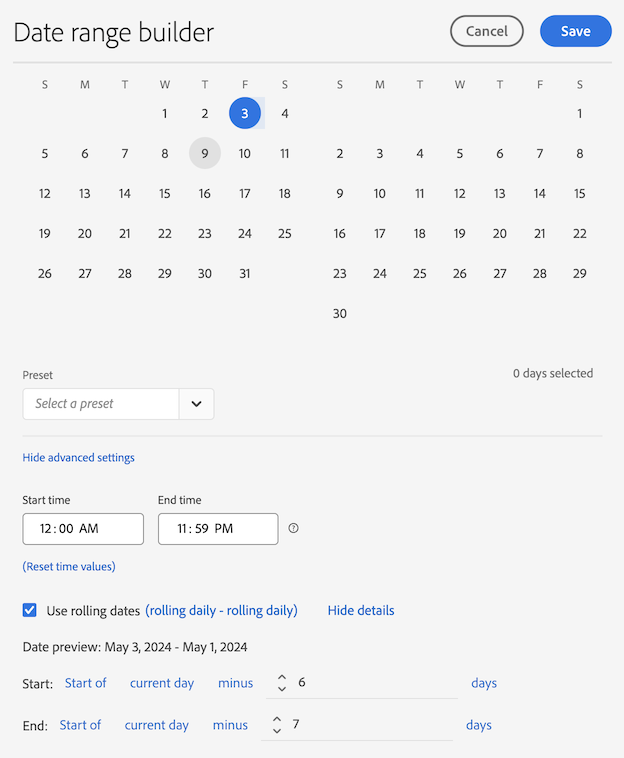

# Skapa anpassade datumintervall

Skapa anpassade datumintervall i Analysis Workspace och spara dem som tidskomponenter.

**[!UICONTROL Components]** > **[!UICONTROL New Date Range]**

Ett datumintervall används på panelnivå. Om du vill lägga till ett datumintervall i projektet klickar du på **Paneler** > *`<select panel>`* och anger ett nytt datumintervall.

## Datumintervall för&quot;två månader sedan&quot; {#section_C4109C57CB444BB2A79CC8082BD67294}

I följande anpassade datumintervall visas ett datumintervall för&quot;två månader sedan&quot;, med en visualisering av Sammanfattningsändring som visar en riktningsändring.

Det anpassade datumintervallet visas högst upp på [!UICONTROL Date Range]-komponentpanelen i ditt projekt:

Du kan dra det här anpassade datumintervallet till en kolumn tillsammans med ett anpassat, månatligt löpande datumintervall med hjälp av förinställningen Sista månaden för en jämförelse. Lägg till en visualisering av sammanfattningsändring och välj summorna från varje kolumn för att visa riktningsändring:

## Använd ett 7-dagars rullande datumintervall {#section_7EF63B2E9FF54D2E9144C4F76956A8DD}

Ett datumintervall gäller för panelnivån. Om du vill lägga till ett datumintervall i projektet klickar du på **Åtgärder** > **Lägg till panel** och anger ett nytt datumintervall.

I Date Range Builder kan du skapa ett anpassat datumintervall som visas med andra datumintervall på panelen Komponenter.

Du kan till exempel skapa ett datumintervall som anger ett 7-dagars rullande fönster som slutar för en vecka sedan:

Använd *`rolling daily`*.

* Startinställningarna är *`current day minus 14 days`*.

* Slutinställningarna är *`current day minus 7 days`*.

Datumintervallet kan vara en komponent som du drar till en frihandstabell.
