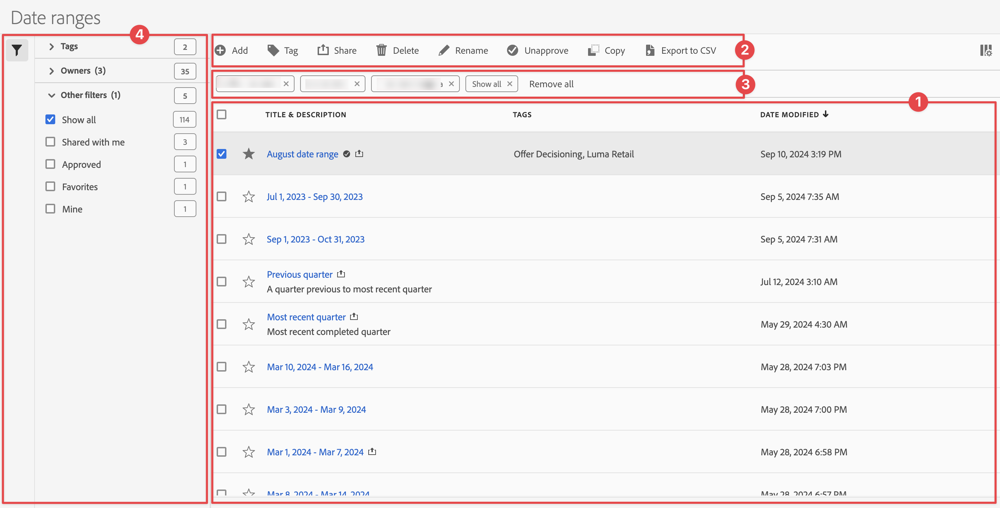

# Hantera datumintervall

Du kan dela, filtrera, tagga, godkänna, kopiera, dela och ta bort datumintervall och markera datumintervall som favoriter från ett centralt [!UICONTROL Date ranges]-hanteringsgränssnitt. Så här hanterar du datumintervall:

* Välj **[!UICONTROL Components]** i huvudgränssnittet och välj sedan **[!UICONTROL Date ranges]**.

## Hanterare för datumintervall

Hanteraren för datumintervall har följande gränssnittselement:

### Datumintervalllista

I datumintervalllistan ➊ visas alla datumintervall. Listan innehåller följande kolumner:

| Kolumn | Beskrivning |
| --- | --- |
|  | Välj om du vill prioritera  eller  ett datumintervall. |
| **[!UICONTROL Title and description]** | Om du vill redigera titeln och beskrivningen markerar du titellänken, som öppnar [datumintervallsverktyget](create.md#date-range-builder). |
| **[!UICONTROL Owner]** | Ägaren till datumintervallet. |
| **[!UICONTROL Tags]** | Taggarna för det här datumintervallet. |
| **[!UICONTROL Shared with]** | De personer eller grupper som du har delat datumintervallet med. Välj det här alternativet om du vill öppna dialogrutan **[!UICONTROL Share Date range]**. |
| **[!UICONTROL Date modified]** | Visar datum och tid då datumintervallet senast ändrades. |

{style="table-layout:auto"}

Använd  för att ange vilka kolumner du vill visa.

### Åtgärdsfält

Du kan utföra åtgärder för datumintervall med åtgärdsfältet ➋. Åtgärdsfältet innehåller följande åtgärder:

| Ikon | Åtgärd | Beskrivning |
|:---:|---|---|
|  | **[!UICONTROL Add]** | Lägg till ett annat datumintervall med hjälp av [datumintervallverktyget](create.md#date-range-builder). |
|  | [!UICONTROL *Sök efter titel*] | Om inget datumintervall är markerat i listan söker du efter datumintervall med det här sökfältet. |
|  | **[!UICONTROL Tag]** | Tagga de markerade datumintervallen. I dialogrutan **[!UICONTROL Tag Date range]** markerar eller avmarkerar du taggarna för de markerade datumintervallen. Välj **[!UICONTROL Save]** om du vill spara taggarna för de valda datumintervallen. |
|  | **[!UICONTROL Share]** | Dela de markerade datumintervallen. I dialogrutan **[!UICONTROL Share Date range]** kan du  *söka efter enskilda personer eller grupper* eller välja **[!UICONTROL Organization]** eller **[!UICONTROL Groups]**. Välj **[!UICONTROL Save]** om du vill spara delningsinformation för de valda datumintervallen. |
|  | **[!UICONTROL Delete]** | Ta bort de markerade datumintervallen. Du uppmanas att bekräfta åtgärden. |
|  | **[!UICONTROL Rename]** | Byt namn på ett enstaka markerat datumintervall. När du har markerat det här alternativet kan du byta namn på datumintervallet. |
|  | **[!UICONTROL Approve]** | Godkänn de valda datumintervallen. |
|  | **[!UICONTROL Copy]** | Kopiera de markerade datumintervallen. Nya datumintervall skapas med samma namn och suffix (Kopiera) |
|  | **[!UICONTROL Export to CSV]** | Exportera de markerade datumintervallen till en `Date ranges List.csv`-fil. |

### Aktivt filterfält

Filterfältet ➌ visar de aktiva filtren (om sådana finns). Du kan snabbt ta bort ett filter med . Om fler än ett filter anges använder du **[!UICONTROL Remove all]** för att ta bort alla filter.

### Panelen Filter

Du kan filtrera datumintervall med den **[!UICONTROL Filter]** vänstra panelen ➍. Filterpanelen visar typen av filter och antalet datumintervall som filtret gäller. Välj  för att växla visningen av filterpanelen.

Så här filtrerar du filterlistan:

1. Välj  för att öppna panelen Filter. Om du behöver mer utrymme för filterlistan kan du stänga panelen genom att välja  en gång till.
1. Du kan filtrera datumintervallen med hjälp av någon av de tillgängliga [filteravsnitten](#filter-sections).

   >[!INFO]
   >
   >*Objekt* refererar till datumintervallobjekt som visas i listan [Datumintervall](#date-ranges-list).
   > 

#### Filtrera avsnitt

{{tagfiltersection}}
{{ownerfiltersection}}
{{otherfiltersfiltersection}}

Listan [Datumintervall](#date-ranges-list) uppdateras automatiskt baserat på din filterkonfiguration. Du kan se de konfigurerade filtren i det [aktiva filterfältet](#active-filter-bar).

## Redigera datumintervall

Du kan redigera ett datumintervall på två sätt:

* Använd ikonen [Komponentinformation](/help/analyze/analysis-workspace/components/use-components-in-workspace.md#component-info) i ett Workspace-projekt.

* Markera datumintervallets titel i listan [[!UICONTROL Date ranges]](#date-ranges-list).

Du använder [datumintervallverktyget](create.md#date-range-builder) för att redigera datumintervallet.

Använd datumintervallhanteraren för att dela, byta namn på eller ta bort datumintervall. Så här når du datumhanteraren:

1. Logga in på [analytics.adobe.com](https://analytics.adobe.com) med inloggningsuppgifterna för ditt Adobe-ID.
1. Navigera till [!UICONTROL Components] > [!UICONTROL Date Ranges].

<!--

## Interface

The date range manager includes the following options:

* **Add**: Create a new date range. See [create a date range](create.md) for more information.
* **Search by title**: Search for a date range by title. Results are filtered based on text entered here.
* **Filter**: Filter date ranges using the left column. You can filter by custom tag, owner, created by you, your favorites, approved, or shared with you. You can also search for desired filters.
* **Favorite**: Click the  icon next to a date range to add it to your favorites.
* **Customize columns**: Click the  icon to show or hide columns in the date range manager.

Click the checkbox next to one or more date ranges for more options.

* **Tag**: Apply a tag to all selected date ranges. Tags help you organize date ranges, and let you filter them using the left column.
* **Share**: Share a date range to other Experience Cloud users. If you are a product administrator, you can also share to the entire organization or groups. Date ranges that are shared to other users in your organization include a  icon next to the title.
* **Delete**: Permanently delete the selected date range(s).
* **Rename**: If a single date range is selected, you can change its title.
* **Approve**: If you are a product admin, you can add a stamp of approval to a date range. Approved date ranges inform users in your organization that they are 'official', differentiating them from date ranges created by other users in your organization. Approved date ranges include a  icon next to the title.
* **Unapprove**: If you are a product admin and select a date range that is already approved, you can unapprove it.
* **Copy**: Create a copy of the selected date range(s). Copying date ranges appends `(Copy)` to the end of the title of the newly copied date range(s).
* **Export to CSV**: Exports all selected date ranges into a CSV file. Columns in the resulting CSV file include all visible columns in the date range manager.
-->
