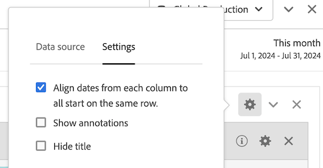

# Datumjämförelse

Med datumjämförelsen i Analysis Workspace kan du ta vilken kolumn som helst som innehåller ett datumintervall och skapa en gemensam datumjämförelse, till exempel år-över-år, kvartal-över-kvartal, månad-över-månad osv.

## Jämför tidsperioder

Analysen kräver ett sammanhang, och ofta tillhandahålls detta sammanhang av en tidigare tidsperiod. Frågan *Hur mycket bättre eller sämre gör du nu jämfört med den här gången förra året?* är grundläggande för att förstå din verksamhet. Datumjämförelse innehåller automatiskt en *differenskolumn*, som visar den procentuella ändringen jämfört med en angiven tidsperiod.

1. Skapa en [frihandstabell](/help/analyze/analysis-workspace/visualizations/freeform-table/freeform-table.md) med alla mått och mått som du vill jämföra under en tidsperiod.
1. Öppna snabbmenyn för en tabellrad och välj **[!UICONTROL Compare time periods]**.

   

   >[!NOTE]
   >
   >Det här snabbmenyalternativet är inaktiverat för måttrader, datumintervallrader och tidsdimensioneringsrader.

1. Beroende på hur du har angett tabellens datumintervall kan du göra följande jämförelser:

   | Alternativ | Beskrivning |
   |---|---|
   | **[!UICONTROL Prior *x *veckor/månader/kvartal/år till detta datumintervall]** | Jämför med det valda datumintervallet omedelbart före det här datumintervallet. |
   | **[!UICONTROL These x weeks / months / quarters / years last year to this date range]** | Jämför med samma datumintervall för ett år sedan. |
   | **[!UICONTROL Custom date range to this date range]** | Här kan du definiera ett anpassat datumintervall. |

   >[!NOTE]
   >
   >När du väljer ett anpassat antal dagar, till exempel 7 oktober-20 oktober (ett 14-dagarsintervall), får du bara två alternativ: **[!UICONTROL Prior 14 days before this date range]** och **[!UICONTROL Custom date range to this date range]**.

1. Jämförelsen ser ut så här:

   

   Rader i kolumnen Procent av ändring visas som röda för negativa värden och gröna för positiva värden.

## Lägg till en tidsperiodkolumn för jämförelse

Nu kan du lägga till en tidsperiod för varje kolumn i en tabell, så att du kan lägga till en annan tidsperiod än den som du har angett för kalendern.

1. Högerklicka på en kolumn i tabellen och välj **[!UICONTROL Add time period column]**.

   

1. Beroende på hur du har angett tabellens datumintervall kan du göra följande jämförelser:

   | Alternativ | Beskrivning |
   |---|---|
   | **[!UICONTROL Prior *x *veckor/månader/kvartal/år till detta datumintervall]** | Lägg till en kolumn med veckan/månaden/osv. omedelbart före detta datumintervall. |
   | **[!UICONTROL These *x *veckor/månader/kvartal/år förra året till detta datumintervall]** | Lägg till samma datumintervall för ett år sedan. |
   | **[!UICONTROL Custom date range to this date range]** | Gör att du kan skapa ett anpassat datumintervall. |

   >[!NOTE]
   >
   >När du väljer ett anpassat antal dagar, till exempel 7 oktober-20 oktober (ett 14-dagarsintervall), får du bara två alternativ: **[!UICONTROL Prior 14 days before this date range]** och **[!UICONTROL Custom date range to this date range]**.

1. Tidsperioden infogas ovanpå kolumnen som du valde:

   

1. Du kan lägga till så många tidskolumner du vill och blanda och matcha olika datumintervall:

1. Dessutom kan du sortera efter varje kolumn, vilket ändrar ordningen på dagar beroende på vilken kolumn du sorterar efter.

## Justera kolumndatum så att de startar på samma rad

Du kan justera datumen från varje kolumn så att alla börjar på samma rad.

Du kan till exempel göra en jämförelse dag för dag för den sista veckan (som slutar den 5 oktober 2024) och den föregående veckan. Som standard börjar den vänstra kolumnen med 22 september och den högra kolumnen med 29 september.

Du kan aktivera **[!UICONTROL Align dates from each column to all start on the same row]** i [Inställningar](/help/analyze/analysis-workspace/visualizations/freeform-table/freeform-table.md#settings-1) för visualisering av frihandstabellen för att justera kolumndatum så att de startar på samma rad.

Tänk på följande när du använder det här alternativet:

* Den här inställningen är aktiverad som standard för alla nya projekt.

* Den här inställningen gäller för hela tabellen. Om du till exempel ändrar den här inställningen för en uppdelning i tabellen, används inställningen på hela tabellen.

<!--
# Date comparison

Date comparison in Analysis Workspace lets you take any column containing a date range and create a common date comparison, such as: year-over-year, quarter-over-quarter, month-over-month, etc.

>[!BEGINSHADEBOX]

See  [Date comparison](https://video.tv.adobe.com/v/30753?quality=12&learn=on){target="_blank"} for a demo video.

>[!ENDSHADEBOX]

## Compare time periods {#section_C4E36BFE0F5C4378A74E705747C9DEE4}

>[!NOTE]
>[!UICONTROL Compare Time Periods] leverages advanced Calculated Metrics. As a result, it is available only to customers with Analytics Select, Prime, and Ultimate SKUs. 

Analysis requires context, and often that context is provided by a previous time period. For example, the question "How much better or worse are we doing than at this time last year?" is fundamental to understanding your business. Date Comparison automatically include a "difference" column, which shows the percentage change compared to a specified time period.

1. Create a Freeform table, with any dimensions and metrics you want to compare over a time period.
1. Right-click a table row and select **[!UICONTROL Compare time periods]**.

   

   >[!NOTE]
   >
   >This right-click option is disabled for metric rows, date range rows, and time dimension rows.

1. Depending on how you have set the table's date range, you have these options for comparison: 

   |  Option  | Description  |
   |---|---|
   | **[!UICONTROL Prior week/month/quarter/year to this date range]** | Compares to the week/month/etc. immediately before this date range.  |
   | **[!UICONTROL This week/month/quarter/year last year to this date range]** | Compares to the same date range a year ago.  |
   | **[!UICONTROL Custom date range to this date range]** | Lets you select a custom date range.  |

   >[!NOTE]
   >
   >When you select a custom number of days, for example October 7 - October 20 (a 14-day range), you will get only 2 options: **[!UICONTROL Prior 14 days before this date range]**, and **[!UICONTROL Custom date range to this date range]**.

1. The resulting comparison looks like this:

   

   Rows in the Percent Change column appear red for negative values and green for positive values.

1. (Optional) As in any other Workspace projects, you can create visualizations based on these time comparisons. For example, here is a Bar graph:

   

   Note that in order to show the percentage change in the bar chart, you have to have the [!UICONTROL Percentages] setting checked in the [!UICONTROL Visualization Settings].

## Add a time period column for comparison {#section_93CC2B4F48504125BEC104046A32EB93}

You can now add a time period to each column in a table, enabling you to add a time period that is different from the one your calendar is set to. This is another way you can compare dates.

1. Right-click a column in the table and select **[!UICONTROL Add time period column]**. 

   

1. Depending on how you have set the table's date range, you have these options for comparison: 

   |  Option  | Description  |
   |---|---|
   | **[!UICONTROL Prior week/month/quarter/year to this date range]** | Adds a column with the week/month/etc. immediately before this date range.  |
   | **[!UICONTROL This week/month/quarter/year last year to this date range]** | Adds the same date range a year ago.  |
   | **[!UICONTROL Custom date range to this date range]** | Lets you select a custom date range.  |

   >[!NOTE]
   >
   >When you select a custom number of days, for example October 7 - October 20 (a 14-day range), you will get only 2 options: **[!UICONTROL Prior 14 days before this date range]**, and **[!UICONTROL Custom date range to this date range]**.

1. The time period will be inserted on top of the column you selected:

   

1. You can add as many time columns as you want, as well as mix and match different date ranges:

   

1. In addition, you can sort on each column, which will change the order of days depending on the column you are sorting on.

## Align column dates to start on the same row {#section_5085E200082048CB899C3F355062A733}

You can align the dates from each column to all start on the same row. 

For example, when you choose to align the dates, if you do a month-over-month comparison between October and September 2016, the left column will start with October 1 and the right column will start with September 1:

>[!NOTE]
>
>Consider the following when using this option:
>
>* This setting is enabled by default for all new projects.
>
>* This setting applies to the entire table. For example, if you change this setting for a breakdown within the table, it will change the setting for the entire table.
>

To enable this setting, if it is not already enabled:

1. In the table where you want to align column dates, select the **Settings** icon in the table header.

1. On the [!UICONTROL **Settings**] tab, select **[!UICONTROL Align Dates from each column to all start on the same row (applies to entire table)]**.

-->