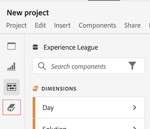

# Översikt över dataordlistan

{{release-limited-testing}}

Med Data Dictionary i Analysis Workspace kan både användare och administratörer hålla reda på och bättre förstå komponenterna i sin Analytics-miljö.

Systemadministratörer ansvarar för att strukturera informationen om varje komponent i datamappningen och göra den tillgänglig för användarna.

## Fördelar för användare

Med Data Dictionary får användarna en bättre förståelse för alla komponenter som är tillgängliga för dem.

Den information som finns i ordlistan innehåller:

* En komponents funktion och avsedda användning

* Komponenter som vanligtvis används med den som du visar

* Komponenter som liknar de som du visar

* Om en komponent har godkänts av systemadministratören

## Fördelar för administratörer

Med Data Dictionary kan systemadministratörer hålla reda på och strukturera komponenterna i sin Analytics-miljö.

Här följer några exempel på hur Analytics-administratörer kan använda Data Dictionary:

* Identifiera duplicerade komponenter som behöver konsolideras.

* Identifiera komponenter som inte samlar in några data så att de kan uppdateras eller tas bort.

* Identifiera komponenter som ännu inte har godkänts.

* Uppdatera komponentbeskrivningar direkt i Analysis Workspace. Alla uppdateringar som görs av komponentbeskrivningarna i Data Dictionary återspeglas i Report Suite.

   På samma sätt återspeglas alla uppdateringar av komponentbeskrivningarna i Report Suite i Analysis Workspace.

   Mer information om hur du lägger till komponentbeskrivningar i antingen Analysis Workspace eller i en Report Suite finns i [Lägga till komponentbeskrivningar](/help/analyze/analysis-workspace/components/add-component-descriptions.md).

## Åtkomst till dataordlistan

Du kan komma åt datamodlistan på något av följande sätt i Analysis Workspace:

* Från **Dataordlista** ikonen i den vänstra listen.

   

* Från **Dataordlista** -ikonen i infoportören för en komponent.

   
<!--update screenshot; this was taken from a mock-->

* Från menyn: [!UICONTROL **Hjälp**] > [!UICONTROL **Dataordlista**].

   <!--add screenshot-->

## Flytta, minimera eller stänga datamappningslistan

När du öppnar dataordlistan (enligt beskrivningen i [Åtkomst till dataordlistan](#access-the-data-dictionary)) visas den som ett fönster ovanpå Analysis Workspace.

Du kan ändra fönstret för datamordlistan på något av följande sätt:

* Dra det till valfri plats i Analysis Workspace

   Om du stänger och öppnar Analysis Workspace igen finns fönstret Datamordlista kvar på den plats där du senast flyttade det. <!--True?-->

* Minimera

   När värdet är minimerat visas datamordlistan som en blå flik i det nedre högra hörnet av Analysis Workspace.

   När du väljer den blå fliken öppnas Data Dictionary för den komponent som du senast visade.

* Stäng
