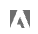

# Visa komponentinformation i Data Dictionary

{{release-limited-testing}}

Med Data Dictionary kan du visa information om en komponent, inklusive komponentbeskrivningen, liknande komponenter, andra komponenter som en komponent ofta används med, med mera.

Så här visar du information om en komponent i Data Dictionary:

1. Gå till det Analysis Workspace-projekt som innehåller komponenten som du vill visa.

1. Välj [!UICONTROL **Dataordlista**] ikonen till vänster i Analysis Workspace. (Alternativa sätt att komma åt dataordlistan beskrivs i&quot;Åtkomst till dataordlistan&quot; i [Översikt över dataordlistan](/help/analyze/analysis-workspace/components/data-dictionary/data-dictionary-overview.md).)

   Fönstret Data Dictionary visas.

   

   <!--double-check this screenshot. I mocked the admin view up a bit to get rid of the Dictionary health tab.-->

1. Kontrollera att den rapportsvit som innehåller den komponent som du vill visa är markerad i listrutan. Som standard visas den rapportsvit som du redan ingår i.

1. (Valfritt) I sökfältet börjar du med att skriva namnet på komponenten som du vill visa.

   Ikoner visas bredvid komponentnamn för att ange komponenttyp:

   | Ikon | Betydelse |
   |---------|----------|
   |  | Anger en **dimension**. Dimensioner tillhandahålls av Adobe. Befintliga dimensioner kan inte ändras och nya dimensioner kan inte skapas. |
   |  | Anger en **standardmått** (inte beräknat). Standardvärden tillhandahålls av Adobe och kan inte ändras. |
   |  | Anger en **mall för beräknat mått** eller en **segmentmall**. Dessa komponenter tillhandahålls av Adobe och kan inte ändras. |
   |  | Anger en **beräknat mått** som har skapats av en Analytics-administratör i din organisation. |
   |  | Anger en **segment**. Dessa kan vara segment som tillhandahålls av Adobe eller skapas av en Analytics-administratör i din organisation. |
   |  | Anger en **datumintervall**. Det kan vara datumintervall som tillhandahålls av Adobe eller skapas av en Analytics-administratör i din organisation. |

{{dd-filter-criteria}}

1. Välj den komponent du vill visa i listan med komponenter.

   Följande information om komponenten visas:

   {{dd-component-information}}

1. (Valfritt) Dra en komponent från Data Dictionary till Analysis Workspace.