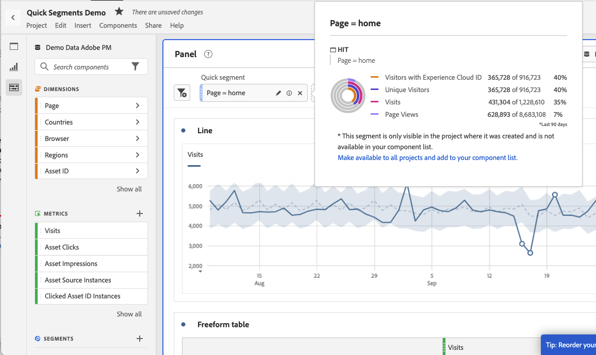
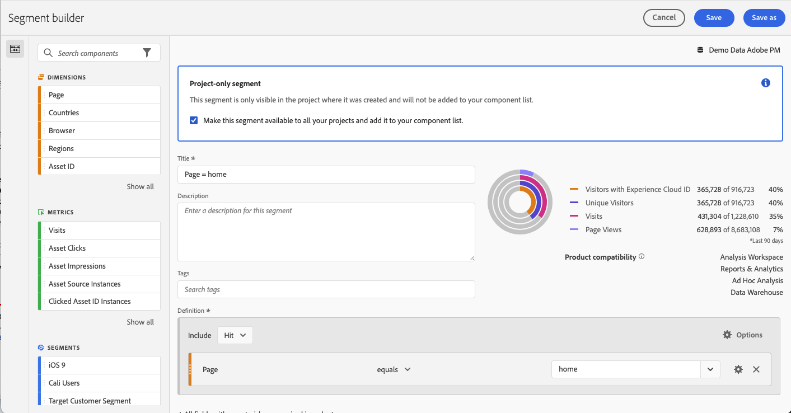

# Snabbsegment

Du kan skapa snabbsegment i ett projekt för att slippa komplexiteten i den fullständiga [segmentbyggare](/help/components/segmentation/segmentation-workflow/seg-build.md). Snabbsegment

* Använd som [endast projektsegment](https://experienceleague.adobe.com/docs/analytics/analyze/analysis-workspace/components/segments/quick-segments.html?lang=en#what-are-project-only-segments%3F).
* Tillåt upp till tre regler.
* Innesluta inte kapslade behållare eller sekventiella regler.

Om du vill jämföra vad snabbsegment kan göra jämfört med fullständiga komponentlistsegment går du till [här](/help/analyze/analysis-workspace/components/segments/t-freeform-project-segment.md).

Här är en videoöversikt över snabbsegment:

>[!VIDEO](https://video.tv.adobe.com/v/341466/?quality=12&learn=on)

## Förutsättningar

Vem som helst kan skapa en [!UICONTROL Quick Segment]. Du behöver dock [!UICONTROL Segment Creation] behörighet i [Adobe Admin Console](https://experienceleague.adobe.com/docs/analytics/admin/admin-console/permissions/summary-tables.html?lang=en#analytics-tools) för att kunna spara ett snabbsegment eller öppna det i [!UICONTROL Segment Builder].

## Skapa snabbsegment

I en friformstabell klickar du på ikonen filter+ i panelhuvudet:

Konfigurera snabbsegmentet från den här tomma plattan:

| Inställning | Beskrivning |
| --- | --- |
| Namn | Standardnamnet för ett segment är en kombination av regelnamnen i segmentet. Du kan byta namn på segmentet. |
| Inkludera/exkludera | Du kan antingen inkludera eller exkludera komponenter i segmentdefinitionen, men inte båda. |
| Behållare för träff/besök/besök | Snabbsegment innehåller ett [segmentbehållare](https://experienceleague.adobe.com/docs/analytics/components/segmentation/seg-overview.html?lang=en#section_AF2A28BE92474DB386AE85743C71B2D6) bara så att du kan inkludera ett mått/mått/datumintervall i (eller exkludera det från) segmentet. [!UICONTROL Visitor] innehåller översiktsdata som är specifika för besökaren vid besök och sidvisningar. A [!UICONTROL Visit] kan du ange regler för att dela upp besökarens data baserat på besök och en [!UICONTROL Hit] kan du dela upp besökarinformation baserat på enskilda sidvyer. Standardbehållaren är [!UICONTROL Hit]. |
| Komponenter (Dimension/mått/datumintervall) | Definiera upp till tre regler genom att lägga till komponenter (mått och/eller mått och/eller datumintervall) och deras värden. Det finns tre sätt att hitta rätt komponent:<ul><li>Börja skriva och [!UICONTROL Quick Segment] builder hittar automatiskt rätt komponent.</li><li>Använd listrutan för att hitta komponenten.</li><li>Dra och släpp komponenter från den vänstra listen.</li></ul> |
| Operator | Använd listrutan för att hitta standardoperatorer och [!UICONTROL Distinct Count] operatorer. [Läs mer](https://experienceleague.adobe.com/docs/analytics/components/segmentation/segment-reference/seg-operators.html?lang=en) |
| Plustecken (+) | Lägg till en annan regel |
| OCH/ELLER-kvalificerare | Du kan lägga till&quot;AND&quot;- eller&quot;OR&quot;-kvalificerare i reglerna, men du kan inte blanda&quot;AND&quot; och&quot;OR&quot; i en enskild segmentdefinition. |
| Använd | Använd det här segmentet på panelen. Om segmentet inte innehåller några data tillfrågas du om du vill fortsätta. |
| Open Builder | Öppnar segmentbyggaren. När du har sparat eller använt segmentet i segmentbyggaren betraktas det inte längre som ett&quot;snabbsegment&quot;. Den blir en del av segmentbiblioteket för komponentlistor. |
| Avbryt | Avbryt det här snabbsegmentet - använd det inte. |
| Datumintervall | Valideraren använder panelens datumintervall för sin datasökning. Alla datumintervall som används i ett snabbsegment åsidosätter panelens datumintervall högst upp på panelen. |
| Förhandsgranska (överst till höger) | Här kan du se om du har ett giltigt segment och hur brett segmentet är. Representerar den uppdelning av datauppsättningen som du kan förvänta dig att se när du använder det här segmentet. Du kan få ett meddelande som anger att det här segmentet saknar data. I så fall kan du fortsätta eller ändra segmentdefinitionen. |

Här är ett exempel på ett segment som kombinerar mått och mätvärden:

Segmentet visas överst. Lägg märke till dess blå, randiga sidospalt, till skillnad från den blå sidolisten för segment på komponentnivå i segmentbiblioteket till vänster.

## Redigera snabbsegment

1. Håll pekaren över snabbsegmentet och välj pennikonen.
1. Redigera segmentdefinitionen och/eller segmentnamnet.
1. Klicka på [!UICONTROL Apply].

## Spara snabbsegment

>[!IMPORTANT]
>När du har sparat eller använt segmentet kan du inte längre redigera det i snabbsegmentsverktyget, utan bara i den vanliga segmentbyggaren. Det är bara Adobe Analytics produktadministratörer och den som skapat snabbsegmentet som kan spara ändringar i ett befintligt snabbsegment.

1. När du har använt snabbsegmentet håller du pekaren över det och väljer ikonen för info (&quot;i&quot;).

   

1. Klicka på **[!UICONTROL Make available to all projects and add to your component list]**.
1. (Valfritt) Byt namn på segmentet.
1. Klicka på **[!UICONTROL Save]**.

Lägg märke till hur segmentets sidlist ändras från randig blå till ljusblå. Den visas nu även i den vänstra listan över komponenter för rälsen.

## Vad är segment med endast projekt?

Endast projektsegment är segment som bara gäller för det aktuella projektet som de skapades i. De är inte tillgängliga i andra projekt och kan inte delas med andra användare. De är avsedda för att snabbt kunna utforska dina data utan att du behöver skapa och spara ett segment i den vänstra listen. Du kan skapa segment som bara innehåller projekt i panelens släppzon med snabbsegment eller [ad hoc-segment](https://experienceleague.adobe.com/docs/analytics/analyze/analysis-workspace/components/segments/ad-hoc-segments.html?lang=en).

Om ett segment som bara är för projekt öppnas i [!UICONTROL Segment Builder]visas ett meddelande om att projektet bara är öppet. Om du inte markerar&quot;Gör det här segmentet tillgängligt..&quot; och klicka **[!UICONTROL APPLY]** förblir segmentet bara ett projektsegment. Obs! om du använder ett snabbsegment från segmentbyggaren kan det inte längre öppnas i [!UICONTROL Quick Segment Builder].

Om du markerar&quot;Gör det här segmentet tillgängligt..&quot; och klicka **[!UICONTROL SAVE]** blir segmentet tillgängligt i den vänstra listan över järnvägskomponenter för användning i andra projekt. Den kan även delas med andra användare från segmenthanteraren.

