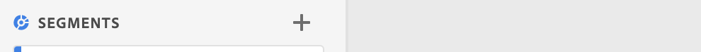

# Segment {#topic_DC2917A2E8FD4B62816572F3F6EDA58A}

Du kan skapa olika typer av segment i Workspace, beroende på hur komplexa de behöver vara, om de bara ska gälla för det här projektet osv. Här följer en sammanfattning av segmenttyper:

| Segmenttyp | Skapad var? | Tillämpligt var? | När ska du använda |
| --- | --- | --- | --- |
| Segment i komponentlista | Klicka på +, vilket tar dig till [segmentbyggaren](/help/components/segmentation/segmentation-workflow/seg-build.md) | Alla dina Workspace-projekt | För mer komplexa segment, sekventiella segment |
| Snabbsegment | [Skapa snabbsegment](/help/analyze/analysis-workspace/components/segments/quick-segments.md) | Endast projekt, men du kan spara och lägga till i segmentlistan. | Kan användas för segment med en regel (med dra och släpp) eller för att lägga till/redigera flera regler (genom att klicka på segmentikonen) |
| Beräknat mätningsbaserat segment | [Bygg beräknade mätvärden](https://experienceleague.adobe.com/docs/analytics/components/calculated-metrics/calcmetric-workflow/metrics-with-segments.html?lang=sv-SE) | Till individuellt beräknat mått | Använd segment i måttdefinitionen |
| Virtuellt rapportsuite-baserat segment | [Virtuell Report Suite Builder](https://experienceleague.adobe.com/docs/analytics/components/virtual-report-suites/vrs-workflow/vrs-create.html?lang=sv-SE) | Till enskild virtuell rapportsvit | Använd segment i definitionen för den virtuella rapportsviten |

## Videor

>[!BEGINSHADEBOX]

Se  [Använda segment i Analysis Workspace](https://video.tv.adobe.com/v/23977?quality=12&learn=on){target="_blank"} för en demonstrationsvideo.

>[!ENDSHADEBOX]

>[!BEGINSHADEBOX]

Se  [Söka efter och skapa segment](https://video.tv.adobe.com/v/334092?quality=12&learn=on){target="_blank"} för en demonstrationsvideo.

>[!ENDSHADEBOX]

>[!BEGINSHADEBOX]

Se  [Rullande datumintervall i segment ](https://video.tv.adobe.com/v/25403?quality=12&learn=on){target="_blank"} för en demonstrationsvideo.

>[!ENDSHADEBOX]

## Skapa segment {#section_693CFADA668B4542B982446C2B4CF0F5}

Du kan skapa olika typer av segment i Analysis Workspace:

* [Snabbsegment](/help/analyze/analysis-workspace/components/segments/quick-segments.md)
* Vanliga segment för komponentlistor som du skapar i segmentbyggaren och som hamnar i segmentbiblioteket (se nedan)

### Skapa segment för komponentlistor {#section_3B07D458C43E42FDAF242BB3ACAF3E90}

Segmentspåret under komponentmenyn visas

* Segment som du eller ditt företag har skapat
* Segmentmallar, enligt Adobe  -ikonen:

Om du vill skapa ett segment av den här typen har du två alternativ. Båda tar dig till [Segment Builder](/help/components/segmentation/segmentation-workflow/seg-build.md) i Adobe Analytics, där du hittar mer information.

* Klicka på plustecknet (+) bredvid [!UICONTROL Segments] i den vänstra listen:

eller

* Gå till [!UICONTROL Components] > [!UICONTROL Segments] och klicka sedan på [!UICONTROL + Add].

### Andra metoder för att använda segment {#section_10FF2E309BA84618990EA5B473015894}

>[!BEGINSHADEBOX]

Se  [Andra metoder för att använda segment](https://video.tv.adobe.com/v/30994?quality=12&learn=on){target="_blank"} för en demonstrationsvideo.

>[!ENDSHADEBOX]

Det finns flera andra metoder för att tillämpa segment i frihandsprojekt.

| Åtgärd | Beskrivning |
|--- |--- |
| Skapa segment från markering | Skapa ett textbundet segment. Det här segmentet gäller bara det öppna projektet och sparas inte som ett Analytics-segment. 1. Markera rader.  2. Högerklicka på markeringen.  3. Klicka på *Skapa segment från markering*. |
| Komponenter > Nytt segment | Visar segmentbyggaren. Mer information om segmentering finns i [Segmentbyggaren](https://experienceleague.adobe.com/docs/analytics/components/segmentation/segmentation-workflow/seg-build.html?lang=sv-SE). |
| Dela > Dela projekt eller Dela > Kuratera projektdata | I [Kuratera och dela](https://experienceleague.adobe.com/docs/analytics/analyze/analysis-workspace/curate-share/curate.html?lang=sv-SE#concept_4A9726927E7C44AFA260E2BB2721AFC6) kan du lära dig hur segment som du tillämpar på projektet är tillgängliga i en delad analys för mottagaren. |
| Använd segment som Dimensioner | Video: [Använda segment som Dimensioner i Analysis Workspace](https://experienceleague.adobe.com/docs/analytics-learn/tutorials/analysis-workspace/applying-segments/using-segments-as-dimensions-in-analysis-workspace.html?lang=sv-SE) |

## Segmentanalys

Segmentanalys (även kallad segmentjämförelse) omfattar följande funktioner:

* [Panelen Segmentjämförelse:](/help/analyze/analysis-workspace/c-panels/c-segment-comparison/segment-comparison.md) Kärnfunktionen i segmentanalys. Dra två segment till panelen och visa en omfattande rapport som visar statistiskt signifikanta skillnader och överlappning mellan de två målgrupperna.
* [Jämför segment i utfallet:](/help/analyze/analysis-workspace/visualizations/fallout/compare-segments-fallout.md) Se hur olika målgrupper skiljer sig från varandra i samband med en utfallsvisualisering.

## Mer info

Mer information om segmentering i Adobe Analytics finns [här](/help/components/segmentation/seg-overview.md).
