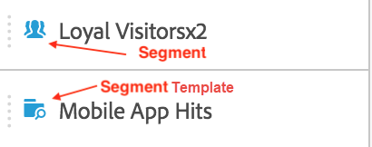

# Segment {#topic_DC2917A2E8FD4B62816572F3F6EDA58A}

## Segmentspår {#section_3B07D458C43E42FDAF242BB3ACAF3E90}

Segmentspåret under menyn Komponenter visar både segment och segmentmallar, enligt följande ikoner:

[Använda segment i Analysis Workspace](https://experienceleague.adobe.com/docs/analytics-learn/tutorials/analysis-workspace/applying-segments/using-segments-in-analysis-workspace.html) (6:46)

## Skapa segment {#section_693CFADA668B4542B982446C2B4CF0F5}

Du kan skapa snabbsegment genom att släppa alla komponenttyper (dimensioner, dimensionsobjekt, händelser, mått, segment, segmentmallar, datumintervall) i segmentsläppzonen högst upp på panelen.

Komponenttyper konverteras automatiskt till segment. Du kan också klicka på plustecknet (+) i rutan Lägg till segment.

Kom ihåg:

* Du **kan inte** släppa följande komponenttyper i segmentzonen: beräknade mått och mått/mätvärden som du inte kan bygga segment utifrån.
* För alla dimensioner och händelser skapar Analysis Workspace&quot;finns&quot;-träffsegment. Exempel: &quot;Träffas där eVar1 finns&quot; eller &quot;hit där event1 finns&quot;.
* Om &quot;unspecified&quot; eller &quot;none&quot; släpps i segmentets släppzon konverteras det automatiskt till segmentet &quot;does not exist&quot; så att det behandlas korrekt i segmentering.

>[!NOTE]
>
>Segment som skapas på det här sättet är interna för projektet.

Du kan välja att göra dessa segment offentliga (globala) genom att följa dessa steg:

1. Håll pekaren över segmentet i släppzonen och klicka på ikonen i.
1. Klicka på **[!UICONTROL Make public]** på informationspanelen som visas.

   

## Andra metoder för att använda segment {#section_10FF2E309BA84618990EA5B473015894}

Det finns flera andra metoder för att tillämpa segment i frihandsprojekt.

| Åtgärd | Beskrivning |
|--- |--- |
| Skapa segment från markering | Skapa ett textbundet segment. Markera rader, högerklicka på markeringen och skapa sedan ett textbundet segment. Det här segmentet gäller bara det öppna projektet och sparas inte som ett Analytics-segment. 1. Markera rader.  2. Högerklicka på markeringen.  3. Klicka på *Skapa segment från markering*. |
| Komponenter > Nytt segment | Visar segmentbyggaren. Mer information om segmentering finns i [Segmentbyggare](https://experienceleague.adobe.com/docs/analytics/components/segmentation/segmentation-workflow/seg-build.html). |
| Dela > Dela projekt eller Dela > Kuratera projektdata | I [Curate and Share](https://experienceleague.adobe.com/docs/analytics/analyze/analysis-workspace/curate-share/curate.html#concept_4A9726927E7C44AFA260E2BB2721AFC6) kan du lära dig hur segment som du tillämpar på projektet är tillgängliga i en delad analys för mottagaren. |
| Använd segment som Dimensioner | Video: [Använda segment som Dimensioner i Analysis Workspace](https://experienceleague.adobe.com/docs/analytics-learn/tutorials/analysis-workspace/applying-segments/using-segments-as-dimensions-in-analysis-workspace.html?lang=en) |

## Ad hoc-segment (tillfälliga) i Analysis Workspace

Här är en video om ad hoc-segment:

>[!VIDEO](https://video.tv.adobe.com/v/23978/?quality=12)
