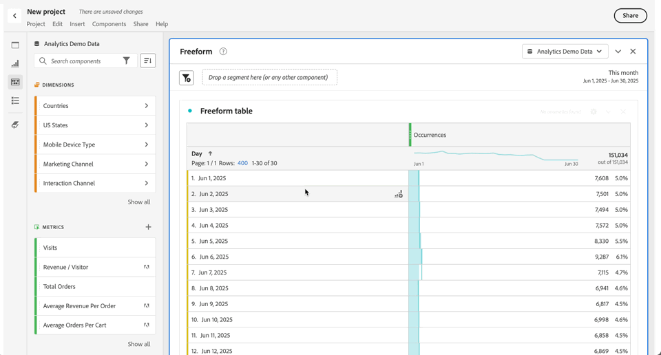

# Använda komponenter i Analysis Workspace

Komponenterna utgör själva data i alla projekt i Analysis Workspace. Komponenterna består av mått, mått, segment och datumintervall. Du kan lägga till komponenter i ett projekt genom att dra dem till visualiseringar eller paneler.

Mer information om vilka typer av komponenter du kan lägga till finns i [komponentöversikten](/help/analyze/analysis-workspace/components/analysis-workspace-components.md).

>[!TIP]
>
>Använd  om du vill ha information om varje komponent. Mer information finns i [Komponentinformation](#component-info)

## Lägga till komponenter i ett projekt

1. [Skapa ett projekt i Analysis Workspace](/help/analyze/analysis-workspace/build-workspace-project/create-projects.md).

1. [Lägg till en panel](/help/analyze/analysis-workspace/c-panels/panels.md#create-a-panel) eller [lägg till en visualisering](/help/analyze/analysis-workspace/visualizations/freeform-analysis-visualizations.md#add-visualizations-to-a-panel) i projektet i Analysis Workspace. Om du lägger till en komponent i ett tomt projekt skapas redan en frihandsritabellvisualisering åt dig.

1. Välj  **[!UICONTROL Components]** på knapppanelen. Alla tillgängliga komponenter visas på den vänstra panelen. Mer information finns i [Gränssnitt](/help/analyze/analysis-workspace/home.md#interface).

1. Bläddra till eller sök efter komponenten som du vill lägga till och dra den sedan till en panel eller visualisering i projektet.

1. Du kan också dra en komponent till segmentets släppzon i ett panelhuvud. Den här dra-och-släpp-funktionen definierar komponenten som ett segment och tillämpar segmentet på allt innehåll på panelen.
Mer information om hur du kan använda segmentsläppzonen på en panel för att segmentera panelen finns i [Släppzon](/help/analyze/analysis-workspace/c-panels/panels.md#drop-zone) i [Panelöversikt](/help/analyze/analysis-workspace/c-panels/panels.md).

1. Mer detaljerad information finns i följande avsnitt:

   * [Lägga till dimensioner i ett projekt](#add-dimensions-to-a-project)

   * [Lägga till mätvärden i ett projekt](#add-metrics-to-a-project)

   * [Lägga till segment i ett projekt](#add-segments-to-a-project)

   * [Lägga till datumintervall i ett projekt](#add-date-ranges-to-a-project)

### Lägga till dimensioner i ett projekt

[Dimensioner](/help/components/dimensions/overview.md) är variabler i Adobe Analytics som vanligtvis innehåller strängvärden. [Mått](/help/components/c-calcmetrics/cm-overview.md) innehåller däremot numeriska värden som är kopplade till en dimension. En grundläggande rapport visar rader med strängvärden (dimension) mot en kolumn med numeriska värden (metrisk).

1. Börja lägga till en dimension i ditt projekt i Analysis Workspace, enligt beskrivningen i [Lägg till komponenter i ett projekt](#add-components-to-a-project).

1. Välj en av följande metoder för att lägga till dimensioner och bestämma vilken typ av data du vill analysera:

   

   * Dra en dimension till en visualisering (till exempel en frihandstabell) i Analysis Workspace.

   * Dra en eller flera dimensioner från den vänstra panelen till segmentets släppzon för att skapa ett snabbsegment, enligt beskrivningen i [Lägg till segment i ett projekt](#add-filters-to-a-project).

1. Du kan även dela upp dimensioner och dimensionsobjekt i Analysis Workspace med andra komponenter. Mer information finns i [Dela upp dimensioner i Workspace](/help/analyze/analysis-workspace/components/dimensions/t-breakdown-fa.md).

Mer information om hur du använder dimensioner i Analysis Workspace finns i [Förhandsvisa dimensioner](/help/analyze/analysis-workspace/components/dimensions/view-dimensions.md), [Dela upp dimensioner](/help/analyze/analysis-workspace/components/dimensions/t-breakdown-fa.md) och [Tidsdelningsdimensioner](/help/analyze/analysis-workspace/components/dimensions/time-parting-dimensions.md).

### Lägga till mätvärden i ett projekt

Med mätvärden kan du kvantifiera datapunkter i Analysis Workspace. De används oftast som kolumner i en visualisering och är knutna till dimensioner.

Så här lägger du till en mätmetod i ett projekt i Analysis Workspace:

1. Börja lägga till ett mått i ditt projekt i Analysis Workspace, enligt beskrivningen i [Lägg till komponenter i ett projekt](#add-components-to-a-project).

1. Välj en av följande metoder för att lägga till ett mått i Analysis Workspace:

   

   * Dra ett mätvärde till släppzonen för mätvärden i en tom Freeform-tabell om du vill se mätningen under projektets datumperiod.

   * Dra ett mått när det finns en dimension för att se måttet för varje dimensionsobjekt.

   * Dra ett mätresultat över ett befintligt måtthuvud om du vill ersätta det.

   * Lägg till det nya måttet genom att dra ett mätvärde till vänster om den högra sidan av en befintlig metrisk rubrik.

   * Dra ett mätresultat ovanför eller under en befintlig måttrubrik om du vill skapa en metrisk överlappning.

Mer information om mått finns i [Metrisk](/help/analyze/analysis-workspace/components/apply-create-metrics.md).

### Lägga till segment i ett projekt

Med [segment](/help/components/segmentation/seg-overview.md) kan du identifiera deluppsättningar av personer, sessioner eller händelser baserat på egenskaper eller specifika interaktioner.

Du kan använda segment i Analysis Workspace på något av följande sätt:

* Lägga till segment i en panel
När du lägger till segment på en panel används segmenten på allt innehåll på panelen.
Mer information om hur du kan använda segmentsläppzonen på en panel för att segmentera panelen finns i [Släppzon](/help/analyze/analysis-workspace/c-panels/panels.md#drop-zone) i [Panelöversikt](/help/analyze/analysis-workspace/c-panels/panels.md).

* Lägga till segment i en visualisering
När du lägger till segment i en kolumn i en frihandstabell används segmenten på allt innehåll i tabellkolumnen. Du kan också lägga till segment som en del av en utfallsvisualisering.

* Använda segment i komponenter
När du definierar komponenter som [beräknade mätvärden](/help/components/c-calcmetrics/c-workflow/cm-workflow/c-build-metrics/metrics-with-segments.md), [anteckningar](/help/analyze/analysis-workspace/components/annotations/create-annotations.md#annotation-builder) eller till och med [segment](/help/components/segmentation/segmentation-workflow/seg-build.md) kan du använda segment som en del av definitionen.

### Lägga till datumintervall i ett projekt

[Datumintervall](/help/analyze/analysis-workspace/components/calendar-date-ranges/calendar.md) bestämmer tidsramen för rapportering i Analysis Workspace, och kan tillämpas på en eller flera paneler i ett projekt och även på vissa visualiseringar (till exempel frihandstabellen).

Varje panel innehåller som standard ett datumintervall. Det finns flera sätt att uppdatera ett datumintervall för en panel. Ett sätt att uppdatera ett datumintervall för en panel i Analysis Workspace är att dra en datumintervallkomponent från den vänstra panelen:

1. Du kan också lägga till ett datumintervall i ditt projekt i Analysis Workspace, enligt beskrivningen i [Lägg till komponenter i ett projekt](#add-components-to-a-project).

1. Dra och släpp ett datumintervall från den vänstra panelen till:

   * Det aktuella datumintervallet för att ändra datumintervallet för panelen.

     

   * Ett mått eller en dimension i en visualisering av frihandsregister. Mer information finns i [Använd datumintervall](/help/analyze/analysis-workspace/components/calendar-date-ranges/calendar.md#use-date-ranges).

Mer information om hur du använder och hanterar datumintervall i Analysis Workspace finns i [Översikt över datumintervall](/help/analyze/analysis-workspace/components/calendar-date-ranges/calendar.md).

## Komponentinformation

Du kan hovra över valfri komponent om du vill visa . När det här alternativet är markerat visas ett popup-fönster med ytterligare information om komponenten.

Baserat på din åtkomstkontroll kan du:

* Få åtkomst till definitionen  [!UICONTROL Data dictionary] för komponenten.
* Få åtkomst till komponentverktyget  där komponenten är definierad.

<!--
# Use components in Analysis Workspace

Components make up the actual data of any project in Analysis Workspace. Components consist of dimensions, metrics, segments, and date ranges. You can add components to a project by dragging them into visualizations or panels.

For overview information about the types of components you can add, see [Components overview](/help/analyze/analysis-workspace/components/analysis-workspace-components.md).

>[!TIP]
>
>For information about each component, select the Info icon next to a component's name in the left rail of Analysis Workspace, or see the [Analytics Components Guide](/help/components/home.md).

## Begin adding components to a project

1. [Create a project in Analysis Workspace](/help/analyze/analysis-workspace/build-workspace-project/create-projects.md) if you haven't already.

1. [Add a panel](/help/analyze/analysis-workspace/c-panels/panels.md) or [add a visualization](/help/analyze/analysis-workspace/visualizations/freeform-analysis-visualizations.md#add-visualizations-to-a-panel) to the project in Analysis Workspace. 

   If you add a component to a blank project, a freeform table visualization is automatically created.

1. Select the **[!UICONTROL Components]** icon in the left rail.

   

1. Scroll to or search for the component you want to add, then drag it to a panel or visualization within your project. 

1. (Optional) Drag a component to the segment drop zone in a panel header. 

   Segments apply to all content within the panel.

   For information about how you can use the segment drop zone on a panel to filter your panel, see [Drop zone](/help/analyze/analysis-workspace/c-panels/panels.md#drop-zone) in [Panels overview](/help/analyze/analysis-workspace/c-panels/panels.md).

   

1. For more detailed information, continue with one of the following sections, depending on the component type you are adding:

   * [Add dimensions to a project](#add-dimensions-to-a-project)

   * [Add metrics to a project](#add-metrics-to-a-project)

   * [Add segments to a project](#add-segments-to-a-project)

   * [Add date ranges to a project](#add-date-ranges-to-a-project)

## Add dimensions to a project

[Dimensions](/help/components/dimensions/overview.md) are variables in Adobe Analytics that typically contain string values. Common dimensions include [Page](/help/components/dimensions/page.md), [Referring domain](/help/components/dimensions/referring-domain.md), or an [eVar](/help/components/dimensions/evar.md). In contrast, [metrics](/help/components/metrics/overview.md) contain numeric values that tie to a dimension. A basic report shows rows of string values (dimension), against a column of numeric values (metric).

1. Start adding a dimension to your project in Analysis Workspace, as described in [Begin adding components to a project](#begin-adding-components-to-a-project).

1. Choose one of the following methods to add dimensions and determine the type of data you want to analyze:

   * Drag a dimension to a visualization (such as a freeform table) in Analysis Workspace.

     
   
   * Drag one or more dimensions from the left rail onto the segment drop zone to create an ad hoc segment, as described in [Add segments to a project](#add-segments-to-a-project).

     

1. (Optional) You can break down dimensions and dimension items in Analysis Workspace with other components. 

   For more information, see [Break down dimensions](/help/analyze/analysis-workspace/components/dimensions/t-breakdown-fa.md).

For more information about how to use dimensions in Analysis Workspace, see [Preview dimensions](/help/analyze/analysis-workspace/components/dimensions/view-dimensions.md), [Break down dimensions](/help/analyze/analysis-workspace/components/dimensions/t-breakdown-fa.md), and [Time-parting dimensions](/help/analyze/analysis-workspace/components/dimensions/time-parting-dimensions.md).

## Add metrics to a project

[Metrics](/help/analyze/analysis-workspace/components/apply-create-metrics.md) allow you to quantify data points in Analysis Workspace. They are most commonly used as columns in a visualization and tied to dimensions.

To add a metric to a project in Analysis Workspace:

1. Start adding a metric to your project in Analysis Workspace, as described in [Begin adding components to a project](#begin-adding-components-to-a-project).

1. Choose one of the following methods to add a metric in Analysis Workspace:

   * Drag a metric to the metric drop zone in an empty Freeform table to see that metric trended over the project's date period. 

     

   * Drag a metric when a dimension is present to see that metric compared to each dimension item. 

   * Drag a metric on top of an existing metric header to replace it.

   * Drag a metric next to a header to see both metrics side-by-side.

For more information about how to use metrics in Analysis Workspace, see [Metrics](/help/analyze/analysis-workspace/components/apply-create-metrics.md).

## Add segments to a project

[Segments](/help/components/segmentation/seg-overview.md) allow you to identify subsets of visitors based on characteristics or specific interactions.

You can use segments in Analysis Workspace in any of the following ways:

### Add segments to a panel

When you add segments to a panel, the segments apply to all content within the panel.

For information about how you can use the segment drop zone on a panel to filter your panel, see [Drop zone](/help/analyze/analysis-workspace/c-panels/panels.md#drop-zone) in [Panels overview](/help/analyze/analysis-workspace/c-panels/panels.md).

### Add segments to a column in a freeform table

When you add segments to a column in a freeform table, the segments apply to all content within the table column.

### Use segments when creating calculated metrics

In the Calculated metric builder, you can apply segments within your metric definition. 

For more information, see [Segmented metrics](/help/components/c-calcmetrics/c-workflow/cm-workflow/c-build-metrics/metrics-with-segments.md).

## Add date ranges to a project

[Date ranges](/help/analyze/analysis-workspace/components/calendar-date-ranges/custom-date-ranges.md) determine the reporting time frame in Analysis Workspace, and can be applied to one or more panels within a project.

Each panel includes a date range by default. There are multiple ways to update a date range for a panel. One way to update a date range for a panel in Analysis Workspace is to drag a date range component from the left rail:

1. Start adding a date range to your project in Analysis Workspace, as described in [Begin adding components to a project](#begin-adding-components-to-a-project).

1. Drag a date range from the left rail onto the current date range in the upper-right portion of the panel.

     

For more information about how to use calendars and date ranges in Analysis Workspace, see [Calendar and date ranges overview](/help/analyze/analysis-workspace/components/calendar-date-ranges/calendar.md).

-->