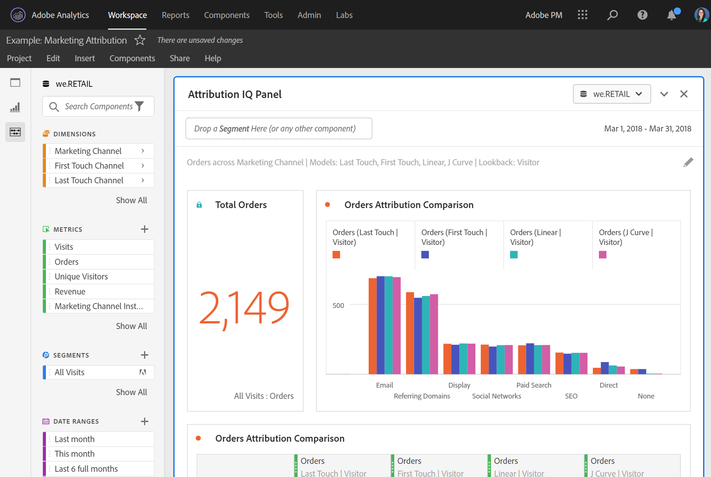

# Kuratprojekt

Med kurering kan du begränsa komponenterna (mått, mått, segment, datumintervall) innan du delar ett projekt. När en mottagare öppnar projektet visas en begränsad uppsättning komponenter som du har valt för dem. Kurering är ett valfritt men rekommenderas innan du delar ett projekt.

>[!NOTE]
> Produktprofiler är den primära mekanismen som styr vilka komponenter en användare kan se. De hanteras via Adobe Experience Cloud Admin Console. Curation är ett sekundärt filter.

Här är en video om projektplanering och -delning:

>[!VIDEO](https://video.tv.adobe.com/v/24711/?quality=12)

## Använd projektstrukturering

1. Klicka på **[!UICONTROL Share]** > **[!UICONTROL Curate Project Data]**.
De komponenter som används i projektet läggs automatiskt till.
   **Anteckning**: Om ett projekt har flera rapportsviter visas ett kuratefält för varje rapportserie i projektet.
1. (Valfritt) Om du vill lägga till fler komponenter drar du de komponenter du vill dela från den vänstra listen till [!UICONTROL Curate Components] fält.
1. Klicka på **[!UICONTROL Done]**.

Du kan också använda Kurva från [!UICONTROL Share] genom att klicka **[!UICONTROL Curate and Share]**. Med det här alternativet kurformas projektet automatiskt till de komponenter som används i projektet. Du kan lägga till ytterligare komponenter enligt stegen ovan.

## Kuraterad projektvy

När en mottagare öppnar ett välstrukturerat projekt visas endast den urval av komponenter som du har definierat:

## Ta bort projekturval

Så här tar du bort projektstrukturering och återställer alla komponenter i den vänstra listen:

1. Klicka på **[!UICONTROL Share]** > **[!UICONTROL Curate Project Data]**.
1. Klicka på **[!UICONTROL Remove Curation]**.
1. Klicka på **[!UICONTROL Done]**.

## VRS-kuration (Virtual Report Suite)

Om du vill använda kurser på rapportsvitnivå så att de gäller för många projekt samtidigt kan du [kuratera komponenter i en VRS (Virtual Report Suite)](https://experienceleague.adobe.com/docs/analytics/components/virtual-report-suites/vrs-components.html).

>[!NOTE]
> VRS-kurering används alltid före projektkurering. Detta innebär att även om ditt kuraterade projekt innehåller vissa komponenter, kommer de att filtreras bort om det aktuella VRS inte innehåller dem.

## Visa alla komponenter, alternativ

I ett välstrukturerat projekt eller VRS kan mottagaren välja att **[!UICONTROL Show All]** komponenter i den vänstra listen. [!UICONTROL Show All] visar olika uppsättningar av komponenter, beroende på:

* Användarens behörighetsnivå (admin eller icke-admin)
* Projektroll (ägare/redigerare eller inte)
* Typ av kuration som används (VRS eller projekt)
* Komponenter som ägs av eller delas med användaren. Ägda/delade komponenter omfattar segment, beräknade värden och datumintervall. De innehåller inte implementerade komponenter som eVars, props och anpassade händelser.

Obs! Roller som inte är administratörsvy har inte åtkomst till den vänstra listen i ett projekt, så de har utelämnats från tabellen nedan.

| Kurvtyp | Administratörer | Projektägare eller redigeringsroll som inte är administratör | Dubblettroll som inte är administratör |
|---|---|---|---|
| Kuraterad VRS | Alla VRS-komponenter som inte är kuraterade | Icke-förvaltade VRS-komponenter som den här rollen äger eller som har delats med dem | Icke-förvaltade VRS-komponenter som den här rollen äger eller som har delats med dem |
| Kuraterat projekt | Alla projektkomponenter som inte är kuraterade | Alla projektkomponenter som inte är kuraterade | Ej förvaltade projektkomponenter som den här rollen äger eller som har delats med dem |
| Kuraterat projekt i ett kuraterat VRS | Alla komponenter som inte är kuraterade, visas under **[!UICONTROL Non-Curated Project Components]** och **[!UICONTROL Non-Curated VRS Components]** | Alla icke-förvaltade projektkomponenter OCH icke-förvaltade VRS-komponenter som den här rollen äger eller som har delats med dem | Icke-förvaltat VRS och projektkomponenter som den här rollen äger eller har delats med dem |
