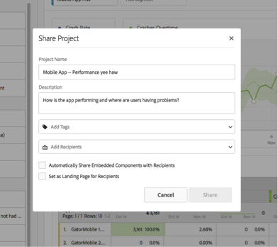

# Översikt över urval/delning

Med Kuration kan du begränsa komponenterna innan du delar ett projekt. Du kan dela ett projekt och dess komponenter med marknadsförare och andra icke-analytiker i din verksamhet. Anteckna och lägg till taggar i projekt.

**Videoöversikt**

>[!VIDEO](https://www.youtube.com/watch?v=LJJRskdmlOg&index=79&t=0s&list=PL2tCx83mn7GuNnQdYGOtlyCu0V5mEZ8sS)

**[!UICONTROL Workspace]** > **[!UICONTROL Share]**> **[!UICONTROL Curate Project Data]**

## Kuratera projektdata

1. Ange behörighet att skapa och strukturera projekt.

   Innan du skapar eller strukturerar ett Analysis Workspace-projekt måste administratörer lägga till dig i en [grupp](https://marketing.adobe.com/resources/help/en_US/reference/groups.html) med aktiverad **[!UICONTROL Analysis Workspace Access]** behörighet eller i **[!UICONTROL All Report Access]** användargruppen. ( **[!UICONTROL Admin]** > **[!UICONTROL User Management]** > **[!UICONTROL Groups]**).

1. [Skapa och spara](/help/analyze/analysis-workspace/build-workspace-project/t-freeform-project.md) ett projekt och klicka sedan på **[!UICONTROL Share]** > **[!UICONTROL Curate Project Data]**.
1. Dra de komponenter som du vill dela från den dragbara komponentstacken till vänster till **[!UICONTROL Curated Components]** fältet.

   

   >[!IMPORTANT]
   >
   >Kursiveringskomponenter krävs inte för att dela ett projekt. Du kan dela ett projekt med alla tillgängliga, standardkomponenter eller med de valda komponenterna. Om du vill bevara alla standardkomponenter i ett projekt är det bäst att skapa en kopia av ett projekt för dig själv (med **[!UICONTROL Save As]**) innan du strukturerar komponenterna. När du har valt komponenterna i ett projekt är de andra komponenterna inte längre tillgängliga för det projektet.

1. Klicka på **[!UICONTROL Done]**.

Det resulterande projektet fungerar som ett vanligt projekt i Analysis Workspace, men bara med de angivna komponenterna att välja bland.

## Dela ett välstrukturerat projekt

Delning gör det här projektet tillgängligt för andra Analysis Workspace-användare i organisationen. All kuration du har gjort återspeglas när andra använder projektet.

1. När du har valt komponenterna i en rapport klickar du på **[!UICONTROL Share]** > **[!UICONTROL Share Project]**.

   

1. Lägg till mottagare.
1. (Valfritt) Du kan dela inbäddade projektkomponenter (segment, beräknade värden och datumintervall) med alla mottagare. När komponenterna har delats visas de i komponentlistrutan på mottagarens arbetsyta.

   >[!IMPORTANT]
   >
   >Den här inställningen kvarstår inte - det är en enkel åtgärd vid tidpunkten för delningen.

1. Du kan också ange den här sidan som landningssida för mottagare.

   >[!IMPORTANT]
   >
   >Den här inställningen kvarstår inte - det är en enkel åtgärd vid tidpunkten för delningen.

1. Klicka på **[!UICONTROL Share]**.

<!-- 

 <b>Annotate and tag a project</b> 
 

An alternative way to collaborate on a project is to use the Information panel. This panel will be re-introduced in an upcoming release. 
 

 
 
<ul id="ul_EFD045FD9F3B4BF8A70637B00EE0BC9C"> 
 <li id="li_EC6C5EAF9C234E76BDA7FF0226B82083">Tag reports for sharing. </li> 
 <li id="li_CF6A438C55F847F8890F8CB674CAA4F7">Specify the recipient (filter by permission group or user name), the storage folder. In-product notifications let users know that they have a shared report waiting. </li> 
 <li id="li_C8E088DA43024277908705CB0F3A142A">Write messages or report descriptions for recipients. </li> 
 <li id="li_342EB4758C344B859757E23691068FA3"> Select the dimensions, metrics, and segments to recommend to a non-analyst colleague, who can view the report you are curating and sharing. Curating the component gives the recipient access to those components, based on their permission settings. </li> 
 <li id="li_6487500F9315481599B7F3897998879F"> Add suggested items to a previously configured report. These new items exist as recommended selectable options. </li> 
</ul>

 -->

