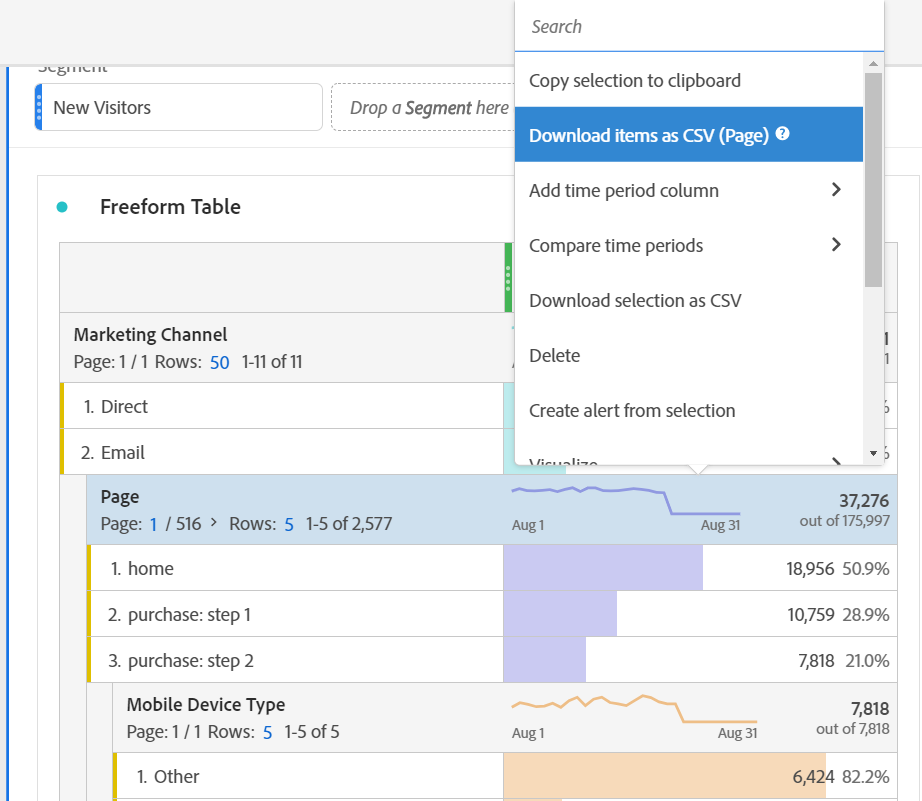
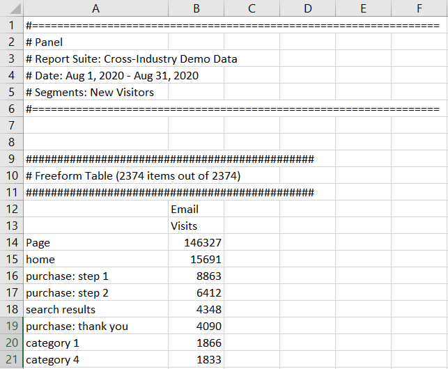

# Hämta PDF- eller CSV-filer

Det finns flera sätt att exportera data från Analysis Workspace. Vilken metod du väljer beror på vilken uppsättning data du vill analysera och vem som behöver komma åt den.

Exporterade data kan vara i form av kopierade data, CSV eller PDF. Ett PDF är att föredra om du vill att visualiseringar ska ingå i filen. CSV och kopierade data är att föredra om du bara vill ha oformaterade textdata.

## Hämta ett projekt som CSV eller PDF {#download-project}

1. Gör något av följande, beroende på vilket format du vill hämta projektet i:

   * **PDF:** Välj **[!UICONTROL Project]** > **[!UICONTROL Download PDF]**.

      Välj det här alternativet om du vill att den hämtade filen ska innehålla alla tabeller och visualiseringar som visas i projektet.

   * **CSV:** Välj **[!UICONTROL Project]** > **[!UICONTROL Download CSV]**.

      Välj det här alternativet om du vill ha oformaterade textdata.
   

1. (Villkorligt) Om du väljer att hämta ett PDF visas ett meddelande när projektet är klart att hämtas. Klicka [!UICONTROL **Hämta**].

När det gäller projektnedladdningar bör du tänka på följande:

* Projektet kan sparas eller inte sparas när du begär en projekthämtning. Endast sparade projekt kan dock [schemalagd](https://experienceleague.adobe.com/docs/analytics/analyze/analysis-workspace/curate-share/t-schedule-report.html).
* Det kan ta flera minuter att exportera PDF som hämtats i webbläsaren eftersom projektet körs på Adobe-servrar igen innan det återges i PDF. Vi rekommenderar att du inte lämnar projektet förrän PDF har hämtats i webbläsaren. Du kan dock fortsätta att ändra projektet medan du väntar. Om det tar längre tid än fem minuter att återge ett PDF uppmanas du att skicka det via e-post i stället.
* Nedladdningar från PDF återges som en sida utan sidnumrering.
* När ett projekt återges för PDF återger vi det som finns på sidan. Om ett projekt har visualiseringar och paneler i anpassad storlek måste du ändra dem så att de storleksändras automatiskt (knappen i det övre högra hörnet) så att det inte finns något trunkerat innehåll.

## Kopiera data till Urklipp (snabbtangent: Ctrl+C) {#copy-data}

Högerklicksalternativet **[!UICONTROL Copy to clipboard]** Med kan du snabbt kopiera data från arbetsytan och klistra in dem i ett verktyg från tredje part.

* Om du vill att den visade tabellen ska kopieras högerklickar du på tabellrubriken och väljer **Kopiera data till Urklipp**.
* Om du vill att en delmängd av data ska kopieras markerar du den i tabellen och högerklickar sedan > **Kopiera markering till Urklipp**.

>[!TIP]
>
>Du kan använda snabbtangenten `Ctrl+C` för att kopiera markeringen till Urklipp och sedan använda `Ctrl+V` för att klistra in den i ett verktyg från tredje part.

## Hämta data som CSV {#download-data}

Högerklicksalternativet **[!UICONTROL Download data as CSV]** Med kan du hämta en datatabell eller datakällan för en visualisering som en CSV-fil.

* Högerklicka och välj i huvudet på en tabell eller visualisering **[!UICONTROL Download data as CSV]**. Detta hämtar visade data i tabellen eller den underliggande datakällan för en visualisering som en CSV-fil.

   >[!NOTE]
   >
   >  Obs! Kartvyn stöder inte det här alternativet.

* Högerklicka i en tabell och välj **[!UICONTROL Download selection as CSV]**. Endast markeringen laddas ned med det här alternativet, i motsats till den fullständiga tabellen som visas.

## Hämta objekt som CSV {#download-items}

Om du vill analysera mer än de 400 synliga dataraderna i en tabell högerklickar du på tabellrubriken eller valfri rad och väljer **Hämta objekt som CSV (_Dimensionens namn_)**. Med det här alternativet exporteras upp till 50 000 dimensionsobjekt (baserat på tabellsortering) för den valda dimensionen, med filter och segment tillämpade. Om du väljer det här alternativet överst i tabellen exporteras den första dimensionen i tabellen. Även om inga begränsningar används i friformstabellen rekommenderar vi att alternativet Hämta objekt används i tabeller med mindre än 20 kolumner för att optimera prestandan.

>[!TIP]
>
> Om din dimension överstiger 50 000 objekt hämtar du filen med olika sorteringsmått tillämpade eller använder ett filter. Du kan t.ex. sortera efter besök i en nedladdning och sedan stigande efter besök i en andra nedladdning. Det här tipset kan hjälpa dig att hämta objekt med längre svans.

Du kan utföra flera uppgifter samtidigt i projektet och till och med navigera till ett nytt Workspace-projekt på samma flik medan hämtningen pågår. Hämtningen pausas om du öppnar en ny flik i webbläsaren. Hämtningen avbryts om du lämnar arbetsytan helt eller stänger webbläsarfliken.

### Nedladdad objektfil

Tabellens funktioner kommer att tillämpas på den hämtade filen enligt följande:

* Alla panelsegment används som filter.
* Uppdelningar **ovan** den valda dimensionen i tabellen används som filter ovanför varje kolumn.
* Uppdelningar **nedan** den valda dimensionen i registret tas bort.

I exemplet ovan hämtas sidobjekt med panelsegmentet (kunder med nya besökare) och komponenterna ovan (marknadsföringskanal = e-post) som filter, och komponenterna nedan (mobilenhetstyp) tas bort från den hämtade CSV-filen.

### Hämta meddelanden

När filen hämtas visas ett informationsmeddelande med förloppet. Du kan när som helst avbryta nedladdningen genom att klicka på **[!UICONTROL Cancel download]**. Stänger popup **inte** avbryt nedladdningen.

När filen är klar visas ett meddelande om att den är klar och filen hämtas till webbläsaren.

Om du begär mer än en nedladdning åt gången får du ett meddelande om att varje ytterligare nedladdning kommer att ställas i kö tills den tidigare nedladdningen är klar.

## Vanliga frågor och svar {#faq}

| Fråga | Svar |
| --- | --- |
| Varför är min nedladdade PDF-sida? | Arbetsytan sidnumrerar inte PDF som har laddats ned just nu. |
| Kan jag exportera mer än 50 000 objekt med alternativet &quot;Hämta objekt som CSV&quot;? | Varje nedladdning kan innehålla upp till 50 000 dimensionsobjekt, men du kan ändra sorteringsordningen i tabellen för att hämta längre slutobjekt eller använda ett filter för att hämta mer specifika objekt. |
| Vad gör **[!UICONTROL Copy visualization]** eller? | Ogilla [!UICONTROL **Kopiera data till Urklipp**] eller [!UICONTROL **Kopiera markering till Urklipp**], **[!UICONTROL Copy visualization]** högerklicksalternativet är inte ett exportalternativ. Du kan kopiera en visualisering eller panel från en plats i Workspace till en annan. Exempel: från en panel till en annan i samma projekt, eller från ett projekt till ett annat projekt. [Intralänkande video](https://experienceleague.adobe.com/docs/analytics-learn/tutorials/analysis-workspace/visualizations/intra-linking-in-analysis-workspace.html) |
