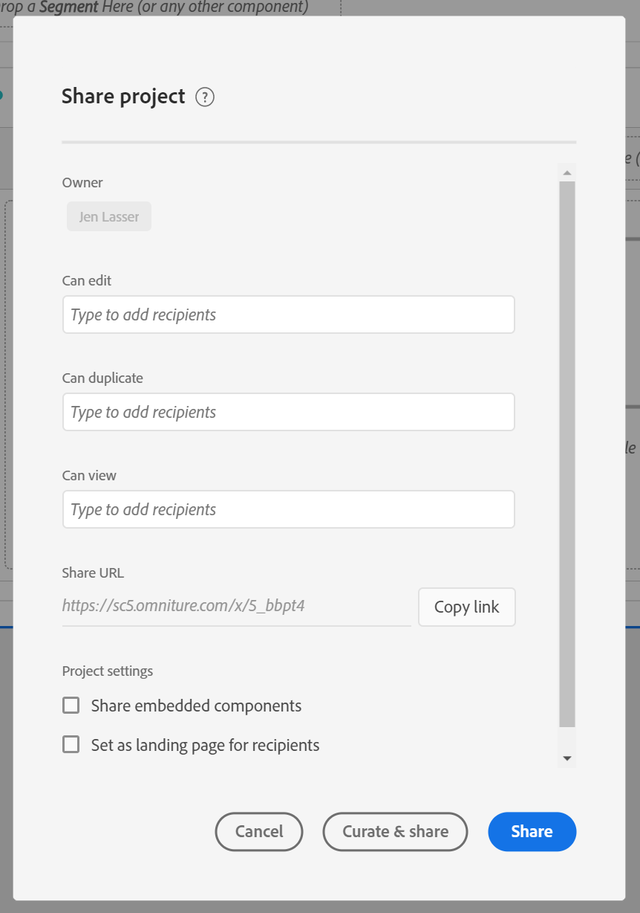

# Dela projekt {#share-projects}

>[!CONTEXTUALHELP]
>id="workspace_shareprojects"
>title="Dela projekt"
>abstract="Du kan dela dessa projektroller med andra användare i organisationen."

Du kan dela ett Analysis Workspace-projekt med följande typer av personer:

* Användare och grupper i organisationen som har tillgång till Adobe Analytics

  Du kan dela behörigheten Redigera, Duplicera eller Visa

* Användare och grupper i organisationen som inte har tillgång till Adobe Analytics

  Mottagarna har skrivskyddad åtkomst

* Personer utanför din organisation

  Mottagarna har skrivskyddad åtkomst

Alla [kurationer](curate.md) som du tillämpar före delning visas när mottagarna öppnar projektet.

>[!BEGINSHADEBOX]

Se  [Dela projekt](https://video.tv.adobe.com/v/36207?quality=12&learn=on){target="_blank"} för en demonstrationsvideo.

>[!ENDSHADEBOX]

## Dela med användare och grupper i organisationen {#Add}

Du kan dela ett projekt med befintliga Analysis Workspace-användare eller -grupper i din organisation. När du delar ett projekt enligt beskrivningen i det här avsnittet måste de användare du delar med redan ha tillgång till Adobe Analytics.

Du kan dela en specifik roll med användare eller grupper eller dela en länk.

* [Dela en specifik projektroll](#share-a-specific-project-role)

* [Dela en länk till ett projekt](#share-a-link-to-a-project)

## Dela en specifik projektroll

När du delar en specifik projektroll med användare och grupper i organisationen bör du tänka på följande:

* Projektroller (**[!UICONTROL Edit original]**, **[!UICONTROL Edit copy]** och **[!UICONTROL Read only]**) är kopplade till användaren och ett specifikt projekt-ID. Projektroller är oberoende av användarbehörigheter som hanteras i [Adobe Experience Cloud Admin Console](https://experienceleague.adobe.com/docs/core-services/interface/manage-users-and-products/admin-getting-started.html).

* I Adobe Analytics definieras grupper av produktprofiler i [Adobe Experience Cloud Admin Console](https://experienceleague.adobe.com/docs/core-services/interface/manage-users-and-products/admin-getting-started.html). Administratörer kan dela till vilken grupp som helst, inklusive&quot;Alla&quot;. Icke-administratörer kan dela till alla grupper som de är medlemmar i, med undantag för&quot;Alla&quot;.

* En användare som placeras i flera roller får alltid den högsta upplevelsen. Detta kan inträffa om en användare läggs till både som en individ och som en del av en grupp. Om en användare till exempel får rollen **[!UICONTROL Edit original]** som individ och rollen **[!UICONTROL Read only]** som medlem i en grupp får han/hon en **[!UICONTROL Edit original]**-projekterfarenhet.

* Administratörer som placerats i rollen **[!UICONTROL Edit copy]** eller **[!UICONTROL Read only]** får de begränsade upplevelserna när de öppnar ett projekt. En administratör kan ändra sin roll till **[!UICONTROL Edit original]** genom att dela projektet med sig själva och bevilja rollen **Redigera** enligt följande procedur.

* Om du väljer att dela flera projekt läggs mottagarna till i den befintliga listan med mottagare för varje projekt.

  Projekt A delas till exempel redan med mottagare 1, 2 och 3, medan projekt B redan delas med mottagare 4, 5 och 6.

  Projekten A och B delas sedan med mottagarna 4 och 7. Den nya resurslistan för projekt A är nu 1, 2, 3, 4 och 7, medan den nya resurslistan för projekt B är 4, 5, 6 och 7.

Så här delar du en specifik projektroll med användare eller grupper i organisationen:

1. I Adobe Analytics väljer du fliken [!UICONTROL **Workspace**] och sedan [!UICONTROL **Projekt**] i den vänstra listen.

1. Markera kryssrutan bredvid ett eller flera projekt som du vill dela och välj sedan [!UICONTROL **Dela**].

   eller

   Om du bara vill dela ett enskilt projekt kan du öppna det projekt som du vill dela och sedan välja **[!UICONTROL Share]** > **[!UICONTROL Share with Workspace users]**.
Om det finns ändringar som inte har sparats uppmanas du att spara projektet först.

   Dialogrutan Dela projekt visas. Avsnitten [!UICONTROL **Dela via länk**] och [!UICONTROL **Inställningar**] i dialogrutan visas bara när du delar ett projekt.

   

1. Lägg till mottagare eller grupper av mottagare i något av de tillhandahållna rollfälten:

   **Redigera original:** Mottagarna kan **[!UICONTROL Save]** ändra ett projekt och fungera som medägare. Den här rollen är användbar om du vill samhantera ett projekt med andra kollegor. Detta inkluderar redigering, borttagning och ändring av mottagarlistor för ett delat projekt.  Obs! Analysis Workspace stöder för närvarande inte live-samarbete, så vi rekommenderar att endast en användare redigerar ett projekt åt gången. Om projekt sparas samtidigt behålls den senaste versionen.

   **Redigera kopia:** Mottagarna kan **[!UICONTROL Save as]** och har tillgång till den vänstra listen. Projektinteraktioner är inte begränsade i den här rollen. Den här rollen är användbar om du vill dela ett projekt med användare som förstår organisationens data och hur du använder Analysis Workspace, men du inte vill att ditt projekt ska ändras.

   **Skrivskyddad:** Mottagarna kan inte **[!UICONTROL Save]** eller **[!UICONTROL Save as]** och har inte åtkomst till den vänstra listen. Projektinteraktionen är också begränsad. Den här rollen är användbar om du vill dela ett projekt med användare som inte är lika bekanta med organisationens datastruktur, Analysis Workspace eller Adobe Analytics i allmänhet. Men ni vill ändå att de ska konsumera data och insikter i en säker miljö. Läs mer om [Skrivskyddad projektupplevelse](/help/analyze/analysis-workspace/curate-share/view-only-projects.md).

1. (Villkorligt) Om du delar ett projekt ska du välja om du vill aktivera följande alternativ när du delar projektet:

   * **Dela inbäddade projektkomponenter:** Delar segment, beräknade värden och datumintervall med alla mottagare. När komponenterna har delats visas de i listrutan Komponenter i mottagarens Workspace. Den här inställningen kvarstår inte - det är en engångsåtgärd vid tidpunkten för delningen.

   * **Ange som startsida för mottagare:** Anger den här sidan som startsida för mottagare. Den här inställningen kvarstår inte - det är en engångsåtgärd vid tidpunkten för delningen.

1. Välj **[!UICONTROL Share]**. (Om projektet redan har delats väljer du [!UICONTROL **Uppdatera**].)

   eller

   Välj **[!UICONTROL Curate and Share]** om du vill använda projektkurering automatiskt. (Om projektet redan har delats väljer du **[!UICONTROL Curate & Update]**.) Läs mer om [projekturval](https://experienceleague.adobe.com/docs/analytics/analyze/analysis-workspace/curate-share/curate.html).

## Dela en länk till ett projekt

Tänk på följande när du delar en länk enligt beskrivningen i det här avsnittet:

* Mottagare som använder länken måste logga in på Adobe Analytics innan de kan komma åt projektet.

* Om en mottagare inte har tilldelats en roll och får en [delbar länk](https://experienceleague.adobe.com/docs/analytics/analyze/analysis-workspace/curate-share/shareable-links.html) till projektet får de som standard en roll. Administratörer får **[!UICONTROL Edit original]** och icke-administratörer får **[!UICONTROL Edit copy]**.

Så här delar du projektlänken med användare i din organisation:

1. Spara projektet. Om det finns ändringar som inte har sparats uppmanas du att spara projektet innan du delar en länk.

1. Välj **[!UICONTROL Share]** > **[!UICONTROL Share with Workspace users]** och välj sedan **[!UICONTROL Copy]** bredvid fältet **[!UICONTROL Share by link]**.

   

1. Dela länken med användare i organisationen. Du kan till exempel klistra in den i ett e-postmeddelande, på en intern webbplats och så vidare.

## Dela ett projekt med vem som helst (ingen inloggning krävs) {#share-public-link}

>[!CONTEXTUALHELP]
>id="workspace_share_with_anyone_require_aec_authentication"
>title="Kräv Experience Cloud-autentisering"
>abstract="Din organisation kräver att användare loggar in på Experience Cloud för att kunna använda den här länken."

Du kan ge [skrivskyddad åtkomst](/help/analyze/analysis-workspace/curate-share/view-only-projects.md) till Analysis Workspace-projekt till personer som inte har tillgång till Adobe Analytics. Detta kan omfatta:

* Personer utanför din organisation

* Personer i organisationen som inte har tillgång till Adobe Analytics

>[!NOTE]
>
>Tänk på följande när du delar ett Analysis Workspace-projekt med personer som inte har tillgång till Adobe Analytics:
>
>* Möjligheten att dela ett projekt på det här sättet kan inaktiveras av Analytics-administratören, vilket beskrivs i [Inställningar](/help/analyze/analysis-workspace/user-preferences.md). Om du inte kan dela ett projekt enligt beskrivningen i det här avsnittet har Analytics-administratören inaktiverat den här möjligheten.
>
>* Projekt med fler än 50 utökade visualiseringar kan inte delas med personer som inte har tillgång till Adobe Analytics.
>
>* Användare som du delar projektet med kan visa alla filter som har tillämpats på projektet under [kurationen](curate.md).
> 
>* Användare som du delar med kan ändra projektets datumintervall. Datumintervallet som du anger för projektet visas som standard.
>
>* Ett projekt kan bli oåtkomligt om många användare försöker få åtkomst till en viss länk samtidigt. Som standard har fler än 190 personer tillgång till en enda länk var femte minut. Om din organisation når den gränsen väntar du i fem minuter och försöker sedan att få åtkomst till länken igen.

>[!BEGINSHADEBOX]

Se  [Dela en länk med vem som helst](https://video.tv.adobe.com/v/3420093?quality=12&learn=on){target="_blank"} för en demonstrationsvideo.

>[!ENDSHADEBOX]

Så här delar du ett Analysis Workspace-projekt med personer som inte har tillgång till Adobe Analytics:

1. Öppna det Analysis Workspace-projekt som du vill dela.

1. Klicka på **[!UICONTROL Share]** > **[!UICONTROL Share with anyone]**.

   Om det finns ändringar som inte har sparats uppmanas du att spara projektet.

   <!-- Add screen shot of new modal -->

1. Aktivera alternativet **[!UICONTROL Link is active]** om det inte redan är aktiverat.

   Om du väljer det här alternativet skapas en länk till projektet som kan delas med alla. Du kan när som helst inaktivera åtkomsten till projektet genom att inaktivera det här alternativet.

   Ägaren till projektet är också ägare till den här länken. Länkägarskap kan endast överföras till en annan användare när projektägarskap överförs, vilket beskrivs i [Överför användarresurser eller ange kontots förfallodatum](/help/admin/admin/user-management2/users-assets.md) i handboken för Analytics-administratörer.

1. Välj om du vill aktivera följande säkerhetsalternativ (det här alternativet kan styras av Analytics-administratören):

   * **[!UICONTROL Require Experience Cloud authentication]:**

     När det här alternativet är aktiverat är de enda användare som har åtkomst till projektet de användare som kan logga in på den Adobe Experience Cloud-organisation där det projekt som du delar skapades. De användare du delar med behöver dock inte ha tillgång till Adobe Analytics.

     Analysadministratörer kan konfigurera den här inställningen för företaget enligt beskrivningen i [Inställningar](/help/analyze/analysis-workspace/user-preferences.md). Följande scenarier kan visas beroende på hur administratören konfigurerade det här alternativet:

      * Om det här alternativet inte visas har Analytics-administratören inte aktiverat den här funktionen.

      * Om det här alternativet är aktiverat och nedtonat kräver din Analytics-administratör Experience Cloud-autentisering för alla som använder Analysis Workspace-projekt.

1. Klicka på ikonen **Kopiera länk**  bredvid fältet **[!UICONTROL Share with anyone (no login required)]** för att kopiera länken till systemets Urklipp.

1. Dela länken med de personer som du vill ska ha tillgång till projektet. Du kan till exempel klistra in länken i ett e-postmeddelande.

   Alla som du delar länken med kan visa Analysis Workspace-projektet.

1. (Valfritt) Du kan klicka på ikonen **Skapa ny länk**  för att ta bort åtkomst för användare som tidigare har fått en länk till projektet. En ny länk skapas som du kan dela med användare som du vill ska få åtkomst till projektet.

1. Välj **[!UICONTROL Close]** för att stänga delningsdialogrutan. Ändringarna sparas automatiskt.

## Visa projekt som delas med dig

När någon delar ett projekt med dig genom att [dela en specifik projektroll](#share-a-specific-project-role) får du åtkomst till de delade projekten på fliken [Projekt på analysstartsidan](/help/analyze/landing.md#navigate-the-projects-tab).

När någon delar ett projekt med dig genom att dela en länk (antingen från fliken [Dela projekt](#share-a-link-to-a-project) eller via länken [Dela med någon](#share-a-project-with-anyone-no-login-required)) måste du använda länken som delats med dig för att få åtkomst till projektet. Länken kan till exempel ha delats i ett e-postmeddelande, på en intern webbplats och så vidare.

## Dela inbäddade komponenter

Du kan dela de inbäddade komponenterna som är en del av ditt projekt.

>[!BEGINSHADEBOX]

Se  [Dela inbäddade komponenter](https://video.tv.adobe.com/v/24713?quality=12&learn=on){target="_blank"} för en demonstrationsvideo.

>[!ENDSHADEBOX]

## Vanliga frågor {#FAQs}

| Fråga | Svar |
| --- | --- |
| Vad händer om två redigerare sparar ett projekt samtidigt? | Ändringarna sammanfogas inte och den senast sparade projektversionen behålls. Analysis Workspace stöder för närvarande inte live-samarbete. |
| Vad händer om en mottagare placeras i en roll som enskild person och en annan roll som medlem i en grupp? | Om en mottagare placeras i flera roller får de alltid den högre upplevelsen. Om en mottagare till exempel får rollen **[!UICONTROL Edit original]** som individ och rollen **[!UICONTROL Read only]** som medlem i en grupp får han/hon en **[!UICONTROL Edit original]**-projekterfarenhet. |
| Vilken upplevelse får en mottagare om de öppnar en projektlänk? | Mottagarna får rollen som du placerade dem i den delade modala rollen. Om en mottagare inte har tilldelats någon roll och får en länk till projektet (**[!UICONTROL Share]** > **[!UICONTROL Share with Workspace users]** och sedan väljer **[!UICONTROL Copy]** bredvid fältet **[!UICONTROL Share by link]**) placeras de som standard i en roll. Administratörer får **[!UICONTROL Edit original]** och icke-administratörer får **[!UICONTROL Edit copy]**. |
