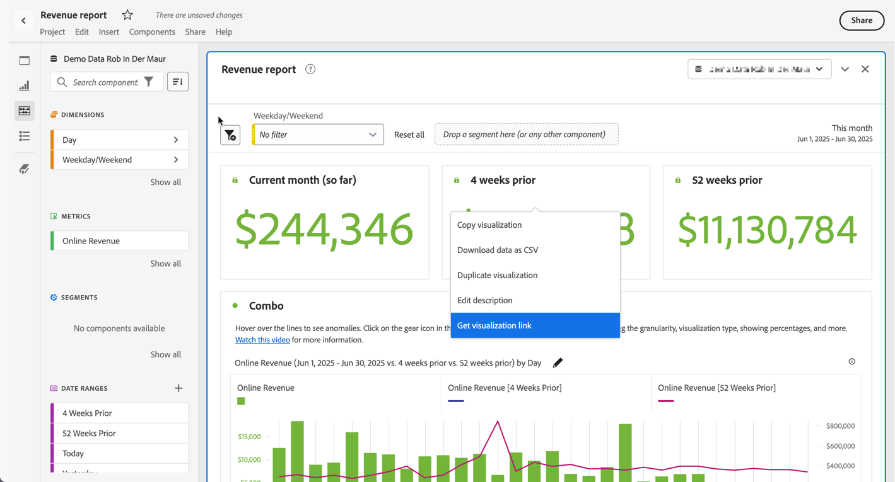

# Skapa delningsbara länkar

Analysis Workspace erbjuder många sätt att dela ett projekt med dina användare, bland annat möjligheten att få en länk till ett projekt eller en viss del av ett projekt. Vissa länktyper kräver att mottagaren loggar in på Adobe Analytics innan han eller hon kommer åt projektet, medan andra inte gör det.

## Få en projektlänk att dela med andra Workspace-användare {#project-link}

Om du vill dela en länk till ett projekt går du till det projekt du vill dela och väljer sedan Gå till **[!UICONTROL Share]** > **[!UICONTROL Get project link]** (eller **[!UICONTROL Share]** > **[!UICONTROL Share with Workspace users]** > **[!UICONTROL Share by link]**). Användare som du delar länken med måste logga in.

Om mottagaren av länken inte har tilldelats en [projektroll](/help/analyze/analysis-workspace/curate-share/share-projects.md) får administratörer **[!UICONTROL Edit original]** och icke-administratörer **[!UICONTROL Edit copy]**-upplevelser.

## Få en skrivskyddad länk att dela med vem som helst

Du kan dela en skrivskyddad länk till Analysis Workspace-projekt med personer som inte har tillgång till Adobe Analytics.

Mer information finns i [Dela med vem som helst](/help/analyze/analysis-workspace/curate-share/share-projects.md#share-a-project-with-anyone-no-login-required).

## Hämta en panel eller visualiseringslänk {#panel-link}

Du kan också dela en länk till en viss del av ett projekt, till exempel en panel eller en enskild visualisering. Detta kallas ibland för koncernintern länkning. Detta kan vara användbart för att dra användarnas uppmärksamhet till viktiga insikter i projektet.

* Välj **[!UICONTROL Get panel link]** på snabbmenyn för en panelrubrik
* Välj **[!UICONTROL Get visualization link]** på snabbmenyn för ett visualiseringshuvud

[Titta på videon](https://experienceleague.adobe.com/docs/analytics-learn/tutorials/analysis-workspace/visualizations/intra-linking-in-analysis-workspace.html) om hur du skapar länkar och använder dem för att dirigera mottagare till specifika delar av projektet.

## Använda länkar i en innehållsförteckning {#TOC}

Ett tips för att utnyttja de olika länkalternativen är att alltid inkludera en innehållsförteckning högst upp i ditt Workspace-projekt. I innehållsförteckningen kan du länka till andra relevanta projekt, särskilda paneler och specifika visualiseringar. Detta gör det enklare för projektmottagaren att navigera.

[Titta på videon](https://experienceleague.adobe.com/docs/analytics-learn/tutorials/analysis-workspace/navigating-workspace-projects/create-a-toc-in-analysis-workspace.html) om hur du skapar en innehållsförteckning med hjälp av länkar och Workspace RTF-redigerare.

<!--
# Create shareable links

Analysis Workspace offers many ways to share a project to your users, including the ability to get a link to a project or a specific part of a project. Some link types require the recipient to log in to Adobe Analytics before accessing the project, while others do not. 

## Get a project link to share with other Workspace users {#project-link} 

To share a link to a project, go to the project you want to share, then select go to [!UICONTROL **Share**] > [!UICONTROL **Share with Workspace users**] > [!UICONTROL **Share by link**]. Users you share the link with are required to log in. 

If the recipient of the link has not been assigned a [project role](https://experienceleague.adobe.com/docs/analytics/analyze/analysis-workspace/curate-share/share-projects.html), admins receive **[!UICONTROL Edit original]** and non-admins receive **[!UICONTROL Edit copy]** experiences.

## Get a read-only link to share with anyone

You can share a read-only link to Analysis Workspace projects with people who don't have access to Adobe Analytics. Users you share the link with are not required to log in. 

For more information, see "Share a project with anyone (no login required)" in the article [Share projects](/help/analyze/analysis-workspace/curate-share/share-projects.md).

## Get panel or visualization link {#panel-link} 

You can also share a link to a specific part of a project, such as a panel or individual visualization. This is sometimes referred to as intra-linking. This can be useful to draw your users' attention to key insights within the project.  

* From any panel header, right-click **[!UICONTROL Get panel link]** 
* From any table or visualization header, right-click **[!UICONTROL Get visualization link]** 

[Watch the video](https://experienceleague.adobe.com/docs/analytics-learn/tutorials/analysis-workspace/visualizations/intra-linking-in-analysis-workspace.html) on how to create links and use them to drive recipients to specific parts of your project. 

-->