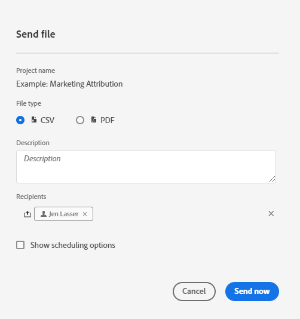

# Skicka och schemalägg projekt

Du kan skicka Adobe Analytics-projekt som filer till utvalda användare via e-post. Du kan skicka filer för hand eller konfigurera filer som ska skickas enligt ett schema.

Tänk på följande när du skickar filer:

* Filer kan skickas i CSV- eller PDF-format.

* Alla märkord som används i projektet används automatiskt vid exporten.

Det finns även andra metoder för att exportera Adobe Analytics-data, vilket beskrivs i [Översikt över export](/help/export/home.md).

## Skicka fil

Så här skickar du en fil ad hoc till mottagarna via e-post:

1. Välj **[!UICONTROL Share]>[!UICONTROL Send file]**.
1. Ange filtyp:
   * [!UICONTROL **CSV**]: Välj det här alternativet om du vill ha textdata.
   * [!UICONTROL **PDF**]: Välj det här alternativet om du vill att den hämtade filen ska innehålla alla tabeller och visualiseringar som visas i projektet.
1. (Valfritt) Använd **[!UICONTROL Description]** för att lägga till en beskrivning som ska inkluderas i e-postmeddelandet.
1. Lägg till mottagare eller grupper. Du kan även ange e-postadresser.
1. (Valfritt) Välj **[!UICONTROL Show scheduling options]** om du vill [schemalägga en filexport](#schedule-file-export).
1. Klicka på **[!UICONTROL Send Now]**. Välj **[!UICONTROL Cancel]** om du vill avbryta.

## Schemalägg filexport {#schedule}

Så här skickar du en fil enligt ett schema till mottagarna via e-post:

1. Välj **[!UICONTROL Share]>[!UICONTROL Schedule file export]**.
1. Ange filtyp:
   * [!UICONTROL **CSV**]: Välj det här alternativet om du vill ha textdata.
   * [!UICONTROL **PDF**]: Välj det här alternativet om du vill att den hämtade filen ska innehålla alla tabeller och visualiseringar som visas i projektet.
1. (Valfritt) Använd **[!UICONTROL Description]** för att lägga till en beskrivning som ska inkluderas i e-postmeddelandet.
1. Lägg till mottagare eller grupper. Du kan även ange e-postadresser.
1. (Endast för sjukvårdskunder) Ange ett lösenord för att [lösenordsskydda en schemalagd rapport](#password-protect-a-new-scheduled-project).
1. Kontrollera att **[!UICONTROL Show scheduling options]** är markerat.
1. Välj en **[!UICONTROL Frequency]**. Du kan välja mellan:

   | Frekvens | Alternativ |
   |---|---|
   | **[!UICONTROL Send hourly]** | Ange ett värde för **[!UICONTROL Send every number of hours]**. |
   | **[!UICONTROL Send daily]** | Välj en **[!UICONTROL Daily frequency]**: **[!UICONTROL Send every day]**, **[!UICONTROL Send every weekday]** eller **[!UICONTROL Custom frequency]**. Om du väljer **[!UICONTROL Custom frequency]** anger du ett värde för **[!UICONTROL Send every number of days]**. |
   | **[!UICONTROL Send weekly]** | Ange ett värde för **[!UICONTROL Send every number of weeks]**. Och välj en **[!UICONTROL Day of week]**. |
   | **[!UICONTROL Send monthly by day of the week]** | Välj **[!UICONTROL Day of week]** och **[!UICONTROL Week of month]**. |
   | **[!UICONTROL Send monthly by day of the month]** | Välj ett värde från **[!UICONTROL Send on this day of the month]**. |
   | **[!UICONTROL Send yearly by day of the month]** | Välj en **[!UICONTROL Day of week]**, markera en **[!UICONTROL Week of month]** och välj en **[!UICONTROL Monthly of year]**. |
   | **[!UICONTROL Send yearly by specific date]** | Välj en **[!UICONTROL Month of year]** och välj ett värde från **[!UICONTROL Send on this day of the month]**. |

1. Ange ett startdatum i **[!UICONTROL Starting on]**. Du kan också välja  om du vill välja ett startdatum från kalendern.

1. Ange ett slutdatum i **[!UICONTROL Ending on]**. Du kan också välja  om du vill välja ett slutdatum från kalendern.
1. Välj **[!UICONTROL Send on schedule]**. Välj **[!UICONTROL Cancel]** om du vill avbryta.

## Schemalagd projektledare {#manager}

Schemalagda Analysis Workspace-projekt kan hanteras från huvudgränssnittet med **[!UICONTROL Components]** > **[!UICONTROL Scheduled Projects]**. Mer information finns i [Schemalagda projekt](/help/components/scheduled-projects-manager.md).

<!--
# Schedule projects

From the Workspace **Share menu**, you can send Analysis Workspace projects using email to selected recipients. Files can be sent in CSV or PDF format. After you share scheduled projects, you can edit the schedule settings to modify the frequency, receipient list, or file type using the Scheduled Projects manager.

## Send file now

To send a file immediately to recipients via email:

1. Click **[!UICONTROL Share] > [!UICONTROL Export file]**.
1. Specify the file type:
   * [!UICONTROL **CSV**]: Choose this option if you want plain-text data.
   * [!UICONTROL **PDF**]: Choose this option if you want the downloaded file to contain all the displayed (visible) tables and visualizations in the project.
1. (Optional) Add a description to include in the email to explain the file being received. 
1. Add recipients or groups. Email addresses can also be entered. 
1. Click **[!UICONTROL Send Now]**.
1. (Optional) Click **[!UICONTROL Show scheduling options]** to specify a delivery schedule.

## Send file on schedule

To send a file on a recurring schedule to recipients via email:

1. Click **[!UICONTROL Share] > [!UICONTROL Schedule file export]**.
1. Specify the file type (CSV or PDF).
1. (Optional) Add a description that will be included in the email to explain the file being received. 
1. Add recipients or groups. Email addresses can also be entered. 
1. Specify the range the schedule should be delivered over by modifying Starting on and Ending on inputs. The end date must be within a year from the day the schedule is created or modified.
1. Specify the delivery frequency. Each frequency allows for different customizations. 
1. Click **[!UICONTROL Send on schedule]**.

## Manage scheduled projects

When you manage scheduled projects, you can edit and delete recurring project schedules:

*  Change the file type (.csv or PDF)
*  Update the project description
*  Add or remove recipients
*  Change the frequency

Scheduled Analysis Workspace projects can be managed under **Analytics > Components > Scheduled Projects**.

For more information, see [Scheduled projects](/help/components/scheduled-projects-manager.md)
-->
