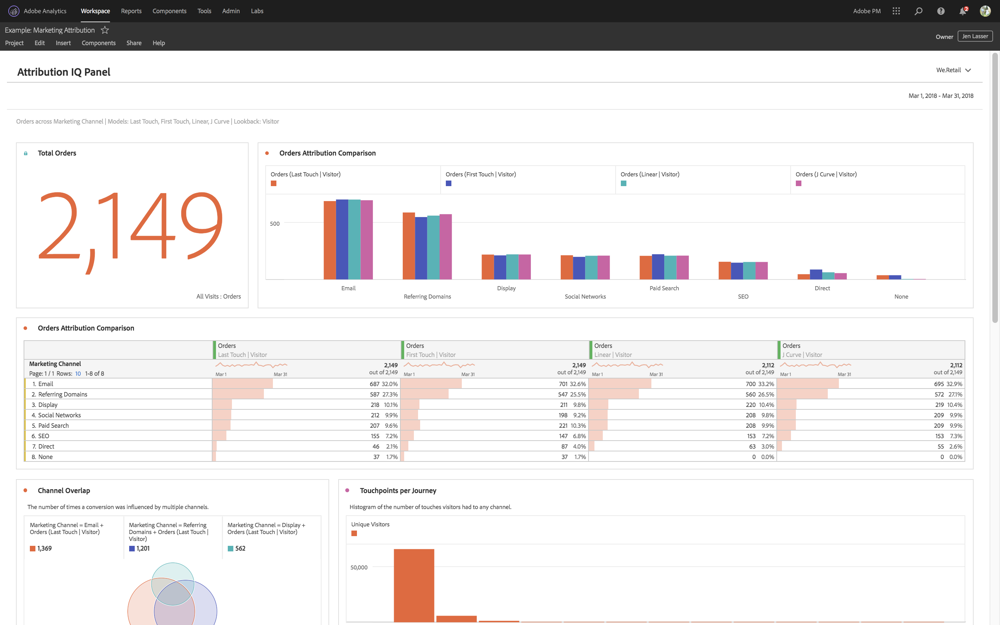

# projekt med endast visning

Du kan dela projekt som&quot;endast för visning&quot; till mottagare via arbetsflödet [Projektdelning](/help/analyze/analysis-workspace/curate-share/share-projects.md). Mottagare som placerats i rollen Kan visa får en mer begränsad projekterfarenhet. Detta kan vara önskvärt om du delar ett projekt med användare som inte är lika bekanta med organisationens datastruktur, Analysis Workspace eller Adobe Analytics i allmänhet, men ändå vill att de ska använda data och insikter i en säker miljö.

Observera att du kan redigera panelens datumintervall även i projekt som bara är för visning.

Här är en videoöversikt över projekt som bara är för visning:

>[!VIDEO](https://video.tv.adobe.com/v/36206/?quality=12)

## Inaktiverade interaktioner

Inaktiverade interaktioner i ett projekt som endast är synligt inkluderar:

* Dolt vänster spår
* Rapportsvit
* Frihandsfiltrering
* Frihandsnr för synliga rader
* Inställningar för frihandsrad, kolumn eller visualisering
* Panelsegment
* Redigera, Infoga och Komponentmenyer
* Workspace tips

## Aktiverade interaktioner

Några av de mer välkända interaktionerna i ett projekt med endast visning är:

| Område | Aktiverade interaktioner |
| --- | --- |
| Frihandsregister | <ul><li>Sidindelning och sortering</li><li>Hovring</li><li>Cellmarkeringar som uppdaterar länkade visualiseringar</li><li>Högerklicka > Hämta visualiseringslänk</li><li>Högerklicka > Kopiera till Urklipp</li></ul> |
| Visualiseringar | <ul><li>Klicka för att aktivera/inaktivera förklaring</li><li>Hovring</li><li>Högerklicka > Hämta visualiseringslänk</li><li>Komprimera/expandera</li><li>Flöde - expandera flödesnoder</li><li>Karta - zoom</li></ul> |
| Panel | <ul><li>Interaktiva nedrullningsbara filter</li><li>Högerklicka > Hämta panellänk</li><li>Komprimera/expandera</li></ul> |
| Projekt | <ul><li>Inspektera alla informationsikoner</li><li>Projektmeny - Nytt, Öppna, Ange som landningssida, Uppdatera, Hämta CSV/PDF, Begränsad projektinformation och inställningar</li><li>Dela-menyn - Hämta projektlänk, Skicka fil nu</li><li>Hjälpmenyn - Alla åtgärder förutom Tips och felsökningsalternativ</li></ul> |
