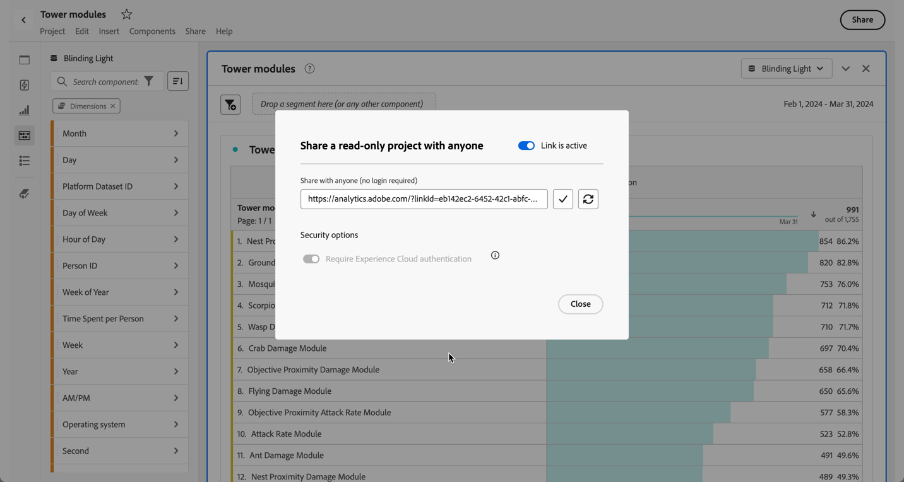

# Skrivskyddade projekt

Du kan dela projekt som skrivskyddade till mottagare via [delningsfunktionen](share-projects.md). Mottagare som placerats i rollen **[!UICONTROL Read only]** får en mer begränsad projekterfarenhet.

Detta kan vara önskvärt om du delar ett projekt med användare som inte är lika bekanta med organisationens datastruktur, Analysis Workspace eller Adobe Analytics i allmänhet, men ändå vill att de ska använda data och insikter i en säker miljö.

Interaktionen för de skrivskyddade mottagarna är begränsad.

## Inaktiverade interaktioner

Inaktiverade interaktioner i ett projekt som endast är synligt inkluderar:

* Dold vänster panel
* Panelkalenderns datumintervall. Obs! Om du vill ge mottagarna kalenderkontroll lägger du till i ett [nedrullningsbart segment med datumintervall](https://experienceleague.adobe.com/docs/analytics-learn/tutorials/analysis-workspace/using-panels/using-drop-down-filters.html).
* Frihandssegmentering
* Frihandsnr för synliga rader
* Inställningar för frihandsrad, kolumn eller visualisering
* Panelsegment
* Redigera, Infoga och Komponentmenyer
* Workspace tips

## Aktiverade interaktioner

Några av de mer välkända interaktionerna i ett projekt med endast visning är:

| Område | Aktiverade interaktioner |
| --- | --- |
| Frihandsregister | <ul><li>Sidindelning och sortering</li><li>Hovring</li><li>Cellmarkeringar som uppdaterar länkade visualiseringar</li><li>Från snabbmenyn > Hämta visualiseringslänk</li><li>Från snabbmenyn > Kopiera till Urklipp</li></ul> |
| Visualiseringar | <ul><li>Klicka för att aktivera/inaktivera förklaring</li><li>Hovring</li><li>Från snabbmenyn > Hämta visualiseringslänk</li><li>Komprimera/expandera</li><li>Flöde - expandera flödesnoder</li><li>Karta - zoom</li></ul> |
| Panel | <ul><li>Interaktiva nedrullningsbara segment</li><li>På snabbmenyn > Hämta panellänk</li><li>Komprimera/expandera</li></ul> |
| Projekt | <ul><li>Inspektera alla informationsikoner</li><li>Project menu - New, Open, Set as landing page, Refresh, Download CSV/PDF, limited Project Info &amp; Settings</li><li>Dela-menyn - Hämta projektlänk, Skicka fil nu</li><li>Hjälpmenyn - Alla åtgärder förutom Tips och felsökningsalternativ</li></ul> |

## Dela med vem som helst

Om du har valt ett projekt med [Dela med vem som helst](share-projects.md#share-a-project-with-anyone-no-login-required) kan mottagaren av länken bara visa projektet och inte interagera med projektet.

