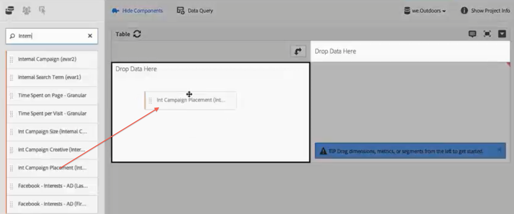
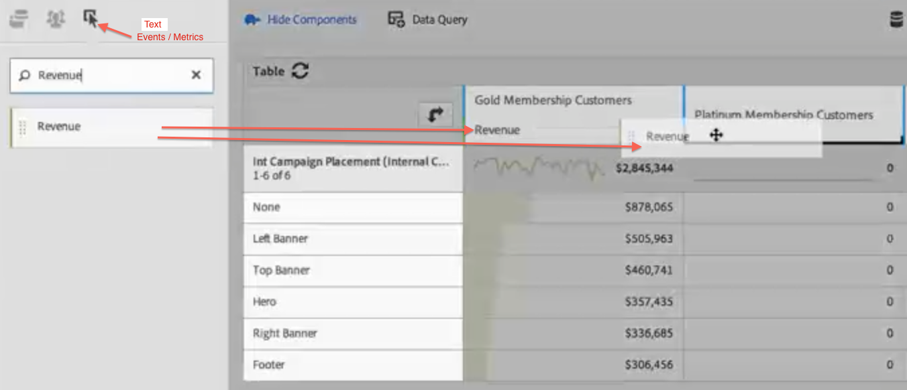
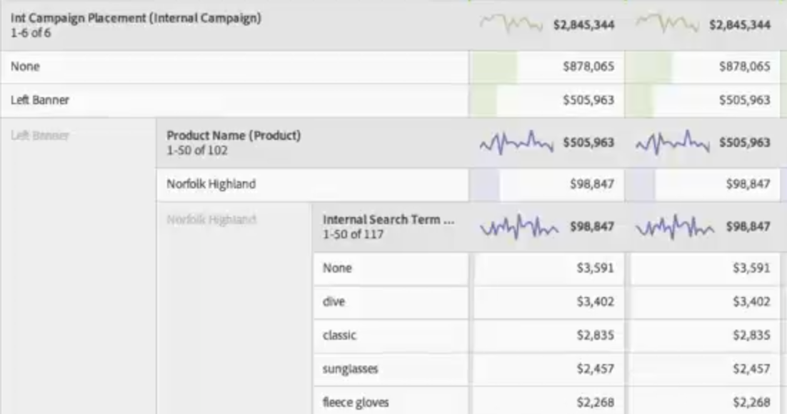

# Användningsområden för Analysis Workspace

Exempel på hur du använder datatabeller och segment samt förslag på användningsområden för Analysis Workspace.

Du kan rikta efterforskning mot data för att besvara specifika frågor och sammanställa berättelser om kundernas interaktioner och målgruppernas intressen. I den här friformsmiljön kan du använda mått, mätvärden och segment under en viss tidsperiod för att hämta måldata direkt. Utforma och anpassa analysen efter specifika frågor och publicera sedan information i omfattande rapporter och visualiseringar, som enkelt kan delas och tolkas även av de användare som är under tidspress.

**Exempel**

* Som medieföretag kanske ni vill jämföra nya besökare, återkommande besökare och de mest lojala besökarna för att se hur innehållskonsumtionen förändras över tid för varje segment.
* Jämför konverteringsgraderna för nyckelord med och utan varumärke.
* Dela upp sidvisningar efter intern sökning, extern sökning, landningssidor och så vidare för att förstå varför termer med och utan varumärke ger olika resultat.
* Jämför dag mot nästa dag för att jämföra kolumner eller rader och analysera tillväxten över flera mätvärden.
* Kör en enkel fråga, till exempel studsar per mått.

## Exempel för detaljhandlare {#section_9EFDEF038CAD4954BCFB118A8F33A96F}

Anta att du är marknadsföringsanalytiker hos en återförsäljare av friluftsutrustning och ska undersöka utfallet för en nyligen genomförd Thanksgiving-kampanj. Du ska dessutom ge din syn på hur webbkampanjerna kan förbättras. I det här exemplet visas hur du kan jämföra kampanjintäktsdata för olika segment och lägga till uppdelningar för att gå på djupet.

1. Välj önskad rapportsvit.
1. Sök till exempel efter måttet för interna kampanjplaceringar och dra det till den vänstra delen av tabellarbetsytan (dessa data utgör tabellraderna).

   

1. Klicka nu på segmentikonen längst upp till vänster och dra olika kundlojalitetssegment till den högra halvan av arbetsytan. Du ska jämföra segmenten med varandra direkt. Dessa utgör tabellkolumnerna.

   

1. Klicka på ikonen för händelser (mått) längst upp till vänster och lägg till intäktsmåttet under varje segment. Lägg märke till att rapporten genereras automatiskt. Nu kan du börja jämföra kampanjintäkterna för de här kundsegmenten.

   

1. Om du vill se vilka produkter som var mest effektiva på den vänstra bannerpositionen på sidorna kan du dela upp vänster banner efter produktnamn. Klicka bara på ikonen för mått och dra produktnamnsmåttet ovanpå vänster banner.

   

1. Men du kan fördjupa dig ännu mer. Du kan ta reda på vilka söktermer som människor använder för att hitta till er bästsäljande produkt, Norfolk Highland. Det enda du behöver göra är att dra måttet för intern sökterm ovanpå produktnamnet:

   

   Ett nytt uppdelningsresultat visas:

   

   Du har redan delat upp data på ett sätt som kan generera rekommendationer och merförsäljning som era säljteam kan implementera i andra kampanjer och öka företagets intäkter ännu mer. Du kan fortsätta att göra uppdelningar tills du får det resultat du vill ha.

   Nu kan du [dela](/help/analyze/analysis-workspace/curate-share/curate.md) rapporten med säljteamen.

