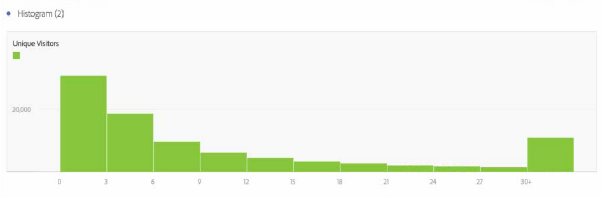
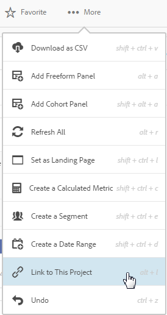
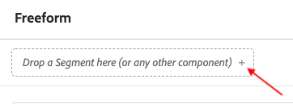

# Nyheter i Analysis Workspace

Om du vill få tillgång till versionsinformationen för Adobe Experience Cloud som helhet går du [hit](https://docs.adobe.com/content/help/sv-SE/release-notes/experience-cloud/current.html).

## Februari 2021

| Funktion | Måldatum | Beskrivning |
| --- | --- | --- |
| Komponentval | 4 februari 2021 | Den nedrullningsbara eller släppzon-komponent som finns i [!UICONTROL Quick Insights] kommer att läggas till i alla släppzoner i [!UICONTROL Workspace]. Den här förbättringen gör att du kan välja från en nedrullningsbar lista med kompatibla komponenter eller fortsätta att använda utrymmet som en släppzon. |

## Januari 2021

| Funktion | Måldatum | Beskrivning |
| --- | --- | --- |
| Bild-URL:er | 14 januari 2021 | Du kan lägga till bilder i arbetsyteprojekt genom att referera till en offentlig bild-URL. |
| Kombinerad käll- och inställningshanterare för visualiseringar | 14 januari 2021 | Hanteraren för [!UICONTROL Data Source] (punkt) och inställningar (kugghjulet) för visualiseringar har kombinerats till en enda leverantör, så att du enkelt kan hantera källan och inställningarna från samma plats. |

## Oktober 2020

| Funktion | Beskrivning |
| --- | --- |
| Linjevisualisering: [Alternativ för glidande medeltrendlinje](https://docs.adobe.com/content/help/en/analytics/analyze/analysis-workspace/visualizations/line.html) | **[!UICONTROL Moving average]** har lagts till i  [!UICONTROL Line] visualiseringens trendlinjeinställningar. Ett glidande medelvärde kallas även för ett rullande medelvärde och använder ett visst antal datapunkter (som bestäms av en **[!UICONTROL Periods]**-markering), jämför dem och använder medelvärdet som en punkt på raden. |
| [Hjälpsida för prestanda](https://docs.adobe.com/content/help/en/analytics/analyze/analysis-workspace/workspace-faq/optimizing-performance.html) | På hjälpsidan för Analysis Workspace prestanda visas olika faktorer som påverkar projektets prestanda och länkar till tips för optimering. |

## September 2020

| Funktion | Beskrivning |
| --- | --- |
| [Ladda ned 50 000 artiklar för en enda dimension](https://docs.adobe.com/content/help/en/analytics/analyze/analysis-workspace/curate-share/download-send.html#download-items) | Nu kan du ladda ned 50 000 objekt för en enda dimension i en friformstabell med segment och filter. Det ger dig åtkomst till mer än de 400 dataraderna utanför Analysis Workspace. |
| [Förbättringar av linjevisualisering](https://docs.adobe.com/content/help/en/analytics/analyze/analysis-workspace/visualizations/line.html) | <ul><li>Du kan visa eller dölja X-axeln och Y-axeln för alla [!UICONTROL Line]-visualiseringar. Detta kan vara praktiskt när dina [!UICONTROL Line]-visualiseringar är mer kompakta.</li><li>Du kan lägga över en etikett för minsta och högsta värde på alla linjevisualiseringar för att snabbt markera toppar och dalar i ett mätresultat.</li><li>Du kan täcka över olika regressionstrendlinjer på alla linjevisualiseringar för att lättare se trenden i data. Alternativen är [!UICONTROL Linear], [!UICONTROL Logarithmic], [!UICONTROL Exponential], [!UICONTROL Power] och [!UICONTROL Quadratic].</li></ul> |
| Nya datumintervall | Vi har lagt till fem nya datumintervall så att du kan välja mellan datumintervall som inte innehåller data för delar av dagen från idag: De senaste 7 fullständiga dagarna, de senaste 14 fullständiga dagarna, de senaste 30 fullständiga dagarna, de senaste 60 fullständiga dagarna, de senaste 90 fullständiga dagarna |

## Augusti 2020

Inga nya funktioner släpptes i augusti 2020.

## Juli 2020

Ny funktion släppt 16 juli 2020.

| Funktion | Beskrivning |
| --- | --- |
| Nya förinställningar för datumintervall | Fyra nya datumintervall har lagts till: ([!UICONTROL This week/month/quarter/year (excluding today)]). På så sätt kan du välja från datumintervall som inte innehåller data för delar av dagen från och med idag. |

## Juni 2020

Nya funktioner som släpptes 18 juni 2020.

| Funktion | Beskrivning |
|--- |--- |
| Attribution IQ: Algoritmisk attribuering | I modellen för algoritmisk attribuering i Analysis Workspace används statistiska tekniker för att dynamiskt fastställa den optimala kreditfördelningen för det valda måttet. Tillgängligt för kunder som har Adobe Analytics Ultimate. [Läs mer …](https://docs.adobe.com/content/help/en/analytics/analyze/analysis-workspace/attribution/algorithmic.html) |
| Attribution IQ: Anpassade uppslagsfönster | Nu kan du konfigurera alla attribueringsmodeller i Attribution IQ så att de omfattar kontaktytor från upp till 90 dagar före rapporteringsperioden. Detta ökar vanligen attribueringens exakthet för händelser som inträffar tidigt under rapporteringsperioden genom att redovisa interaktioner som inträffat under föregående månad(er). Tillgängligt för kunder som har Adobe Analytics Foundation, Select, Prime, Premium, Premium Attribution, Premium Complete och Ultimate. [Läs mer …](https://docs.adobe.com/content/help/en/analytics/analyze/analysis-workspace/attribution/models.html#lookback-windows) |
| Projektroller för delade Workspace-projekt | När du delar ett Workspace-projekt kan du nu placera mottagare i en av tre projektroller, beroende på vilken funktion du vill att de ska ha: Edit, Duplicate och View. [Läs mer …](https://docs.adobe.com/content/help/en/analytics/analyze/analysis-workspace/curate-share/share-projects.html) |
| Skrivskyddade Workspace-projekt | Skrivskyddade Workspace-projekt kan delas med användare som Can view. När mottagare med View-behörighet öppnar det delade projektet får de en begränsad upplevelse där den vänstra listen saknas och interaktionen är begränsad. [Läs mer …](https://docs.adobe.com/content/help/en/analytics/analyze/analysis-workspace/curate-share/view-only-projects.html) |
| Möjlighet att samredigera Workspace-projekt | Mottagare som läggs till i rollen Can edit kan spara över ett projekt som har delats med dem. Detta gäller både administratörer och icke-administratörer. [Läs mer …](https://docs.adobe.com/content/help/en/analytics/analyze/analysis-workspace/curate-share/share-projects.html) |
| Uppdaterad tom panel | Den tomma panelen innehåller nu paneler och visualiseringar, vilket gör det enklare att välja det analysarbetsflöde som fungerar bäst för dig. |
| Panelen Snabbinformation (25 juni 2020) | Quick Insights ger vägledning till icke-analytiker och nya användare av Analysis Workspace så att de snabbt och enkelt kan lära sig att svara på affärsfrågor. [Läs mer...](/help/analyze/analysis-workspace/c-panels/quickinsight.md) |
| Panelen Analytics for Target i Workspace (25 juni 2020) | Med panelen Analytics for Target (A4T) kan du analysera dina Adobe Target aktiviteter och upplevelser i Analysis Workspace. [Läs mer …](/help/analyze/analysis-workspace/c-panels/a4t-panel.md) |
| Om sidan Arbetsyta | Sidan Om arbetsyta innehåller information om din Analysis Workspace-miljö, om Adobe Analytics-administratörer (om du behöver support) och ett sätt att ge produktfeedback. Den finns under Arbetsyta > Hjälp > Om arbetsyta. |

## Maj 2020

Nya funktioner släpptes 21 maj 2020.

| Funktion | Beskrivning |
|--- |--- |
| Bygg frihandstabeller automatiskt från ett tomt läge | Tidigare gick det inte att släppa komponenter direkt i ett tomt projekt eller en tom panel. du var tvungen att lägga till en friformstabell först. Nu kan du släppa komponenter direkt i ett tomt projekt eller en tom panel, och en frihandstabell skapas automatiskt i det format som rekommenderas. Dessutom har vi förbättrat hur blandade komponenttyper (som dimensioner och mätvärden) hanteras när de släpps i en tom frihandstabell tillsammans. |
| Tillgänglighetsförbättringar | Adobe Analytics-teamet har gjort flera tillgänglighetsförbättringar för Analysis Workspace, och har bland annat förbättrat stöd för tangentbordsnavigering, färgkontrast och skärmläsare. [Läs mer …](https://docs.adobe.com/content/help/en/analytics/analyze/analysis-workspace/workspace-faq/aw-accessibility.html) |

## April 2020

Ny funktion som släpptes 16 april 2020.

| Funktion | Beskrivning |
|--- |--- |
| Bygg automatiskt [!UICONTROL Freeform Tables] från ett tomt utgångsläge | Tidigare gick det inte att släppa komponenter direkt i ett tomt projekt eller på en tom panel, utan du var tvungen att lägga till en friformstabell först. Nu kan du släppa komponenter direkt i ett tomt projekt eller på en tom panel, så skapas en friformstabell automatiskt i det format som rekommenderas. Dessutom har vi förbättrat hur blandade komponenttyper (som mått och mätvärden) hanteras när de släpps tillsammans i en tom [!UICONTROL Freeform Table]. |

## Mars 2020

Nya funktioner som släpptes 12 mars 2020.

| Funktion | Beskrivning |
|--- |--- |
| Stöd för flera rapportsviter i Workspace | Nu kan du samla in data från flera rapportsviter i ett enda projekt och visa dem sida vid sida. [Läs mer …](https://docs.adobe.com/content/help/en/analytics/analyze/analysis-workspace/build-workspace-project/multiple-report-suites.html) |
| Mall för självstudiekurser | Den här nya standardmallen vägleder dig bland vanliga termer och steg när du skapar din första analys i Workspace. Den finns som en standardmall i det modala fönstret Nytt projekt och ersätter det exempelprojekt som finns idag för nya användare, som inte har andra projekt i sin lista. [Läs mer …](/help/analyze/analysis-workspace/build-workspace-project/starter-projects.md) |

## Februari 2020

Nya funktioner som släpptes 20 februari 2020.

| Funktion | Beskrivning |
|--- |--- |
| Ny Workspace-mall för organisationer som använder analys över olika enheter | Den här mallen visar hur effektivt funktionen för analys över olika enheter sammanfogar besök och utbildar dig om mått och mätvärden som är specifika för just den här analysen. En rapportsvit som har analys över olika enheter krävs. Mer information finns i [Konfigurera analys över olika enheter](https://docs.adobe.com/content/help/sv-SE/analytics/components/cda/cda-setup.html). |
| Nya kortkommandon i Workspace | <ul><li>Visa/dölj alla paneler: `alt + m`</li><li>Visa/dölj aktiv panel: `alt + ctrl + m`</li><li>Sök i vänster list: `ctrl + /`</li><li>Gå till nästa panel: `alt + Right Key`</li><li>Gå till föregående panel: `alt + Left Key`</li></ul>[Läs mer …](https://docs.adobe.com/content/help/en/analytics/analyze/analysis-workspace/build-workspace-project/fa-shortcut-keys.html) |
| Andra förbättringar av Workspace | <ul><li>När en panel eller visualisering släpps i Workspace växlar den vänstra listen nu automatiskt till komponenter för ett smidigare arbetsflöde.</li><li>Mallkomponenter kan nu användas direkt (till exempel taggas, anges som favoriter eller godkännas).</li><li>Filtrerade mätvärdes- och segmentlistor har en plusknapp för att lägga till en ny komponent om du inte hittar det du behöver.</li></ul> |
| Felsökare för Workspace | Felsökaren för Workspace har lagts till på menyn Hjälp för att göra det lättare att aktivera den för felsökning av begäranden. [Läs mer …](https://www.adobe.io/apis/experiencecloud/analytics/docs.html#!AdobeDocs/analytics-2.0-apis/master/reporting-tricks.md) |

## Januari 2020

Ny funktion som släpptes 16 januari 2020.

| Funktion | Beskrivning |
|--- |--- |
| [Verktyg för friformstabeller](https://docs.adobe.com/content/help/en/analytics/analyze/analysis-workspace/visualizations/freeform-table/freeform-table.html) | Med tabellverktyget aktiverat kan du dra och släppa i många mått, uppdelningar, mätvärden och segment för att skapa tabeller som besvarar mer komplexa affärsfrågor. Data uppdateras inte omedelbart. I stället uppdateras de när du klickar på **[!UICONTROL Build]**, vilket sparar tid när du väl vet vilken tabell du vill skapa. Dessutom har den här funktionen följande:<ul><li>**Förhandsgranskning**: Du kan förhandsgranska tabellformatet innan du lägger tid på att återge verkliga data.</li><li>**Inställningar för flexibla rader och uppdelning**: Du kan ange rad- och uppdelningsnivåer för alla måttrader. Tidigare användes standardvärden som inte gick att ändra förrän data returnerades.</li><li>**Uppdelning efter position**: Du kan ange att måttrader alltid ska _delas upp efter position_ i stället för _efter ett visst objekt_ (standard).</li><li>**Ordna statiska rader manuellt**: Du kan ordna statiska rader manuellt så att tabellraderna visas exakt som du vill ha dem. Tidigare kunde statiska rader bara sorteras efter en mätvärdeskolumn eller i bokstavsordning.</li></ul> |

## Oktober 2019

Förbättringar som släpptes 10 oktober 2019.

| Förbättring | Beskrivning |
|--- |--- |
| Uppdatering av totalsummor för friformstabeller | Friformstabeller innehåller nu två totalsummor, en **[!UICONTROL Table total]** och en **[!UICONTROL Grand total]**. Raden med tabellsumman avser de [rapportfilter](https://docs.adobe.com/content/help/en/analytics/analyze/analysis-workspace/visualizations/freeform-table/pagination-filtering-sorting.html) som används. Tidigare påverkades summorna bara av segmentering. [Läs mer](https://docs.adobe.com/content/help/en/analytics/analyze/analysis-workspace/visualizations/freeform-table/workspace-totals.html) Dessutom har alternativen **[!UICONTROL Show Totals]** och **[!UICONTROL Show Grand Total]** lagts till i **[!UICONTROL Column Settings]**. Med den här förändringen av totalsummor för friformstabeller uppdateras beroende visualiseringar (som länkade **[!UICONTROL Summary Number]**-visualiseringar) samt exporterade CSV- och PDF-data. |
| Alternativ för att ta bort ospecificerad/ingen | Möjligheten att enkelt ta bort ospecificerad/ingen har lagts till som ett alternativ i rapportfiltren. |
| Borttagning av lila komponenter för tidsperioder | Lila komponenter för tidsperioder (minut, timme, dag, vecka, månad, kvartal, år) har tagits bort. De lila tidskomponenterna har alltid fungerat på exakt samma sätt som deras motsvarande oranga mått, och den här förändringen förenklar det hela. Du **behöver inte göra något** om du tidigare har använt någon av de lila tidskomponenterna. Den här ändringen innebär även att det lila avsnittet **[!UICONTROL Time]** har bytt namn till **[!UICONTROL Date Ranges]**. |

## Augusti 2019

Förbättring som släpptes 8 augusti 2019.

| Förbättring | Beskrivning |
|--- |--- |
| Höjd objektgräns för listrutefilter från 50 till 200 | Vi höjde gränsen för det antal objekt som kan placeras i ett listrutefilter från 50 till 200. Den här förbättringen kommer till nytta i flera olika sammanhang, till exempel kan du nu lägga till alla länder (195) eller alla delstater och provinser i USA (52) i ett filter. |

## Juli 2019

Förbättringar som släpptes 18 juli 2019.

| Förbättring | Beskrivning |
|--- |--- |
| Förbättrad kohortanalys | Nya [inställningar för kohortanalys](https://docs.adobe.com/content/help/en/analytics/analyze/analysis-workspace/visualizations/cohort-table/t-cohort.html) har lagts till: <ul><li>Visa endast procent</li><li>Avrunda procent till närmaste heltal</li><li>Visa en rad genomsnittlig procent</li></ul> |
| Visa objekt från de senaste 18 månaderna | I den vänstra listen kan användarna nu _visa objekt från de senaste 18 månaderna_. Tidigare var den perioden högst 6 månader. Detta gör det enklare att jämföra med sidor eller kampanjer från föregående år, upp till för 18 månader sedan. |
| Ny Analysis Workspace-mall | Vi har lagt till en ny mall med namnet [Magento: marknadsföring och handel](https://docs.adobe.com/content/help/en/analytics/analyze/analysis-workspace/build-workspace-project/starter-projects.html) i Analysis Workspace. Den är särskilt utformad för Magentos e-handelskunder, men alla återförsäljare kan använda den för att få unika insikter i e-handelsverksamheten. |

## Juni 2019

Förbättring som släpptes 13 juni 2019.

| Förbättring | Beskrivning |
| --- |--- |
| Nya färdiga filter | Nya färdiga filter har lagts till i sökningen i den vänstra listen. Utöver det som redan finns (mått, mätvärden, godkända med mera) har vi lagt till nya filter, som beräknade värden, kundattribut, evariabler, egenskaper och video, för att det ska vara enklare att hitta de komponenter du behöver. |

## Maj 2019

Förbättring som släpptes 9 maj 2019.

| Förbättring | Beskrivning |
|--- |--- |
| En ny inställning har lagts till i inställningarna för flödesvisualisering: Inkludera upprepade förekomster. | [Flödesinställningar](/help/analyze/analysis-workspace/visualizations/c-flow/flow-settings.md) |

## April 2019

Förbättring som släpptes 11 april 2019.

| Förbättring | Beskrivning |
|--- |--- |
| Förbättringar av metodtips för optimering | [Optimera prestanda](/help/analyze/analysis-workspace/new-features-in-analysis-workspace.md) |

## Januari 2019

Nya funktioner och förbättringar som släpptes 17 januari 2019.

| Funktion | Beskrivning |
|--- |--- |
| [Kohortanalys](/help/analyze/analysis-workspace/visualizations/cohort-table/cohort-analysis.md) | Tack vare omfattande förbättringar av kohortanalys kan du:<ul><li>Använda segmentinkludering och returnera mätvärden separat. </li><li>Visa bortfall i stället för lojalitet.</li><li>Visa latenstabeller (förfluten tid före och efter en inkluderingshändelse).</li><li>Anpassa kohortmått (för att gruppera besökare baserat på en evariabel, inte bara tid).</li><li>Utföra en rullande kohortberäkning: beräkna lojalitet/bortfall baserat på tidigare tidsperiod, inte ursprunglig kohort. </li><li>Lägga till flera mätvärden i inkluderings- och returfält samt använda segment. (Beräknade värden stöds inte.)</li></ul> |
| [Visa densitet](/help/analyze/analysis-workspace/build-workspace-project/view-density.md) | Med den här nya inställningen kan du visa mer data på en enda skärm genom att minska den lodräta utfyllnaden i den vänstra listen, friformstabeller och kohorttabeller. Tillgängligt via Projekt > Projektinformation och inställningar. |
| [Stöd för flervärdesvariabler i Attribution IQ](attribution/overview.md) | Vissa mått i Analytics kan innehålla flera värden för en enda träff, till exempel listvariabler, produktvariabler, listegenskaper eller evariabler för försäljning. Med Analysis Workspace kan du använda Attribution IQ på alla dessa variabler på träffnivå. |
| Prestandaförbättringar | Snabbare visualisering av uppdelningar – projekt med många uppdelningar läses in snabbare. |

## November 2018

Nya funktioner och förbättringar som släpptes 1 november 2018.

| Funktion | Beskrivning |
|--- |--- |
| [Strukturering av virtuella rapportsviter (VRS) och projekt – förbättringar](/help/analyze/analysis-workspace/curate-share/curate.md) | De här ändringarna infördes i själva verket i oktober 2018. Vi har ändrat vilka komponenter som administratörer och icke-administratörer kan se i strukturerade Workspace-projekt och virtuella rapportsviter (VRS).   Tidigare kunde alla se icke-strukturerade komponenter när de klickade på Visa alla komponenter. Den här uppdateringen ger bättre kontroll över vilka komponenter som är synliga.  |

## Oktober 2018

Nya funktioner och förbättringar som släpptes 11 oktober 2018.

<table id="table_3DDC812B2F66416F868004416D248BF3"> 
 <thead> 
  <tr> 
   <th colname="col1" class="entry"> Funktion </th> 
   <th colname="col2" class="entry"> Beskrivning </th> 
  </tr> 
 </thead>
 <tbody> 
  <tr> 
   <td colname="col1"> 
<b>Hantering av panellistrutor</b> 
 </td> 
   <td colname="col2"> 
Vi har gjort några ändringar i hanteringen av panellistrutor, som introducerades i septemberversionen. När du högerklickar på listrutan kan du nu: 
 
    <ul id="ul_4BDEC66EEB2243628FE32B43E377E5BD"> 
     <li id="li_EF8277BE972540D3B2604D82BC7C0918">Ta bort en listruta (det här alternativet finns alltid). </li> 
     <li id="li_6A991208F2744274817DBE1E9D1B443F">Ta bort en etikett (om en etikett visas). </li> 
     <li id="li_5C1CFC465C2E41D2B35E8841EFDC82AA">Lägga till en etikett (om ingen etikett visas). </li> 
    </ul> </td> 
  </tr> 
  <tr> 
   <td colname="col1"> 
<b>Länkar i verktygstips för paneler och visualiseringar</b> 
 </td> 
   <td colname="col2"> 
Vi har lagt till länkar till relevanta videoklipp och relevant dokumentation i verktygstipsen för paneler och visualiseringar. 
 </td> 
  </tr> 
 </tbody> 
</table>

## September 2018

Nya funktioner och förbättringar som släpptes 13 september 2018.

<table id="table_137719BFA03C44A78FDE872DF8B228A4"> 
 <thead> 
  <tr> 
   <th colname="col1" class="entry"> Funktion </th> 
   <th colname="col2" class="entry"> Beskrivning </th> 
  </tr> 
 </thead>
 <tbody> 
  <tr> 
   <td colname="col1"> 
<b>Panellistrutor</b> 
 </td> 
   <td colname="col2"> 
Panelens släppzon har nu funktioner för listrutor. Med hjälp av listrutor kan slutanvändarna interagera med data i ett projekt på ett kontrollerat sätt. Exempel: Anta att du har flera versioner av ett projekt för landsspecifik rapportering. Nu kan du komprimera dessa projekt till ett enda projekt och lägga till en listruta för att välja land. 
 </td> 
  </tr> 
  <tr> 
   <td colname="col1"> 
<b>Färgpaletter</b> 
 </td> 
   <td colname="col2"> 
Nu kan du ändra det färgschema som används i Workspace genom att välja från en annan färgpalett eller ange en egen palett. Detta påverkar många saker i Workspace, bland annat de flesta visualiseringar. Det påverkar <b>INTE</b> sammanfattningsändringar, villkorsstyrd formatering i friformstabeller eller kartvisualiseringar. 
 
Obs! Stöd för färgpaletter har inte aktiverats för Internet Explorer 11. 
 </td> 
  </tr> 
  <tr> 
   <td colname="col1"> 
<b>Ny mall: Ljudkonsumtion</b> 
 </td> 
   <td colname="col2"> 
Läs mer i <a href="https://docs.adobe.com/content/help/sv-SE/media-analytics/using/media-reports/media-workspace-templates.html"  >Ljudanalys</a>. 
 </td> 
  </tr> 
 </tbody> 
</table>

## Augusti 2018

Nya funktioner och förbättringar som släpptes 9 augusti 2018.

<table id="table_DD77C02344414DCD9AC0A6A22E648B72"> 
 <thead> 
  <tr> 
   <th colname="col1" class="entry"> Funktion </th> 
   <th colname="col2" class="entry"> Beskrivning </th> 
  </tr> 
 </thead>
 <tbody> 
  <tr> 
   <td colname="col1"> 
<b>Stödlinjer för släppzoner</b> 
 </td> 
   <td colname="col2"> 
Med de här stödlinjerna blir det enklare att se vad varje dra och släpp-åtgärd kommer att göra. Om du till exempel håller markören över en kolumn visas saker som Lägg till, Ersätt, Filtrera efter och Uppdelning. 
 
Vi har även lagt till gula/röda stödlinjer som varnar dig om du försöker göra något som inte rekommenderas eller tillåts, som att stapla två mätvärden ovanpå varandra (vilket leder till ogiltiga data). 
 </td> 
  </tr> 
  <tr> 
   <td colname="col1"> 
<b>Alternativ för att lägga till en tom panel</b> 
 </td> 
   <td colname="col2"> 
Vi har lagt till ett plustecken (+) under startpanelen för att göra det enklare att lägga till fler paneler. 
 </td> 
  </tr> 
 </tbody> 
</table>

## Juli 2018

Nya funktioner och förbättringar som släpptes 19 juli 2018.

<table id="table_336E121310204DC492EA004F40830B0F"> 
 <thead> 
  <tr> 
   <th colname="col1" class="entry"> Funktion </th> 
   <th colname="col2" class="entry"> Beskrivning </th> 
  </tr> 
 </thead>
 <tbody> 
  <tr> 
   <td colname="col1"> 
<b> <a href="attribution/overview.md"  > Attribution IQ </a> </b> 
 </td> 
   <td colname="col2"> 
Med Attribution IQ kan du utföra mer avancerade och intelligenta analyser av marknadsföringen. De nya attribueringsmodellerna kan användas på mätvärden i Analysis Workspace (på alla tabeller och uppdelningar) och i beräknade mätvärden. En ny attribueringspanel ger bättre visualisering och jämförelse. 
 </td> 
  </tr> 
  <tr> 
   <td colname="col1"> 
<b> Förbättringar av den vänstra listen </b> 
 </td> 
   <td colname="col2"> 
Förbättringar av den vänstra listen som nu är mer intuitiv och lättanvänd: 
 
    <ul id="ul_087BEDF4338946DA857CD82CB69F98C2"> 
     <li id="li_C751AACAC60442DC93118F0819F8EEA7"> Funktionen Skapa (+) för komponenter (mätvärden, segment, datum) är i linje med rubrikerna. </li> 
     <li id="li_DE2EB184A02D4CE58C23F518DB85EFDD"> Längst ned i varje avsnittslista har ”+ Visa alla” lagts till för att tydligt tala om att det finns fler än fem alternativ. </li> 
     <li id="li_5208F3C6026647B09F4A85131B175175">Åtgärder (som att tagga och ange som favorit) har lyfts fram med ikoner när komponenter är valda. </li> 
     <li id="li_11E601488A844515928231E09889BC54">Estetiska förbättringar av användargränssnittet. </li> 
    </ul> </td> 
  </tr> 
  <tr> 
   <td colname="col1"> 
<b>Totalsummor för beräknade värden </b> 
 </td> 
   <td colname="col2"> 
När det är möjligt visas nu totalsummor för beräknade värden, inklusive procentvärden. 
 </td> 
  </tr> 
  <tr> 
   <td colname="col1"> 
<b>Ny förinställning för <a href="/help/analyze/analysis-workspace/components/calendar-date-ranges/calendar.md"  >datumintervall</a> </b> 
 </td> 
   <td colname="col2"> 
De senaste 13 fullständiga veckorna har lagts till i förinställningarna för datumintervall i Analysis Workspace. 
 </td> 
  </tr> 
 </tbody> 
</table>

## Juni 2018

Nya funktioner och förbättringar som släpptes 14 juni 2018.

<table id="table_57035A06D99447A6BE6ED825A648ED3F"> 
 <thead> 
  <tr> 
   <th colname="col1" class="entry"> Funktion </th> 
   <th colname="col2" class="entry"> Beskrivning </th> 
  </tr> 
 </thead>
 <tbody> 
  <tr> 
   <td colname="col1"> 
<b> <a href="/help/analyze/analysis-workspace/components/dimensions/view-dimensions.md"  > Kolumner för dynamiska mått </a> </b> 
 </td> 
   <td colname="col2"> 
Tidigare, när ett mått släpptes på en kolumn, visades de fem högsta värdena för icke-tidsmått (och 15 för tidsmått) och dessa värden var statiska (de fem värdena ändrades aldrig). 
 
Från och med nu visas som standard dynamiska värden i stället för statiska, men du kan omvandla dem till statiska värden vid behov. Andra saker att notera: 
 
    <ul id="ul_C802BC32CB084E30B4E58E9E90B9A63D"> 
     <li id="li_452466AB416F4737B532849C604BD4CC">Klicka på (i) för ett dynamiskt mått så visas rankningen (första av fem) och måttets typ. </li> 
     <li id="li_588F6199E38D47869AC855A4C2A4D1B7">När data uppdateras uppdateras kolumnerna för dynamiska mått så att de aktuella 5/15 måttobjekten visas. </li> 
     <li id="li_19D47638D4D94416B0DAD2B2FB835ABE">En kolumn för dynamiska mått som kopieras eller flyttas blir statisk. </li> 
     <li id="li_B95411689AE04774B7B9BA128F2DB96F">När du håller markören över en statisk måttkolumn visas en låsikon, som anger att måttet är statiskt. </li> 
    </ul> </td> 
  </tr> 
  <tr> 
   <td colname="col1"> 
<b>Modalt fönster med nya Workspace-funktioner </b> 
 </td> 
   <td colname="col2"> 
På samma sätt som med Dagens tips, som introducerades förra månaden, visar det här modala fönstret nya Workspace-funktioner första gången du loggar in på Workspace efter en ny version. 
 </td> 
  </tr> 
 </tbody> 
</table>

## Maj 2018

Nya funktioner och förbättringar som släpptes 10 maj 2018.

<table id="table_EE4C690A178B4F80BDAF2BB4424D6020"> 
 <thead> 
  <tr> 
   <th colname="col1" class="entry"> Funktion </th> 
   <th colname="col2" class="entry"> Beskrivning </th> 
  </tr> 
 </thead>
 <tbody> 
  <tr> 
   <td colname="col1"> 
<b>Dagens tips</b> 
 </td> 
   <td colname="col2"> 
Vi visar dagens tips (tillsammans med en kort videofilm) längst ned till höger i gränssnittet. De här tipsen bekantar dig med en mängd olika funktioner i Analysis Workspace. Du kan när som helst stänga de här tipsen eller öppna dem via Hjälp &gt; Tips. 
 
 
 </td> 
  </tr> 
  <tr> 
   <td colname="col1"> 
<b> <a href="/help/analyze/analysis-workspace/components/t-freeform-project-segment.md"  > Segmentmallar</a> och <a href="/help/analyze/analysis-workspace/components/apply-create-metrics.md"  >mallar för beräknade värden</a></b> 
 </td> 
   <td colname="col2"> 
I den vänstra listen visas nu segmentmallar och mallar för beräknade värden. 
 </td> 
  </tr> 
  <tr> 
   <td colname="col1"> 
<b>Möjlighet att rulla när du drar komponenter</b> 
 </td> 
   <td colname="col2"> 
Nu kan du rulla uppåt och nedåt medan du drar komponenter till en ny plats. 
 </td> 
  </tr> 
  <tr> 
   <td colname="col1"> 
<b>Ytterligare information om <a href="/help/analyze/analysis-workspace/virtual-analyst/c-anomaly-detection/view-anomalies.md"  >avvikelser</a></b> 
 </td> 
   <td colname="col2"> 
När du håller markören över en avvikelse i ett linjediagram visas nu datumet och det råa värdet för avvikelsen. 
 </td> 
  </tr> 
 </tbody> 
</table>

## April 2018

Nya funktioner och förbättringar som släpptes 12 april 2018.

<table id="table_B9E784CD14A1453EB360FCCDC612250F"> 
 <thead> 
  <tr> 
   <th colname="col1" class="entry"> Funktion </th> 
   <th colname="col2" class="entry"> Beskrivning </th> 
  </tr> 
 </thead>
 <tbody> 
  <tr> 
   <td colname="col1"> 
 <a href="/help/analyze/analysis-workspace/visualizations/freeform-table/column-row-settings/column-settings.md"  > Radbrytning av rubriktext är aktiverat som standard </a> 
 </td> 
   <td colname="col2"> 
Kolumninställningen att radbryta rubriktext är nu aktiverad som standard för friformstabeller. 
 </td> 
  </tr> 
  <tr> 
   <td colname="col1"> 
 <a href="/help/analyze/analysis-workspace/visualizations/freeform-table/column-row-settings/table-settings.md"  > Ny radinställning </a> 
 </td> 
   <td colname="col2"> 
Med den nya inställningen Beräkna procent per rad tvingas friformstabellen att beräkna cellprocenten för raden i stället för kolumnen. Detta är särskilt användbart när du vill ändra procentvärden, t.ex. hur en dimensionspost blandas med resten över tiden. Det är aktiverat som standard när du klickar på ikonen Visualisera. 
 </td> 
  </tr> 
  <tr> 
   <td colname="col1"> 
 <a href="/help/analyze/analysis-workspace/visualizations/freeform-analysis-visualizations.md#section_D3BB5042A92245D8BF6BCF072C66624B"  >Visualiseringsinställning för ”100 % staplad”</a> 
 </td> 
   <td colname="col2"> 
En ny inställning för områdesstaplade/staplade/horisontellt staplade visualiseringar förvandlar diagrammet till en ”100 % staplad” visualisering så att du kan uppskatta relativa proportioner. 
 
 
 </td> 
  </tr>
  <tr> 
   <td colname="col1"> 
 <a href="/help/analyze/analysis-workspace/virtual-analyst/overview.md"  > Avvikelseidentifiering och bidragsanalys</a> är nu bara tillgängliga via Analysis Workspace 
 </td> 
   <td colname="col2"> 
Avvikelseidentifiering och bidragsanalys har tagits bort från funktionerna för rapporter och analyser och är nu bara tillgängliga via Analysis Workspace. 
 
Tänk på att kunder som använder Adobe Analytics Select och Adobe Analytics Foundation bara har tillgång till avvikelseidentifiering på dagsnivå i Workspace. 
 </td> 
  </tr> 
 </tbody> 
</table>

## Mars 2018

Nya funktioner och förbättringar som släpptes 8 mars 2018.

<table id="table_580CF2C1322E4FB78870BE2B1F497B2F"> 
 <thead> 
  <tr> 
   <th colname="col1" class="entry"> Funktion </th> 
   <th colname="col2" class="entry"> Beskrivning </th> 
  </tr> 
 </thead>
 <tbody> 
  <tr> 
   <td colname="col1"> 
 <a href="/help/analyze/analysis-workspace/visualizations/freeform-table/column-row-settings/column-settings.md"  > Radbrytning av rubriktext </a> 
 </td> 
   <td colname="col2"> 
Nu kan du radbryta rubriktexten i friformstabeller så att rubrikerna blir mer lättlästa och tabellerna enklare att dela. Vi har lagt till ett alternativ i kolumninställningarna för att radbryta rubriktext. Detta är särskilt användbart för återgivning av PDF-filer och för mätvärden med långa namn. 
 </td> 
  </tr> 
  <tr> 
   <td colname="col1"> 
 <a href="/help/analyze/analysis-workspace/components/apply-create-metrics.md"  > Högerklicka för att skapa mätvärden </a> 
 </td> 
   <td colname="col2"> 
För att det ska bli enklare att snabbt skapa beräknade värden har vi lagt till Skapa mått från markering på högerklicksmenyn i friformstabeller. Det här alternativet visas när en eller flera rubrikkolumnceller är markerade. 
 </td> 
  </tr> 
  <tr> 
   <td colname="col1"> 
 <a href="/help/analyze/analysis-workspace/visualizations/map-visualization.md"  > Förbättringar av kartvisualiseringar </a> 
 </td> 
   <td colname="col2"> 
För att kunna visa jämförelser över perioder (till exempel år för år) i kartvisualiseringen har vi gjort följande förbättringar: 
 
    <ul id="ul_F570E6AB174C45788620CF50E2742A08"> 
     <li id="li_746E329037764644A9CCF79161C26350">Kartvisualiseringen kan nu visa negativa tal. Om du till exempel ritar upp ett årligt mätvärde kan kartan visa -33 % över New York. </li> 
     <li id="li_E05F0380627044E6A4E8A60C98494BF7">Med mätvärden av typen procent beräknar klustring det genomsnittliga procentvärdet. </li> 
     <li id="li_44C04306EA1B413E91B8256B340D5296">Ett nytt färgschema: positivt/negativt (grönt/rött) </li> 
    </ul> </td> 
  </tr> 
  <tr> 
   <td colname="col1"> 
 <a href="/help/analyze/analysis-workspace/build-workspace-project/starter-projects.md"  > Uppdateringar av anpassade mallar </a> 
 </td> 
   <td colname="col2"> 
För de senast släppta anpassade mallarna har vi gjort följande: 
 
    <ul id="ul_787F48253F454163B99F6DD50F199FE2"> 
     <li id="li_828DD547DDB54A81B9FFB9FE92790F6C">Lagt till en mallikon längst upp i projektet (nära titeln) för att göra det lättare att skilja mellan läget för mallredigering och när du använder en mall som startpunkt för ett projekt. </li> 
     <li id="li_EEAA4D115CB74A57BABD524B2561E0CC">Gett icke-administratörer möjlighet att skapa (spara som) och redigera mallar för Workspace-projekt, förutsatt att de har beviljats behörighet att skapa/strukturera projekt i Analysis Workspace. (Admin  &gt; Användarhantering &gt; Grupper &gt; Redigera behörighet för alla rapporter &gt; Anpassa Analytics-verktyg &gt; Skapa/strukturera projekt i Analysis Workspace). </li> 
    </ul> </td> 
  </tr> 
 </tbody> 
</table>

## Februari 2018

Nya funktioner och förbättringar som släpptes 8 februari 2018.

<table id="table_824BBE4A554B4DB092ADA9044383D0FA"> 
 <thead> 
  <tr> 
   <th colname="col1" class="entry"> Funktion </th> 
   <th colname="col2" class="entry"> Beskrivning </th> 
  </tr> 
 </thead>
 <tbody> 
  <tr> 
   <td colname="col1"> 
 <a href="/help/analyze/analysis-workspace/build-workspace-project/starter-projects.md#create-custom-template"  > Anpassade Workspace-mallar </a> 
 </td> 
   <td colname="col2"> 
Nu kan du skapa egna mallar i Workspace och spara dem så att andra användare i organisationen kan börja med data som är relevanta för dem. 
 </td> 
  </tr> 
  <tr>  
   <td colname="col2"> 
När du klickar på Nytt projekt öppnas ett nytt fönster, där du kan välja att börja från: 
 
    <ul id="ul_FE90E6B9AF334A029D66A43901F8FA0B"> 
     <li id="li_F1DFD9AE140C4E5B849D4C522D5968DB">ett tomt projekt, </li> 
     <li id="li_23BD391D68674C299858A97BFE10598B">en standardmall (inbyggd) i Workspace eller </li> 
     <li id="li_04D84FE375B84BF88843AA0D43A234BF">en anpassad Workspace-mall (se ovan). </li> 
    </ul> </td> 
  </tr> 
  <tr> 
   <td colname="col1"> 
Stöd för att kopiera genom att högerklicka 
 </td> 
   <td colname="col2"> 
Vi har lagt till ett högerklicksalternativ för att kopiera till Urklipp, så att du kan kopiera celler/tabeller på ett enhetligt sätt. 
 </td> 
  </tr> 
  <tr> 
   <td colname="col1"> 
 <a href="/help/analyze/analysis-workspace/visualizations/freeform-table/column-row-settings/column-settings.md"  > Förbättring av kolumnprocent </a> 
 </td> 
   <td colname="col2"> 
Procentandelen av totalsumman som visades i kolumner begränsades till 100 %, även när vissa scenarier ledde till rader på över 100 % av totalsumman (till exempel med medelvärden). 
 
Nu visas procenttal som är större än 100 % för ökad precision. Vi flyttar också det övre gränsvärdet till 1 000 % för att säkerställa att kolumnerna kan bli stora. 
 </td> 
  </tr> 
  <tr> 
   <td colname="col1"> 
 <a href="/help/analyze/analysis-workspace/visualizations/freeform-table/column-row-settings/column-settings.md#section_3DD847151DA14914888A70FC4FD7BDFB"  > Villkorsstyrd formatering aktiverat för uppdelningar </a> 
 </td> 
   <td colname="col2"> 
Användning av villkorsstyrd formatering (färger med mera) i friformstabeller aktiveras nu automatiskt för uppdelningar, såvida inte anpassade gränser har valts. 
 </td> 
  </tr> 
  <tr> 
   <td colname="col1"> 
Ändringar av <a href="/help/analyze/analysis-workspace/components/calendar-date-ranges/calendar.md"  > standardkalendervy</a> 
 </td> 
   <td colname="col2"> 
Som standard visar kalendern i Workspace nu den aktuella månaden och förra månaden i stället för den aktuella månaden och nästa månad. 
 </td> 
  </tr> 
  <tr> 
   <td colname="col1"> 
Förbättrade färger för hovring/markering i Workspace-tabeller 
 </td> 
   <td colname="col2"> 
Skillnaden mellan färgerna när du hovrar över en friformstabellcell och när du klickar på en cell har blivit tydligare. 
 </td> 
  </tr> 
 </tbody> 
</table>

## Januari 2018

Nya funktioner och förbättringar som släpptes 18 januari 2018.

<table id="table_7A2E678577F94BDABB1276C826E6554F"> 
 <thead> 
  <tr> 
   <th colname="col1" class="entry"> Funktion </th> 
   <th colname="col2" class="entry"> Beskrivning </th> 
  </tr> 
 </thead>
 <tbody> 
  <tr> 
   <td colname="col1"> 
Fler <a href="/help/analyze/analysis-workspace/visualizations/freeform-table/pagination-filtering-sorting.md"  >filtreringsalternativ</a> för måttobjekt i friformstabeller 
 </td> 
   <td colname="col2"> 
Dessa (avancerade) filtreringsalternativ för måttobjekt har lagts till (utöver de befintliga alternativen för ”innehåller” och ”innehåller inte”): 
 
    <ul id="ul_869B3E943E304C0282D56AD96BB79E18"> 
     <li id="li_81A49BA0CA3041C7AB892FAD2D129E5A">Innehåller alla termer </li> 
     <li id="li_2AB564F917844F82839A91949D0B684A">Innehåller valfri term </li> 
     <li id="li_16C7938EDC8F422EA006FB63F2881EF1">Innehåller frasen </li> 
     <li id="li_5130EBE9A7A54CCFA313F3C3C268B367">Innehåller inga termer </li> 
     <li id="li_861825154EDC49EBA57514FD0A2AE462">Innehåller inte frasen </li> 
     <li id="li_5364BFB73ECF4B92A6663693ABD4BCF5">Är lika med </li> 
     <li id="li_1EBF3119B6364842A35D39BAD645F4AF">Är inte lika med </li> 
     <li id="li_487886E0A6EC4245A0E85D2E8B4A20FB">Börjar med </li> 
     <li id="li_A73F54DFBAAB44D4A4134342A3124E47">Slutar med </li> 
    </ul> </td> 
  </tr> 
  <tr> 
   <td colname="col1"> 
 <a href="/help/analyze/analysis-workspace/visualizations/freeform-analysis-visualizations.md#section_05B7914D4C9E443F97E2BFFDEC70240C"  > Kopiera och klistra in visualiseringar/paneler </a> i paneler och projekt 
 </td> 
   <td colname="col2"> 
Du kan nu högerklicka och kopiera en visualisering eller panel och sedan klistra in (infoga) det kopierade elementet på en annan plats i projektet eller i ett annat projekt. 
 
Du kan använda den här funktionen för att skapa byggstenar – fördefinierade visualiseringar/paneler – som kan kopieras till andra projekt för att komma igång snabbare och med data som är specifika för ert företag. 
 </td> 
  </tr> 
  <tr> 
   <td colname="col1"> 
 <a href="/help/analyze/analysis-workspace/build-workspace-project/starter-projects.md"  > Nya mobilmallar för meddelanden och platser </a> 
 </td> 
   <td colname="col2"> 
Två nya projektmallar har lagts till: 
 
    <ul id="ul_2F5976C849474A2B8A6BCDA2559F2855"> 
     <li id="li_51B7830E062A4CFDBDF219C56249A733">En ny mobilprojektmall för meddelanden med fokus på appmeddelanden och push-meddelanden. </li> 
     <li id="li_D2FB258EF3AF4EB19CEB258D08F4EBBE">En ny mobilprojektmall för platser som innehåller en karta med platsdata. </li> 
    </ul> </td> 
  </tr> 
  <tr> 
   <td colname="col1"> 
Förbättrad storleksändring för kolumner 
 </td> 
   <td colname="col2"> 
När du ändrar storlek på den vänstra kolumnen behåller Workspace nu breddprocenten för övriga kolumner (och justerar inte bara nästa kolumnbredd till höger). Tack vare den här ändringen går det snabbare att skapa tabeller för både analys och delning. 
 </td> 
  </tr> 
  <tr> 
   <td colname="col1"> 
Visa <a href="/help/analyze/analysis-workspace/visualizations/freeform-table/freeform-table.md"  >400 rader</a> i en tabell 
 </td> 
   <td colname="col2"> 
Nu kan du visa 400 rader i en tabell (tidigare 200) för att kunna visa 365-dagarstrender. 
 </td> 
  </tr> 
  <tr> 
   <td colname="col1"> 
 Stöd för <a href="/help/analyze/analysis-workspace/visualizations/map-visualization.md"  >kartvisualisering</a> i PDF-format 
 </td> 
   <td colname="col2"> 
Kartvisualiseringen, som introducerades i oktober 2017, kan nu återges i PDF-format. 
 </td> 
  </tr> 
  <tr> 
   <td colname="col1"> 
 <a href="/help/analyze/analysis-workspace/home.md"  > Relativa internlänkar</a> när du kopierar/sparar som 
 </td> 
   <td colname="col2"> 
Tidigare när du kopierade ett projekt eller sparade som ledde alla internlänkar som sparades i projektet till det ursprungliga projektet, inte till det kopierade projektet. 
 
Internlänkarna är nu relativa till det projekt där de finns när du kopierar/sparar som. 
 </td> 
  </tr> 
  <tr> 
   <td colname="col1"> 
Bidragsanalys: <a href="https://docs.adobe.com/content/help/sv-SE/analytics/analyze/analysis-workspace/virtual-analyst/anomaly-detection/anomaly-detection.html"  >Tokenavisering</a> 
 </td> 
   <td colname="col2"> 
Om företaget har ett begränsat antal tokens för bidragsanalys visas nu en avisering i gränssnittet för Analysis Workspace när du konsumerar en token. Du får då veta hur många tokens ni har kvar.  
 
(Administratörsanvändare: Du kan begränsa vem som kan använda dessa tokens genom att redigera gruppbehörigheten. Behörigheten kallas för avvikelseidentifiering och bidragsanalys under Analytics &gt; Admin &gt; Användarhantering &gt; Redigera grupper &gt; Redigera behörighet för alla rapporter &gt; Anpassa verktyg i rapportsvit &gt;  Verktyg och rapporter.)  
 </td> 
  </tr> 
  <tr> 
   <td colname="col1"> 
CSV-filer med multibyte-tecken 
 </td> 
   <td colname="col2"> Mejlade CSV-filer som innehåller multibyte-tecken kan nu öppnas i MS Excel. </td> 
  </tr> 
  <tr> 
   <td colname="col1"> 
Ändringar av händelsenummer, evariabelnummer och egenskapsnummer 
 </td> 
   <td colname="col2"> 
Händelsenummer, evariabelnummer och egenskapsnummer som lades till i måttnamnen i den vänstra listen (2017) visas bara när du <b>söker</b> efter komponenten. 
 
(Gäller även verktyget för virtuella rapportsviter (VRS).) 
 </td> 
  </tr> 
  <tr> 
   <td colname="col1"> 
Ändringar av ingen/ospecificerad 
 </td> 
   <td colname="col2"> 
Ändrade hur Ingen/Ospecificerad fungerar i Analysis Workspace så att det överensstämmer med Rapporter och analyser, Segment Builder och menyn för dimensionsobjekt i Analysis Workspace. 
 
Det innebär att värdet visas som ospecificerat i stället för som inget i de flesta projekt i Analysis Workspace. 
 </td> 
  </tr> 
 </tbody> 
</table>

## November 2017

Ny funktion som släpptes 9 november 2017.

<table id="table_C502E81253634E6CBAE7F12C7B62F7B6"> 
 <thead> 
  <tr> 
   <th colname="col1" class="entry"> Funktion </th> 
   <th colname="col2" class="entry"> Beskrivning </th> 
  </tr> 
 </thead>
 <tbody> 
  <tr> 
   <td colname="col1"> 
Lista över inkompatibla komponenter 
 </td> 
   <td colname="col2"> 
Ibland ingår inte alla komponenter i ett projekt i rapportsviten. Det meddelande som då visas, ”Inkompatibel rapportsvit”, när du läser in ett projekt eller växlar till en rapportsvit visar nu vilka komponenter som inte är kompatibla. 
 </td> 
  </tr> 
 </tbody> 
</table>

## Oktober 2017

Nya funktioner som släpptes 26 oktober 2017.

<table id="table_892279F2B4AF4DB38C64AA9AFC5657A7"> 
 <thead> 
  <tr> 
   <th colname="col1" class="entry"> Funktion </th> 
   <th colname="col2" class="entry"> Beskrivning </th> 
  </tr> 
 </thead>
 <tbody> 
  <tr> 
   <td colname="col1"> 
 <a href="/help/analyze/analysis-workspace/visualizations/map-visualization.md"  > Kartvisualisering </a> 
 </td> 
   <td colname="col2"> 
Med den nya kartvisualiseringen kan du enkelt visa kundinteraktioner i deras rätta sammanhang. Från en makrovy (global) till en mikrovy (stad) kan du enkelt zooma in och ut ur olika hierarkinivåer i visualiseringen för att se användargrupper i olika regioner. 
 
Du kan visualisera platsdata via IP-adresser (för icke-mobila datauppsättningar) eller åskådliggöra latitud- och longituddata (för kunder som använder SDK:et för mobiler) i Analysis Workspace.  
 </td> 
  </tr> 
  <tr> 
   <td colname="col1"> 
 <a href="/help/analyze/analysis-workspace/visualizations/line.md"  > Nivåväljare för trendvisualiseringar </a> 
 </td> 
   <td colname="col2"> 
Nu kan du enkelt växla mellan olika tidsnivåer när måttet i datakällan är ett tidsmått. Du växlar via en listruta i visualiseringsinställningarna. 
 </td> 
  </tr> 
  <tr> 
   <td colname="col1"> 
 <a href="/help/analyze/analysis-workspace/components/t-freeform-project-segment.md"  > Fullständiga mått och händelser i släppzoner för segment </a> 
 </td> 
   <td colname="col2"> 
Tidigare kunde du bara släppa måttobjekt, datumintervall och segment i släppzoner för segment. Nu kan du släppa ett komplett mått eller en komplett händelse i en släppzon för segment. I båda fallen skapas träffsegmentet ”finns” av Analysis Workspace. 
 
Exempel: ”Träff där evariabel1 finns” eller ”Träff där händelse1 finns”. 
 
Obs! Du kan inte släppa beräknade värden i en segmentzon. Endast de mått/mätvärden som du kan bygga segment med kan användas med segmentzoner. 
 </td> 
  </tr> 
  <tr> 
   <td colname="col1"> 
 <a href="/help/analyze/analysis-workspace/visualizations/t-sync-visualization.md"  > Anslutna visualiseringar som visas i inställningarna för datakälla </a> 
 </td> 
   <td colname="col2"> 
Om det finns visualiseringar anslutna till en friforms- eller kohorttabell visas de anslutna visualiseringarna nu i den övre vänstra punkten (Inställningar för datakälla). Vid hovring markeras den länkade visualiseringen och om du klickar på den kommer du till den. 
 
Dessutom finns det en kryssruta för att visa/dölja datatabellen. 
 </td> 
  </tr> 
  <tr> 
   <td colname="col1"> 
 <a href="/help/analyze/analysis-workspace/home.md"  > Händelsenummer har lagts till i händelsenamnen i den vänstra listen </a> 
 </td> 
   <td colname="col2"> 
Redan innan oktober 2017 lades evariabelnummer och egenskapsnummer till i måttnamnen, och du kunde söka på dessa nummer. Nu fungerar det likadant med händelser också. 
 
Exempel: ”Prenumerationer” visas nu i den vänstra listen som ”Prenumerationer (händelse1)”. 
 
Tänk på följande: 
 
    <ul id="ul_5DF85C65F7004539949DDC4F23922296"> 
     <li id="li_A685834B4914460D87568583BB39C474">Händelsenumret visas inte i tabellen (för att titlarna ska vara korta). </li> 
     <li id="li_D742D04470244633900335B7F5A79FD9">För konsekvensens skull visas inte längre numren för egenskaper och evariabler i tabeller heller. </li> 
    </ul> </td> 
  </tr> 
  <tr> 
   <td colname="col1"> 
 <a href="/help/analyze/analysis-workspace/home.md"  > Färdiga mått sorteras logiskt som standard </a> 
 </td> 
   <td colname="col2"> 
Standardsorteringsordningen för vissa färdiga mått har uppdaterats i följande fall: 
 
    <ul id="ul_B9C0C761F39E43A4977EC028F4D4525C"> 
     <li id="li_FE72ADDCD32A4FF7907462726D6E7758">När de dras till en friformstabell. </li> 
     <li id="li_5D78DD0DCB7347AC85E260F53109010C">När de visas i den vänstra listen. </li> 
    </ul> 
Om till exempel ”Timme på dagen” släpps i en tabell sorteras den från 00:00–23:00. Du kan fortfarande välja att sortera efter valfri mätvärdeskolumn. 
 </td> 
  </tr> 
  <tr> 
   <td colname="col1"> 
 <a href="/help/analyze/analysis-workspace/virtual-analyst/c-anomaly-detection/view-anomalies.md"  > Möjlighet att låta konfidensintervall skala om diagram </a> 
 </td> 
   <td colname="col2"> 
Konfidensintervallet för avvikelseidentifiering skalar inte automatiskt y-axeln för en visualisering så att diagrammet blir mer läsbart. 
 
Du kan nu välja att låta konfidensintervallet skala diagrammet. 
 </td> 
  </tr> 
  <tr> 
   <td colname="col1"> 
 <a href="/help/components/c-alerts/alert-manager.md"  > Varningar: alternativet <b>Förnya</b> har lagts till</a> 
 </td> 
   <td colname="col2"> 
När en eller flera aviseringar har valts i Aviseringshanteraren kan du förnya dem genom att klicka på Förnya. 
 
Detta förlänger deras förfallodatum till ett år från den dag då användaren klickade på Förnya, oavsett deras ursprungliga förfallodatum. 
 </td> 
  </tr> 
  <tr> 
   <td colname="col1"> 
Förbättringar av användargränssnittet 
 </td> 
   <td colname="col2"> 
    <ul id="ul_645B43AC6F554353B887DD58F0AA86E8"> 
     <li id="li_05B16A84008E4DA3A5DE91AF3C942D55">Tom panel: Vi börjar nu med att lyfta fram alla visualiseringar du kan lägga till på panelen, till exempel karta, bortfall, flöde, histogram, kohort och venn. Du kan välja att spara den här panelen som standardstartläge för projekt. </li> 
     <li id="li_9F1ED138DB0E453DA6BD4B4A512492CC">Tack vare det nya utseendet på den vänstra listen syns paneler, visualiseringar och komponenter bättre och blir lättare att använda. </li> 
     <li id="li_5DF6177F0EFD4D4D9D432768DEA3F37D">Friformstabell: Tomma friformstabeller har nu en animerad GIF-fil som visar dra och släpp-funktionen i Analysis Workspace. </li> 
    </ul> </td> 
  </tr> 
 </tbody> 
</table>

## September 2017

Nya funktioner som släpptes 21 september 2017.

<table id="table_DC0DA93B8A3B481080FCB2BA8F985753"> 
 <thead> 
  <tr> 
   <th colname="col1" class="entry"> Funktion </th> 
   <th colname="col2" class="entry"> Beskrivning </th> 
  </tr> 
 </thead>
 <tbody> 
  <tr> 
   <td colname="col1"> 
 <a href="/help/analyze/analysis-workspace/components/dimensions/time-parting-dimensions.md"  > Tidsdelningsmått i Analysis Workspace </a> 
 </td> 
   <td colname="col2"> 
Färdiga mått som bygger på en tidsstämpel har lagts till i Analysis Workspace. Måtten omfattar: 
 
    <ul id="ul_9BDBC0B344504E85840040E493873A47"> 
     <li id="li_826A8CBF4FDB4C98AC176C7145C09DB2">Timme på dagen (t.ex. 01, 12, 15, 23) </li> 
     <li id="li_FD6AAD4D3F544224A757D8124F973BE5">AM/PM </li> 
     <li id="li_5CAE35FB8E3E490A8FCF72DF8AC619CC">Veckodag (t.ex. måndag, tisdag, onsdag) </li> 
     <li id="li_930DFC6BFCC740A392EC7FA859FF0E73">Helgdag/arbetsdag </li> 
     <li id="li_C09F8BF8C598498392732C183C5BB720">Dag i månaden (t.ex. 1, 2 t.o.m 30, 31) </li> 
     <li id="li_E80A8932C32B4410A9BC703090FB5CFF">Månad på året (t.ex. januari, februari, mars) </li> 
     <li id="li_67620F09B58244B2B17317E0DB97067A">Dag på året (t.ex. dag 1, dag 2) </li> 
     <li id="li_A96CD77357064FC19D92EFA8244560D6">Kvartal på året (t.ex. kv1, kv2) </li> 
    </ul> </td> 
  </tr> 
  <tr> 
   <td colname="col1"> 
 <a href="/help/analyze/analysis-workspace/visualizations/freeform-table/column-row-settings/column-settings.md"  > Hantera flera kolumner samtidigt i friformstabeller </a> 
 </td> 
   <td colname="col2"> 
Du kan nu ändra inställningarna för flera kolumner samtidigt. Markera bara flera kolumner och klicka på inställningsikonen för någon av dessa kolumner. Alla ändringar du gör gäller för alla kolumner där celler är markerade. 
 </td> 
  </tr> 
  <tr> 
   <td colname="col1"> 
 <a href="/help/analyze/analysis-workspace/visualizations/c-flow/multi-dimensional-flow.md"  > Flöde: märkning över flera mått </a> 
 </td> 
   <td colname="col2"> 
Tack vare en ny måttetikett längst upp i varje flödeskolumn är det nu mer intuitivt att använda flera mått i en flödesvisualisering. 
 </td> 
  </tr> 
  <tr> 
   <td colname="col1"> 
 <a href="/help/analyze/analysis-workspace/visualizations/histogram.md#section_09D774C584864D4CA6B5672DC2927477"  > Metod för träffräkning i histogram </a> 
 </td> 
   <td colname="col2"> 
Tidigare fanns det två beräkningsmetoder i en histogramvisualisering: besök och besökare (standard). 
 
Nu kan du använda en tredje beräkningsmetod, träff, som segmentbehållare. Förekomster används som mätvärde på y-axeln i friformstabellen. 
 </td> 
  </tr> 
  <tr> 
   <td colname="col1"> 
 Knappen Rensa alla för konfiguration av segmentjämförelse och bidragsanalys 
 </td> 
   <td colname="col2"> 
I stället för att ta bort varje element manuellt kan du nu rensa alla element i följande delar av Workspace: 
 
    <ul id="ul_73E06D64CDCA4E83B9FEC2FD99D41CD3"> 
     <li id="li_A51EF8FADFA04CC19FD79C1675597659"> <a href="/help/analyze/analysis-workspace/virtual-analyst/contribution-analysis/run-contribution-analysis.md#section_F6932F4BF74544B5872164E7B1E0C6FC"  > Uteslutna komponenter för bidragsanalys </a> </li> 
     <li id="li_30E612D5A7584484967260931DB9E30E"> <a href="/help/analyze/analysis-workspace/c-panels/c-segment-comparison/segment-comparison.md"> Uteslutna komponenter för segmentjämförelse </a> </li> 
    </ul> </td> 
  </tr> 
  <tr> 
   <td colname="col1"> 
 <a href="/help/analyze/analysis-workspace/visualizations/summary-number-change.md"  > Uppdaterade namn för visningstyperna sammanfattningsändring </a> 
 </td> 
   <td colname="col2"> 
Två befintliga alternativ för sammanfattningsändring har bytt namn för att förtydliga dem: 
 
    <ul id="ul_7301D1C73E72424F911EE8DAAD9247A0"> 
     <li id="li_89D94632E0C94263A84887AF5B360E27">Visa ändring &gt; Visa procentuell ändring </li> 
     <li id="li_D48EB4055019449DAF2998CB9A5D23DF">Visa differens &gt; Visa rådifferens </li> 
    </ul> </td> 
  </tr> 
  <tr> 
   <td colname="col1"> 
 <a href="/help/analyze/analysis-workspace/visualizations/summary-number-change.md"  > Utökade decimaler för förkortat sammanfattningsnummer/-ändringar </a> 
 </td> 
   <td colname="col2"> 
Tidigare visades visualiseringar av förkortade sammanfattningsnummer/-ändringar med 0 decimaler. 
 
Du kan nu välja 0–3 decimaler för att förbättra rapporterna. 
 </td> 
  </tr> 
 </tbody> 
</table>

## Augusti 2017

Nya funktioner som släpptes 17 augusti 2017.

<table id="table_C29887097C894B1C91AD7086F0DAEC73"> 
 <thead> 
  <tr> 
   <th colname="col1" class="entry"> Funktion </th> 
   <th colname="col2" class="entry"> Beskrivning </th> 
  </tr> 
 </thead>
 <tbody> 
  <tr> 
   <td colname="col1"> 
 <a href="/help/analyze/analysis-workspace/home.md"  > Tagga ett projekt när du sparar </a> 
 </td> 
   <td colname="col2"> 
Du kan nu lägga till taggar i ett projekt när du sparar det. 
 </td> 
  </tr> 
  <tr> 
   <td colname="col1"> 
 <a href="/help/analyze/analysis-workspace/build-workspace-project/freeform-overview.md"  > Taggkolumn på sidan med projektlistan </a> 
 </td> 
   <td colname="col2"> 
En taggkolumn har lagts till på sidan med Workspace-projekt. I den här kolumnen visas taggarna för varje projekt. 
 </td> 
  </tr> 
  <tr> 
   <td colname="col1"> 
 <a href="/help/analyze/analysis-workspace/visualizations/c-flow/flow.md"  > Exportera flödesvisualiseringar som CSV-filer </a> 
 </td> 
   <td colname="col2"> 
Du kan ladda ned flödevisualiseringar som CSV-filer, så att du kan analysera flödesresultatet i Microsoft Excel (visualiserat som en tabell) eller någon annanstans. 
 </td> 
  </tr> 
  <tr> 
   <td colname="col1"> 
 <a href="/help/components/c-alerts/intellligent-alerts.md"  > Intelligenta aviseringar: Ytterligare konfidensintervall </a> 
 </td> 
   <td colname="col2"> 
För aviseringar som bygger på avvikelseidentifiering har två nya konfidensintervall (99,75 % och 99,90 %) lagts till. Standardvärdena för vissa detaljurval har också ändrats: 
 
    <ul id="ul_EB1F07A4D2204D57B2DDD9838CE4F5D9"> 
     <li id="li_542AAACE703F4EBFBD91F11F5ABC2929">timme: nu 99,75 % </li> 
     <li id="li_D01E4598FB33473FAAC5D60441FD081B"> dagligen: nu 99 % </li> 
    </ul> </td> 
  </tr> 
 </tbody> 
</table>

## Juli 2017

Nya funktioner som släpptes 20 juli 2017.

<table id="table_64E3A9960F314E2F9FFC738696EACDF7"> 
 <thead> 
  <tr> 
   <th colname="col1" class="entry"> Funktion </th> 
   <th colname="col2" class="entry"> Beskrivning </th> 
  </tr> 
 </thead>
 <tbody> 
  <tr> 
   <td colname="col1"> 
<b> <a href="/help/analyze/analysis-workspace/visualizations/text.md"  > RTF-redigerare </a></b> 
 </td> 
   <td colname="col2"> 
Med denna kan du ändra inställningar för teckensnitt (fet, kursiv stil och så vidare) och hyperlänkar i textrutevisualiseringar och beskrivningar av paneler/visualiseringar. 
 </td> 
  </tr> 
  <tr> 
   <td colname="col1"> 
<b> <a href="/help/analyze/analysis-workspace/home.md#section_253EA04E067F4A29A8B54CE2B7631086"  > Internlänkning (snabbvisualiseringslänkar) </a></b> 
 </td> 
   <td colname="col2"> 
Med <b>internlänkning</b> kan du länka till specifika paneler och visualiseringar i ett projekt från en textruta, till exempel för att skapa en innehållsförteckning för ett projekt. Du kan dela dessa länkar på samma sätt som du delar projektlänkar för att dirigera någon till en viss visualisering eller panel i ett projekt. Nya högerklicksalternativ (Hämta panellänk och Hämta visualiseringslänk) har lagts till. 
 </td> 
  </tr> 
  <tr> 
   <td colname="col1"> 
<b> <a href="/help/analyze/analysis-workspace/visualizations/freeform-analysis-visualizations.md#section_94F1988CB4B9434BA1D9C6034062C3DE"  > Redigering av förklaringsetiketter </a></b> 
 </td> 
   <td colname="col2"> 
Du kan byta namn på serienamn i visualiseringsförklaringar (bortfall, område, områdesstaplad, stapel, staplad, ring, histogram, horisontell stapel, horisontellt staplade, linje, spridning och venn) så att de blir lättare att förstå. 
 
Redigering av förklaringar <b>gäller inte</b> för: treemap, punktdiagram, sammanfattningsändring eller -nummer, text, friform, histogram, kohort eller flödesvisualiseringar. 
 </td> 
  </tr> 
  <tr> 
   <td colname="col1"> 
<b> <a href="/help/analyze/analysis-workspace/visualizations/t-sync-visualization.md"  > Uppdaterad hantering av datakällor </a></b> 
 </td> 
   <td colname="col2"> 
Vi har förnyat hur datakällor (som driver visualiseringar) hanteras. Det finns inte längre några separata, dolda tabeller när du låser datakällan till en tabell. 
 
I stället behåller visualiseringen kopplingen till den tabell från vilken den skapades. Detta löser också ett fel med live-länkade tabeller där detaljnivån, efter att du ändrat den, ändå återgick till den gamla nivån nästa gång projektet lästes in. 
 </td> 
  </tr> 
  <tr> 
   <td colname="col1"> 
<b> <a href="/help/analyze/analysis-workspace/virtual-analyst/contribution-analysis/run-contribution-analysis.md"  > Möjlighet att markera en viss avvikelse </a></b> 
 </td> 
   <td colname="col2"> 
Avvikelsen lyfts nu fram med en blå punkt i bidragsanalysen och i de intelligenta aviseringar som är kopplade till den. Detta ger en tydligare bild av den avvikelse som analyseras. 
 </td> 
  </tr> 
  <tr> 
   <td colname="col1"> 
<b>Hämta projektlänk för Experience Cloud-inloggningar</b> 
 </td> 
   <td colname="col2"> 
När du tidigare loggade in med dina Experience Cloud-inloggningsuppgifter och navigerade till Analytics kunde du inte använda funktionen   Dela   &gt;  Hämta projektlänk . Vi har åtgärdat det här problemet. Du måste fortfarande spara projektet innan du kan klicka på alternativet. 
 </td> 
  </tr> 
  <tr> 
   <td colname="col1"> 
<b> <a href="/help/analyze/analysis-workspace/curate-share/t-schedule-report.md"  > Filter för utgångna projekt i hanteraren för schemalagda projekt </a></b> 
 </td> 
   <td colname="col2"> 
Du kan nu filtrera utgångna projekt i hanteraren för schemalagda projekt. Sedan kan du bestämma om du vill starta om eller ta bort dessa projekt. 
 </td> 
  </tr> 
 </tbody> 
</table>

## Juni 2017

Nya funktioner som släpptes 8 juni 2017.

<table id="table_5B859A64363A44A98FC55E7AFB3C1D0C"> 
 <thead> 
  <tr> 
   <th colname="col1" class="entry"> Funktion </th> 
   <th colname="col2" class="entry"> Beskrivning </th> 
  </tr> 
 </thead>
 <tbody> 
  <tr> 
   <td colname="col1">  Förbättringar av <b><a href="/help/analyze/analysis-workspace/visualizations/fallout/configuring-fallout.md"  > bortfall</a></b> </td> 
   <td colname="col2"> 
    <ul id="ul_8A979BC0BE0F4D008F68B019A2D83A08"> 
     <li id="li_C8093834980B43A094FA9E2A7906E135">Obegränsade segment för jämförelse </li> 
     <li id="li_45D709C9B04F4E6A9BD94FD03E0C80FA">Möjlighet att namnge och enklare hantera kontaktytegrupper (lägga till, ta bort, flytta osv.) </li> 
     <li id="li_BC609CDFD9AA4EB081987922DB318040">Högerklicka &gt; Trend för kontaktyta %: trender för den totala bortfallsprocenten </li> 
     <li id="li_C72BB725368644DDA3FCE479A918CDB3">Högerklicka &gt; Trend för alla kontaktytor %: trender för alla procentsatser för kontaktytor i bortfallet (utom för Alla besök om det ingår) i samma diagram. </li> 
     <li id="li_40D0A8B481B04F21BEC0A4E421C77865">Möjlighet att begränsa enskilda kontaktytor till nästa träff (i motsats till så småningom) på vägen </li> 
    </ul> </td> 
  </tr> 
  <tr> 
   <td colname="col1"> Förbättringar av <a href="/help/analyze/analysis-workspace/visualizations/c-flow/flow-settings.md"  ><b>flöden</b> </a> </td> 
   <td colname="col2"> 
    <ul id="ul_54675DB3F59E4B24AF0C8F6E6AB2F3C1"> 
     <li id="li_DEF7D9BF03CD4A2D86A4BDD89FB3731A">En ny visualiseringsinställning med namnet Inaktivera etikettförkortning (standard = avmarkerad) har lagts till. </li> 
    </ul> </td> 
  </tr> 
  <tr> 
   <td colname="col1"> Ändringar av <b> <a href="/help/analyze/analysis-workspace/components/calendar-date-ranges/calendar.md"  > kalendern </a></b> </td> 
   <td colname="col2"> Ändringar av kalendern så att den överensstämmer med kalendern för rapporter och analyser: 
    <ul id="ul_BD706B07369F4339BF4925F22FEC1C7F"> 
     <li id="li_33A47BAAD3C04C8784D2FC00A6F6782E">Första klickningen startar ett val av datumintervall. Markera sedan intervallet i endera riktningen fram till den andra klickningen, som markerar datumintervallets slut. Om du håller Skift-tangenten nedtryckt (eller högerklickar) när du klickar på det första datumet läggs det till i intervallet. </li> 
     <li id="li_C3BEC56ABCED482C82A41EA0550B3077">Utökade återblicksperioder för de olika delarna av rullande datum (till exempel tillåts återblickar på upp till två år) </li> 
    </ul> </td> 
  </tr> 
  <tr> 
   <td colname="col1"> 
<b>Förbättrad sökning efter måttobjekt</b> 
 </td> 
   <td colname="col2"> 
    <ul id="ul_E955585818FF4553A869003B94DDB697"> 
     <li id="li_A37D2DB6290842578FE752DD8E712B73">Högre hastighet </li> 
     <li id="li_BADFD0FF3D574F1C8F19EFB37F95969C">Ett alternativ för att visa de populäraste objekten från de senaste 6 månaderna som hämtar mer data, om det behövs </li> 
    </ul> </td> 
  </tr> 
  <tr> 
   <td colname="col1"> 
<b> <a href="/help/analyze/analysis-workspace/visualizations/freeform-table/column-row-settings/column-settings.md"  > Kryssrutan Använd procentgränser</a></b> 
 </td> 
   <td colname="col2"> 
    <ul id="ul_7B6B794EDF874A4D87770AB9BAB42F33"> 
     <li id="li_0B403D892320434FBAD9A7F7B808947C"> En kryssruta för att ange gränser för procent har lagts till, avsedd särskilt för procentbaserade mätvärden (fungerar även med icke-procentbaserade mätvärden). </li> 
    </ul> </td> 
  </tr> 
  <tr> 
   <td colname="col1"> 
Förbättringar av <b>komponenthanteraren</b> 
 </td> 
   <td colname="col2"> 
    <ul id="ul_BB22F84ABFB04685A9752AD4BDE6E60A"> 
     <li id="li_B3D460C15C454911A9D7254F50815355">Förfallodatum för aviseringar och schemalagda projekt har lagts till </li> 
    </ul> </td> 
  </tr> 
  <tr> 
   <td colname="col1"> 
Förbättringar av <b><a href="/help/components/c-alerts/alert-manager.md"  >Aviseringshanteraren</a> </b> 
 </td> 
   <td colname="col2"> 
    <ul id="ul_72464DC499744290BA37DB3B1E143F74"> 
     <li id="li_C687F0A3A99F4CC39B482BDA0F7B75DD">Möjlighet att aktivera/inaktivera aviseringar har lagts till. </li> 
     <li id="li_F7415EE7DF29417FAF416594E36A38A4">En aktiverad/inaktiverad kolumn har lagts till. </li> 
     <li id="li_61B3A60A2AFB4BD0AA4D83803AB95B1E">Ett filter för aktiverade/inaktiverade aviseringar har lagts till. </li> 
    </ul> </td> 
  </tr> 
  <tr> 
   <td colname="col1"> 
Nya <b><a href="/help/analyze/analysis-workspace/build-workspace-project/fa-shortcut-keys.md"  >kortkommandon</a></b> 
 </td> 
   <td colname="col2"> 
Följande kortkommandon har lagts till: 
 
    <ul id="ul_5AE965D910DA4883BC2067CDFDBBA75A"> 
     <li id="li_6DBD6DFB9CA54F89B9A0627F3B1D5928">Alt + Skift + 1 = Gå till panelen Paneler </li> 
     <li id="li_1B7E7C1115A84DB8A1BC07EA1C3AB15F">Alt + Skift + 2 = Gå till panelen Visualiseringar </li> 
     <li id="li_1BDB09DDEEDC4E7DB0D1C08A4E02A613">Alt + Skift + 3 = Gå till panelen Komponenter </li> 
    </ul> </td> 
  </tr> 
 </tbody> 
</table>

## April 2017

Nya funktioner som släpptes 20 april 2017.

<table id="table_53EEFB870ED943F5BFD71FAB2DBCE49B"> 
 <thead> 
  <tr> 
   <th colname="col1" class="entry"> Funktion </th> 
   <th colname="col2" class="entry"> Beskrivning </th> 
  </tr> 
 </thead>
 <tbody> 
  <tr> 
   <td colname="col1"> 
 <a href="/help/analyze/analysis-workspace/build-workspace-project/starter-projects.md"  >Personmall</a> 
 </td> 
   <td colname="col2"> 
Obs! Personmallen och tillhörande mätvärden kan bara användas som en del av <a href="https://docs.adobe.com/content/help/sv-SE/device-co-op/using/data/people.html"  >Adobe Experience Cloud Device Co-op</a>. 
 
Mallen är baserad på mätvärdet Personer, som är en avduplicerad version av mätvärdet Unika besökare. Mätvärdet Personer är ett mått på hur ofta konsumenter som använder flera enheter interagerar med ert varumärke. 
 </td> 
  </tr> 
  <tr> 
   <td colname="col1"> 
Förbättringar av alternativet Ångra/Gör om 
 </td> 
   <td colname="col2"> 
De här listorna visar vad du kan och inte kan ångra/göra om i Analysis Workspace</a>. 
 </td> 
  </tr> 
 </tbody> 
</table>

## Februari 2017

Ny funktion som släpptes 16 februari 2017:

<table id="table_227D3668E9FD4FF4A1906FC619DCAFBF"> 
 <thead> 
  <tr> 
   <th colname="col1" class="entry"> Funktion </th> 
   <th colname="col2" class="entry"> Beskrivning </th> 
  </tr> 
 </thead>
 <tbody> 
  <tr> 
   <td colname="col1"> 
 <a href="/help/analyze/analysis-workspace/visualizations/freeform-table/column-row-settings/table-settings.md"  > Uppdelning efter position </a> 
 </td> 
   <td colname="col2"> 
Medger uppdelning efter tabellposition. Exempel: ”Jag vill alltid att de sju översta raderna i en friformstabell ska delas upp.” Nu finns det en kryssruta när du skapar en friformstabell där du kan aktivera Uppdelning efter position. Den här inställningen är inaktiverad som standard. 
 
Tidigare var listan med värden i uppdelningen låst. Detta innebar att om du till exempel gjorde en uppdelning för datum efter sida så fick du en lista över de 50 översta sidorna för det valda datumintervallet. 
 
Om du sparade den rapporten och sedan körde den igen en månad senare hade de 50 översta sidorna förmodligen ändrats. Men Analysis Workspace ”litade på” resultatet från den ursprungliga uppdelningen och returnerade samma sidor, men med den aktuella månaden som datumintervall. 
 </td> 
  </tr> 
 </tbody> 
</table>

## Januari 2017

Ny funktion som släpptes 19 januari 2017:

<table id="table_0AB06B81BFA34521A9BF1150E64663C3"> 
 <thead> 
  <tr> 
   <th colname="col1" class="entry"> Funktion </th> 
   <th colname="col2" class="entry"> Beskrivning </th> 
  </tr> 
 </thead>
 <tbody> 
  <tr> 
   <td colname="col1"> 
 <a href="/help/analyze/analysis-workspace/curate-share/download-send.md"  > Skicka och ladda ned en PDF-fil utan att spara projektet </a> 
 </td> 
   <td colname="col2"> 
Du kan nu skicka och ladda ned en PDF-fil i Workspace utan att spara projektet. Namnet på PDF-filen matchar projektets aktuella namn. Den nedladdade PDF-filen innehåller även projektets osparade ändringar. Tänk på att du inte kan schemalägga osparade projekt. (Du kan också skicka och ladda ned osparade CSV-filer, men du kan inte schemalägga dem.) 
 </td> 
  </tr> 
  <tr> 
   <td colname="col1"> 
 <a href="/help/analyze/analysis-workspace/curate-share/curate.md"  > Dela projektkomponenter automatiskt </a> 
 </td> 
   <td colname="col2"> 
Nu kan du dela projektkomponenter automatiskt (segment, beräknade värden och datumintervall) med alla mottagare. När komponenterna har delats visas de i listrutan med komponenter i mottagarens Workspace-instans. 
 </td> 
  </tr> 
  <tr> 
   <td colname="col1"> 
Bortfallsvisualisering i CSV-format 
 </td> 
   <td colname="col2"> 
Stöd för bortfallsvisualisering i CSV-format har lagts till. 
 </td> 
  </tr> 
  <tr> 
   <td colname="col1"> 
 <a href="/help/analyze/analysis-workspace/components/t-freeform-project-segment.md"  > Datumintervall i segment </a> 
 </td> 
   <td colname="col2"> 
Du kan släppa datumintervall i släppzoner för segment (till exempel släppzoner för panelsegment, släppzoner för bortfallsvisualisering för segment och så vidare). Datumintervallen konverteras automatiskt till segment. Datumintervallen kan vara anpassade och icke-anpassade, men inte detaljerade med timme/dag/vecka/månad/kvartal/år. 
 </td> 
  </tr> 
  <tr> 
   <td colname="col1"> 
 <a href="/help/analyze/analysis-workspace/components/calendar-date-ranges/time-comparison.md"  > Lägga till en tidsperiod i varje kolumn i en tabell </a> 
 </td> 
   <td colname="col2"> 
Nu kan du lägga till en tidsperiod i varje kolumn i en tabell, så att du kan lägga till en annan tidsperiod än den som du har angett för kalendern. Den här funktionen är ett annat sätt att jämföra datum. Du kan också justera datum från alla kolumner så att alla börjar på samma rad. 
 </td> 
  </tr> 
 </tbody> 
</table>

## November 2016

Ny funktion som släpptes 10 november 2016:

<table id="table_9B2B9CC7A3574A99A716BF1C9745E32B"> 
 <thead> 
  <tr> 
   <th colname="col1" class="entry"> Funktion </th> 
   <th colname="col2" class="entry"> Beskrivning </th> 
  </tr> 
 </thead>
 <tbody> 
  <tr> 
   <td colname="col1"> 
 <a href="/help/analyze/analysis-workspace/components/calendar-date-ranges/time-comparison.md"  > Datumjämförelse </a> 
 </td> 
   <td colname="col2"> 
Med den nya funktionen för datumjämförelse kan du ta valfri kolumn och skapa en gemensam datumjämförelse, till exempel år för år, kvartal för kvartal, månad för månad och så vidare. 
 
Datumjämförelser innehåller automatiskt en differenskolumn, som visar den procentuella förändringen. 
 </td> 
  </tr> 
 </tbody> 
</table>

## Oktober 2016

Nya funktioner som släpptes 20 oktober 2016:

<table id="table_56258080C60F480AA83E1D5DE7D2C782"> 
 <thead> 
  <tr> 
   <th colname="col1" class="entry"> Ny funktion </th> 
   <th colname="col2" class="entry"> Så här använder du den </th> 
  </tr> 
 </thead>
 <tbody> 
  <tr> 
   <td colname="col1"> <b> <a href="/help/analyze/analysis-workspace/visualizations/fallout/fallout-flow.md"  > Bortfallsanalys </a></b> </td> 
   <td colname="col2"> 
Med den nya bortfallsfunktionen får Analysis Workspace nya funktioner för marknadsföringstrattar. Med en tratt kan ni identifiera var kunderna överger en marknadsföringskampanj eller avviker från en definierad konverteringsväg när de interagerar med er webbplats eller flerkanalskampanj. Med hjälp av bortfallsanalys kan ni bygga robusta trattar med nya visualiseringar och den inbyggda flexibiliteten i Analysis Workspace för att identifiera konverteringar för viktiga framgångsmått. Med bortfallsanalys kan du: 
 
 
 
    <ul id="ul_E7C8255BA5D84F74ABBC6CC0E148DFB0"> 
     <li id="li_B7AC104F2A9348DCB2BCAA2FC9D3F3E6">Dra, släpp och ordna om steg i tratten (kontaktytor) </li> 
     <li id="li_CC85524BC64546CD84794CC02C24CF21">Analysera flerdimensionellt bortfall (mixa och matcha värden från olika mått och mätvärden) </li> 
     <li id="li_FA59CEE0211E4894B9109FF6A2FA3F80">Identifiera nästa steg för att ta reda på vart kunderna tar vägen direkt efter att de faller bort </li> 
    </ul> 
 
 </td> 
  </tr> 
  <tr> 
   <td colname="col1"> <b> <a href="/help/analyze/analysis-workspace/visualizations/c-flow/flow.md"  > Flödesvisualisering </a></b> </td> 
   <td colname="col2"> 
Med den nya flödesfunktionen kan ni visa kundflödet/kundresan på webbplatser och i appar via nya, uppdaterade och flexibla visualiseringar i Analysis Workspace så att ni kan identifiera hur kunderna rör sig på webbplatserna och i apparna. Med flödet kan ni: 
 
 
 
    <ul id="ul_F1D4A99743664CB3B17E9485CF5E72FC"> 
     <li id="li_0F7AF953EAB746DC95032FF9A533E560">Visualisera kundresan över alla resurser </li> 
     <li id="li_697A47BE06CF4284ACA3DBE4CA4012BF">Analysera de omedelbara efterföljande stegen från ingång, avslut eller ett visst måttobjekt i kundresan </li> 
     <li id="li_D13AD928AC434D599D43836FB334B14D">Skapa ett användarsegment dynamiskt genom att ange en specifik punkt på en vald väg </li> 
    </ul> 
 
 </td> 
  </tr> 
  <tr> 
   <td colname="col1"> <b> <a href="/help/components/c-alerts/intellligent-alerts.md"  > Intelligenta aviseringar </a></b> </td> 
   <td colname="col2"> 
Med det nya aviseringssystemet för hela Adobe Analytics kan ni skapa och hantera aviseringar i Analysis Workspace, komplett med förhandsgranskning och regelbidrag. Ni kan: 
 
 
 
    <ul id="ul_02BD64D3047942009880B8F1DA1F2A40"> 
     <li id="li_01504AABBC514DF38354683843222541">Skapa aviseringar baserade på avvikelser (tröskelvärden på 90 %, 95 % eller 99 %), procentuell förändring, över/under). </li> 
     <li id="li_9BFE2B4C429D441287F1A37A08E62A40">Förhandsgranska hur ofta en avisering utlöses. </li> 
     <li id="li_08D310196581483DB499C00358835B73">Skicka aviseringar via e-post eller SMS med länkar till automatiskt genererade Analysis Workspace-projekt. </li> 
     <li id="li_2ADF9465EE474CDB839ED867662CCE6F">Skapa ”staplade” aviseringar som omfattar flera mätvärden i en enda avisering. </li> 
    </ul> 
 
 </td> 
  </tr> 
  <tr> 
   <td colname="col1"> <b> <a href="/help/analyze/analysis-workspace/virtual-analyst/c-anomaly-detection/anomaly-detection.md"  > Avvikelseidentifiering och bidragsanalys </a></b> </td> 
   <td colname="col2"> 
Talar om ifall en ändring i trenddata är signifikant och vad som orsakade den. 
 
Både avvikelseidentifiering och bidragsanalys är nu centrala arbetsflöden i Analysis Workspace. 
 
Viktigt! Bidragsanalys är bara tillgängligt för Adobe Analytics Premium-kunder. 
 
Ni kan: 
 
 
 
    <ul id="ul_9CEE47788F3640838D8598F2E2C020D6"> 
     <li id="li_787236BB5EA545B8833B311C06C24337">Automatiskt identifiera statistiskt signifikanta dataavvikelser i data. </li> 
     <li id="li_2FB3D94DEEF14DD5ADA6AD69E15F243D">Köra bidragsanalys mot dagliga avvikelser och bädda in det i Analysis Workspace-projekt. </li> 
    </ul> 
 
 
 
 </td> 
  </tr> 
  <tr> 
   <td colname="col1"> <b> <a href="/help/analyze/analysis-workspace/build-workspace-project/starter-projects.md"  > Startprojekt </a></b> </td> 
   <td colname="col2"> För att göra det enklare för användarna att komma igång med Analysis Workspace har vi skapat ett antal färdiga projektmallar för vanliga affärsproblem, som: 
 
 
    <ul id="ul_603F5ACC16F74D53AEB9F762FAC91656"> 
     <li id="li_6B3F2E5D4B044EC19D45E5501E33DB91">Lojalitet </li> 
     <li id="li_7240EE8852FC4642B3AD4837C990A775">Mobilförvärv </li> 
    </ul> 
 
 </td> 
  </tr> 
  <tr> 
   <td colname="col1"> <b> <a href="/help/analyze/analysis-workspace/visualizations/freeform-analysis-visualizations.md"> Histogramvisualisering </a></b> </td> 
   <td colname="col2"> 
Med histogram kan du se hur användarna är fördelade vid alla lyckade händelser. Du kan anpassa grupperna och deras storlekar för att passa alla fördelningar och för att identifiera olika värdefulla användare. 
 
 
 </td> 
  </tr> 
  <tr> 
   <td colname="col1"> Diverse uppdateringar </td> 
   <td colname="col2"> 
    <ul id="ul_2585F74DC7754C819017F280E16BF06F"> 
     <li id="li_412446013E7F42DBB1BF50F9E2C4D92F"> 
      <!--AN-124610: -->Räkna upprepade förekomster har lagts till som en inställning på projektnivå (Projekt &gt; Projektinformation och inställningar). Den här inställningen anger om upprepade förekomster räknas i rapporter. Om du har flera sekventiella värden för samma variabel kan du räkna dem som en eller som flera förekomster av variabeln. </li> 
     <li id="li_480E1B307C62418CBC2F50ADE32B9EE9">En ny knapp med namnet Använd på alla paneler har lagts till bredvid Avbryt och Kör i kalendern. Kör har ändrats till Använd. Om du klickar på den nya knappen ändras inte bara det markerade datumintervallet för den aktuella panelen, utan även för alla andra paneler i projektet. </li> 
     <li id="li_4D10DFE307344D06AA60792FABE5B57E"> 
      <!--AN-124168: -->En åtgärdsknapp har lagts till på den vänstra navigeringslisten med följande åtgärder: tagga, ange som favorit, godkänn, <b>dela (nytt!)</b>, <b>ta bort (nytt!)</b>. </li> 
     <li id="li_946EC05568D4447193E9307546DF6F9B">Ett filter har lagts till i sökfältet för att filtrera efter taggar, favoriter, godkända objekt och komponenter. </li> 
     <li id="li_4EA118ACCD3B4F88B0ECF72717F631FA">En förhandsgranskningsikon har lagts till för manuella rader (inte för dynamiska rader som listar måttobjekt) så att du kan förhandsgranska segment, mätvärden och datumintervall. </li>  
     <li id="li_D81DB98C49664D2884CCCC1DB0058CD8"> 
      <!--AN-124004:-->För visualiseringar har vi lagt till ett högerklicksalternativ på snabbmenyn som heter Börja om (fungerar för flöden, venndiagram och histogram), som tar bort konfigurationen för den aktuella visualiseringen och öppnar en ny panel där du kan konfigurera om den. </li> 
     <li id="li_84632BFCE1794B49A31FF45067FA04B7">Med en ny visualiseringsinställning som heter Förklaring synlig kan du dölja filterinformationstexten för visualiseringar av sammanfattningsnummer/-ändringar. </li> 
     <li id="li_EE8C48642DD54A04B08F4222F9565BF6">Med en ny visualiseringsinställning för visualisering av sammanfattningsändringar kan du visa skillnaden mellan två procenttal. Om du väljer alternativet Visa skillnad för värden som inte är procenttal visas ett tal. </li> 
     <li id="li_17AAABCA7B3A477182FB70453CA2EEBB">Antalet rader för tidsmått har justerats. </li> 
     <li id="li_35A91D50CD514CD0B939C24AEEC64BF4">Utseendet och stilen på den vänstra navigeringslisten i segmentverktyget och verktyget för beräknade värden har uppdaterats så att den ser ut som Analysis Workspace. </li> 
    </ul> </td> 
  </tr> 
 </tbody> 
</table>

## Juni 2016

Nya funktioner som släpptes 16 juni 2016:

* [Ny gruppbehörighet](https://docs.adobe.com/content/help/sv-SE/analytics/admin/user-product-management/user-groups/groups.html) som administratörer kan använda för att ge eller neka användare åtkomst till fliken **[!UICONTROL Analytics]** > **[!UICONTROL Workspace]**. Från och med den 16 juni 2016 har alla användare behörighet att komma åt den här fliken. Om du vill neka åtkomst tar du bara bort användare från gruppen Åtkomst till Analysis Workspace.
* Panelen för [segmentjämförelse](/help/analyze/analysis-workspace/c-panels/c-segment-comparison/segment-comparison.md) visar de statistiskt mest signifikanta skillnaderna mellan två valfria segment via en automatiserad analys av alla mätvärden och mått som du har tillgång till.
* [Ny struktur för menyn Projekt](/help/analyze/analysis-workspace/build-workspace-project/freeform-overview.md) som ordnar om den övre menyn och gör den mer utbyggbar. Om du till exempel skapar en **ny kohortpanel** måste du nu skapa en tom panel och dra in en kohorttabellvisualisering.
* [Ny vänsterlist](/help/analyze/analysis-workspace/build-workspace-project/freeform-overview.md): paneler, visualiseringar, komponenter
* En ny [typ av vennvisualisering](/help/analyze/analysis-workspace/visualizations/venn.md) med vilken du kan dra in upp till tre segment och ett mätvärde och skapa ett venndiagram.
* [Trendmarkering](/help/analyze/analysis-workspace/home.md#section_34930C967C104C2B9092BA8DCF2BF81A) (linjediagram) för en rankad tabell är nu länkat.
* [Ikonen Skapa visualisering](/help/analyze/analysis-workspace/visualizations/freeform-analysis-visualizations.md): Om du klickar på den här ikonen får du en smart gissning vid nästa åtgärd (till exempel stapel- eller venndiagram).
* Utökade funktioner för [manuella rader](/help/analyze/analysis-workspace/visualizations/freeform-table/column-row-settings/manual-vs-dynamic-rows.md)
* Släppzon för [Lägg till segment](/help/analyze/analysis-workspace/components/t-freeform-project-segment.md)
* Mindre uppdateringar:

   * Möjlighet att ta bort alla visualiseringar på en panel och alla paneler i ett projekt. (Tidigare var du tvungen att behålla minst en visualisering eller panel.)
   * Ändringar av [kortkommandon](/help/analyze/analysis-workspace/build-workspace-project/fa-shortcut-keys.md) (snabbtangenter) som kan underlätta arbetet med Analysis Workspace.
   * Formatändringar: mindre teckensnitt i visualiseringar; färgrutor på rader; nedflyttad datumväljare (på paneler).

## April 2016

Nya funktioner som släpptes 21 april 2016:

<table id="table_2649645FDED84B71952F741ABB3FC20E"> 
 <thead> 
  <tr> 
   <th colname="col1" class="entry"> Funktion </th> 
   <th colname="col2" class="entry"> Beskrivning </th> 
  </tr> 
 </thead>
 <tbody> 
  <tr> 
   <td colname="col1"> Skicka fil </td> 
   <td colname="col2"> 
Skicka ett Analysis Workspace-projekt via e-post eller schemalägg det för leverans. Läs mer i <a href="/help/analyze/analysis-workspace/curate-share/t-schedule-report.md"  >Skicka fil – Schemalägga ett projekt för leverans</a>. 
 </td> 
  </tr> 
  <tr> 
   <td colname="col1"> Ladda ned PDF </td> 
   <td colname="col2"> 
Via åtgärdsmenyn kan du ladda ned ett Analysis Workspace-projekt i PDF-format (ungefär som när du hämtar i CSV-format). 
 </td> 
  </tr> 
 </tbody> 
</table>

## Januari 2016

Nya funktioner som släpptes 21 januari 2016.

* [Ångra åtgärder](/help/analyze/analysis-workspace/new-features-in-analysis-workspace.md#section_12890C393D5E4FC8A3CF050318BD8482)
* [Länka till det här projektet](/help/analyze/analysis-workspace/new-features-in-analysis-workspace.md#section_453E70F7409F4501B8E976A0D18C9A46)
* [Visualiseringar av punktdiagram, spridningsdiagram och treemap](/help/analyze/analysis-workspace/new-features-in-analysis-workspace.md#section_B19EA50EBF5546E99D3A142827153FD6)
* [Spara som för segment, mätvärden och datum](/help/analyze/analysis-workspace/new-features-in-analysis-workspace.md#section_04C8B10A0751453AAE5F1BC35938C6CE)
* [Knappen Lägg till nytt segment](/help/analyze/analysis-workspace/new-features-in-analysis-workspace.md#section_85CC88C02C79456EA2B41F2BFBB64FC4)
* [Villkorsstyrd formatering](/help/analyze/analysis-workspace/new-features-in-analysis-workspace.md#section_5775B505D83041408B8C3EAEC5D7C32B)
* [Förhandsgranskning av mått](/help/analyze/analysis-workspace/new-features-in-analysis-workspace.md#section_F519EBF889B244E8B25BB6BA2833325A)
* [Förklaring synlig](/help/analyze/analysis-workspace/new-features-in-analysis-workspace.md#section_28D10D86CAE343AB838808C1DD2E7983)
* [Ankra Y-axel vid noll](/help/analyze/analysis-workspace/new-features-in-analysis-workspace.md#section_83DF5DE79EF04F9F8DCB3154F5E799B3)
* [Projektnamn på fliktitel](/help/analyze/analysis-workspace/new-features-in-analysis-workspace.md#section_497C61A030984BCCA2CEA553312C3226)
* [Överföra projektägarskap](/help/analyze/analysis-workspace/new-features-in-analysis-workspace.md#section_989C2CCB80B5408EB85E6B12C8D943E3)

## Ångra åtgärder {#section_12890C393D5E4FC8A3CF050318BD8482}

Du kan nu ångra de flesta åtgärder du gör i Analysis Workspace.

Ångra genom att klicka på **[!UICONTROL Undo]** på åtgärdsmenyn.

Du kan också använda [standardkortkommandona](/help/analyze/analysis-workspace/build-workspace-project/fa-shortcut-keys.md) (Ctrl eller Kommando+Z) för Windows och Mac för att ångra en åtgärd.

*`Undo`* är särskilt användbart när du ångrar uppdelningar i tabeller.

Åtgärder som *`not`* INTE kan ångras:

* Ändra konfigurationen för en [!UICONTROL Cohort Table] (som att dra mätvärden eller ändra värden). Du kan dock klicka på **[!UICONTROL Undo]** efter att du klickat på **[!UICONTROL Run]**.

* Ändra storlek på eller flytta paneler och underpaneler.

Åtgärder som rensar ångra-historiken:

* Att spara projektet.
* Att byta rapportsvit.

## Länka till det här projektet {#section_453E70F7409F4501B8E976A0D18C9A46}

I ett projekt klickar du på **[!UICONTROL Link to This Project]** på åtgärdsmenyn för att mejla ett sparat projekts webbadress till andra användare. Administrativa mottagare kan redigera och spara ett projekt som delas på det här sättet. För alla andra är dessa projekt skrivskyddade.

>[!NOTE]
>
>Det går inte att dela rapportlänkar om företaget använder enkel inloggning (både den äldre enkla inloggningen och inloggning via Experience Cloud).

## Visualiseringar av punktdiagram, spridningsdiagram och treemap {#section_B19EA50EBF5546E99D3A142827153FD6}

Följande nya visualiseringar är tillgängliga i versionen från januari 2016.

**Punktdiagram**

Du kan se hur ett värde som du är intresserad av står sig mot andra prestandaintervall (mål).

Punktdiagrammet innehåller ett enda primärt mått (till exempel intäkter hittills i år), jämför det måttet med ett eller flera andra mått för att fördjupa det (till exempel jämfört med en målintäkt) och visar det som ett kvalitativt resultatintervall, till exempel hög, medel och låg. Du kan ange målintervall i [!UICONTROL Visualization Settings].

**Spridningsdiagram**

Visar antalet visningar och hur många unika användare som har sett dessa. Storleken på varje datapunkt ger en visuell signal om det genomsnittliga antalet gånger som en tittare exponerades för en annons. Storlek och data varierar beroende på de mått, datumintervall och filter du väljer.

>[!NOTE]
>
>Obs! En tabell som är associerad med ett spridningsdiagram måste ha minst två kolumner. Den första kolumnen definierar X-axeln och den andra kolumnen Y-axeln. Om det finns en tredje kolumn används den för att bestämma punktens radie i spridningsdiagrammet. Kolumnerna *1*, *2* och *3* mappas med andra ord till *X*, *Y* och *punktradie*.

**Treemap-diagram**

Visar hierarkiska data (i trädstrukturer) som en uppsättning kapslade rektanglar. Varje förgrening i trädet tilldelas en rektangel, som sedan visas med mindre rektanglar som representerar undergrenar.

När färger och storleksmått korrelerar med trädstrukturen är det ofta lätt att se mönster som annars är svåra upptäcka, till exempel om en viss färg är särskilt relevant. En annan fördel med treemap-diagram är att de genom sin konstruktion utnyttjar utrymmet effektivt.

## Spara som för segment, mätvärden och datum {#section_04C8B10A0751453AAE5F1BC35938C6CE}

När du redigerar ett befintligt (sparat) segment med segmentverktyget i Analysis Workspace klickar du på **[!UICONTROL Save As]** för att skapa en kopia.

Det nya segmentet visas i gruppen [!UICONTROL Segments] på panelen [!UICONTROL Components].

*`Save As`* finns även för [!UICONTROL Calculated Metric Builder] och [!UICONTROL Date Range Builder].

## Lägg till nytt segment

Släppzonen **[!UICONTROL Drop a Segment here]** har lagts till så att du kan dra och släppa segment i ett projekt.

Den här förbättringen är praktisk om du föredrar att skapa segment direkt när du arbetar i ett projekt i stället för att skapa dem med panelen [!UICONTROL Segment].

## Villkorsstyrd formatering {#section_5775B505D83041408B8C3EAEC5D7C32B}

I kolumninställningarna kan du använda villkorsstyrd formatering för celldata.

<table id="table_4285E6982FBD4B66AC95AAF6C5C7B347"> 
 <thead> 
  <tr> 
   <th colname="col1" class="entry"> Element </th> 
   <th colname="col2" class="entry"> Beskrivning </th> 
  </tr> 
 </thead>
 <tbody> 
  <tr> 
   <td colname="col1"> Villkorsstyrd formatering </td> 
   <td colname="col2"> 
 Använder följande färger på celler baserat på datavärden: 
 
    <ul id="ul_97E3AD5F6B41460C882D8B4EE0A8C77A"> 
     <li id="li_88874B4250224DE781C03E4A5931D6A2">Grön: höga värden </li> 
     <li id="li_B4863F967C7544D7AA2847696FB85525">Gul: mittpunktsvärden </li> 
     <li id="li_5B06D7CD0C39437898DA55EA653A1124">Röd: låga värden </li> 
    </ul> 
Om du ersätter ett mått i tabellen återställs gränserna för villkorsstyrd formatering. Om du ersätter ett mätvärde räknas gränserna för den kolumnen om (där ett mätvärde finns på X-axeln och ett mått på Y-axeln). 
 </td> 
  </tr> 
  <tr> 
   <td colname="col1"> Automatiskt genererad </td> 
   <td colname="col2"> 
Genererar automatiskt gränser för villkorsstyrd formatering. Den övre gränsen är det största värdet i den här kolumnen. Den undre gränsen är det lägsta och mittpunkten är medelvärdet av de övre och nedre gränserna. 
 </td> 
  </tr> 
  <tr> 
   <td colname="col1"> Anpassad </td> 
   <td colname="col2"> 
Du kan tilldela värden för fälten Övre, Mittpunkt och Nedre manuellt för villkorlig formatering. Då får du den flexibilitet du behöver för att avgöra när ett kolumnvärde blir bra, medelbra eller dåligt. 
 </td> 
  </tr> 
 </tbody> 
</table>

## Förhandsgranskning av mått {#section_F519EBF889B244E8B25BB6BA2833325A}

På komponentpanelen [!UICONTROL Dimensions] kan du hovra över informationsikonen bredvid ett mått för att visa en förhandsgranskning av de fem toppvärdena.

## Förklaring synlig {#section_28D10D86CAE343AB838808C1DD2E7983}

I [!UICONTROL Visualization Settings] visar eller döljer alternativet **[!UICONTROL Legend Visible]** förklaringen för en visualisering.

## Ankra Y-axel vid noll {#section_83DF5DE79EF04F9F8DCB3154F5E799B3}

Beroende på vad siffrorna är för ett linjediagram och ett ytdiagram kan det hända att Y-axelns nederkant inte är noll. Om du aktiverar **[!UICONTROL Anchor Y Axis at Zero]** i [!UICONTROL Visualization Settings] tvingar det Y-axeln till noll och ger en mer korrekt bild av trenderna. I följande exempel visas hur ett intäktsdiagram ändras när den här inställningen aktiveras och inaktiveras:

**Ankra Y-axel vid noll inaktiverat**

**Ankra Y-axel vid noll aktiverat**

## Projektnamn på fliktitel {#section_497C61A030984BCCA2CEA553312C3226}

När du sparar ett projekt står det `<Project Name>` – Analysis Workspace på webbläsarfliken. Den här förbättringen är praktisk om du öppnar flera projekt på flera webbläsarflikar.

## Överföra projektägarskap {#section_989C2CCB80B5408EB85E6B12C8D943E3}

Administratörer kan överföra [!UICONTROL Analysis Workspace]-projekt från en användare till en annan.

Navigera till **[!UICONTROL Admin]** > **[!UICONTROL User Management]** > **[!UICONTROL Transfer]** för att överföra projekt.
