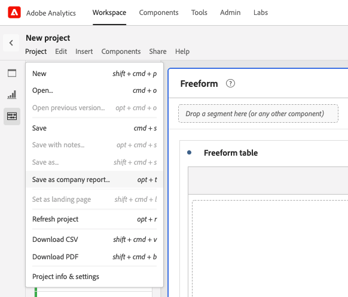

# Skapa och hantera företagsrapporter

Du kan skapa anpassade rapporter och spara dem så att andra på ditt inloggningsföretag kan använda dem. Företagsrapporter är tillgängliga att välja mellan när du skapar ett projekt, vilket beskrivs i [Skapa ett projekt från ett tomt projekt eller en rapport](/help/analyze/analysis-workspace/build-workspace-project/create-projects.md#create-a-project-from-a-blank-project-or-a-report) i artikeln, [Skapa projekt i Analysis Workspace](/help/analyze/analysis-workspace/build-workspace-project/create-projects.md).

## Skapa en anpassad företagsrapport

Så här skapar du en ny företagsrapport:

1. Bygg ett projekt i Analysis Workspace till önskat tillstånd.
1. Välj [!UICONTROL **Projekt**] > **[!UICONTROL Save as company report…]**.

   

1. Uppdatera rapportens namn, lägg till en beskrivning och lägg till eventuella taggar och välj sedan [!UICONTROL **Spara som företagsrapport**].

   Rapporten läggs till i listan Företagsrapporter i modal Create Project och är tillgänglig för användare i ditt inloggningsföretag.

   Mer information om hur användare kan skapa ett projekt baserat på en företagsrapport finns i&quot;Skapa ett projekt från ett tomt projekt eller en rapport&quot; i [Skapa projekt](/help/analyze/analysis-workspace/build-workspace-project/create-projects.md).

## Hantera företagsrapporter

Administratörer kan filtrera projektlistan för att visa och hantera företagsrapporter. Fastnålade objekt förblir fästa följt av listan med företagsrapporter som identifieras av  rapportikon . I den här vyn kan du ta bort, byta namn på, tagga eller godkänna en eller flera rapporter.

Så här visar och hanterar du företagsrapporter

1. I filterfältet väljer du **ANDRA FILTER** och sedan **Företagsrapporter**.
En lista över företagsrapporter visas. Alla vanliga projekt visas inte, såvida de inte är fästa.

   

   När företagsrapporter visas kan administratörer ta bort, byta namn på, lägga till en tagg eller godkänna rapporten.

1. Välj en rapport eller flera rapporter i rapportlistan.

1. Klicka på **...** elikonen bredvid en rapport om du vill visa de tillgängliga alternativen (Ta bort, Byt namn, Tagga och Godkänn).

   

1. Välj ett alternativ (Ta bort, Byt namn, Tagga och Godkänn).

1. Om du vill återgå till den vanliga vyn när du är klar avmarkerar du alternativet Företagsrapporter igen i filterfältet.

### Ta bort en företagsrapport

Administratörer kan ta bort en rapport med alternativet Företagsrapportlista (beskrivs ovan) eller ta bort en rapport från alternativet Skapa projekt.

