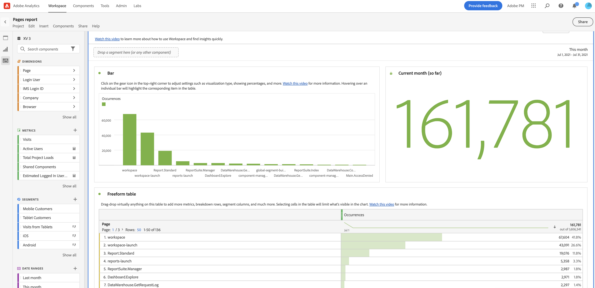

# Använd färdiga rapporter

Färdiga rapporter i Analysis Workspace ger snabba insikter i de vanligaste rapportscenarierna. Nedan följer några exempel på frågor som du kan besvara med färdiga rapporter:

* Hur många personer besöker er webbplats
* Hur många av dessa besökare är unika besökare (räknas bara en gång)
* Hur de kom till webbplatsen (t.ex. om de följde en länk eller kom dit direkt)
* Vilka nyckelord besökarna använde för att söka efter webbplatsinnehåll
* Hur länge besökarna var kvar på en viss sida eller på hela webbplatsen
* Vilka länkar besökarna klickade på och när de lämnade webbplatsen
* Vilka marknadsföringskanaler är mest effektiva för att generera intäkter eller konverteringshändelser?
* Hur mycket tid de tillbringade med att titta på en video
* Vilka webbläsare och enheter de använde för att besöka din webbplats

Följande information beskriver hur du får åtkomst till och använder färdigbyggda rapporter från [!UICONTROL Reports] i Analysis Workspace.

## Få åtkomst till och köra en rapport

1. I Analysis Workspace väljer du [!UICONTROL **Arbetsyta**] -fliken.

1. Välj [!UICONTROL **Rapporter**].

   

1. I sökfältet börjar du skriva namnet på den rapport som du vill hitta och väljer den sedan i listan med rapporter. Du kan också söka i rapportlistan efter hjälp, eVar och händelsenummer. <!-- still true? -->

   eller

   Välj den rapportkategori som du vill visa och välj sedan rapporten i listan med rapporter.

   >[!TIP]
   >
   >   Om du vill navigera på menyn med piltangenterna trycker du på snedstreck (/) och sedan på nedpilen. Tryck på Retur för att läsa in den valda rapporten.

En lista över tillgängliga rapporter finns i [Tillgängliga rapporter](#available-reports) nedan.

## Spara en rapport {#use-reports}

Om du lämnar en rapport efter att ha gjort ändringar uppmanas du att spara eller ignorera ändringarna. Om du sparar ändringar i en rapport sparas rapporten som ett nytt projekt.

1. Gå till [!UICONTROL **Rapporter**] -fliken.
1. Markera den rapport som du vill visa. Till exempel under [!UICONTROL **Mest populära**] väljer du [!UICONTROL **Sidor**] rapport.

   

1. Sidrapporten, som den visas i Analysis Workspace, visar två [visualiseringar](/help/analyze/analysis-workspace/visualizations/freeform-analysis-visualizations.md) ([Stapeldiagram](/help/analyze/analysis-workspace/visualizations/bar.md) och [Sammanfattningsnummer](/help/analyze/analysis-workspace/visualizations/summary-number-change.md)) och [Frihandsregister](/help/analyze/analysis-workspace/visualizations/freeform-table/freeform-table.md). Det mätvärde som används är förekomster.
1. Gör något av följande:

   * Visa rapporten.
   * Dra ett eller flera segment till segmentsläppzonen längst upp. Dra till exempel segmentet [!UICONTROL **Mobilkunder**] och visa resultaten.
   * Ändra datumintervallet genom att gå till kalendern längst upp till höger.
   * Lägg till dimensionsanalyser, dra in andra mätvärden och anpassa rapporten generellt efter dina behov.

1. (Valfritt) Spara rapporten som ett projekt genom att välja [!UICONTROL **Projekt**] > [!UICONTROL **Spara**].

   Rapporten sparas som ett nytt projekt. Den ändrar inte den befintliga rapporten. Mer information om hur du sparar en rapport som ett projekt finns i [Spara projekt](/help/analyze/analysis-workspace/build-workspace-project/save-projects.md).

## Tillgängliga rapporter

Följande tabell innehåller en fullständig lista över tillgängliga färdigbyggda rapporter.

Några av de populäraste färdiga rapporterna är Flow, Fallout, Marketing channel och Real-time Reports.

| Menyalternativ | Rapporter under det här menyobjektet |
| --- | --- |
| **[!UICONTROL Most Popular]** | <ul><li>Självstudiekurs (befintlig mall för arbetsyta)</li><li>Sidor (Vad är mina översta sidor?)</li><li>Sidvyer (hur många sidvyer skapar jag?)</li><li>Besök (hur många besök får jag?)</li><li>Besökare (hur många besökare får jag?)</li><li>Viktiga mätvärden (Hur fungerar mina viktigaste mätvärden?)</li><li>Webbplatsavsnitt (Vilka avsnitt på min webbplats genererade de flesta sidvyerna?)</li><li>Realtid (vad är trender på min webbplats och varför?)</li><li>Nästa sida (Vilka är de nästa sidor som besökarna går till?)</li><li>Föregående sida (Vilka är de föregående sidorna som mina besökare gick till?)</li><li>Kampanjer (Vilka kampanjer driver på min nyckelstatistik?)</li><li>Produkter (Vilka produkter driver på min nyckelstatistik?)</li><li>Senaste beröringskanal (Vilken senaste beröringskanal fungerar bäst?</li><li>Senaste beröringskanaldetalj (Vilken specifik sista beröringskanal presterar bättre än andra?)</li><li>Intäkter (hur fungerar mina intäkter?)</li><li>Beställningar (Hur fungerar mina order?)</li><li>Enheter (hur många enheter säljer jag?)</li></ul> |
| **[!UICONTROL Engagement]** | <ul><li>Viktiga mätvärden (Hur fungerar mina viktigaste mätvärden?)</li><li>Sidvyer (hur många sidvyer skapar jag?)</li><li>Sidor (Vad är mina översta sidor?)</li><li>Besök (hur många besök får jag?)</li><li>Besökare (hur många besökare får jag?)</li><li>Tid per besök (hur mycket tid tillbringar mina användare per besök?)</li><li>Tid före händelse (Hur mycket tid tillbringar mina användare före en lyckad händelse?)</li><li>Webbplatsavsnitt (Vilka avsnitt på min webbplats genererade de flesta sidvyerna?</li><li>Konsumtion av webbinnehåll (Vilket innehåll konsumeras mest och engagerar användarna)?</li><li>Förbrukning av mediematerial (vilket innehåll konsumeras mest och engagerar användarna)?</li><li>Nästa och föregående sidflöde (Vilka är/var nästa/föregående sökvägar som mina besökare tar/tog?)</li><li>Utfall (Var ser jag utfall från mina digitala resurser?)</li><li>Enhetsövergripande analys (Använda enhetsövergripande analys i Analysis Workspace)</li><li>Webbbevarande (Vilka är mina lojala användare och vad gör de?)</li><li>Medieljudförbrukning (Vad är trender och de viktigaste mätvärdena för ljudförbrukning?)</li><li>Media Recency, frequency, loyalty (Vilka är mina lojala läsare?)</li><li>Sidanalys > Läs in igen (vilka sidor genererar de mest laddade)?</li><li>Sidanalys > Tidsåtgång för sidan (hur mycket tid lägger mina användare på mina sidor?)</li><li>Poster och utträde > Startsidor (Vad är mina övre startsidor?)</li><li>Poster och utträden > Ursprungliga startsidor (Vilken sida angav min besökare ursprungligen från?)</li><li>Poster och avslutningar > Enkelsidiga besök (Vilka sidor genererade de mest enkelsidiga besöken?)</li><li>Poster och avslutningar > Avsluta sidor (Vad är mina översta avslutssidor?)</li><li>Sidanalys > Sidsammanfattning</li></ul> |
| **[!UICONTROL Conversion]** | <ul><li>Produkter > Produkter (Vilka produkter påverkar min nyckelstatistik?)</li><li>Produkter > Produktprestanda (Vilka produkter fungerar bäst?)</li><li>Produkter > Kategorier (Vilka är mina mest framgångsrika produktkategorier?</li><li>Kundvagn > Korgar (hur många användare har lagt till en produkt i kundvagnen?</li><li>Kundvagn > Vyer av kundvagn (hur många gånger såg mina besökare sina kundvagnar?)</li><li>Kundvagn > Tillägg av kundvagn (Hur ofta lägger användare till en produkt i kundvagnen?)</li><li>Kundvagn > Ta bort kundvagn (Hur ofta tar användarna bort en produkt från kundvagnen?)</li><li>Inköp > Inkomster (hur fungerar mina intäkter?)</li><li>Inköp > Beställningar (hur fungerar mina order?)</li><li>Inköp > Enheter (hur många enheter säljer jag?)</li><li>[Magento: marknadsföring och handel](https://experienceleague.adobe.com/docs/analytics/analyze/analysis-workspace/build-workspace-project/starter-projects.html#commerce)</li></ul> |
| **[!UICONTROL Audience]** | <ul><li>Personmätvärden (hur många interagerar med mitt varumärke?)</li><li>Besökarprofil > Platsöversikt (vilka platser som används mest av användarna)</li><li>Besökarprofil > Geosegmentering > Geo Counties, Geo US States, Geo Regions, Geo Cities, Geo US DMA (Vilka platser besöker mina användare?)</li><li>Besökarprofil > Språk (vilket språk föredrar mina användare?)</li><li>Besökarprofil > Tidszoner (vilka tidszoner besöker mina användare?)</li><li>Besökarprofil > Domäner (Vilka internetleverantörer använder mina besökare för att komma åt min webbplats?)</li><li>Besökarprofil > Domäner på översta nivån (Vilka domäner kör trafik till min webbplats?)</li><li>Besöksprofil > Teknik > Teknik - översikt (Vilka tekniker använder människor för att komma åt min webbplats?)</li><li>Besökarprofil > Teknik > Webbläsare, webbläsartyp, webbläsarbredd, webbläsarhöjd (vilket företags webbläsare, webbläsarversion och dess bredd och höjd använder någon för att komma åt min webbplats?)</li><li>Besökarprofil > Teknik > Operativsystem, operativsystemtyper (vilket operativsystem och vilken version av det använder mina besökare?)</li><li>Besöksprofil > Teknik > Mobiloperatör (Vilka mobiloperatörer använder mina besökare för att besöka min webbplats?)</li><li>Bevarande av besökare > Returfrekvens (hur lång tid går det mellan min användares aktuella besök och tidigare besök?)</li><li>Bevarande av besökare > Returbesök (hur många av mina besök returnerar användare?)</li><li>Bevarande av besökare > Besök nummer (som besöks av sifferhaken styr de flesta av mina nyckeltal)</li><li>Besökarlojalitet > Försäljningscykel > Kundlojalitet (vilket lojalitetssegment tillhör mina användare?)</li><li>Bevarande av besökare > Försäljningscykel > Dagar före första köp (hur många dagar gick det mellan mitt användares första besök och deras första inköp?)</li><li>Bevarande av besökare > Försäljningscykel > Dagar sedan senaste köp (hur många dagar har gått mellan mitt användarbesök och det senaste köpet? )</li><li>Bevarande av besökare > Mobil > Enheter och enhetstyper (vilka enheter och enhetstyper använder mina besökare?)</li><li>Bevarande av besökare > Mobil > Tillverkare (Vilken mobilenhetstillverkare använder mina besökare?)</li><li>Bevarande av besökare > Mobil > Skärmstorlek, Skärmhöjd, Skärmbredd (Vilken mobilskärmstorlek/-höjd/bredd har mina besökare?)</li><li>Behåll besökarna > Mobil > [Användning av mobilappar](https://experienceleague.adobe.com/docs/analytics/analyze/analysis-workspace/build-workspace-project/starter-projects.html#mobile)</li><li>Behåll besökarna > Mobil > [Mobilappsresor](https://experienceleague.adobe.com/docs/analytics/analyze/analysis-workspace/build-workspace-project/starter-projects.html#mobile)</li><li>Behåll besökarna > Mobil > [Mätvärden för mobilappar](https://experienceleague.adobe.com/docs/analytics/analyze/analysis-workspace/build-workspace-project/starter-projects.html#mobile)</li><li>Behåll besökarna > Mobil > [Mobilappsmeddelanden](https://experienceleague.adobe.com/docs/analytics/analyze/analysis-workspace/build-workspace-project/starter-projects.html#mobile)</li><li>Behåll besökarna > Mobil > [Mobilappsprestanda](https://experienceleague.adobe.com/docs/analytics/analyze/analysis-workspace/build-workspace-project/starter-projects.html#mobile)</li><li>Behåll besökarna > Mobil > [Underhåll av mobilappar](https://experienceleague.adobe.com/docs/analytics/analyze/analysis-workspace/build-workspace-project/starter-projects.html#mobile)</li></ul> |
| **[!UICONTROL Acquisition]** | <ul><li>Marknadskanaler > Första beröringskanalen, Första beröringskanalen (Vilken första beröringskanal och vilken specifik första beröringskanal fungerar bäst?)</li><li>Marknadsföringskanaler > Första sista kanalen, Första sista kanalinformationen (Vilken sista beröringskanal och vilken specifik sista beröringskanal fungerar bäst?)</li><li>Campaigns > Campaigns (Vilka kampanjer driver min nyckelstatistik?)</li><li>Kampanjer > Kampanjresultat (Vilka kampanjer genererar störst intäkter?)</li><li>Kampanjer > Spårningskod (Vilka kampanjspårningskoder fungerar bäst?)</li><li>[Webbförvärv](https://experienceleague.adobe.com/docs/analytics/analyze/analysis-workspace/build-workspace-project/starter-projects.html#web)</li><li>[Mobilförvärv](https://experienceleague.adobe.com/docs/analytics/analyze/analysis-workspace/build-workspace-project/starter-projects.html#mobile)</li><li>[Advertising Analytics: betalsökning](https://experienceleague.adobe.com/docs/analytics/analyze/analysis-workspace/build-workspace-project/starter-projects.html#advertising)</li><li>Söknyckelord - alla, betalda, naturliga (vilka söknyckelord och betalda/naturliga söknyckelord ger bäst nyckeltal?)</li><li>Sökmotorer - alla, betalda, naturliga (vilka sökmotorer och betalsökmotorer/naturliga sökmotorer ger mina nyckeltal bäst resultat?)</li><li>All rankning av söksidor (Vilken söksida besöker mina användare?)</li><li>Referensdomäner (Vilka domäner driver trafik till min plats?)</li><li>Ursprungliga refererande domäner (Vad var de första domänanvändarna var på innan de besökte min webbplats?)</li><li>Referenter (Vilka URL:er var mina användare på innan de klickade igenom till min webbplats?)</li><li>Refererartyper (vilken kategori tillhör mina refererande URL:er?)</li></ul> |
