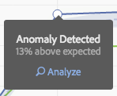

# Köra bidragsanalys

Bidragsanalys är en intensiv maskininlärningsprocess som utformats för att identifiera medverkande till en konstaterad avvikelse i Adobe Analytics. Avsikten är att hjälpa användaren att hitta fokusområden eller möjligheter till ytterligare analys mycket snabbare än vad som annars skulle vara möjligt.

## Köra bidragsanalys {#section_7D2C5E48A5664727941DF4C90976D9DC}

Det finns två sätt att anropa bidragsanalys i ett projekt:

* I en frihandstabell med daglig kornighet högerklickar du på en rad och väljer **[!UICONTROL Run Contribution Analysis]**. Du kan till och med köra det på rader som inte visar några avvikelser.

   >[!NOTE]
   >
   >Vi stöder för närvarande endast bidragsanalys med daglig granularitet.

   

* Håll pekaren över en avvikande datapunkt i ett linjediagram. Klicka på **[!UICONTROL Analyze]** länk som visas.

   

1. (Valfritt) När du har klickat **[!UICONTROL Run Contribution Analysis]** i antingen linjediagrammet eller en tabell kan du begränsa omfattningen av (och därmed snabba upp) analysen med [exklusive dimensioner](#section_F6932F4BF74544B5872164E7B1E0C6FC).

1. Vänta medan din bidragsanalys läses in. Detta kan ta lång tid, beroende på rapportsvitens storlek och antalet dimensioner. Bidragsanalys utför analyser på de 50 000 främsta objekten per dimension.
1. Analysis Workspace läser sedan in en ny bidragsanalyspanel direkt i projektet. Du kommer att märka en mängd välbekanta paneler om du har använt bidragsanalys i rapporter och analyser tidigare:

   * En visualisering som visar antalet **Besök** den dagen.
   * En gång i månaden **Besök Trend line** för kontext.
   * **De vanligaste objekten** som bidrog till avvikelsen, sorterade efter [täckningsgrad](https://experienceleague.adobe.com/docs/analytics/analyze/analysis-workspace/virtual-analyst/contribution-analysis/ca-tokens.html), plus det aktuella måttet och ett unikt besökarmått som sätter måttet i sitt sammanhang utifrån ett storleksperspektiv.

   * The [Genererade segment](https://experienceleague.adobe.com/docs/analytics/components/segmentation/segmentation-workflow/seg-build.html) (Top Item Clusters)-tabellen identifierar associationer av de vanligaste objekten baserat på bidragsresultat, avvikelser och den totala procentandel som bidrar till det avvikande måttet. Detta registreras sedan som ett målgruppssegment (bidragssegment 1, bidragssegment 2 osv.). Om du klickar på knappen &quot;i&quot; (info) får du en översikt över varje segment, inklusive vilka av de viktigaste objekten som den består av:

      

1. Eftersom bidragsanalysen nu ingår i Analysis Workspace kan du dra nytta av ett antal funktioner från en tabells högerklicksmeny och göra analysen ännu mer meningsfull, som:

   * [Bryter ned varje dimensionsobjekt med en annan dimension.](/help/analyze/analysis-workspace/components/dimensions/t-breakdown-fa.md)
   * [Trending one or more rows.](/help/analyze/analysis-workspace/home.md#section_34930C967C104C2B9092BA8DCF2BF81A)
   * [Lägga till nya visualiseringar.](/help/analyze/analysis-workspace/visualizations/freeform-analysis-visualizations.md)
   * [Skapa aviseringar.](/help/components/c-alerts/intellligent-alerts.md)
   * [Skapa eller jämföra segment.](/help/analyze/analysis-workspace/c-panels/c-segment-comparison/segment-comparison.md)

>[!NOTE]
>
>Vi belyser den avvikelse som analyseras med en blå prick i bidragsanalysen och de intelligenta aviseringsprojekt som är kopplade till den. Detta ger en tydligare bild av den avvikelse som analyseras.

## Uteslut dimensioner från bidragsanalys {#section_F6932F4BF74544B5872164E7B1E0C6FC}

Det kan finnas tillfällen då du vill utesluta vissa dimensioner från bidragsanalysen. Du kanske inte bryr dig om webbläsar- eller maskinvarurelaterade dimensioner alls och du vill snabba upp analysen genom att ta bort dem.

1. Efter att du klickat **[!UICONTROL Run Contribution Analysis]** (eller **[!UICONTROL Analyze]** i ett linjediagram) **[!UICONTROL Excluded Dimensions]** visas.

1. Bara dra oönskade dimensioner till **[!UICONTROL Excluded Dimensions]** och sedan spara listan genom att klicka på **[!UICONTROL Set as Default]**. Eller klicka **[!UICONTROL Clear All]** för att börja om med att välja dimensioner som ska uteslutas.

   

1. När du har lagt till dimensioner som ska uteslutas (eller valt att inte göra det) klickar du på **[!UICONTROL Run Contribution Analysis]** igen.
1. Om du någon gång behöver revidera listan över undantagna dimensioner dubbelklickar du bara på Dimensioner så visas listan över undantagna dimensioner:

   

1. Ta bara bort oönskade dimensioner genom att klicka på x:et bredvid dem och spara sedan listan genom att klicka på **[!UICONTROL Set as Default]**.
