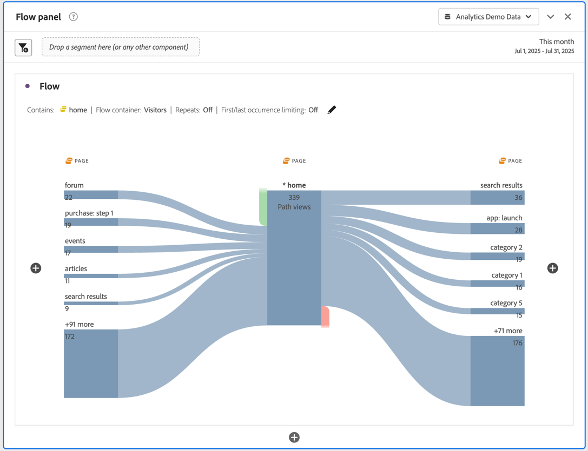

# Konfigurera en flödesvisualisering

>[!NOTE]
>
>Den nya versionen av [!UICONTROL Flow] visualisering är för närvarande i begränsad testning.

Med den uppdaterade Flow-visualiseringen kan ni förstå den resa som härrör från eller leder fram till en specifik konverteringshändelse på er webbplats eller i er app. Den spårar en bana genom dina dimensioner (och dimensionsobjekt) eller mätvärden. Med Flow kan du konfigurera början eller slutet av sökvägen som du är intresserad av, eller analysera alla sökvägar som flödar genom en dimension eller dimensionspost.

Den nya [!UICONTROL flow] arbetsflödet har förbättrats på flera sätt:

* Nu kan du välja att starta eller avsluta din bana med en kombination av mått och en målningsdimension.
* Innehåller [!UICONTROL Advanced Settings] så att du kan anpassa [!UICONTROL flow].
* Den nya knappen &quot;Bygg&quot; sparar tid genom att du kan konfigurera hela resan samtidigt, ställa frågor och sedan automatiskt bygga ut flera kolumner och noder samtidigt &#x200B;.

## Konfigurationssteg {#configure}

1. Om du vill börja skapa ett flödesdiagram lägger du till en tom panel i projektet och klickar på ikonen för visualiseringar i den vänstra listen. Dra sedan Flödesvisualiseringen till panelen. Eller dra [!UICONTROL Flow] visualisering i ett befintligt projekt.

1. Förankra Flödesvisualiseringen med ett av tre alternativ:

   * [!UICONTROL Starts with] (mått, dimensioner eller objekt), eller
   * [!UICONTROL Contains] (mått, eller objekt), eller
   * [!UICONTROL Ends with] (mått, dimensioner eller objekt)

   Var och en av dessa kategorier visas på skärmen som en&quot;släppzon&quot;. Du kan fylla i släppzonen på tre sätt:

   * Använd listrutan för att välja mått eller mått.
   * Dra objekt från måttlistan eller mätningslistan.
   * Använd sökfunktionen för att hitta de mätvärden eller dimensioner du letar efter.

   Låt oss anta att du vill spåra allt som leder till en utcheckningshändelse. Du drar en utcheckningsrelaterad dimension eller mätvärden (som [!UICONTROL Order exists]) till **[!UICONTROL Ends with]** släppzon.

1. Om du väljer ett mätvärde måste du även ange [!UICONTROL Pathing Dimension], som visas här, som du använder för att skapa sökvägen. Standardvärdet är [!UICONTROL Page].

   

   >[!IMPORTANT]
   >
   >Beräknade mått kan inte tas med i  **[!UICONTROL Starts with]** eller **[!UICONTROL Ends with]** släppzoner.

1. (Valfritt) Klicka på **[!UICONTROL Show Advanced Settings]** för att konfigurera avancerade inställningar:

   

   | Inställning | Beskrivning |
   | --- | --- |
   | **[!UICONTROL Wrap labels]** | Etiketterna på Flow-elementen trunkeras normalt för att spara skärmutrymme, men du kan göra hela etiketten synlig genom att markera den här rutan.  Standard = avmarkerat. |
   | **[!UICONTROL Include repeat instances]** | Flödesvisualiseringar baseras på instanser av en dimension. Den här inställningen ger dig möjlighet att inkludera eller exkludera upprepade instanser, t.ex. sidomladdning. Det går dock inte att ta bort upprepningar från Flow-visualiseringar som innehåller flervärdesdimensioner, som listVars, listProps, s.product, merchandising eVars osv. Standard = avmarkerat. |
   | **[!UICONTROL Limit to first/last occurrence]** | Begränsa banor till dem som börjar/slutar med den första/sista förekomsten av en dimension/artikel/mått. En mer detaljerad förklaring finns i avsnittet&quot;Exempelscenario för &#39;begränsning till första/sista förekomsten&#39;&quot; nedan. |
   | **[!UICONTROL Number of Columns]** | Anger hur många kolumner du vill ha i flödesdiagrammet. |
   | **[!UICONTROL Items expanded per Column]** | Hur många objekt du vill ha i varje kolumn. |
   | **[!UICONTROL Flow Container]** | <ul><li>Gå in på</li><li>Besökare</li></ul> Gör att du kan växla mellan Besök och Besök för att analysera besökarbanan. Dessa inställningar hjälper er att förstå besökarnas engagemang på besökarnivå (mellan besök) eller begränsa analysen till ett enda besök. |

1. Klicka på **[!UICONTROL Build]**.

## Visa och ändra flödesutdata {#output}

En sammanfattning av flödeskonfigurationen visas högst upp i diagrammet. Banorna i diagrammet är proportionella. Banor med mer aktivitet ser tjockare ut.

Om du vill gå längre ned i informationen har du flera alternativ:

* Flödesdiagrammet är interaktivt. För musen över diagrammet för att ändra de detaljer som visas.

* När du klickar på en nod i diagrammet visas information om den noden. Klicka på noden igen för att komprimera den.

   

* Du kan filtrera en kolumn så att endast vissa resultat visas, t.ex. inkludera och exkludera, ange villkor osv.

* Klicka på plustecknet (+) till vänster för att expandera en kolumn.

* Använd de högerklicksalternativ som förklaras nedan för att anpassa utdata ytterligare.

* Klicka på pennikonen bredvid konfigurationssammanfattningen om du vill redigera flödet ytterligare eller återskapa det med andra alternativ.

* Du kan också exportera och ytterligare analysera flödesdiagrammet som en del av ett projekts .CSV-fil genom att gå till **[!UICONTROL Project]** > **[!UICONTROL Download CSV]**.

## Filtrering

Ovanför varje kolumn visas ett filter när du håller pekaren över den. Genom att klicka på filtret får du samma filterdialogruta som finns i friformstabellen idag. Det här filtret fungerar på samma sätt som i frihandstabellen.

* Använd avancerade inställningar för att inkludera eller exkludera vissa villkor med vår lista över operatorer.
* När du har filtrerat ett objekt från listan återspeglas filtreringen i den kolumnen. (Filtret minskar det antingen så att bara det objekt som är tillåtet i filtret visas, eller så tas alla objekt bort utom det som du vill ha i filtret.
* Alla kolumner som är nedströms och uppströms ska finnas kvar så länge som det finns data som flödar in i de återstående noderna.
* När filterikonen har använts visas den i blått ovanför den kolumn den filtrerar.
* Om du vill ta bort ett filter klickar du på filterikonen för att öppna filtermenyn. Ta bort eventuella filter och klicka sedan på **[!UICONTROL Save]**. Flödet bör återgå till det tidigare, ofiltrerade läget.

## Alternativ för högerklick {#right-click}

| Alternativ | Beskrivning |
|--- |--- |
| [!UICONTROL Focus on this node] | Ändra fokus till den valda noden. Flödesdiagrammets fokusnod visas i mitten. |
| [!UICONTROL Start Over] | Returnerar dig till Frihand-diagramverktyget, där du kan skapa ett nytt flödesdiagram. |
| [!UICONTROL Create Segment from this point in flow] | Skapa ett segment. Då kommer du till segmentbyggaren där du kan konfigurera det nya segmentet. |
| [!UICONTROL Breakdown] | Dela upp noden efter tillgängliga Dimensioner, mått eller tid. |
| [!UICONTROL Trend] | Skapa ett trenddiagram för noden. |
| [!UICONTROL Expand entire column] | Expandera en kolumn om du vill visa alla noder. Som standard visas bara de fem översta noderna. |
| [!UICONTROL Collapse entire column] | Dölj alla noder i en kolumn. |
| [!UICONTROL Exclude Item]/[!UICONTROL Restore Excluded Items] | Tar bort en specifik nod från kolumnen och skapar den automatiskt som ett filter överst i kolumnen. Om du vill återställa det uteslutna objektet högerklickar du igen och väljer **[!UICONTROL Restore Excluded Item]**. Du kan också öppna filtret längst upp i kolumnen och ta bort rutan med det objekt du just uteslutit. |

## Exempelscenario för &#39;begränsa till första/sista förekomsten&#39;

Tänk på följande när du använder det här alternativet:

* **[!UICONTROL Limit to first/last occurrence]** räknar endast den första/sista förekomsten i serien. Alla andra förekomster av **[!UICONTROL Starts with]** eller **[!UICONTROL Ends with]** villkor ignoreras.
* Om den används med en **[!UICONTROL Starts with]** Flöde, inkluderas bara den första förekomsten som matchar startvillkoret.
* Om den används med en **[!UICONTROL Ends with]** Flöde, inkluderas endast den sista förekomsten som matchar slutvillkoret.
* Serien som används skiljer sig åt beroende på behållaren. Om du använder **[!UICONTROL Visit]** -behållaren, serien träffar blir sessionen. Om du använder **[!UICONTROL Visitor]** -behållaren kommer alla träffar för en viss användare i det angivna datumintervallet.
* The **[!UICONTROL Limit to first/last occurrence]** kan konfigureras i de avancerade inställningarna när du använder ett måttobjekt eller ett Dimension-objekt i fälten &quot;Börjar med&quot; eller &quot;Slutar med&quot;.

Exempelserie med träffar:

Hem > Produkter > Lägg till i kundvagn > Produkter > Lägg till i kundvagn > Fakturering > Orderbekräftelse

### Fundera på en flödesanalys med följande inställningar:

* Börja med[!UICONTROL  Add to cart] (Dimension)
* [!UICONTROL Page] målningsdimension
* [!UICONTROL Visit] container

Om Begränsa till första/sista förekomsten är inaktiverat räknas den här enskilda serien träffar som 2 förekomster av Lägg till i kundvagnen.
Förväntat flöde: &quot;Lägg i kundvagnen&quot; (2) —> &quot;Produkter&quot; (1) -> &quot;Fakturering&quot; (1)

Om alternativet Begränsa till första/sista förekomsten är aktiverat inkluderas endast den första förekomsten av Lägg till i kundvagnen i analysen.
Förväntat flöde: &quot;Lägg i kundvagnen&quot; (1) —> &quot;Produkter&quot; (1)

### Tänk på samma serie träffar men med följande inställningar:

* Slutar med [!UICONTROL Add to cart] (Dimension)
* [!UICONTROL Page] målningsdimension
* [!UICONTROL Visit] container

If **[!UICONTROL Limit to first/last occurrence]** är *inaktiverad*, kommer den här serien träffar att räkna till två förekomster av&quot;Lägg i kundvagnen&quot;.
Förväntat flöde: &quot;Produkter&quot; (2) &lt;— &quot;Lägg i kundvagn&quot; (2)

Om **[!UICONTROL Limit to first/last occurrence]** är *aktiverad*, bara den sista förekomsten av [!UICONTROL Add to cart] skulle ingå i analysen.
Förväntat flöde: &quot;Produkter&quot; (1) &lt;— &quot;Lägg i kundvagn&quot; (1)
