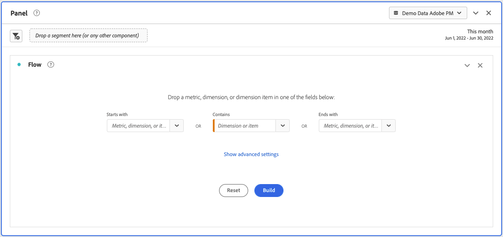

# Konfigurera en flödesvisualisering {#configure-a-flow-visualization}

>[!CONTEXTUALHELP]
>id="workspace_flow_startswith"
>title="Börjar med"
>abstract="Det här fältet kan bara anges för den första versionen. Om du vill uppdatera det här fältet väljer du **[!UICONTROL Reset]** för att skapa en ny flödesvisualisering."

>[!CONTEXTUALHELP]
>id="workspace_flow_contains"
>title="Innehåller"
>abstract="Det här fältet kan bara anges för den första versionen. Om du vill uppdatera det här fältet väljer du **[!UICONTROL Reset]** för att skapa en ny flödesvisualisering."

>[!CONTEXTUALHELP]
>id="workspace_flow_endswith"
>title="Slutar med"
>abstract="Det här fältet kan bara anges för den första versionen. Om du vill uppdatera det här fältet väljer du **[!UICONTROL Reset]** för att skapa en ny flödesvisualisering."

>[!CONTEXTUALHELP]
>id="workspace_flow_pathingdimension"
>title="Målardimension"
>abstract="Välj en dimension som du vill använda som banans radavstånd till eller gå från den markerade komponenten."

>[!CONTEXTUALHELP]
>id="workspace_flow_container"
>title="Flödesbehållare"
>abstract="Välj den behållare som ska användas för att visa (siffror för) banan."

>[!CONTEXTUALHELP]
>id="workspace_flow_include_repeats_disabled"
>title="Inkludera upprepningar (inaktiverat)"
>abstract="Upprepningar kan inte tas bort från Flödesvisualiseringar som innehåller flervärdesdimensioner."

>[!CONTEXTUALHELP]
>id="workspace_flow_include_repeats_default"
>title="Inkludera upprepningar"
>abstract="Flödesvisualiseringar baseras på instanser av en dimension. Den här inställningen ger dig möjlighet att inkludera eller exkludera upprepade instanser, till exempel: Sidomladdning."

>[!CONTEXTUALHELP]
>id="workspace_flow_limit_occurrence"
>title="Begränsa till första/sista förekomsten"
>abstract="Resultaten begränsas till banor när den första/sista kontaktytan är en inträde/avslutning."

>[!CONTEXTUALHELP]
>id="workspace_flow_numberofcolumns"
>title="Antal kolumner"
>abstract="Det här fältet kan bara anges för den första versionen. Om du vill uppdatera det här fältet väljer du **[!UICONTROL Reset]** för att skapa en ny flödesvisualisering."

>[!CONTEXTUALHELP]
>id="workspace_flow_itemsexpandedpercolumn"
>title="Objekt utökade per kolumn"
>abstract="Det här fältet kan bara anges för den första versionen. Om du vill uppdatera det här fältet väljer du **[!UICONTROL Reset]** för att skapa en ny flödesvisualisering."

Flödesvisualiseringar hjälper er att förstå den resa som härrör från eller leder fram till en specifik konverteringshändelse på er webbplats eller i er app. Den spårar en bana genom dina dimensioner (och dimensionsobjekt) eller mätvärden.

Med flödesvisualiseringar kan du konfigurera början eller slutet av den sökväg du är intresserad av, eller analysera alla banor som flödar genom en dimension eller dimensionspost.

## Använd

1. Lägg till en  **[!UICONTROL Flow]**-visualisering. Se [Lägga till en visualisering på en panel](../freeform-analysis-visualizations.md#add-visualizations-to-a-panel).

1. Förankra Flödesvisualiseringen med något av följande alternativ:

   * [!UICONTROL **Börjar med**] (mått, dimensioner eller objekt), eller
   * [!UICONTROL **Innehåller**] (dimensioner eller objekt), eller
   * [!UICONTROL **Slutar med**] (mått, dimensioner eller objekt)

   Var och en av dessa kategorier visas på skärmen som en *släppzon*. Du kan fylla i släppzonen på tre sätt:

   * Använd listrutan för att välja mått eller mått.
   * Dra mått eller mätvärden från den vänstra panelen.
   * Börja skriva namnet på en dimension eller ett mått och markera det sedan när det visas i listrutan.

   >[!IMPORTANT]
   >
   >Beräknade mått kan inte användas i fälten **[!UICONTROL Starts with]** eller **[!UICONTROL Ends with]**.

1. Om du väljer ett mätvärde måste du även ange en [!UICONTROL **Sökväg-Dimension**] som du kan använda som sökväg som leder till eller kommer från den markerade komponenten, vilket visas här. Standardvärdet är [!UICONTROL **Sida**].

   

1. (Valfritt) Välj **[!UICONTROL Show advanced settings]** om du vill konfigurera något av följande alternativ:

   | Inställning | Beskrivning |
   | --- | --- |
   | **[!UICONTROL Wrap labels]** | Etiketterna på Flow-elementen trunkeras normalt för att spara skärmutrymme, men du kan göra hela etiketten synlig genom att markera den här rutan.  Standard = avmarkerat. |
   | **[!UICONTROL Include repeat instances]** | Flödesvisualiseringar baseras på instanser av en dimension. Den här inställningen ger dig möjlighet att inkludera eller exkludera upprepade instanser, till exempel Sidomladdning. Det går dock inte att ta bort upprepningar från Flow-visualiseringar som innehåller flervärdesdimensioner, som listVars, listProps, s.product, merchandising eVars osv. 
Det här alternativet är inaktiverat som standard.
 |
   | **[!UICONTROL Limit to first/last occurrence]** | Begränsa banor till banor som börjar eller slutar med den första eller sista förekomsten av en dimension, artikel eller mätvärde. Mer information finns i [Begränsa till första/sista förekomsten](#example-scenario-for-limit-to-firstlast-occurrence). |
   | **[!UICONTROL Number of columns]** | Antalet kolumner som du vill ha i flödesdiagrammet. Du kan ange högst fem kolumner. |
   | **[!UICONTROL Items expanded per column]** | Antalet objekt som du vill ha i varje kolumn. Du kan ange högst 10 objekt utökade per kolumn. |
   | **[!UICONTROL Flow container]** | Du kan växla mellan **[!UICONTROL Sessions]** och **[!UICONTROL Person]** för att analysera målningen. Dessa inställningar hjälper dig att förstå en persons engagemang på personnivå (mellan sessioner) eller begränsa analysen till en enda session. |

   >[!IMPORTANT]
   >
   >Kombinationen av **[!UICONTROL Number of columns]** och **[!UICONTROL Items expanded per column]** avgör antalet underliggande begäranden som krävs för att skapa flödesvisualiseringen. Ju högre tal, desto längre tid tar det att återge en visualisering.

1. Välj **[!UICONTROL Build]**.

### Exempel

Anta att du vill spåra sökvägen som användare tog både till och från de mest populära sidorna på din webbplats.

1. Skapa en flödesvisualisering enligt beskrivningen ovan.
1. Dra dimensionen [!UICONTROL **Sida**] till fältet **[!UICONTROL Contains]** och välj sedan [!UICONTROL **Skapa**].
1. Flödesvisualiseringen byggs, med den mest visade sidan synlig i fokusnoden, i mitten av visualiseringen. Du kan även se de översta sidorna som leder till den sidan (till vänster om fokusnoden) samt de översta sidorna som leder ut från den sidan (till höger om fokusnoden).
1. Analysera data i flödet enligt beskrivningen i [Konfigurera](#configure).

## Konfigurera

En sammanfattning av flödeskonfigurationen visas högst upp i visualiseringarna. Banorna i diagrammet är proportionella. Banor med mer aktivitet ser tjockare ut.

Om du vill gå längre ned i informationen har du flera alternativ:

* Flödesdiagrammet är interaktivt. För musen över diagrammet för att ändra de detaljer som visas.

* När du markerar en nod i diagrammet visas information om den noden. Markera noden igen för att komprimera den.

  

* Du kan filtrera en kolumn så att endast vissa resultat visas, t.ex. inkludera och exkludera, ange villkor osv.

* Välj  till vänster eller höger för att expandera en kolumn.

* Använd alternativen på [snabbmenyn](#context-menu) om du vill anpassa utdata.

* Om du vill redigera flödet eller återskapa det med andra alternativ väljer du  bredvid konfigurationssammanfattningen.

## Filter

Ovanför varje kolumn visas ett filter, , när du hovrar över den. Genom att markera filtret får du samma filterdialogruta som finns i friformstabellen. Se [Filtrera och sortera](freeform-table/../../freeform-table/filter-and-sort.md).

* Använd **[!UICONTROL Show advanced]** om du vill konfigurera avancerade inställningar så att vissa villkor inkluderas eller exkluderas med en lista över operatorer. Mer information finns i [Filter och sortering](../freeform-table/filter-and-sort.md).
* När du har filtrerat en kolumn återspeglas filtreringen i den kolumnen. Ett blått  anger att kolumnen är filtrerad.  Filtret minskar antingen kolumnen så att bara det objekt som är tillåtet i filtret visas. Eller så tas alla objekt bort, förutom det objekt som du vill ha med i filtret.
* Alla kolumner som är nedströms och uppströms bevaras, så länge som det finns data som flödar in i de återstående noderna.
* Om du vill ta bort ett filter väljer du  för att öppna filtermenyn. Ta bort eventuella filter som använts och välj sedan **[!UICONTROL Save]**. Flödet bör återgå till det tidigare, ofiltrerade läget.

## Snabbmeny

Använd en snabbmeny på en nod i flödesvisualiseringen med följande alternativ:

| Alternativ | Beskrivning |
|--- |--- |
| **[!UICONTROL Focus on this node]** | Ändra fokus till den valda noden. Flödesdiagrammets fokusnod visas i mitten. |
| **[!UICONTROL Start over]** | Gå tillbaka till Frihandsdiagramverktyget där du kan skapa ett nytt flödesdiagram. |
| **[!UICONTROL Create a filter for this path]** | Skapa ett filter. Det här valet tar dig till filterverktyget, där du kan konfigurera det nya filtret. |
| **[!UICONTROL Breakdown]** | Dela upp noden efter tillgängliga mått, mått eller tid. |
| **[!UICONTROL Filter column]** | Samma filteralternativ visas som de är tillgängliga i frihandstabellen. Mer information om de tillgängliga alternativen finns i avsnittet Använda ett enkelt eller avancerat filter i en tabell i [Filtrera och sortera tabeller](/help/analyze/analysis-workspace/visualizations/freeform-table/filter-and-sort.md). |
| **[!UICONTROL Exclude item]** eller **[!UICONTROL Restore excluded items]** | Tar bort en specifik nod från kolumnen och skapar den automatiskt som ett filter överst i kolumnen. Om du vill återställa det uteslutna objektet väljer du **[!UICONTROL Restore Excluded Item]** på snabbmenyn. Du kan också öppna filtret längst upp i kolumnen och ta bort rutan med det objekt du just uteslutit. |
| **[!UICONTROL Trend]** | Skapa ett trenddiagram för noden. |
| **[!UICONTROL Show next column]** / **[!UICONTROL Show previous column]** | Visar nästa (höger) eller föregående (vänster) kolumn i visualiseringen. |
| **[!UICONTROL Hide colum]**n | Döljer den markerade kolumnen från visualiseringen. |
| **[!UICONTROL Expand entire column]** | Expandera en kolumn om du vill visa alla noder. Som standard visas bara de fem översta noderna. |
| **[!UICONTROL Create audience from selection]** | Skapar en målgrupp baserat på den markerade kolumnen. |
| **[!UICONTROL Collapse entire column]** | Dölj alla noder i en kolumn. |

## Begränsa till första/sista förekomsten

Tänk på följande när du använder det här alternativet:

* **[!UICONTROL Limit to first/last occurrence]** räknar endast den första/sista förekomsten i serien. Alla andra förekomster av villkoret **[!UICONTROL Starts with]** eller **[!UICONTROL Ends with]** ignoreras.
* Om den används med ett **[!UICONTROL Starts with]**-flöde inkluderas endast den första förekomsten som matchar startvillkoret.
I exemplet nedan inkluderas **alla** förekomster av *Lägg i kundvagnen* och *huvudkategorin för produkten* i varje steg i flödet.
  

  I exemplet nedan inkluderas bara de **första** förekomsterna av *Lägg till i kundvagnen* och *produkthuvudkategorin* i varje steg i flödet.
  
* Om den används med ett **[!UICONTROL Ends with]**-flöde inkluderas endast den sista förekomsten som matchar slutvillkoret.
I exemplet nedan inkluderas **alla** förekomster av *huvudkategorin för produkten* och *Lägg till i kundvagnen* i varje steg i flödet.
  

  I exemplet nedan inkluderas bara de **sista** förekomsterna av *huvudkategorin för produkten* och *Lägg i kundvagnen* i varje steg i flödet.
  
* Serien som används skiljer sig åt beroende på behållaren. Om du använder behållaren **[!UICONTROL Person]** är händelserierna sessionen. Om du använder behållaren **[!UICONTROL Session]** är händelserierna alla händelser för en viss användare i det angivna datumintervallet.
* Alternativet **[!UICONTROL Limit to first/last occurrence]** kan konfigureras i de avancerade inställningarna när du använder ett mått eller ett Dimension-objekt i fälten **[!UICONTROL Starts with]** eller **[!UICONTROL Ends with]**.

>[!MORELIKETHIS]
>
>[Lägg till en visualisering på en panel](/help/analyze/analysis-workspace/visualizations/freeform-analysis-visualizations.md#add-visualizations-to-a-panel)
>[Visualiseringsinställningar](/help/analyze/analysis-workspace/visualizations/freeform-analysis-visualizations.md#settings)
>[Snabbmenyn Visualisering ](/help/analyze/analysis-workspace/visualizations/freeform-analysis-visualizations.md#context-menu)
>

<!--
## Create a flow visualization {#configure}

1. Add a blank panel to your project and click the visualizations icon in the left rail. 

   Or
   
   Add a visualization in any of the ways described in the "Add visualizations to a panel" section in [Visualizations overview](/help/analyze/analysis-workspace/visualizations/freeform-analysis-visualizations.md).

1. Anchor your Flow visualization using one of the following options:

   * [!UICONTROL **Starts with**] (metrics, dimensions, or items), or
   * [!UICONTROL **Contains**] (dimensions, or items), or
   * [!UICONTROL **Ends with**] (metrics, dimensions, or items)

   Each of these categories is shown onscreen as a "drop zone." You can populate the drop zone in 3 ways:

   * Use the drop-down menu to select metrics or dimensions.
   * Drag dimensions or metrics from the left rail.
   * Begin typing the name of a dimension or metric, then select it when it appears in the drop-down list.

   >[!IMPORTANT]
   >
   >Calculated metrics cannot be used in the  **[!UICONTROL Starts with]** or **[!UICONTROL Ends with]** fields.

1. If you choose a metric, you also need to provide a [!UICONTROL **Pathing Dimension**] to use as your path leading to or coming from your selected component, as shown here. The default is [!UICONTROL **Page**].

   

1. (Optional) Select **[!UICONTROL Show advanced settings]** to configure any of the following options:

   

   | Setting | Description |
   | --- | --- |
   | **[!UICONTROL Wrap labels]** | Normally, the labels on the Flow elements are truncated to save screen real estate, but you can make the entire label visible by checking this box.  Default = unchecked. |
   | **[!UICONTROL Include repeat instances]** | Flow visualizations are based on instances of a dimension. This setting gives you the option to include or exclude repeated instances, e.g. Page reloads. However, repeats cannot be removed from Flow visualizations that include multi-valued dimensions, such as listVars, listProps, s.product, merchandising eVars, etc. 
This option is disabled by default.
 |
   | **[!UICONTROL Limit to first/last occurrence]** | Limit paths to those that start/end with the first/last occurrence of a dimension/item/metric. See the section below, [Example scenario for 'limit to first/last occurrence'](#example-scenario-for-limit-to-firstlast-occurrence), for a more detailed explanation. |
   | **[!UICONTROL Number of columns]** | The number of columns you want in your Flow diagram. You can specify a maximum of 5 columns. |
   | **[!UICONTROL Items expanded per column]** | The number of items you want in each column. You can specify a maximum of 10 items expanded per column.  |
   | **[!UICONTROL Flow container]** | <ul><li>Visit</li><li>Visitor</li></ul> Lets you switch between Visit and Visitor to analyze visitor pathing. These settings help you understand visitor engagement at the visitor level (across visits), or constrain the analysis to a single visit.|

   >[!IMPORTANT]
   >
   >The combination of **[!UICONTROL Number of columns]** and **[!UICONTROL Items expanded per column]** determine the number of underlying requests required to create the flow visualization. The higher those numbers, the longer it takes to render a visualization.

1. Select **[!UICONTROL Build]**.

>[!INFO]
>
>**Example:** Suppose that you want to trace the path that users took both to and from the most popular pages on your site.
>
>To do this, you would
> 
>1. Begin creating a flow visualization as described above.
>1. Drag the [!UICONTROL **Page**] dimension into the **[!UICONTROL Contains]** field, then select [!UICONTROL **Build**].
>1. The Flow visualization builds with the most-viewed page visible in the focus node in the center of the visualization. You also see the top pages leading into that page (to the left of the focus node) as well as the top pages leading out of that page (to the right of the focus node).
>1. Analyze data in the flow, as described in [View and change the Flow output](#view-and-change-the-flow-output).

## View and change the Flow output {#output}

A summary of the Flow configuration appears at the top of the diagram. The thickness of a path in the diagram is proportional to its activity, with paths with more activity appearing thicker than those with less activity.

To drill down further into the data, you have several options:

* The flow diagram is interactive. Mouse over the diagram to change the details that are shown.

* When you select on a node in the diagram, the details for that node appear. Select on the node again to collapse it.

   

* You can filter a column to display only certain results, such as including and excluding, specifying criteria, and so forth.

* Select the plus sign (+) on the left to expand a column.

* Use the right-click options explained below to further customize the output.

* Select the pencil icon next to the configuration summary to further edit the flow or rebuild it with different options.

* You can also export and further analyze your Flow diagram as part of a project's .CSV file by going to **[!UICONTROL Project]** > **[!UICONTROL Download CSV]**.

## Filtering

Above each column, a filter appears when you hover over it. By selecting the filter, you get the same filter dialog that exists in the Freeform table today. This filter works the same as it does in the Freeform table.

* Use advanced settings to include or exclude certain criteria with our list of operators.
* Once you have filtered an item from the list, that specific column will reflect the filtering. (The filter either reduces it to only show the item allowed in the filter, or it removes all items except for the one item you want in the filter.
* All downstream and upstream columns should persist, as long as there is data flowing into the remaining nodes.
* Once applied, the filter icon appears in blue above the column it is filtering.
* To remove a filter, select the filter icon to open the filter menu. Remove any filters applied and then select **[!UICONTROL Save]**. The flow should return to its previous, unfiltered state.

## Right-click options {#right-click}

| Option | Description |
|--- |--- |
| [!UICONTROL Start over] | Returns you to the Freeform diagram builder, where you can build a new Flow diagram. |
| [!UICONTROL Create segment for this path] | Create a segment. This takes you into the Segment Builder, where you can configure the new segment. |
| [!UICONTROL Breakdown] | Break the node down by available Dimensions, Metrics, or Time. |
| [!UICONTROL Trend] | Create a trended diagram for the node. |
| Show next column / Show previous column | Reveals the next (right) or previous (left) column of the visualization. |
| Hide column | Hides the selected column from the visualization. | 
| [!UICONTROL Expand entire column] | Expand a column to show all nodes. By default, only the top five nodes display. |

## Example scenario for 'limit to first/last occurrence'

When using this option, keep in mind that:

* **[!UICONTROL Limit to first/last occurrence]** counts only the first/last occurrence in the series. All other occurrences of the **[!UICONTROL Starts with]** or **[!UICONTROL Ends with]** criteria are discarded.
* If used with a **[!UICONTROL Starts with]** flow, only the first occurrence that matches the start criteria is included.
* If used with an **[!UICONTROL Ends with]** flow, only the last occurrence that matches the end criteria will be included.
* The series used differs based on the container. If using the **[!UICONTROL Visit]** container, the series of hits will be the session. If using the **[!UICONTROL Visitor]** container, the series of hits will be all the hits for a given user in the provided date range.
* The **[!UICONTROL Limit to first/last occurrence]** option can be configured in the advanced settings when using a Metric or Dimension Item in the "Starts with" or "Ends with" fields.

Example series of hits:

Home > Products > Add to cart > Products > Add to Cart > Billing > Order Confirmation

### Consider a flow analysis using the following settings:

* Start with[!UICONTROL  Add to cart] (Dimension Item)
* [!UICONTROL Page] pathing dimension
* [!UICONTROL Visit] container

If **[!UICONTROL Limit to first/last occurrence]** is *disabled*, then this single series of hits counts 2 occurrences of "Add to Cart".
Expected Flow Output:
"Add to Cart" (2) —> "Products" (1)
                  -> "Billing" (1)

However, if **[!UICONTROL Limit to first/last occurrence]** is *enabled*, only the first occurrence of "Add to cart" is included in the analysis.
Expected Flow Output:
"Add to Cart" (1) —> "Products" (1)

### Consider the same series of hits but using the following settings:

* Ends with [!UICONTROL Add to cart] (Dimension Item)
* [!UICONTROL Page] pathing dimension
* [!UICONTROL Visit] container

If **[!UICONTROL Limit to first/last occurrence]** is *disabled*, then this single series of hits would count 2 occurrences of "Add to Cart".
Expected Flow Output:
"Products" (2) <— "Add to cart" (2)

However, if **[!UICONTROL Limit to first/last occurrence]** is *enabled*, only the last occurrence of [!UICONTROL Add to cart] would be included in the analysis.
Expected Flow Output:
"Products" (1) <— "Add to cart" (1)

-->