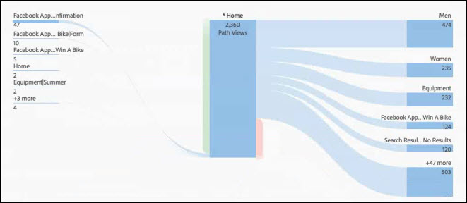
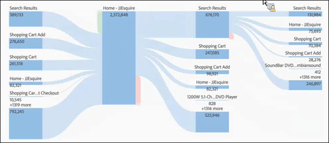

# Konfigurera en flödesvisualisering

Med Flow kan du spåra en bana genom sidorna eller dimensionerna, t.ex. eVars:

* Post (endast dimensioner)
* Dimensioner eller objekt
* Avsluta (endast dimensioner)

Var och en av dessa kategorier visas på skärmen som en&quot;släppzon&quot;. Dra objekt från listan och släpp dem i önskad släppzon. Sidor och andra objekt som inte är dimensioner kan bara placeras i den mittersta släppzonen. Om du släpper en dimension i mellanzonen körs automatiskt en rapport som infogar de översta objekten för den dimensionen.

När du släpper ett objekt i en släppzon öppnas flödesdiagrammet. Innehållet i flödesdiagrammet beror på den släppzon där du släpper en dimension eller en artikel. Avsluta och ange visar alla objekt för dimensionen (t.ex. sidor) som du släpper i släppzonen Inmatning eller Avsluta. Om du till exempel släpper en dimension i den centrala släppzonen öppnas flödesdiagrammet för den dimensionen.

Håll pekaren över fokusnoden mitt i diagrammet för att visa information om den noden.

Flödesdiagrammet är interaktivt. För musen över diagrammet för att ändra de detaljer som visas.

Banorna i diagrammet är proportionella. Banor med mer aktivitet ser tjockare ut.

När du klickar på en nod i diagrammet visas information om den noden. Om du till exempel klickar på **[!UICONTROL Search Results]** längst upp till höger i det övre diagrammet ovan, expanderas diagrammet så att mer information om noden för sökresultat visas. Klicka på en nod igen för att komprimera den.

Som standard visas de fem översta flödena i diagrammet. Om du klickar på noden **[!UICONTROL More]** längst ned i diagrammet utökas diagrammet nedåt så att ytterligare fem flöden visas. Fortsätt att klicka på **[!UICONTROL More]** för att expandera tills det inte finns några ytterligare flöden att visa.

Det finns inga gränser för hur mycket du kan utforska i flödesdiagrammet.

Du kan också exportera och ytterligare analysera flödesdiagrammet som en del av ett projekts .CSV-fil genom att gå till **[!UICONTROL Project]** > **[!UICONTROL Download CSV]**.
