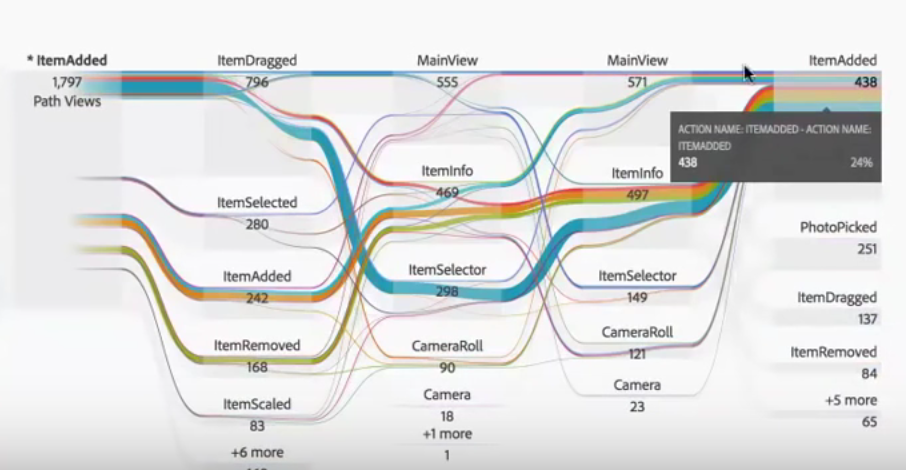

# Intradimensionella flöden

Med ett interdimensionellt flöde kan du undersöka användarsökvägar i olika dimensioner.

En dimensionsetikett högst upp i varje Flow-kolumn gör det mer intuitivt att använda flera dimensioner i en flödesvisualisering:

Vi ska titta på två användningsfall: ett exempel på appanvändning och ett exempel på webbanvändning.

## Använd fall ett: app {#section_3D31D37B9C9F4134AE46C96291E41294}

Dimensionen [!UICONTROL Action Name] lades till i flödet, där det översta returnerade objektet var [!UICONTROL ItemAdded]:

Om du vill utforska interaktionen mellan skärmar/sidor och åtgärder i den här appen kan du dra siddimensionen till flera platser, beroende på vad du vill utforska:

* Dra den till valfri ände av släppzonen (inuti den svarta trimmade rektangulära zonen som visas) för att **ersätta** det övre resultatet i ändarna:

    

* Dra den till det tomma utrymmet på slutet (lägg märke till den svarta parentesen) för att **lägga till i** visualiseringen:

   

Här är resultatet om du bestämmer dig för att ersätta ItemScaled-objektet i den högra kolumnen med Page-dimensionen. Det översta resultatet ändras nu till det översta resultatet för siddimensionen:

Nu kan ni se hur kunderna rör sig genom åtgärder och sidor. Du kan utforska flödet ytterligare genom att klicka på olika noder:

Detta är vad som händer om du lägger till en annan Action Name-dimension i slutet av visualiseringen:

Detta ger vissa djupgående insikter och möjlighet att ändra appen som du analyserar.

## Använd fall två: webb {#section_8D55983FA0C84926995270052AE01CD8}

Det här användningsexemplet visar hur ni kan analysera vilka kampanjer som leder till flest poster på en webbplats.

Dra Campaign Name-dimensionen till ett nytt flöde:

Nu vill jag se till vilka sidor dessa kampanjer genererar trafik, så jag drar siddimensionen åt höger om flödesresultaten för att lägga till ytterligare i visualiseringen:

