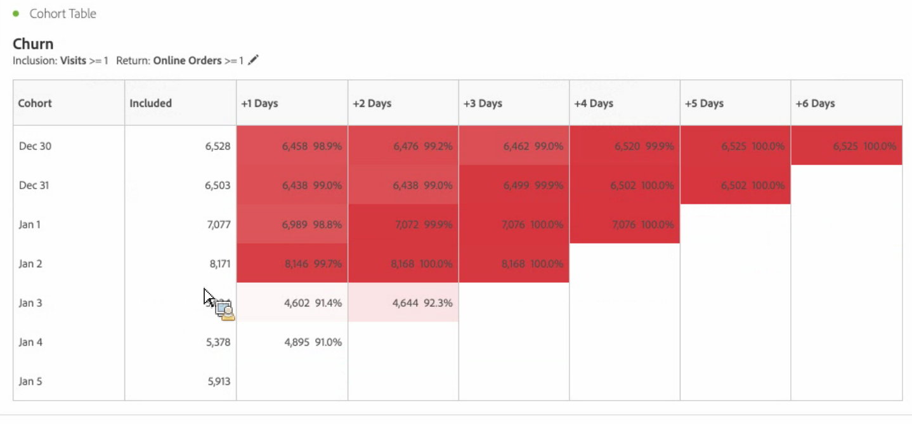
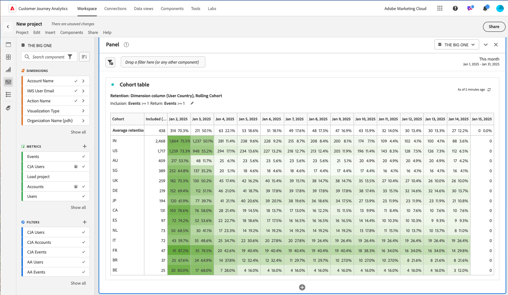

# Läs mer om [!UICONTROL Cohort Analysis] i Adobe Analytics

A *`cohort`* är en grupp personer som delar gemensamma egenskaper under en angiven period. [!UICONTROL Cohort Analysis] är till exempel användbart när du vill veta hur en kohort interagerar med ett varumärke. Du kan enkelt upptäcka ändringar i trender och sedan svara på dem. (Förklaringar av [!UICONTROL Cohort Analysis] finns på webben, till exempel [Kohortanalys 101](https://en.wikipedia.org/wiki/Cohort_analysis).)

När du har skapat en kohortrapport kan du strukturera komponenterna (specifika dimensioner, mått och segment) och sedan dela kohortrapporten med vem som helst. Se [Kuratera och dela](/help/analyze/analysis-workspace/curate-share/curate.md).

Exempel på vad du kan göra med [!UICONTROL Cohort Analysis]:

* Lansera kampanjer som utformats för att ge önskat resultat.
* Byt marknadsföringsbudget vid exakt rätt tidpunkt i kundlivscykeln.
* Identifiera när en testversion eller ett erbjudande ska avslutas för att maximera värdet.
* Få idéer för A/B-testning inom områden som priser, uppgraderingsalternativ osv.

[!UICONTROL Cohort Analysis] är tillgängligt för alla Adobe Analytics-kunder med åtkomsträttigheter till [!UICONTROL Analysis Workspace].

Video om Cohort-tabeller i Analysis Workspace:

>[!VIDEO](https://video.tv.adobe.com/v/25965/?quality=12)

>[!IMPORTANT]
>
>[!UICONTROL Cohort Analysis] stöder inte icke-segmenterbara mått (inklusive beräknade värden), icke-heltalsvärden (t.ex. Intäkter) eller förekomster.
>
>Endast mätvärden som kan användas i segment kan användas i [!UICONTROL Cohort Analysis]och de kan bara ökas med >1 åt gången.

## Funktioner för kohortanalyser

Följande funktioner gör att du kan finjustera kontrollen över de kohorter du bygger:

### [!UICONTROL Retention] Tabell

A [!UICONTROL Retention] kohortrapport returnerar besökare: varje datacell visar det obearbetade antalet och den procentuella andelen besökare i kohorten som utförde åtgärden under den tidsperioden. Du kan ta med upp till 3 mätvärden och upp till 10 segment.

Här är en video om hur du beräknar kvarhållande av rullande text:

>[!VIDEO](https://video.tv.adobe.com/v/25962/?quality=12)

### [!UICONTROL Churn] Tabell

A [!UICONTROL Churn] kohort är inversen till ett kvarhållanderegister och visar de besökare som inte uppfyller eller aldrig uppfyller returkriterierna för din kohort över tiden. Du kan ta med upp till 3 mätvärden och upp till 10 segment.

Här är en video om bortfallsanalys:

>[!VIDEO](https://video.tv.adobe.com/v/25966/?quality=12)

### [!UICONTROL Rolling Calculation]

Gör att du kan beräkna kvarhållning eller kurva baserat på föregående kolumn, inte den inkluderade kolumnen.

### [!UICONTROL Latency] Tabell

Mäter den tid som har gått före och efter det att inkluderingshändelsen inträffade. Detta är ett utmärkt verktyg för för-/efteranalys. The **[!UICONTROL Included]** -kolumnen finns i mitten av tabellen och tidsperioder före och efter att inkluderingshändelsen visas på båda sidor.

### [!UICONTROL Custom Dimension] Kohort

Skapa kohorter baserat på en vald dimension, och inte tidsbaserade kohorter, som är standard. Använd dimensioner som [!UICONTROL marketing channel], [!UICONTROL campaign], [!UICONTROL product], [!UICONTROL page], [!UICONTROL region]eller någon annan dimension i Adobe Analytics för att visa hur kvarhållandet ändras baserat på de olika värdena för dessa dimensioner.

Instruktioner om hur du konfigurerar och kör en kohortrapport finns på [Konfigurera en kohortanalysrapport](/help/analyze/analysis-workspace/visualizations/cohort-table/t-cohort.md).
