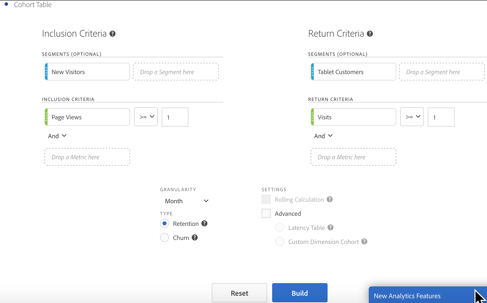

# Konfigurera en [!UICONTROL Cohort Analysis]-rapport

Skapa en kohort och kör en [!UICONTROL Cohort Analysis]-rapport i Analysis Workspace.

1. I Analysis Workspace klickar du på ikonen **[!UICONTROL Visualizations]** i den vänstra listen och drar en **[!UICONTROL Cohort Table]** till arbetsytan.

   

1. Definiera **[!UICONTROL Inclusion Criteria]**, **[!UICONTROL Return Criteria]**, **[!UICONTROL Cohort Type]** och **[!UICONTROL Settings]** enligt definitionen i tabellen nedan.

| Element | Beskrivning |
|--- |--- |
| **[!UICONTROL Inclusion Criteria]** | Du kan använda upp till 10 inkluderingssegment och upp till 3 inkluderingsvärden. Måttet anger vad som placerar en användare i en kohort. Om inkluderingsmåttet till exempel är Order, inkluderas endast användare som har gjort en beställning under kohortanalysens tidsintervall i den initiala kohorten. Standardoperatorn mellan mätvärden är AND, men du kan ändra den till OR. Dessutom kan du lägga till numerisk filtrering i dessa mätvärden. Till exempel: &quot;Besök >= 1&quot;.  |
| **[!UICONTROL Return Criteria]** | Du kan använda upp till 10 retursegment och upp till 3 returvärden. Måttet anger om användaren har behållits (kvarhållning) eller inte (bortfall). Om returvärdet till exempel är Videovyer visas bara de användare som visade videor under efterföljande tidsperioder (efter den period då de lades till i en kohort) som sparade. Ett annat mått som kvantifierar kvarhållandet är Besök. |
| **[!UICONTROL Granularity]** | Tidsgranulariteten för dag, vecka, månad, kvartal eller år. |
| **[!UICONTROL Type]** | **[!UICONTROL Retention]**(standard): En bevarandekohort mäter hur bra besökskohorterna återvänder till din egendom över tid. Det här är den standardkohort som vi alltid har haft och indikerar återkomst och upprepning av användarbeteende. En [!UICONTROL Retention]-kohort indikeras av den gröna färgen i tabellen. **[!UICONTROL Churn]**: En bortfallskohort (kallas även&quot;attrition&quot; eller&quot;utfall&quot;) mäter hur besökarkohorterna faller bort från din egendom över tiden. Kurn = 1 - Kvarhållning. [!UICONTROL Churn] är ett bra mått på hur kantig och möjlig kunden är genom att visa hur ofta kunderna inte kommer tillbaka. Du kan använda urn för att analysera och identifiera fokusområden: vilka kohortsegment som skulle kunna behöva lite uppmärksamhet. En [!UICONTROL Churn]-kohort indikeras av den röda färgen i tabellen (liknar den som används i vår **[!UICONTROL Flow]**-visualisering).  |
| **[!UICONTROL Settings]** | **[!UICONTROL Rolling Calculation]**: Beräkna kvarhållande eller bortfall baserat på föregående kolumn, i stället för kolumnen Inkluderat (standard). [!UICONTROL Rolling Calculation] ändrar beräkningsmetoden för dina&quot;retur&quot;-perioder. Vid den normala beräkningen hittas oberoende av användare som uppfyller&quot;returkriterierna&quot; och som var en del av inkluderingsperioden, oavsett om de var i kohorten för den föregående perioden eller inte. I stället hittar [!UICONTROL Rolling Calculation] användare som uppfyller returvillkoret och som var en del av föregående period. [!UICONTROL Rolling Calculation] filtrerar och styr därför de användare som kontinuerligt uppfyller kriterierna för retur under perioden. [!UICONTROL Return] kriterier tillämpas på var och en av de perioder som leder fram till den valda perioden.   **[!UICONTROL Latency Table]**: En  [!UICONTROL Latency] tabell mäter tiden som har gått före och efter det att inkluderingshändelsen inträffade. [!UICONTROL Latency] är bra att använda för-/efteranalys. Om du till exempel har en kommande produkt eller en kampanjstart och du vill spåra beteendet innan samt se hur det fungerar efter, visar tabellen [!UICONTROL Latency] beteendet sida vid sida för att se den direkta effekten. Cellerna före inkludering i tabellen [!UICONTROL Latency] beräknas av användare som uppfyller [!UICONTROL Inclusion]-kriterierna för inkluderingsperioden och som sedan uppfyller [!UICONTROL Return]-kriterierna under perioderna före inkluderingsperioden. Observera att [!UICONTROL Latency]-tabeller och [!UICONTROL Custom Dimension]-kohort inte kan användas tillsammans.  **[!UICONTROL Custom Dimension Cohort]**: Skapa kohorter baserat på den valda dimensionen i stället för tidsbaserade kohorter (standard). Många kunder vill analysera sina kohorter med något annat än tid, och med den nya funktionen Custom Dimension Cohort kan du skapa kohorter baserat på de mått de själva väljer. Använd dimensioner som marknadsföringskanal, kampanj, produkt, sida, region eller någon annan dimension i Adobe Analytics för att visa hur kvarhållandet ändras baserat på de olika värdena för dessa dimensioner. I definitionen för kohortsegmentet [!UICONTROL Custom Dimension] används dimensionsobjektet endast som en del av inkluderingsperioden, inte som en del av returdefinitionen.  När du har valt alternativet  [!UICONTROL Custom Dimension] Kohort kan du dra och släppa vilken dimension du vill i släppzonen. På så sätt kan du jämföra liknande dimensionsobjekt under samma tidsperiod. Du kan t.ex. jämföra prestanda för städer sida vid sida, produkter, kampanjer osv. Den returnerar dina 14 främsta dimensionsobjekt. Du kan emellertid använda ett filter (öppna det genom att hålla muspekaren åt höger om dimensionen som dragits) för att visa endast önskade dimensionsobjekt. Det går inte att använda en [!UICONTROL Custom Dimension]-kohort med tabellfunktionen [!UICONTROL Latency].  |

1. Justera **[!UICONTROL Cohort Table Settings]** genom att klicka på kugghjulsikonen.

| Inställning | Beskrivning |
| Visa endast procent | Tar bort talvärdet och visar bara procentvärdet. |
| Avrundar procent till närmaste heltal | Avrundar procentvärdet till närmaste heltal i stället för att visa decimalvärdet. |
| Visa genomsnittlig procentrad | Infogar en ny rad högst upp i tabellen och lägger sedan till medelvärdet för värdena i varje kolumn. |

## Skapa [!UICONTROL Cohort Analysis]-rapporten

1. Klicka på **[!UICONTROL Build]**.

   

   I rapporten visas besökare som har gjort en beställning ( *`Included`* kolumn) och som har återvänt till din webbplats vid efterföljande besök. Genom att antalet besök minskar över tid kan du upptäcka problem och vidta åtgärder.
1. (Valfritt) Skapa ett segment av en markering.

   Markera celler (angränsande eller icke-angränsande) och högerklicka sedan > **[!UICONTROL Create Segment From Selection]**.

1. I [Segment Builder](/help/components/segmentation/segmentation-workflow/seg-build.md) redigerar du segmentet ytterligare och klickar sedan på **[!UICONTROL Save]**.

   Det sparade segmentet kan användas i panelen [!UICONTROL Segment] i [!UICONTROL Analysis Workspace].
1. Namnge och spara ditt kohortprojekt.
1. (Valfritt) [Kuratera och dela](/help/analyze/analysis-workspace/curate-share/curate.md) projektkomponenterna.

   >[!NOTE]
   >
   >Du måste spara projektet innan kursen är tillgänglig.
