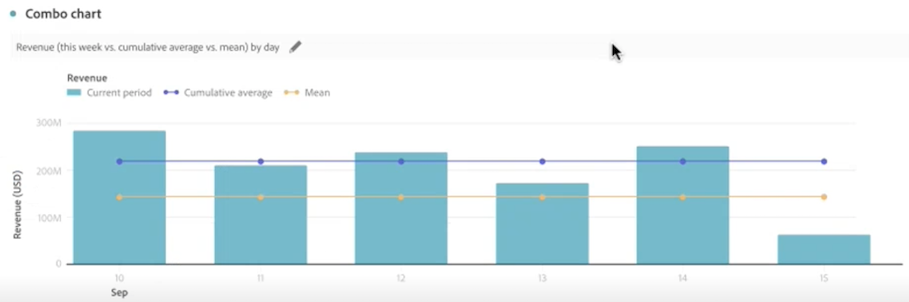

# Kombinationsdiagram

>[!NOTE]
>
>Den här funktionen finns för närvarande i [begränsad testning](/help/release-notes/releases.md).

The [!UICONTROL Combo chart] visualisering gör det enkelt att snabbt skapa en jämförelsevisualisering utan att först behöva skapa en tabell. Du kan enkelt visa trender i dina data i en kombination av rad och rad.

Använd en [!UICONTROL Combo chart] till

* Jämför den här veckans order med order vid samma tidpunkt förra månaden (och förra året) - allt med bara några klick.

* Analysera och jämför snabbt olika mätvärden (som [!UICONTROL Unique Visitors] och [!UICONTROL Revenue]) mot varandra i samma diagram.

* Analysera ett mått mot en funktion (som [!UICONTROL Cumulative Average]) över en tidsperiod.

Kom ihåg att du kan

* Lägg till flera jämförelser i en enda [!UICONTROL Combo chart].
* Om du lägger till en eller flera jämförelser måste de vara av samma typ, till exempel [!UICONTROL Time comparison].
* Du kan lägga till upp till fem jämförelser.
* Du kan använda upp till tre filter (segment) för ett mätresultat.

## Skapa ett kombinationsdiagram

1. Dra i listrutan Visualiseringar i den vänstra listen [!UICONTROL Combo chart] visualisering till en tom panel.

   

1. I listrutorna väljer du en dimension för X-axeln och ett mått för Y-axeln.

1. Välj typ av [!UICONTROL Line comparison] som du vill använda.

   | Jämförelsetyp | Definition |
   | --- | --- |
   | **[!UICONTROL Time comparison]** | Den vanligaste typen av jämförelse - till exempel en jämförelse mellan den här tidsperioden och för 4 veckor sedan. Om du valde [!UICONTROL Time comparison], gör ett sekundärt val av vilken tidsperiod du vill jämföra.
 |
   | **[!UICONTROL Additional metric]** | Du kan till exempel jämföra [!UICONTROL Revenue] till ett annat mätvärde.
 |
   | **[!UICONTROL Function]** | Du kan presentera en funktion som [!UICONTROL Average] i jämförelsen. Se en lista över funktioner som stöds nedan.
 |

   {style=&quot;table-layout:auto&quot;}

1. Klicka på **[!UICONTROL Build]**.

   Utdata ser ut ungefär så här:

   

   Den aktuella perioden visas i stapeldiagrammet och jämförelseperioden representeras av linjediagrammet. Punkter i linjediagrammet kallas för&quot;streck&quot;.

## Funktioner som stöds

Om du väljer **[!UICONTROL Function]** som [!UICONTROL Line comparison type], returneras en funktion för det mätvärde du har valt.

|  -funktion | Definition |
| --- | --- |
| **[!UICONTROL Column Sum]** | Lägger till alla numeriska värden för ett mått i en kolumn (över elementen i en dimension) |
| **[!UICONTROL Cumulative Average]** | Returnerar medelvärdet för de sista N raderna. |
| **[!UICONTROL Median]** | Returnerar medianvärdet för ett mått i en kolumn. Medianvärdet är talet i mitten av en uppsättning tal, det vill säga hälften av talen har värden som är större än eller lika med medianvärdet och hälften är mindre än eller lika med medianvärdet. |
| **[!UICONTROL Cumulative]** | Den kumulativa summan av N-rader. |
| **[!UICONTROL Column Maximum]** | Returnerar det största värdet i en uppsättning dimensionselement för en måttkolumn. |
| **[!UICONTROL Mean]** | Returnerar det aritmetiska medelvärdet, eller medelvärdet, för ett mått. |
| **[!UICONTROL Column Minimum]** | Returnerar det minsta värdet i en uppsättning dimensionselement för en måttkolumn. |

{style=&quot;table-layout:auto&quot;}

Här är ett exempel på det ackumulerade genomsnittet för intäktsmåttet:

Här följer ett exempel på ett kombinationsdiagram med funktioner för både Cumulativt medelvärde och Medel:

## Inställningar för kombinationsdiagram

Klicka på kugghjulsikonen längst upp till höger i ett kombinationsdiagram om du vill ändra dess inställningar.

| Inställning | Definition |
| --- | --- |
| **[!UICONTROL Visualization type]** | Växla till en annan visualiseringstyp. |
| **[!UICONTROL Granularity]** | För trendvisualiseringar kan du ändra tidshalten (dag, vecka, månad osv.) från den här listrutan. |
| **[!UICONTROL General]** |  |
| **[!UICONTROL Percentages]** | Visar värden i procent. |
| **[!UICONTROL Legend visible]** | Gör att du kan dölja den detaljerade förklaringstexten för visualiseringen av kombinationsdiagram. |
| **[!UICONTROL Limit max items]** | Minskar antalet objekt på X-axeln. Om du har en stor datauppsättning kan du bara visa de första 10 objekten (eller vilket värde du än väljer). |
| **[!UICONTROL Overlays]** | Visa eller dölj strecken på linjer. |
| **[!UICONTROL Axis]** |  |
| **[!UICONTROL Display dual axis]** | Gäller endast om du har två mätvärden - du kan ha en y-axel till vänster (för ett mätresultat) och till höger (för det andra måttet). Detta är praktiskt när plottade mätvärden har mycket olika förstoringsgrader. Färgen på den dubbla axeln matchar färgen på tabellen, såvida det inte finns flera jämförelser. I så fall är färgen för alla jämförelser grå. |
| **[!UICONTROL Normalization]** | Tvingar måtten att ha samma proportioner. Detta är praktiskt när plottade mätvärden har mycket olika förstoringsgrader. |
| **[!UICONTROL Show x-axis]** | Visa x-axeln eller dölj den. |
| **[!UICONTROL Show y-axis]** | Visa y-axeln eller dölj den. |
| **[!UICONTROL Anchor y-axis at zero]** | Om alla värden som är ritade i diagrammet ligger betydligt över noll, kommer diagrammets standardvärde att göra den nedre delen av y-axeln ICKE-ZERO. Om du markerar den här rutan kommer y-axeln att tvingas till noll (och diagrammet ritas om). |

{style=&quot;table-layout:auto&quot;}

